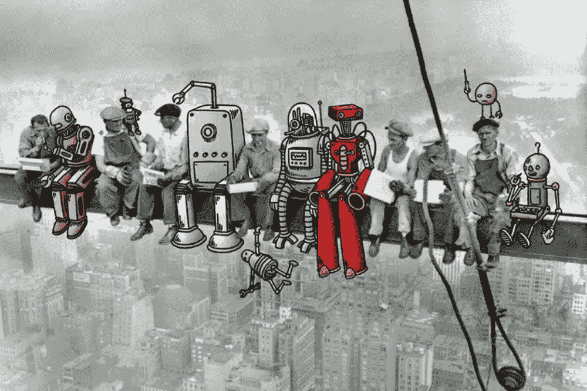

# 没有工作了

> 原文：<https://medium.datadriveninvestor.com/no-more-jobs-6a173f7811df?source=collection_archive---------13----------------------->

我们在历史上进化是因为我们学会了合作。协作精神是一股强大的力量，让我们人类克服了迄今为止面临的所有挑战。在人类用来在这个不健康的星球上生存的所有策略中，只有一个策略是至关重要的:教育。

是的，传承每一代人积累的知识帮助我们向前进化。我们为什么要这样做？为什么要投入时间和金钱来训练年轻人面对他们自己时代的挑战呢？

**“The machines are coming for the high-wage, high-skill jobs as well”**
*Martin Ford*

理论上，如果我们不会永远活着，为什么要担心我们不在的未来会发生什么。为什么不让我们的孩子在没有我们干预的情况下独自解决他们的问题呢？
当然，这些问题听起来很蠢。但它们可以让我们正确看待事物。

 [## 模式和机器人:复杂的现实|数据驱动的投资者

### 哈耶克的名著《复杂现象理论》(哈耶克，1964)深入探讨了复杂性的话题，并断言…

www.datadriveninvestor.com](https://www.datadriveninvestor.com/2019/03/04/patterns-and-robotics-a-complex-reality/) 

在遥远的过去，几百万年前，我们的祖先每天只是采摘水果和吃小动物，在这里和那里，他们可以找到它们。今天，我们打开一个应用程序，在明亮的屏幕上滑动我们的手指，几分钟后一份温暖的饭菜就送到了我们的门口。为什么会这样？为什么人类历史上的事情从来都不一样？为什么我们总是试图以不同的方式做事？

近几十年来，我们的进化程度超过了人类历史上的任何时期。为什么我们科学的扩张速度越来越快？

似乎时间被扭曲了。它看起来像是从你的手指中渗出来的。它不再像过去那样，看起来像是我们在控制。在遥远的过去，我们的祖父母只考虑食物、保护、旅行，然后找个地方睡觉。今天，食物、安全、交通和睡眠的概念就像我们处理时间的能力一样模棱两可。

从第一次合作开始，当我们的祖父母明白如果两个人一起做一件事会更容易、更快、更安全。从那以后，社会生活就不一样了。我们创造了一种现实扭曲场，在其中我们可以想象一个想法，然后找到合适的人来实现它。歪曲事实已经成为我们的专长。给想象力插上翅膀，让我们从本质上成为人类，远离其他动物。创造的土壤越肥沃，就需要越多的人参与进来，让新的想法成为现实。

我们变得沉迷于拥有想法。最大的乐趣就是和其他人一起表演。我们的作品变得如此伟大，有时一代人的时间不足以完成它们。因此，我们必须储存信息，让我们的儿女做好继续前进的准备，为他们提供一切必要的东西，以便部落、城市、王国或整个国家的创造过程不会停止。

我们的想象力是如此强大，它超越了时间和空间。即使被困在平均持续 60 或 70 年的很短的时间内，我们也可以绕过规则，证明在许多方面我们存在于时间中，它可能不会比我们的想法更大或更强大。这种火花让人类的心灵持续燃烧，永不停息地制造不安。这是让我们不断前进的秘密。创造新的方法来克服生活强加给我们的所有挑战。

人类合作的艺术创造了如此多的可能性，纵观我们的历史，我们为彼此工作，彼此付出，并让我们的孩子延续这一传统。但不知何故，这个前提受到了限制。

大约 200 年前，人类社会中发生事情的方式开始改变，因为我们身体的延伸变得越来越金属化。从蒸汽机到汽车到智能手机，与此同时，我们为满足需求而存储的信息以前所未有的方式被阅读、理解和应用。

厚厚的纸张包含了我们了解我们是谁以及我们可以去哪里所需的一切，这种被动已经被分散在全球数字服务器上的光纤电缆所取代。知识是活跃的，无所不在的。知识并不指望你去寻找它，它是“活的”,不停地注视着我们，试图了解我们是谁，并随时准备告诉你去哪里。

创造了我们文化的合作，以及让数百万人从事职业生涯数千年的工作，现在正被正确看待。直到最近，我们所知道的工作穿着和走路都不一样。每个人，年轻人和老年人，都在看着现实，却不太明白正在发生什么。许多工作正在消失，结果是许多其他工作正在出现。

不是每个人都能满足新角色所需的技能要求。即使他们做到了，五分钟后，他们很快就会被要求再次学习新的东西。

我们想消灭体力消耗。

我们不欣赏它。我们所做的一切都是为了尽可能的避免。我们喜欢舒适。看看我们创造的一切。我们希望活得更久，感受全盛时期的快乐，没有限制。当然，这是让我们行动的感觉。为了到达天堂，我们不择手段。不幸的是，我们正在创造的天堂是数字化的，似乎没有适合每个人的地方。我们创造东西来解除各种痛苦，却忘了为它的副作用做准备。

我们对不可避免的结局的恐惧使我们团结起来创造一个更加美好和舒适的世界。现在，这个世界在收费，我们不知道如何还清债务。

This is my new book, spare some time to know more about creativity.

这是我的新书，抽点时间了解一下创意。

我们需要史诗级别的创造力，但这与我们迄今为止所做的完全不同。现在的挑战是能够设定我们的思想，以便我们能够照亮我们的敏感性，以便美比无所事事的快乐更能触动我们，因为只要我们负担得起，算法将为我们解决一切。这个新的数字社会需要更少务实的人，更多地与他们的感官相连，更加敏感。我们有如此多的便利，以至于忘记了我们的身体是如何工作的。

对于多梅尼科·德·马西(Domenico De Masi)来说，在他的著作《创造力和创造性群体》(Creativity and Creative Groups)中，我们寻求将所有努力委托给机器，并将人类从所有无聊、重复、乏味和令人厌倦的工作中完全解放出来，“同时将所有精力集中在更高的目标上，如通过创造力、自省、有趣的活动、友谊、爱、欢乐和美丽来实现自我，”他说。

至少目前，幸运的人平均寿命只有 80/90 岁。当然，我们将继续教育我们的孩子，但是在这个勇敢的新世界里，我们需要能够感知隐形层的新感官，在那里没有任何种类的电子传感器能够穿透。这种有创造力的存在，对生活的接触很敏感，会精彩地冲浪并展示事物是如何的，从真实的人身上学习更多，分享经验，欣赏错误的价值，因为他们可以看到并感受到人类的本质。这将不可避免地在任何算法中留下一个巨大的漏洞来寻找它的意义。

— -

非常感谢您的阅读。如果你喜欢我的工作并想支持我，那么你可以 r [*给我买杯咖啡*](https://www.buymeacoffee.com/barterwilliam) *☕️
或者使用* [*这个链接*](https://williambarter-br.medium.com/membership) *成为中等会员。继续关注更多这样的故事！*

点击下面的链接，安排与 [**威廉·巴特**](https://app.ddichat.com/experts/william-barter) 的对话。

 [## 威廉·巴特-迪查特

### 我是一名生活在巴西的创意顾问，在营销领域有 20 多年的经验。我有一些…

app.ddichat.com](https://app.ddichat.com/experts/william-barter) 

在这里申请成为 DDIChat 专家。
与 DDI 合作:[https://datadriveninvestor.com/collaborate](https://datadriveninvestor.com/collaborate)
点击此处订阅 DDIntel [。](https://ddintel.datadriveninvestor.com/)