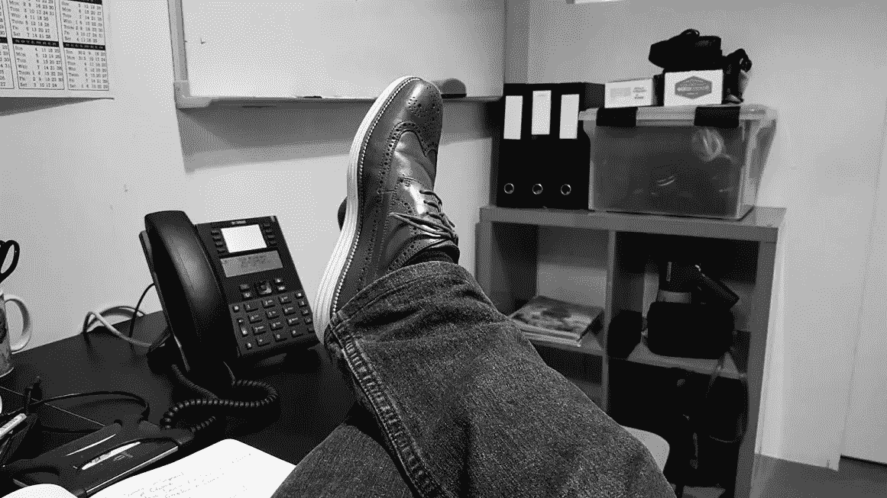

# 不再有“生产力色情”

> 原文：<https://medium.datadriveninvestor.com/no-more-productivity-porn-d1c0ce3d6720?source=collection_archive---------10----------------------->

我的抄写员同事[纳特·埃利亚松](https://medium.com/@nateliason)因喊出了[“斗争色情”](https://medium.com/@nateliason/no-more-struggle-porn-202153a01108)而受到称赞，也就是说，对骗局胜过胜利的赞美让骗子们相信他们正在赢，尽管很明显，他们并没有赢。我想把这篇文章作为我所谓的“生产力色情”的姊妹篇，这篇文章最好地诠释了一个 pod 人的一天生活，她给自己起了一个人名 Melania Edwards:[https://www . business insider . SG/a-day-in-the-life-of-HSBC-executive-Melania-Edwards-2018-10/？r=US & IR=T](https://www.businessinsider.sg/a-day-in-the-life-of-hsbc-executive-melania-edwards-2018-10/?r=US&IR=T)

梅拉尼娅声称会在早上 5 点 30 分起床，冥想，与朋友和家人团聚，做一份令人恶心的奶昔，并在上班前打一场网球。她在那里做什么仍然是一个谜，但不管是什么，她从斯坦福大学获得“创新与企业家证书”是值得的，因为证明你是创新型企业家的最佳方式是获得一份证明你是创新型企业家的证书。

在所有这些之后，她开始了她的慈善工作(我肯定她通常不会谈论它，但为了这篇文章的目的，她破例了)，然后她做瑜伽，最后回家做饭，从零开始，和她的 pod 人男朋友一起。之后，他们在附近散步，撞到路灯柱上，因为他们忙着深情凝视对方布满血丝和疲惫的眼睛。天啊，光是阅读就让我精疲力尽。

现在，我确信梅拉尼娅在现实中更可爱，抱歉，更正常，但这个时间表并不反映正常，也不反映像 Mumbrella 的 24 小时与…专栏这样的美德信号，其中没有人醒来晚或宿醉，但每个人都写感恩日记，并在窗台上种植自己的麦草。在那里，没有人哀叹毫无意义的会议，而是乐于抓住每一个“报到”、“叙旧”或(上帝保佑)我们“接触基础”的机会。在那里，没有人会在午餐时吃厚脸皮的 Maccy D，而是虔诚地吞下营养均衡的羽衣甘蓝和藜麦思慕雪，并加入额外的 chia 种子，因为好吃！没有人会在下班后去喝一杯，而是立即冲向健身房/瑜伽垫/漂浮舱(删除适用内容)，然后为他们的舱人家庭从头开始烹饪美食，这样他们就可以变得强壮，繁殖，并最终如预言所预言的那样接管地球。

来吧伙计们，现实点吧！这和那些过度管理的 Instagram 账户一样糟糕，它们设定了一个正常人都无法达到的标准。在努力向互联网呈现一个“真实的”自己的过程中，这些有影响力的人事实上正在加剧心理健康危机，因为他们剥夺了努力工作的人在完成工作后放松的权利，而不会对他们应该做得更多感到焦虑。更多什么？没有人知道，只是更你这个懒惰的混蛋！

这当然不全是梅拉尼娅的错，她只是最近的一个可笑的例子。也是那些所谓的大师们声称#黑掉真正的大师们的日常工作，让你相信只要你和比尔·盖茨同时起床，和杰夫·贝索斯读一样的书，或者和比尔·克林顿喷一样的古龙水，你也会成为亿万富翁和/或美国总统，你这个没用的大胖子。

听着，我不是说我们不能向我们的上级学习，但是我们只能从他们的实际习惯中学习，而不是这些生产力羞辱中的公关练习。是的，我说了。比如睡懒觉。人渣。午餐时间网购？失败者。下班后喝一杯葡萄酒？白痴。

我已经在英国、美国和亚洲的电视、出版、广告和电影行业工作了 20 年，目前我在那里工作。我曾是自己公司的首席执行官，我白手起家，7 年后卖掉了这家公司。我制作电影和电视节目是为了工作和娱乐。我嫁给了我一生的爱人，和他有一个快乐健康的小孩。我认为自己非常幸运，非常成功，你知道吗，我在正常的时间起床，吃汉堡的时候吃沙拉，大多数晚上我都喝一杯，周末我喜欢 Netlix 狂欢。不要评判我，我是人，梅拉尼娅和她的亲属也是人，我只是希望他们不要那么害怕承认这一点。