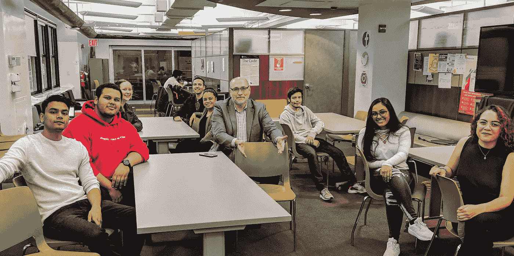

# 计算机科学课没有座位？我们有座位了

> 原文：<https://medium.datadriveninvestor.com/no-seats-in-computer-science-class-weve-got-seats-d1ecb60b4072?source=collection_archive---------9----------------------->

作为一名教育工作者，一个相信学术力量的人，特别是当与现实世界的经验相匹配时，我最喜欢看到的事情莫过于满教室的学生。当他们在长时间的休息后回来，在走廊里充满了讨论、辩论和经常沙哑的笑声时，学生们给佩斯大学的教室和学习空间带来了活力。而作为大学，我们有义务也有责任给他们提供上课的机会。所以当我看到 Natasha Singer 最近在《纽约时报》上发表的文章“[计算机科学最难的部分？进入](https://www.nytimes.com/2019/01/24/technology/computer-science-courses-college.html?smtyp=cur&smid=tw-nytimes)班，我很惊讶。CS 没有座位？那么，我应该停止招募了！

玩笑归玩笑，辛格女士可能是对的。有如此多的学生想要学习计算机科学，以至于在许多大学里，他们真的没有教他们的师资力量。不过，在佩斯，我们有座位。你先在这里听到的。

Some of the stellar young academics at Pace University’s Seidenberg School, with me, ready to welcome new students

在我们的计算机科学学士和硕士学位中，理论和动手实践技能的结合几乎等于保证成功。在佩斯大学的赛登伯格计算机科学和信息系统学院——我很荣幸领导这个小学校——我们的学生在毕业一年内找到工作的成功率为 96%。他们在顶级公司如谷歌、脸书、万事达、普华永道、威瑞信和 IBM 获得六位数的薪水。他们中的一些人创办了自己的公司，并继续做着令人惊叹的事情。他们到那里不仅仅是因为他们在课堂上坐了一个座位，而是因为吸引佩斯大学的学生类型:聪明、雄心勃勃、斗志昂扬、富有创业精神。在一个像纽约这样无情、积极、忙碌、不停的城市里，你必须具备所有这些特质。再加上计算机科学专业？毕业后你有一份很好的工作等着你。

如果你能在课堂上找到一个座位。

纯粹出于自私的原因，我不得不回应辛格女士的文章。我想让她知道，嘿，*我们*有座位。事实上，如果她想过来看看我们，我们甚至会给她留一个。我们会给所有新同学留一个座位，因为——我可能已经提到过——没有什么比坐满渴望学习的学生的教室更令人愉快的了。也许是一间教室，其人口统计反映了世界上最多样化的城市之一的街道。我很高兴地说，我们已经做到了这一点，我特别为我们近 30%的女性人口感到自豪，这至少比全国平均水平高 10 个百分点。

所以我们有座位。那些坐在我们教室里的学生继续坐在大公司的好位子上。座椅可能比我们的塑料(但时尚)座椅好得多。但我说过我们的学生很好斗。

**关于乔纳森·希尔**

Jonathan Hill 博士是佩斯大学 T2 赛登伯格计算机科学和信息系统学院的院长。作为塞登伯格学院的院长，希尔博士带来了跨越近三十年的学术界和私营部门的综合经验

## 来自 DDI 的相关故事:

 [## 数据科学和软件工程哪个更有前途？-数据驱动型投资者

### 大约一个月前，当我坐在咖啡馆里为一个客户开发网站时，我发现了这个女人…

www.datadriveninvestor.com](https://www.datadriveninvestor.com/2019/01/23/which-is-more-promising-data-science-or-software-engineering/)  [## 成为数据科学家所需的 8 项技能——数据驱动型投资者

### 数字吓不倒你？没有什么比一张漂亮的 excel 表更令人满意的了？你会说几种语言…

www.datadriveninvestor.com](https://www.datadriveninvestor.com/2019/02/07/8-skills-you-need-to-become-a-data-scientist/)