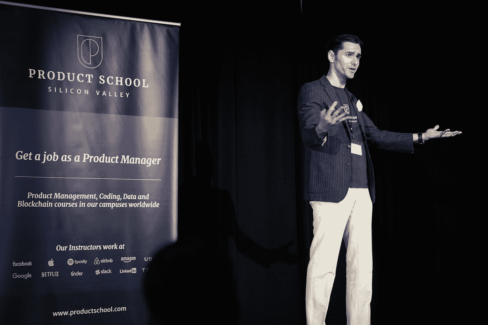

# 没人在乎

> 原文：<https://medium.datadriveninvestor.com/nobody-cares-ace7f6546859?source=collection_archive---------7----------------------->

Photo by [Product School](https://unsplash.com/@productschool?utm_source=medium&utm_medium=referral) on [Unsplash](https://unsplash.com?utm_source=medium&utm_medium=referral)

## 所以你真的想成为一名职业演说家？

也许任何人在专业发言时可能说的最愚蠢的话是…

“我是职业演说家！！！!"

嗯，没人在乎。

真的。没人。关心。

虽然说你以此为生(或正在为此努力)可能听起来令人印象深刻和震惊，但从那些雇佣演讲者的角度来看(我也是其中之一)，这是你能说的最愚蠢的事情。

原因如下:

首先，这份声明是关于你自己的，你认为作为一个专业人士给你带来的荣誉，你认为你应该得到的隐性地位，以及在观众面前可能给你带来的好处。

求你了。

没人在乎。

然而，当我一次又一次地参加全国议长会议时，这是新手和热切的新手说的话。这不仅非常明显——毕竟，我们是在一个有大约 3000 名专业人士参加的会议上——而且也说明了你的菜鸟身份。

 [## 在创业之旅中，拥抱学习|数据驱动的投资者

### 好像建立一个数百万美元的公司还不够困难，企业家必须额外照顾他们的…

www.datadriveninvestor.com](https://www.datadriveninvestor.com/2018/10/16/on-the-entrepreneurial-trek-embrace-the-learning/) 

这种冲动不仅限于演讲者。问别人同样的问题，你会得到:

*我是一名会计。*

*我做销售。*

我从事营销工作。

我从事房地产。

我是一名财务顾问。

求你了。

# 没人在乎。

这些是谈话杀手。更糟糕的是，如果一个潜在的客户问，他们会倾向于侧身，如果不是匆匆忙忙地，离开。

原因如下:上面的陈述表明这一切都是为了你。*我是专业演讲者*这句话听起来像是你在期待掌声。

Deposit photos

我们都是自我指涉的，我们都是自我专注的。这是人类生活的一部分。这没什么不好，除非你想被录用。

这里既有问题也有机会。

你的委托人也是。不想被雇佣。他们也是自我指涉和自我专注的。

所以，如果你的潜在客户问你是做什么的，而你用一句让他们远离聚光灯的话来回答，你希望得到什么样的回应？

**下一个**。

你是做什么的？

你的客户会给你 6 到 7 秒的时间全神贯注，然后就是*该死，我得给市场部的杰夫打电话了，我们有截止日期，我怎么才能摆脱这个家伙* …

所以你说的第一句话需要是一个有实际意义的实实在在的钩子。让我们开始:

首先，你的车道是什么？你的行业？你最擅长什么？

你为客户解决了什么具有挑战性的问题？

你比竞争对手做得更好的是什么？

如果你不知道，你已经在挣扎了。最优秀的企业家清楚地知道他们做什么，为谁做，以及客户为什么喜欢他们。那是你的坚果。请记住，你首先是一名企业家，同时也是一名演讲者。优秀的商业人士解决问题。

你的挑战是把它变成一个清晰的、七秒钟的价值主张，直截了当地说出是什么让你的客户在竞争中损失了时间、金钱、客户或市场份额。

当我在供应链部门工作时，我的客户是大型财富 100-500 强公司的供应链采购员和首席采购官。他们与受保护阶层中不老练的供应商有一个持续的问题，这些供应商不知道如何向他们的公司展示他们的产品。那是我的专长。这是我的开场白:

*我解决了供应商毫无准备的问题。*

嘣。十有八九我会收到一张名片，一次谈话，通常还有一份合同。

为什么？因为我解决了一个让他们夜不能寐的问题。

当然，我是一个专业的演讲者。但是…

Photo by [Jelleke Vanooteghem](https://unsplash.com/@ilumire?utm_source=medium&utm_medium=referral) on [Unsplash](https://unsplash.com?utm_source=medium&utm_medium=referral)

# 没人在乎。

我的客户只关心我能做些什么来解决他们的问题。这句开场白在几秒钟内表达了我理解他们的世界，知道他们在处理什么，并且也有成功的历史。我做到了。

你和我倾向于乱说。在会议和许多网络活动的高度交易世界中，你只有几秒钟的时间来表达你所做的事情，以吸引注意力。

# 我想成为一名演说家

所以，尽管你可能想成为一名职业演说家，因为这会让你有*的感觉，但让我善意地劝阻你。数百人在演讲后找到我，告诉我他们想做我做的事情。随着时间的推移，我发现真正的原因是，他们认为这很容易，他们所要做的就是打扮一下，展示一下，享受掌声。*

亲切地。号码

那些退休演讲者已经做了几十年，他们的收入徘徊在七位数以上，他们已经成功了很多年，他们明白演讲与他们没有什么关系。虽然获得一个好名声很好，我也有我的一份，但一个演讲者真正的工作是传递价值，给出答案和/或提供超出客户期望的娱乐。自我关注会分散注意力。

不仅如此，精明的观众(除了偶尔的深夜酒吧人群，他们都很精明)也不会太喜欢你。

真正的修行人，深感上台的责任之重大。这不是关于他们的，过去不是，将来也不会是。这是关于观众，客户，以及这两个利益相关者的需求是否得到满足。

# 演讲是一种服务，而不是在公共场合手淫。

这就是为什么，如果有人问你是做什么的，你可能会关注那些支付我们费用的人(如果我们被录用)，那些填补空缺的人，以及那些期望得到有价值的东西的人。他们不欠你任何东西，甚至不欠你全部的注意力。你欠他们一切。努力工作、研究、实践、准备、对他们的世界的深刻理解、同理心、同情心和尊重。因为他们通常知道的比你想象的多得多。

这就是为什么这是一个艰难的生意。它不适合需要掌声的娘娘腔、自恋者或极度缺乏安全感的人。

它是为那些对改变客户充满热情的人准备的。当你知道两者的区别后，就开始构思 7 秒钟的开场白。

因为有人真的会在乎。这就完全不同了。

Photo by [Yvette de Wit](https://unsplash.com/@yvettedewit?utm_source=medium&utm_medium=referral) on [Unsplash](https://unsplash.com?utm_source=medium&utm_medium=referral)