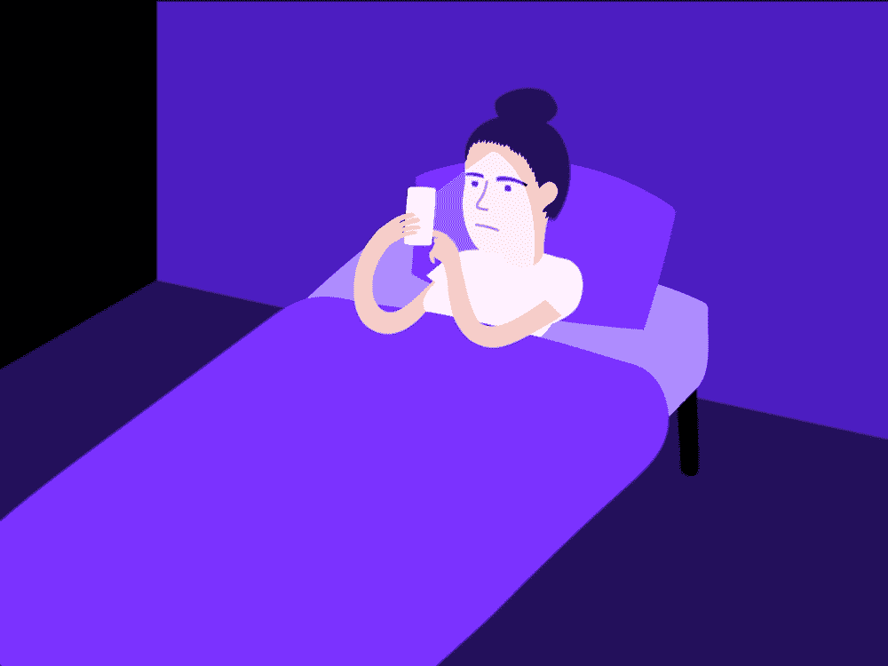

# 诺莫恐惧症:无声的斗争

> 原文：<https://medium.datadriveninvestor.com/nomophobia-the-silent-struggle-a2dc994da7bd?source=collection_archive---------15----------------------->

# 诺莫恐惧症是真实存在的，超过一半的人都在与它作斗争…

每个人都喜欢开玩笑说人们沉迷于手机，但研究人员实际上认为这是一种实际的成瘾。“无手机恐惧症”一词产生于 2010 年，是“无手机”的简称。

无手机恐惧症是害怕没有手机。这个词的恐惧症部分可能有点误导，因为恐惧症可能暗示你害怕没有它。然而，医生认为这更多的是一种焦虑症。

患有诺莫恐惧症的人在没有手机的情况下会感到孤独，他们对手机有一种依恋，这就相当于一个爱人/伴侣。这可能会导致人们脱离真正的公司，甚至会让他们在没有手机的情况下感到沮丧。

# 你有诺莫恐惧症吗？

我们都知道，我们几乎所有的事情都依赖于手机，没有手机会是一个巨大的负担。有迹象表明你正在与诺莫恐惧症作斗争，所以继续读下去，看看你是否有斗争的倾向。

# 1.紧急检查

我们都知道支票；当你彻底搜身，翻遍你的包试图找到你的手机。贯穿你全身的恐慌往往会让你看起来很傻。

# 2.这是你最后想到的事情，也是你醒来后检查的第一件事

如果你早上醒来，有即刻查看手机的冲动，这就是对手机上瘾的迹象。如果睡觉前一定要检查就更能说明问题了！

# 3.你去哪都带着手机

如果你的手机实际上变成了你最大的伴侣，这可能是一个信号。如果你不把手机带到某个地方，你就必须去把它拿回来。这可能会让你觉得少了什么，这会极大地影响你的情绪。

# 4.不管情况如何，你都必须回答

无论在什么情况下，你都会有不可抗拒的冲动去回复收到的任何信息/通知。即使在危险的“无电话区”,你仍然会有接听电话的冲动，释放内心深处那种火辣辣的渴望。

> 手机恐惧症会影响我们所有人，你有手机成瘾的症状吗？本周我将会发布更多关于应对无手机恐惧症的文章。

## 如果你喜欢这个故事，请点击👏按钮并分享，帮助其他人找到它！欢迎在下方留言评论。

关注我了解更多内容。