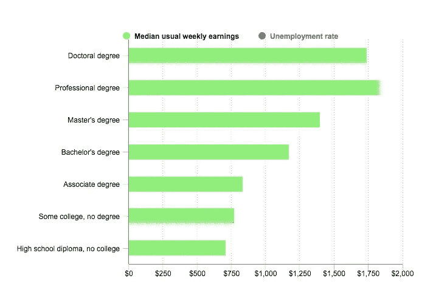
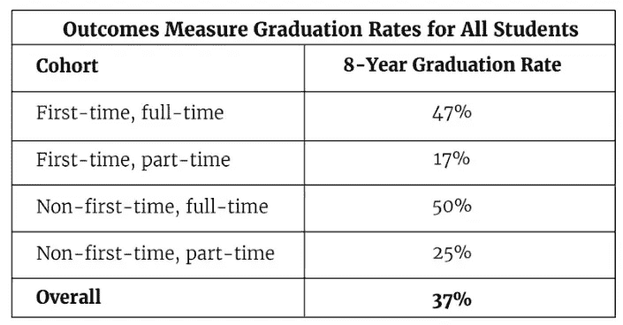

# 非解决方案:面向所有人的“免费”大学

> 原文：<https://medium.datadriveninvestor.com/non-solutions-free-college-for-all-3290dfbc129e?source=collection_archive---------2----------------------->

## 大学的费用太高了。让它“免费”会加剧这个问题

作为一名自由主义者，我经常被“自由主义过度”的想法所激怒，好像为平等而战是一种政治犯规。我仍然经常有这种感觉，但我发现了一个例证“自由主义过度”概念的问题，并凸显了试图将复杂问题纳入一刀切解决方案的左翼传统。那个问题？面向所有人的“免费”大学。

这一解决方案旨在解决一个现实问题:大学学费高得令人厌恶，令人望而却步。这是不可否认的。国家理应降低这一成本，并停止让年轻人背负不可持续和不公平的债务负担，这些负担可能会在我们让他们起步之前阻碍我们的职业生涯。“免费”大学不是解决问题的办法。这根本解决不了存在的真正问题。

为什么要上大学？

为了理解这一点，首先有必要考察一下大学作为个人和职业幸福的万能解决方案的前提。这是建立在半真半假的前提上的，即拥有大学学位等同于更大的长期收入潜力。下面的图表来自[劳动统计局](https://www.bls.gov/careeroutlook/2018/data-on-display/education-pays.htm)，显示了拥有学士(或更高)学位的人的周收入中位数是如何提高的。显然，更多的教育等同于更多的报酬。

但正是这样一个结论强调了大学是实现自我的唯一途径这一半真半假的事实，同时也强调了让大学“免费”只会让学位贬值(下文将详细介绍)。这张图表显示的是，学士学位等同于更多的赚钱能力。它还表明，即使是学士学位也不再是获得真正高收入的途径:为了赚取最多的收入，我们还必须越来越多地获得更高的学位。它也未能表明，尽管学士学位能带来更多收入，但这并不是保证。许多读者，尤其是年轻读者，会知道调酒师、咖啡师和其他从事类似工作的人，他们的大学学位并没有转化为更强的赚钱能力。

因此，对所有人“免费”上大学的含蓄承诺已经比其支持者认为的更加遥不可及。这让我明白了为什么“免费”大学是一个非常糟糕的主意。

**成本上升，价值下降**

没有人——即使是那些支持这个想法的人——认为大学教育可以是免费的。这些倡导者谈论的是转移成本，而不是根除成本。教授仍然必须得到报酬(我敢打赌，许多 FCfA 的支持者可能也主张给教授更好的报酬和待遇)；灯光和科学实验室设施必须保持开启；学生仍然必须有吃有住。让大学“免费”其实没什么是免费的。

但是在这个计划下，对未来的学生来说，免费确实意味着免费，因为其他人将买单。供求定律可以告诉我们接下来会发生什么；更多的人会想上大学，从而推高实际费用。与此同时，更多的人将从大学毕业，从而降低了学位的价值。虽然自称是一个均衡器，但面向所有人的“免费”大学加剧了它试图解决的问题，同时破坏了它自己为大学争取公平的社会经济竞争环境的努力。学位花费更多，意味着更少。这已经发生了。事实上，这解释了为什么大学学位作为一种信号手段已经次于高级学位，以及为什么受过大学教育的咖啡师并不短缺。

与此同时，我惊讶地发现，我的轶事经验只能解释不断上涨的大学费用的一部分。在两个学年和两个暑假里，我在母校担任学生导游。在任何一次参观中，我可能会收到 10 到 20 个关于我们住宿和餐饮设施质量的问题，而只有 2 到 3 个关于我们学术质量的问题。我认为富丽堂皇的设施是成本的主要驱动力，然而，尽管社会对大学的期望导致了对奢侈品的需求增加，但这些设施五星级餐饮设施和豪华宿舍仅占学费增长的 25%。

在第一次检查时，这些数据使人乐观地认为，在入学人数继续增加的同时，大学的费用是可以控制的。然而，随着我的进一步研究，很明显，即使世界级的便利设施不会让最终支付大学费用的人破产(尽管 25%的飙升不是一个小数目)，推动学费上涨的其他主要因素也会因潜在的新生潮而大大加剧。根据中西部高等教育联盟 2018 年的一项研究，学费上涨的主要驱动力是保持和满足不断提高的教育“护理标准”。这在某种程度上是一件积极的事情。这意味着许多大学正在投入资源成为强大的学术机构。但是那很贵。例如，考虑一下护理标准的一个要素，班级规模。班级越大，学生受到的个别关注就越少。可管理的班级规模是高教育护理标准的一个重要因素。那么当更多的学生入学时会发生什么呢？必须雇佣更多的教授，建造更多的实验室和教室。护理教育标准是学费飙升的主要原因，正如报告指出的:

*护理标准也延伸到现代大学提供的其他服务中。例如，学校必须为有学习障碍的学生提供服务。而且现在的学生在心理咨询和职业规划方面的标准比他们父母那一代要高。*

保持护理标准不仅仅意味着建立更大、更现代化的科学实验室，还意味着——除其他外——训练有素的社会工作和医务人员，以及积极参与和相互联系的职业中心。

**投资回报**

如果大学毕业率很高的话，为每个人承担大学费用可能更有道理，但事实上恰恰相反。教育部最近的数据显示，在 2009-2010 年入学的学生中，只有 37%在 2018 年毕业。甚至那些可以说是准备最充分的学生——那些不是家里第一个上大学的全日制学生——在八年后也有 50%的毕业率。这些是准备最充分的学生。那些可以说是准备最不充分的人——他们家庭中第一个参加兼职机构的人——也最有可能需要辅导。但是为 17%的 8 年毕业率买单是不明智的投资。

**不只是贵**

从财政上来说，让一所大学“免费”会产生与预期效果相反的效果，但是这个想法失败还有其他原因。例如，它没有解决学生在进入大学前和毕业生在毕业时面临的巨大不平等。

在前端，可悲的少数美国学生实际上为大学的艰苦生活做好了准备。根据国家教育进步评估(NAEP)2016 年的数据，只有大约 1/3 的美国学生在数学和阅读方面达到了大学水平。在其他内容领域[的数据甚至更糟](https://www.nationsreportcard.gov/) : 12%的美国高中生精通美国历史；公民学 24%；理科 27%。即使成为“免费”学院和大学，也仍然有招生标准，但随着更多的学生上大学，需要补习课程的比例(已经在上升)将进一步上升。根据[hech inger 报告](https://hechingerreport.org/college-students-increasingly-caught-in-remedial-education-trap/)，40%的新生最终参加了补习课程，花费约 70 亿美元。因此，低水平的 K-12 教育未能让学生为大学教育做好准备，但我们没有关注这个问题，而是愿意为每个人上大学买单，即使账单虚高，因为我们在 K-12 的投资没有得到应有的回报？这相当于为失败买单，然后花更多的钱来解决失败，同时假装这没花什么钱。

在后端，最近的研究发现，黑人和拉丁裔求职者今天面临的歧视率与 25 年前一样，名字听起来像白人的求职者比名字听起来像黑人的求职者更有可能得到回电。这是一个更广泛的问题，但当它涉及到“免费”大学时，这意味着将会有更多的詹姆斯和更多的约瑟夫，更多的 Ethans 和更多的 Erykahs，更多的 Adams 和更多的 Antwans。他们中谁最有可能收到回电，因为我们已经转移了大学费用？远远不是一个均衡器，有可能通过增加大学生的数量，我们只是创建了一个更大的白人名字简历堆，供雇主在给黑人和西班牙裔名字堆看一眼之前进行排序。

**真解**

一篇文章本身，但有两件事更值得优先考虑，并将产生更大的社会经济影响。

1.  加大对 K-12 教育的投资。同样，这是一篇论文，但是——除了补习——学生应该比他们在许多 K-12 学校学到更多。课程和设施往往过时，教师得不到赏识，工资低，负担过重，从过分强调考试到锁定练习，一切都扼杀了学习的激情。各种变化都是必要的:课程需要更新；技术的使用和参与应该更加有力；必须优先考虑多样性。用于推迟大学费用的资金最好用于提高 K-12 教育的质量。
2.  优先考虑其他教育和职业途径。为什么大学应该是通向个人和职业幸福的万能之路？因为二战结束后就这样了？这样的争论会引起混乱。社区大学和贸易学校可能会受到指责，但这是因为它们实际上是更糟糕的选择吗？为什么不向雇主提供激励，让他们自己制定不依赖于大学教育的橡皮图章的人才评估计划，鼓励他们跳出框框思考，以创新的方式与候选人联系，例如，可以减轻简历根据顶部的名字听起来是白人还是黑人而被过滤的问题？人力资源部门应该受到培训和激励，以创造新的招聘模式，而不是主要依赖于学位的橡皮图章，作为第一个也是唯一的入门方式。

全民免费大学听起来不错，但有可能成为自由主义过头的一个绝妙例子。主张全民免费上大学的人试图对一个更广泛的社会经济现象的特定因素强加一个一刀切的解决方案，最终将使高等教育的成本变得更加不可持续，同时确保学位本身的承诺变得更加遥远。