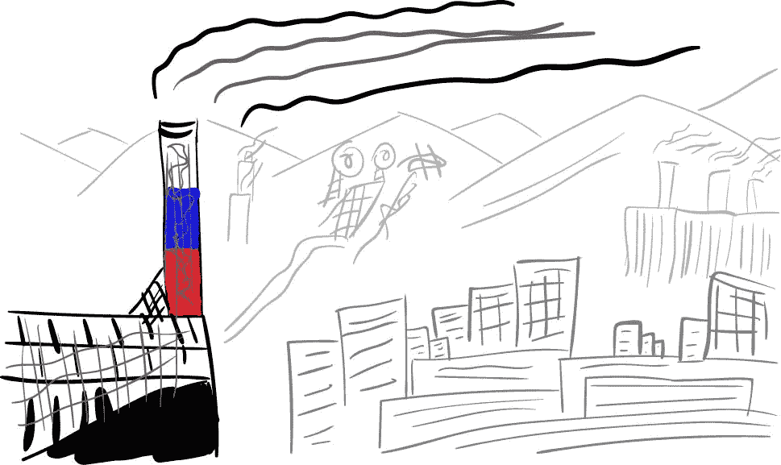
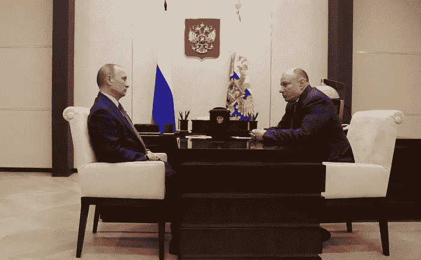
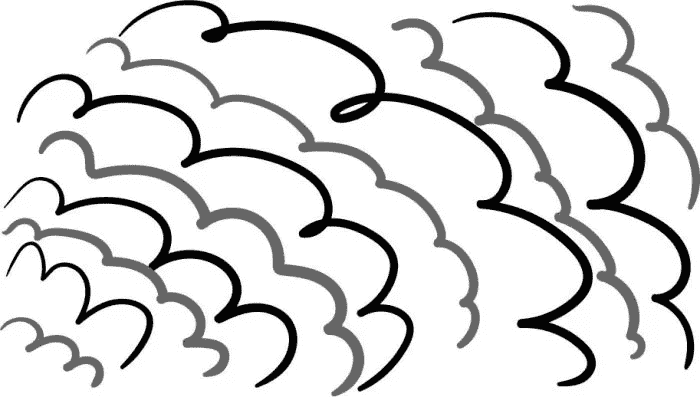
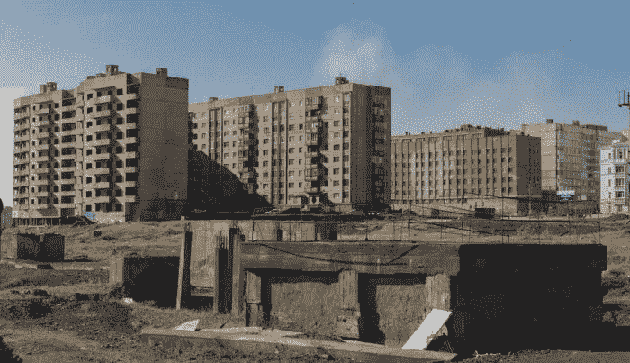

# 诺里尔斯克:冰和熔炉相遇的地方

> 原文：<https://medium.datadriveninvestor.com/norilsk-where-ice-and-furnaces-meet-648cd94e4cce?source=collection_archive---------12----------------------->

## 在俄罗斯冰冷的北部，坐落着镍产业的瑰宝，一小群高楼和冒着浓烟的烟囱，被原始的北极美景所环绕。

诺里尔斯克是俄罗斯北部的一个混凝土小污点，远在北极圈之上，被冒着浓烟的烟囱和有毒的工业废料所包围。在这小小的人类之外，传播着原始的北极之美。

正是在俄罗斯的这个地区，最后一批长毛象灭绝了。永久冻土仍然充满了它们的尸体。诺里尔斯克在 1935 年成立时，是附近古拉格集中营的囚犯挖了第一个地基。当他们开始挖掘时，他们发现了猛犸象的骨头。

五十年后，古拉格早已关闭，这座拥有 18 万人口的城市，一群工人正在修建一个卡车车库。在挖掘过程中，骨头开始再次出现。这吓坏了工人。这一次，它们不是猛犸象的骨头，而是人类的。当古拉格关闭并被拆除时，它留下了一个没有标记的墓地，是 150，000 名前囚犯的家。从来没有人谈论过这件事。克格勃出现了，把这些骨架装上卡车运走。没人知道在哪里。

诺里尔斯克没有历史。没有坟墓来哀悼。

镍。我们说话的时候你口袋里可能已经有一些了。一英镑和两英镑的硬币、一欧元和两欧元的硬币以及五美分、十美分、二十五美分和五十美分的硬币都含有镍。充电电池、不锈钢和吉他弦也是由镍制成的。镍会从地下出来，经过冶炼厂。在工厂里，它被急剧加热，直到它看起来像一个致命的喷溅的熔岩。然后，它被冷却，与其他金属混合，并被压制成硬币，你可以用它来购买葡萄干。

这些矿山和冶炼厂很可能属于诺里尔斯克的世界上最大的镍公司 Nornickel。

这家公司的产值约占俄罗斯国内生产总值的 2%，董事长是世界排名第 83 位的富豪[弗拉基米尔·波塔宁](https://en.wikipedia.org/wiki/Vladimir_Potanin)。在 90 年代由共产主义垮台引发的俄罗斯淘金热期间，波塔宁是一个被称为“贷款换股票”计划的主要策划者，该计划相当于以极低的价格大规模出售国有资产，也是弗拉基米尔·波塔宁一夜之间成为亿万富翁的一种方式。

更著名的俄罗斯亿万富翁罗曼·阿布拉莫维奇拥有该公司 5%的股份。第三大股东是俄罗斯最大的铝业公司 Rusal。Rusal 由 Matthias Warnig 担任董事长。Warnig 是一名前东德间谍，曾在 20 世纪 80 年代为弗拉基米尔·普京工作，而未来的总统是克格勃官员。

如今，波塔宁、阿布拉莫维奇和沃尼格是普京总统宠信的少数人中的三个成员。

Pals: Putin and Potanin

诺里尔斯克是一座没有树木的城市。一年中有九个月，这座城市都在下雪，气温在零下，二月份低至零下 40 度。废金属包围着工厂；汽车外壳和管道散落在地上，仿佛被冒烟的熔炉吸引回了它们的出生地。诺里尔斯克的烟囱将城市笼罩在厚厚的云层中，无论阳光是否明媚。晚上，太阳和有毒的云一起跳舞，形成了一个既美丽又有毒的戏剧性日落。

这座城市污染严重，市容丑陋，政府限制任何没有特别许可证的人进入。

2016 年，附近的达尔迪坎河[开始](https://www.theguardian.com/world/2016/sep/12/russian-metals-firm-admits-spillage-turned-river-blood-red) [流红](https://www.theguardian.com/world/2016/sep/12/russian-metals-firm-admits-spillage-turned-river-blood-red)。没有人承担责任。责任在于附近一家冶炼厂的一组 Nornickel 拥有的废水管道。但由于 Nornickel 与俄罗斯政府关系密切，这种污染多年来一直被忽视。

诺里尔斯克是俄罗斯北部众多工业城市之一。大多数是作为斯大林五年计划的一部分建造的，该计划旨在将苏联农业经济转变为以工业为基础的经济。正如学者兼作家米娅·贝内特[解释的那样](http://www.cryopolitics.com/2015/02/10/norilsk-russia-the-inescapability-of-the-company-town-on-the-tundra/)，俄罗斯的北极比任何其他北极国家的北部地区都要发达。虽然像基洛夫斯克和摩尔曼斯克这样的地方也分担了俄罗斯有毒采掘业的负担，但诺里尔斯克在环境犯罪方面是最糟糕的。

一天，我开车去机场。当时是极夜，所以非常黑。我们正在开车，突然一只狗出现了。事情发生得太快了。他不知从哪里冒出来的。他低着头，闭着眼睛。然后就结束了。这只狗只是选择了死亡。因为寒冷，因为黑暗，因为他独自一人。在黑暗的极地夜晚，在孤独中，也许这只狗做了正确的事情。这就是我们周围的一切，我认为这是诺里尔斯克的一部分。镍和冰的月亮

加拿大纪录片《镍和冰的月亮》通过与居民的接触探索了诺里尔斯克的历史和现状。这部纪录片展现了这座城市更人性化的一面。诺里尔斯克有一个繁忙的剧院和一群吃苦耐劳的人，他们在一个被人描述为“像住在月球上”的地方享受欢乐时光。

但所有人都认为诺里尔斯克是一座衰落的城市。这些旧公寓开裂且潮湿。一些幽灵般的空着，他们的居民已经放弃并离开了。其他的不完整；它们的根基像被撕裂的茎秆一样从地面伸出来。

Abandoned flats in Norilsk

自共产主义垮台和人们对生活水平的期望提高以来的 25 年间，诺里尔斯克的未来已经消失。金属工人和矿工不再是工人阶级的英雄。他们的孩子想搬到圣彼得堡。俄罗斯社会不再像过去那样盲目崇拜繁重的体力劳动。一个粗暴的金属工人哀叹道，自从苏联解体后，去其他地方看朋友的旅行费用太高了。我过去常常能在周末飞到里加去喝酒。基本上没花什么钱！他说。现在，我的选择是飞行和喝酒！这就是我的困境。'

但世界继续需要镍，诺里尔斯克的冶炼厂继续冒烟。这些冶炼厂可能看起来像是过去的遗迹，但全球制造业仍然依赖它们。如果没有这些不锈钢，我们会怎样？

尽管诺里尔斯克的居民声称他们愿意离开，这座镍城仍然保持着它的吸引力。相反，离开诺里尔斯克的主要是金属，这些工人向其中倾注了一点心血。这种金属环游世界，而它的制造者却呆在冰冷的诺里尔斯克，离下一个主要城市有 1000 多公里。

[*【怪异的西班牙】*](https://weirdspain.substack.com/) *是一份时事通讯，面向那些想要更深入了解他们的第二故乡及其人民的移民，以及世界各地想要更多了解这个神奇国家正在发生什么以及为什么会发生的西班牙爱好者。* [*在这里订阅，在你的收件箱里收到这些文章。*](https://weirdspain.substack.com/subscribe)