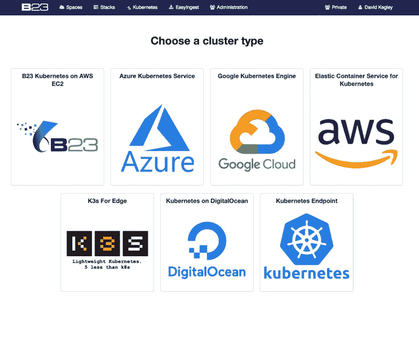

# 并非所有的 Kubernetes 服务都是平等的。我们应该知道。

> 原文：<https://medium.datadriveninvestor.com/not-all-kubernetes-services-are-equal-we-should-know-5889422c91c8?source=collection_archive---------9----------------------->

Kubernetes 承诺长期以来一直追求的功能，即从执行特定功能的软件应用程序或*工作负载*的角度，完全抽象底层公共云、私有云和边缘基础架构。对于 B23 来说，Kubernetes 的价值意味着我们基于多年经验开发和运营的所有创新和突破性的数据工程和应用机器学习*工作负载*可以无缝部署在运行 Kubernetes 的几乎任何环境中。

 [## DDI 编辑推荐:5 本机器学习书籍，让你从新手变成数据驱动专家…

### 机器学习行业的蓬勃发展重新引起了人们对人工智能的兴趣

go.datadriveninvestor.com](http://go.datadriveninvestor.com/5ML1) 

B23 支持和操作各种 Kubernetes 解决方案，包括我们部署到任意一组受支持的服务器主机上的“纯”Kubernetes。我们还支持来自 Google、Amazon、Microsoft 和 DigitalOcean 的公共云托管 Kubernetes 服务。我们支持集成到以前运行的 Kubernetes 系统，以解决私有云 Kubernetes 解决方案。最近，我们支持 Rancher 的 K3S 边缘计算解决方案(在后面的博客中有更多令人兴奋的消息)。

我们从零开始完成了 Kubernetes 的"*艰难之路*，我们使用云管理的 Kubernetes 完成了“简单之路”，或者至少我们*认为*管理的 Kubernetes 会很简单。在某些情况下,“简单的方法”并不简单。这就是为什么 Kubernetes 的“概念价值”与 Kubernetes 的“实际价值”不同。这很大程度上取决于您的云服务提供商。

以下是我们在使用 Kubernetes 实现与基础设施无关的工作负载这一最终目标的过程中发现的一些高级差异。它们分为以下几类:

**默认安全功能和版本因 Kubernetes 服务提供商而异**

**对 Kubernetes 跨服务提供商自动扩展功能的不存在或有限的内置支持**

**一些服务提供商需要专有或提供商特定的功能，导致厂商锁定**

**Kubernetes 和托管的*工作负载*的工作流和生命周期管理在功能和复杂性**方面各不相同

**用于以编程方式运营托管 Kubernetes 解决方案的 SDK 生态系统在成熟度方面有很大差异**

**在云供应商的控制台上操作 Kubernetes 的“开发者体验”有很大不同**

# **安全性、升级和版本兼容性支持**

Kubernetes(CVE-2018–1002105)中最近非常明显的安全漏洞对于大多数目前运行 Kubernetes 或希望采用 Kubernetes 的组织来说是一个大开眼界的时刻。发布之后，修补和/或升级现有和正在运行的 Kubernetes 集群的能力对组织来说至关重要。在不同的云管理 Kubernetes 解决方案上运行工作负载，运行不同的版本，并使用不同的流程进行修补和升级是一个重要的考虑因素。并非所有云管理的 Kubernetes 服务都易于修补和升级。在 B23，我们认为问题不在于是否会发现更多的安全漏洞(毫无疑问会)，而在于我们能够以多快的速度做出响应，并不间断地继续运行我们的业务关键型工作负载。

# **自动缩放**

从传统数据中心迁移到云的一个最基本的优势是，根据服务最终用户所需的软件应用程序不断变化的需求，自动扩展计算、内存和/或存储。Kubernetes 使自动伸缩比以前的虚拟机自动伸缩服务更容易(我们可以写一整篇博客来说明为什么这很重要)。几乎每个工作负载都可以从自动扩展服务中受益，从基本的 web 服务器/电子商务解决方案到数据工程和应用机器学习工作负载，如 B23 为我们的客户提供的工作负载。使用 Kubernetes 在云中托管工作负载而不具备自动扩展资源的能力是没有意义的。

# **避免供应商锁定**

一旦你开始管理一个云管理的 Kubernetes 解决方案，你很快就会明白供应商是如何创造他们的护城河来锁定客户的。每个云供应商都将推荐一种方法，利用他们的能力来运营和保护 Kubernetes 解决方案——使用他们的供应和监控工具等。这完全可以理解，而且在大多数情况下，这些功能增加了托管 Kubernetes 产品的价值(并使其与众不同)。在我们看来，当供应商专有的功能被要求为“必须具备”而不是最佳实践时，这条线就被跨越了。

# **生命周期管理**

根据我们的观察，大多数 Kubernetes 系统管理员仍然使用特定于供应商的“云控制台”来管理他们的 Kubernetes 系统的生命周期(供应、操作/管理和删除)。对于基于角色的访问控制，每个云供应商都有自己的术语和最佳实践安全建议。使用只有少量集群的基于 web 的云控制台来管理底层资源变得非常困难，这就是为什么我们的所有解决方案都是以编程方式管理的

# **SDK 生态系统**

在 B23，我们使用 Python 进行大部分开发和编程自动化，命令行 SDK 是第二大优势。cloud Kubernetes 服务提供商的 Python SDK 功能在成熟度上有所不同。在大多数情况下，命令行 Kubernetes SDK 相当有用，但也存在差异。在一个特定的例子中，关于一个著名的供应商，根据我们提交的错误数量和我们推荐的文档更新，我们很难相信我们不是第一个使用 Python SDK 的。从 Python SDK 的角度来看，它基本上是不可用的。

# **开发者体验**

当然，这是主观的，但是有一个普遍的共识，一些托管的 Kubernetes 服务比其他服务更容易开发和操作。因为我们每小时和每天都在使用它们，所以我们当然有我们的最爱，它们在概念上易于使用和操作。通常，术语上的小差异可能会令人讨厌，处理云专有需求可能会令人沮丧。在不指名道姓的情况下，我认为公平地说，我们总体上同意在这一领域发表意见的人。

# **有没有最好的？**

许多人问我们是否有“最好的”Kubernetes 管理服务。

答案是“是”…

*…但是*这也取决于顾客在寻找什么。在现实世界中，企业仍然从他们了解和喜欢的供应商那里购买软件和云服务。有时候，当涉及到人类情感时，很难讨论一个解决方案的技术价值。这就是为什么在考虑哪种 Kubernetes 解决方案最适合您的组织时，或者当决策与技术价值无关时，如何快速适应变得更加重要。