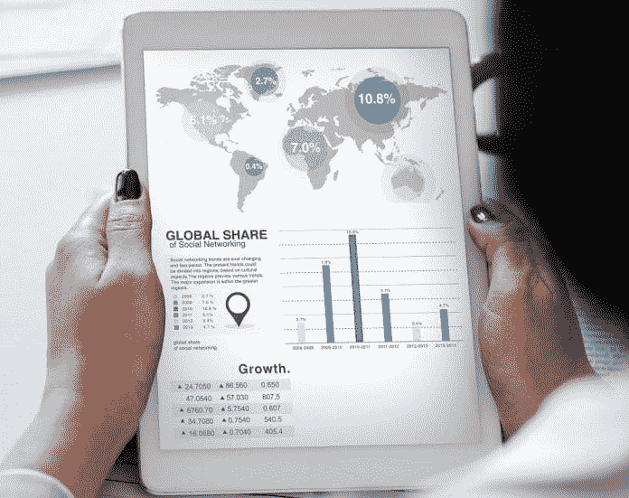

# 并非所有保护都是不好的|数据驱动的投资者

> 原文：<https://medium.datadriveninvestor.com/not-all-protection-is-bad-data-driven-investor-53b81b37c3cb?source=collection_archive---------18----------------------->

在围绕贸易战叙事的对话中，我们忽略了一件事，即并非所有的保护都是不好的。问题是，如果你看看某种保护的理由，没有一个符合特朗普和他的经济政策制定者试图做的事情的公开原因。撰写贸易文章的经济学家会注意到六类保护主义理由。

首先，对商品征税是为国家赚钱的好方法。许多欠发达国家的经济活动更多地发生在非正规经济中，因此从进口中拿走一部分收入是获得现金来运转政府的好方法。这是某些右翼美国人想象中的天堂，他们认为我们应该回到小政府和允许征收所得税的进步时代税收改革的时代。(对于想回到金本位的人来说，这里也有重叠——在现代国家，这也是一个坏主意)。

 [## 为什么包容性财富指数比 GDP 更能衡量社会进步？|数据驱动…

### 你不需要成为一个经济奇才或金融大师就能知道 GDP 的定义。即使你从未拿过 ECON 奖…

www.datadriveninvestor.com](https://www.datadriveninvestor.com/2019/03/08/why-inclusive-wealth-index-is-a-better-measure-of-societal-progress-than-gdp/) 

第二类是劳工论点。这是一个普遍的说法，即贸易会损害就业，因为将劳动力转移到海外意味着国内就业岗位的流失。这样做的最大问题是效率低下。国家可以花很多钱来保护那些不值得保留的工作。此外，即使应该保留这些工作，问题是保护是否是保留这些工作的最佳方式。你可以更有效地间接补贴一个你想要保护的行业。我们现在看到这种情况，付款给我们的“伟大的爱国农民”,而不是让他们以世界市场价格出售他们的产品，因为这场贸易战正在进行。

第三类更加微妙。我们必须认为世界不是静止的，而是处于不同发展阶段的国家。幼稚产业的观点认为，允许对 sum 行业进行保护可能是个好主意，因为这对国家有好处，但他们还不能制造出符合世界标准的产品，所以允许他们发展。这是可行的——汉密尔顿在 18 世纪 90 年代去了国会，并将其作为最佳产业政策，在他的“关于制造业的报告”中指出，国家发展的最佳方式不是通过农业(比如，国家或自耕农),而是通过确保新兴产业的发展。除了具有先见之明之外，它还让中国变得自力更生，而不仅仅是一个大宗商品出口国。当然，那种商品是棉花，棉纺厂是在马萨诸塞州发展起来的，由于奴隶制度，棉花很便宜，但这也适用于英格兰，他们只是把农奴赶出了田地，围起了公地，然后他们就变成了工厂工人，以相互自由的劳动换取工资。

第四类是关于国家安全的正当理由。你可以说你热爱自由贸易，但是你热爱自由贸易到把导弹系统卖给你意识形态上的敌人吗？当然，我们可以质疑为什么我们的世界会有意识形态的敌人或导弹系统，但是考虑到这两者都存在，作为一个与你交易这些东西的国家，你可能要小心了。

一个相关的论点是文化保护论点。也许你有意识形态上的敌人，但他们也是世界上最大的文化产品生产商——他们可以用他们的摇滚、牛仔裤和好莱坞电影来影射你的国家，彻底摧毁你自己的本土文化，而不是导弹系统。你不喜欢吗？在边境上安排一个看守人，不要让那些东西进来。

保护的最后一个理由是报复。比方说，有人开始掌管你最大的贸易伙伴之一，并决定利用一个或多个先前的论点来加强对他们的保护。你就这样算了吗？不要！你发动了一场贸易战，并对进口商品加征关税，目的是伤害那些投票给那些一开始就认为贸易战是个好主意的人的人。现在你处于一种全面的敌对关系中，没有赢家。很高兴那个人决定采取行动。

我们看到的是特朗普和他的人试图推动的是最后一个原因的某种零和版本，增加与中国(现在是欧洲)的贸易壁垒，作为对长期利用我们的某种惩罚。特朗普没有将贸易视为一种交换，而是一场分出赢家和输家的竞赛。对他来说，我们从中国购买价值数千亿美元的商品的事实表明，美国人输了。然而，这忽略了一个事实，那就是美国人现在有那么多的商品。重商主义者有一种固定的思维模式，他们认为国家的财富就是一堆黄金，如果我们的进口量大于出口量，就意味着我们的黄金储备少了，而他们的多了。在全球体系中，情况并非如此，因为贸易是流动的，资本是流动的，不再是固定的一堆。97%的经济学家支持更自由的贸易，因为这是我们能够记录的为数不多的经验概括的净福利收益之一。真正的问题在于这些收益如何分配，但那是以后的事了。

埃德加·米赫利奇早年从事教育和新闻工作，但在过去的十年里，他在一家为智力和发育障碍者服务的非营利组织的财务部积累了经验。与此同时，他继续接受教育，于 2016 年获得了肯考迪亚大学的 MBA 学位，并将于 2020 年获得两个硕士学位——一个是堪萨斯州立大学的英语学位，一个是罗斯福大学的经济学学位。他希望继续攻读博士学位，这样他就可以不用去上学了。关于他最有趣的事情是他在危险中失去的时间！

*原载于 2019 年 10 月 17 日*[*【https://www.datadriveninvestor.com】*](https://www.datadriveninvestor.com/2019/10/17/not-all-protection-is-bad/)*。*