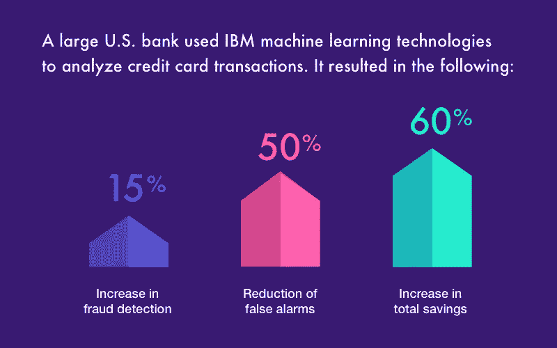
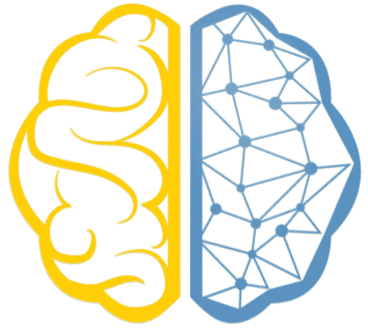
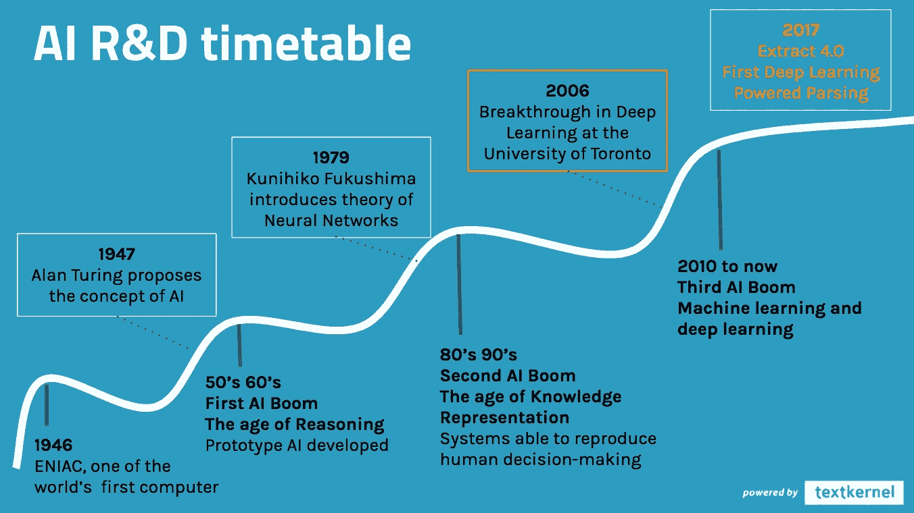

# 需要更多数据？扩大问题范围。

> 原文：<https://medium.datadriveninvestor.com/not-enough-data-expand-the-scope-of-the-question-f9d5aa9c2363?source=collection_archive---------4----------------------->

## 应用人工智能是关于制定问题来整合数据。

在机器学习领域工作，我得到的最常见的问题是“你如何找到足够的数据？”这可能是一个有趣的问题，也可能是某人在寻找借口逃避改变的迹象。简单的答案是，数据是一种珍贵的商品，AI 工程师沉迷于数据就像我们的前辈沉迷于石油一样。我们购买、乞求、借用，或者你知道，在它“从卡车后面掉下来”后找到它这是我们做得最好的唯一方法，在现实世界的混乱中解决问题。

用另一种语气说，“你从哪里得到你的数据？”暴露了失败主义的态度。这个人经常暗示“我不能用机器学习来解决这个问题，因为我们没有足够的数据。”根据我的经验，缺乏信息可以通过创造力来解决。当一个行业中的大多数参与者认为环境信息贫乏时，颠覆性创新的时机就成熟了。五年前，谁会想到一个人的社交媒体帖子可以在没有任何直接人类输入的情况下预测自己未来的怀孕？现在看起来很明显，但在人工智能驱动广告之前，这是不可想象的。

尽管可以接触到顶级开发人员，但忽视机器学习的人有一个共同的心理错误。这些人期望他们目前解决问题的方法也是最佳的人工智能方法。他们看不到人工智能的真正价值，即**将一种全新的*类*智能融入问题解决过程的能力。**人类的大脑使用叙事来预测未来的结果:*“Stacey 去商店买了一夸脱牛奶和一盒饼干，她可能打算一回家就一起吃这些东西，同时看电影。”*人工智能的优势在于找到相关性，牛奶和饼干可能不会让人想起坐在沙发上看《女仆的故事》的画面，但*结合 Stacey 的出生日期、收入和身高，人工智能可能会确定她有 35%的机会在未来 12 天内更换她喜欢的洗发水品牌。*前者是基于推理的人类式预测，后者是纯粹的统计事实。我们也许能在事后合理化它，但它永远不可能从基本原则中推导出来。虽然机器学习确实因数据而蓬勃发展，但人工智能对“*相关数据”*的定义如此宽泛，以至于需要我们走出自我，从一个新的角度应对挑战。回报是超人水平的优化和洞察力。

在我的工作中，机器学习的一个典型的误导方法是“**我有一个销售前景的列表，我想用人工智能筛选出好的，这样我就不会浪费时间。**“像这样的人通常会为他的潜在客户购买一个基本消费者信息数据库，并记录以前成功的潜在客户的消费者信息。他或她可能正在考虑比较这些名单，看看哪些潜在客户与以前的客户最相似，这是一个人在理论上有无限时间可以做的事情。**问题应该是:“考虑到我的预算、商业模式和前景。我如何实现利润最大化？”**不要把人类的叙述强加给 AI，而是指定问题的参数，指出应该最大化的变量。**不是邮寄数量，不是转化率，不是方法的合理性，只是利润。**

一旦问题被恰当地指定，就把问题交给应用人工智能专家。解决问题的过程是人类理性和机器智能的协作。工程师使用经验、实验和高阶推理的组合来选择和正确校准神经网络可用的变量。神经网络使用深度学习来寻找每个变量之间的相关性，无论是单独还是组合，直到输出为最大利润而优化。其结果是强大的预测能力，超出了传统的纯人类统计方法所能合理提供的。这就是锤子和钉枪的区别:更快、更强、更准。

这是 AI 的真正力量，也是数据没有人们想象的那样成为瓶颈的原因。**用 AI 解锁隐藏关联的能力武装起来，相关数据的定义在不断扩大。**2018 年你表姐的 DNA 序列是你的个人医疗信息，你姐姐的谷歌搜索历史是你的私人消费数据。有了神经网络做艰苦的统计工作，唯一的瓶颈是人类使用工具的创造力。

下次有人告诉你他们没有足够的信息，挑战这个假设。也许他们陷入了前人工智能的思维模式，并问了错误的问题。即使是最好的工程师也会因为缺乏想象力而低估自己。同样，如果你有一名员工想将人工智能融入你的流程，不要太快解雇他们。人工智能确实是一种平行的智能形式，是对我们自身智能的补充。期望结果如此之好，以至于没有任何意义。这是过程的本质。