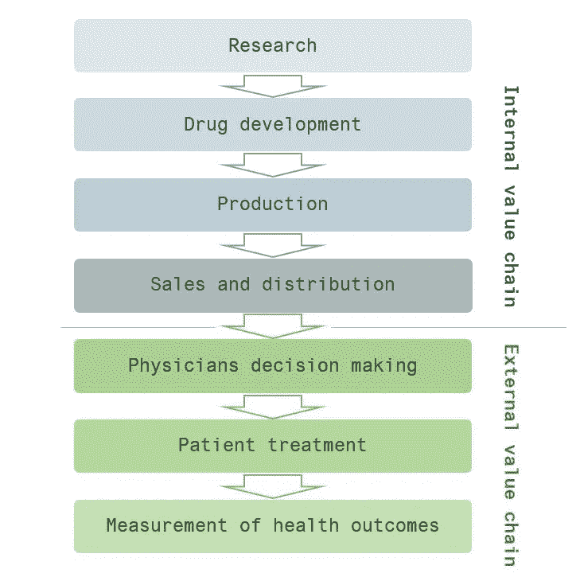

# 医疗保健行业的数字创新

> 原文：<https://medium.datadriveninvestor.com/not-pretending-to-be-a-guide-on-digital-innovation-in-the-healthcare-industry-7e23889959cf?source=collection_archive---------5----------------------->

## 制药和医疗保健公司如何通过数字化实现创新的简短故事。

近年来，许多因素都在推动医疗保健公司走向数字化。外部因素，如加速技术创新、客户对改善医疗保健服务的需求，需要抵御行业干扰；内部因素，如成本效率压力或当前业务模式的过时。不管是哪种触发因素，信息是明确的:利益相关者、顾客、医生、病人都要求医疗保健公司明确改变方法，这是一个典型的转变:从产品/服务的提供者转变为健康结果的提供者。

健康结果关系到最终患者的状况，它们衡量护理的实际效果，它们位于价值链的边缘，这是新的附加价值所在。仅举几个例子，最佳结果可能是:

*   患者更容易获得护理；
*   有效监测病人的健康状况；
*   快速准确地检测健康问题；
*   增加患者对处方治疗的依从性；
*   广泛的医学知识分享。

现在，**数字化**是实现这种范式转变的关键，并在边缘捕捉这种利用的行业价值。然而，为了有效，数字化必须污染整个组织和医疗保健价值链(不仅仅是边缘):从研究 **>** 到药物开发 **>** 到生产、销售和分销 **>** 到医生的决策和诊断 **>** 到患者治疗 **>** 到健康结果的测量(精确地说)。

*很聪明，那么该怎么办呢？*

在大型组织中带来变革是一项艰巨的挑战，但总有一个好的起点，即基础:**文化**和**数据**。

文化意味着组织内的员工接受变革是为了公司的长期生存，接受变革将是每天的任务，而稳定将是例外。文化还意味着领导团队放弃政治，允许从外部聘请高技能人才，让他们领导数字化进程，并让他们参与商业决策——他们将成为你的内部商业伙伴。

数据意味着收集、存储和组织整个价值链中所有可用的数据。没有数据的支持，数字化道路是不可想象的，因此，请努力构建有效的 IT 基础设施，引进技能和技术，利用云/IT 提供商的资源和计算能力，他们将成为您的外部技术合作伙伴。

*明白了，然后呢？*

然后进入业务，产品，流程。

追求**成本效益和工作流程优化**:考虑管理任务占医疗成本的 30%(来源:Frost&Sullivan[research](https://ww2.frost.com/))。数据驱动和人工智能驱动的数字系统/工具可以帮助实现这些任务的大部分自动化，并实现巨大的节约。

**打造你自己的数字产品和服务**:首先要了解哪些健康结果是相关的，你如何设法提取隐藏在其中的价值，哪种产品/服务更好地服务于这些目的，哪种商业模式可能适用于每种特定的产品/服务。这是一条艰难的道路:无论你的目标是为医生提供全新的数字治疗解决方案，还是想要推出一款创新的患者监护设备，总之你需要部署内部资源，整合数字产品管理技能，建立一个类似创业的环境，并拥有清晰的商业愿景。

你也可以**建立自己的风险投资策略**。与风投、孵化器、大学合作，在竞争对手之前获得医疗保健初创企业生态系统中的投资机会。战略目标可能会非常不同:如果你希望将数字资产整合到现有的商业模式中，那么直接 100%风险收购应该没问题。或者，如果你只是想监测前沿技术的发展，那么收购不同的有前途的初创公司的多个小股份可能是正确的举措。问题是:不同的战略目标有不同的方法。

此外，不要低估**与进入医疗保健市场的科技巨头**合作的可能性:Alphabet、亚马逊、苹果、微软正在通过为消费者、护理者、保险公司开发新工具来加速对该行业的投资(美国 10 家最大的科技公司在 2017 年参与了 27 亿美元的医疗保健资金，高于 2012 年的 2.77 亿美元，见[来源](https://www.nytimes.com/2017/12/26/technology/big-tech-health-care.html) ) —这对现有公司来说不是威胁，而是与潜在颠覆者建立战略合作伙伴关系的巨大机会，实现

嗯，我如何评估数字化的成功？

你也应该改变你衡量表现和成功的方式。这里的问题是:通常的绩效衡量指标和框架不一定适用于您的新数字项目和计划。在一个创业环境中，就像你正在尝试创建的环境，绩效评估的重点应该是团队在这个过程中学到了多少，它适应的速度有多快，战略的转变。你应该建立一个全新的**数字问责**框架，KPI 在其中评估学习、敏捷、实验——抛开无用的“虚荣指标”。

如标题所述，这个故事既不能作为指南，也不能作为数字化转型的框架。这是一个结构化的观点集合，涉及当今围绕数字化转型的讨论中的一个热门话题。请随意在评论或注释中添加更多内容。