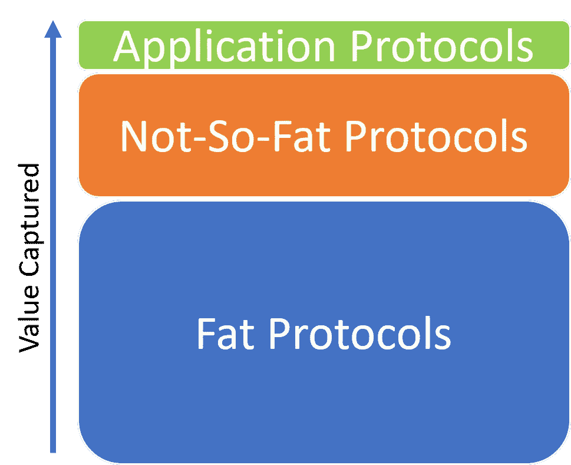
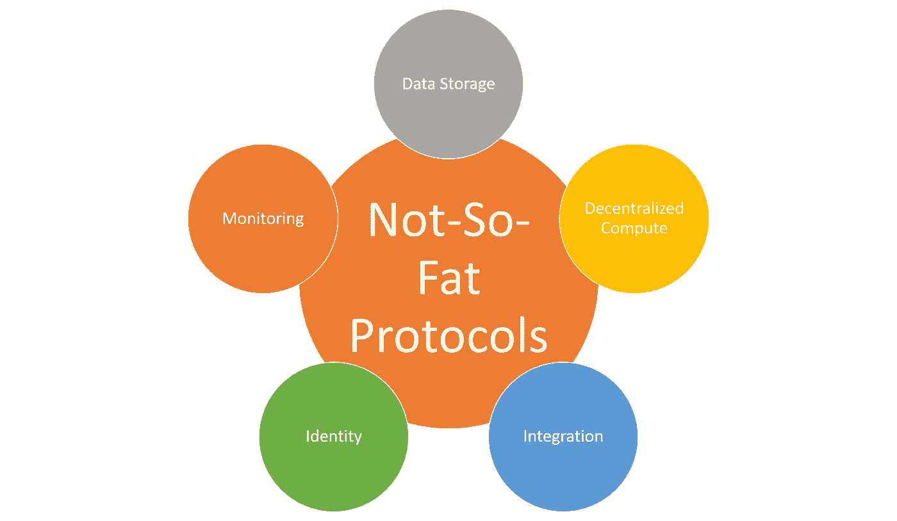
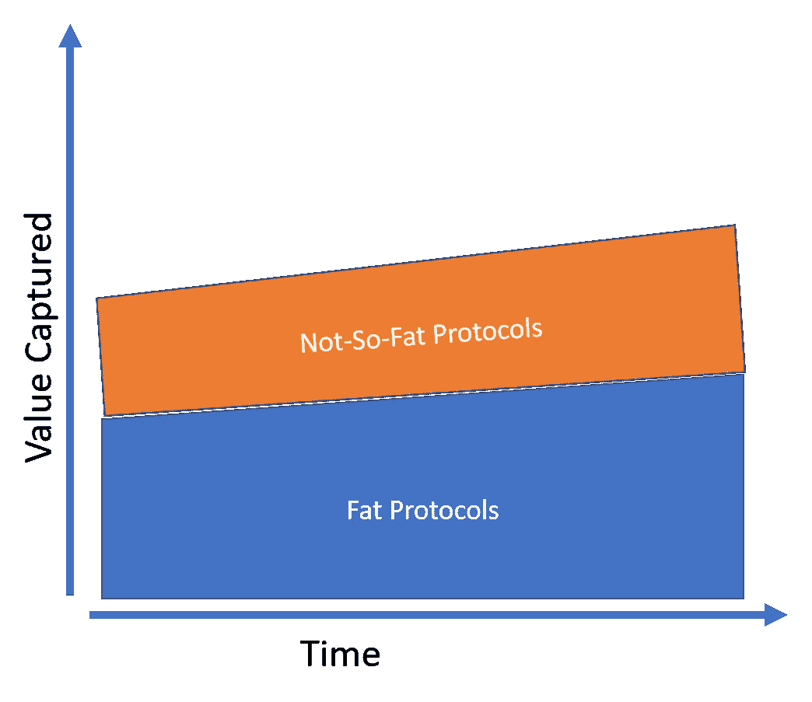

# 不那么胖，但仍然是关键协议

> 原文：<https://medium.datadriveninvestor.com/not-so-fat-but-key-protocols-2e4733279aea?source=collection_archive---------9----------------------->

Joel Monegro 的 Fat Protocols 博客文章已经成为影响当代区块链技术的开创性文章之一。在他的论文中，Monegro 解释了区块链技术中的协议层如何可能比应用层获得更多的价值，这是一个与其他技术趋势根本矛盾的轨迹。无论你是否同意 Monegro 的观点(我个人认为，在使用区块链技术时，金融市场中有一系列应用可以释放出堪比比特币的价值水平)，这个想法当然值得探索。然而，如果你是一名在现实世界中构建区块链解决方案的开发人员，你会不断面临挑战，这些挑战涉及比比特币或以太坊智能合约更高级别的协议。为了与众不同，让我们称这些堆栈为不太胖的协议(NSFP ),即使它们在价值上不能与第 1 层协议相比，但它们现在和将来都是主流采用区块链技术的关键。

# 理解不那么胖的协议

理解简单协议的最简单方法是考虑您在任何区块链应用程序中需要的基础设施功能。更好的是，如果我们回到云计算的早期，想想第一组平台服务，它们位于 AWS 或 Azure 等平台的基础设施功能之上。同样，构建区块链解决方案的开发人员需要一组基本的构建模块来抽象关键功能，如数据存储、身份或集成，这些功能在任何区块链应用程序中都无处不在。这些构件位于以太坊智能合约等胖层 1 协议之上，应用协议之下。

# 关键的不那么胖的协议

如果我们将软件世界分为集中式和分散式应用程序，以太坊智能合同等技术可以与 TCPIP 或 SMTP 等低级协议相比较。这些协议为第一代软件应用奠定了基础，但随着第二层技术的出现，它们逐渐变得不那么明显，以解决主流应用的一些主要需求。这种演变贯穿了集中式软件历史上主要运行时的演变，如 web、移动或云。类似地，我们应该期待第二层不那么胖的协议慢慢开始抽象胖协议，如主流应用程序中的以太坊。

考虑到这一点，我们应该在主流区块链应用程序中看到哪些关键的非肥胖协议？这个列表可能相当大，而且肯定会引起争议，但在我看来，有五个关键协议与几乎所有通用现代区块链应用程序相关。

# 数据存储

任何区块链应用程序都面临着高效存储和访问数据的需求。为了使分散式应用程序变得可行，我们需要与集中式数据库技术 50 年的发展相比较的协议。像[、IPFS](https://ipfs.io/) 、 [FileCoin](https://filecoin.io/) 或 [BigChainDB](https://www.bigchaindb.com/) 这样的平台是首批填补区块链空白的平台。

# 分散计算

跨分散节点的联邦分布计算是区块链应用程序可伸缩性的一个关键能力。这相当于为去中心化的世界构建 AWS EC2。像[假人](https://golem.network/)和 [Tendermint](https://tendermint.com/) 这样的技术是该领域最相关的一些项目。

# 身份

身份验证、访问控制、联合是任何区块链解决方案中都存在的一些以身份为中心的功能。在一个去中心化的世界中，我们仍然主要依靠集中式平台来应对身份管理挑战。像 [Civic](https://www.civic.com/) 或微软在分散身份方面所做的一些工作[这样的技术是该领域有前途的协议。](https://cloudblogs.microsoft.com/enterprisemobility/2018/02/12/decentralized-digital-identities-and-blockchain-the-future-as-we-see-it/)

# 综合

与链外数据和服务通信是主流区块链应用程序的另一个关键需求。虽然这听起来在概念上是微不足道的，但是在大多数区块链平台上，与链外应用程序的集成仍然具有难以置信的挑战性。像 [Oraclize](http://www.oraclize.it/) 这样的技术提供了一些最复杂的协议来尝试解决这一挑战。

# 监视

对于当前一代的区块链平台来说，监控和分析分布式应用程序的行为简直就是一场噩梦。该领域大多数有趣的解决方案都是由一些区块链即服务堆栈提供的，如 [Azure](https://azure.microsoft.com/en-us/solutions/blockchain/) 、 [Bluemix](https://console.bluemix.net/catalog/services/blockchain) 或 [BlockStack](https://blockstack.org/) 。

# 不太肥胖协议的价值越来越大

不太胖的协议刚刚开始在区块链市场上变得相关，其总的潜在市场代表了一级协议所创造的价值的一小部分。然而，随着区块链应用程序变得更加主流，我们可以看到不太胖的协议的价值逐渐增加，并占据了所谓的胖协议所拥有的市场份额。

这种市场变化可能无关紧要，因为肥胖协议的价值也可能会增加，但有一点是肯定的:不那么肥胖的协议将继续存在。