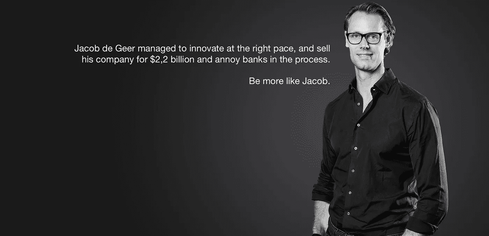

# 不要太慢，也不要太快——我们需要的是适量的创新

> 原文：<https://medium.datadriveninvestor.com/not-too-slow-not-so-fast-what-we-need-is-the-right-amount-of-innovation-1f98169266d2?source=collection_archive---------1----------------------->

在任何行业，经营一家成熟企业的一个核心问题是始终保持不变、适应和进步之间的平衡，以及处理这种平衡的性质、速度和实践。但是，我们不作为、行动不够快或行动过快会带来什么风险呢？

当然，不存在单一的开/关选择；相反，我们处理变化的方式是运营结构和政策的一部分，但也可能根植于文化、历史和关于内部和外部如何做事的叙述中。

面对数字化和快速变化的消费者偏好和行为，我们看到许多公司面临这种困境。零售、金融、酒店、运输只是深受其影响的部分行业。

前提是，你要确保自己与客户的需求相关，同时保持正现金流，并保持可持续发展的成本结构。如果你在当前的运营中取得了成功，那么任何挑战现状的转型都同时面临着失去重要收入或其他对当前业务至关重要的东西的风险。

很简单，这是一个非常非常微妙的平衡动作。

# 那么，为什么大公司通常不能以正确的速度创新呢？

主要不是资源*；并不是他们看不到，看不懂。

但本质上，这是一种战略和运营上的无能。从缺乏一致性和共同点的意义上来说是战略性的，因此，次优化和利益冲突接踵而至。可操作性是指人们不知道现在该做什么或去哪里。

# 那么，如何确定正确的方法呢？

看数据和统计数据几乎总是可以从不同的角度来理解。以仁慈的方式分析数据或者做出有利于你的业务的分析是很容易让人陷入困境的。

假设我们的一部分客户说他们对当前的分销平台不满意——他们宁愿选择其他地方。你对此有什么看法？让它变得更好——更有吸引力，或者干脆把它拿下来。该平台中是否有客户不知道的价值，但对业务骨干至关重要？它能否以这样一种方式转变、改变和发展，即保持其对业务的价值，同时又更符合客户的需求？是否需要创新来改变对服务的看法？一个经典的例子是，根据亨利·福特的说法，当被问及对交通工具的偏好时，人们会要求更快的马而不是汽车。

当你进行分析时，一些棘手的问题出现了:你是否应该表现得好像你的业务的某些方面是与生俱来的，或者是不容置疑的，或者是质疑甚至是过去成功因素中最基本的真理是合理的？你是采取强有力的行动，推动变革，还是继续不断改进？你是在日常运营中整合创新和业务发展，还是将创新外化并创造一个单独的空间，以后再整合？

# 这在现实生活中是如何发生的？

过去几年对金融部门来说具有巨大的破坏性，这场革命似乎才刚刚开始。在我们周围，新的参与者正在全能银行产品的不同领域进行创新。在几乎所有这些情况下，服务从一开始似乎就没有威胁，这类似于中断经常发生的情况。事实上，这是克莱顿·克里斯滕森在其颠覆理论中描述的关键陷阱之一。例如，iPhone 在发布时被大型手机制造商视为玩具。较大的参与者继续专注于他们自己的业务，提炼、增强和培育当前的产品设置，但错过了正在发生的转变。因此，类似地，当金融服务公司在不同的业务领域接连受到挑战时，似乎什么都不会发生，直到为时已晚。

瑞典金融初创公司 Izettle 是一个很好的例子，说明了现有的银行业务将如何一部分接一部分地被新型公司接管。从一开始，iZettle 就追求一个非常小众的市场——由美国的 [Square](http://squareup.com/) 发明的移动卡支付。大多数现有银行认为这是一个单一产品的威胁，[很快发布了一个类似的产品](https://www.mobil.se/business/swedbank-lanserar-mobil-kortterminal)——尽管没有那么复杂和圆滑。在一家大型银行的产品和服务组合中，它很快被遗忘，也很少受到关注。

他们没有意识到的是，这个产品离最终目标非常非常远。围绕 iZettles 产品的生态系统现在包括中小企业贷款、电子商务系统、支付解决方案等。基本上，小型零售或服务公司可能需要的一切。它将在 2018 年以 100 亿 SEK 的估值上市。[修正；现已被 PayPal 以 22 亿美元收购](https://www.breakit.se/artikel/13420/paypal-koper-izettle-for-over-19-miljarder)。

Izettle founder Jacob de Geer, Paypal CEO Dan Schulman and Paypal COO Bill Ready. Photo: Press

现在，企业家精神已经进入抵押贷款业务，许多瑞典初创公司提供的抵押贷款利率远低于普通银行。最核心的反应是[指出这种现象](https://www.expressen.se/dinapengar/experter-varnar-for-dyrare-bolan/?complete-navigation)(平心而论，有很多)目前的缺陷，而不是分析是什么让 8200 名客户在 Enkla 推出其数字低成本抵押贷款的第一天注册。

仅仅是兴趣低，还是也和简单、透明有关？反弹反应，入职过程中的一些事情？

银行传统上有着非常高的膨胀，抛出类似*“风投资助的初创公司是我们外包的研发部门”*，或者*“我们在他们有规模之前就有创新”*的即兴评论。

只是像 [iZettle](http://www.izettle.com) 、[trusted](https://trustly.com/se/)、 [Klarna](https://www.klarna.com/se/) 和其他一些公司现在是大玩家。他们拥有 50 亿 SEK 的规模和估值。在这一点上，它不仅仅是你获得的东西。但同样重要的是，他们拥有相当大的客户群(因为现在与 PayPal 合作的 iZettle 更大)，这为他们提供了巨大的平台机会。这确实表明，在所有这些小型创业公司中，存在真实业务规模的隐藏威胁，也表明了不要试图避免单一产品攻击，而是要了解并赢得整个游戏的重要性。

要赢得游戏，你需要开始执行任务的能力。无法以足够快的速度改变，同时取悦市场、专家并构建业务的外部故事，仍然是大型现任者的一个突出问题。

没有任何战略努力是一成不变的，而是随着环境变化而变化的能力，而不放弃使企业与众不同的东西。

至少对我来说，无论你选择什么样的商业模式、分销策略或路径，都必须明确方向，并在前进的过程中不断适应和改变。

# 数字化是未来竞争的核心

如果你的背景是实体零售、金融或其他什么，那么将业务转型为数字化首先是要确保你保持足够的相关性，以吸引足够大的市场份额，而不是冒着成为利润玩家的风险。

对任何企业来说，发生巨大变化的是如何发现、评估和消费你。经营企业的所有这些关键部分现在大部分都数字化了。

这意味着，在任何给定的商业解决方案中，都有上百万个小选择要做，所有这些都会影响客户体验，进而影响你对品牌和公司的看法。说一个数字解决方案，就其本质(作为数字)而言，很容易被复制，因此不会作为一种竞争武器构成威胁，这是……嗯，是错误的。

个人接触、人性、体验、作为顾客的感受、服务和产品的消费和互动方式，以及任何其他触觉参数都已经在很大程度上数字化了，未来将会更加数字化。

品牌可以绝对地，也必须绝对地，被作为消费者的数字体验所定义。我们再也不能将数字能力仅仅视为一种补充服务，一种帮助商店或实体商店的附加服务。

它必须整合到流程、产品和体验中。否则，这项业务将是地方性的，无关紧要的。

*对于上市公司来说，这是一件相当复杂的事情。他们必须平衡投资与成本结构，同时仍能提供稳定的收入增长。风险投资公司在某些年份有极高的烧钱率，没有义务显示利润。此外，在这种经济形势下，找到 IT 能力几乎是不可能的，即使对于那些可能是有吸引力的雇主的科技公司和初创公司来说，对开发人员的竞争也是疯狂的。

*原载于 2018 年 07 月 21 日*[*carlbjulling . se*](http://carlbjurling.se/content/not-too-slow-not-so-fast-what-we-need-is-the-right-amount-of-innovation/)*。*