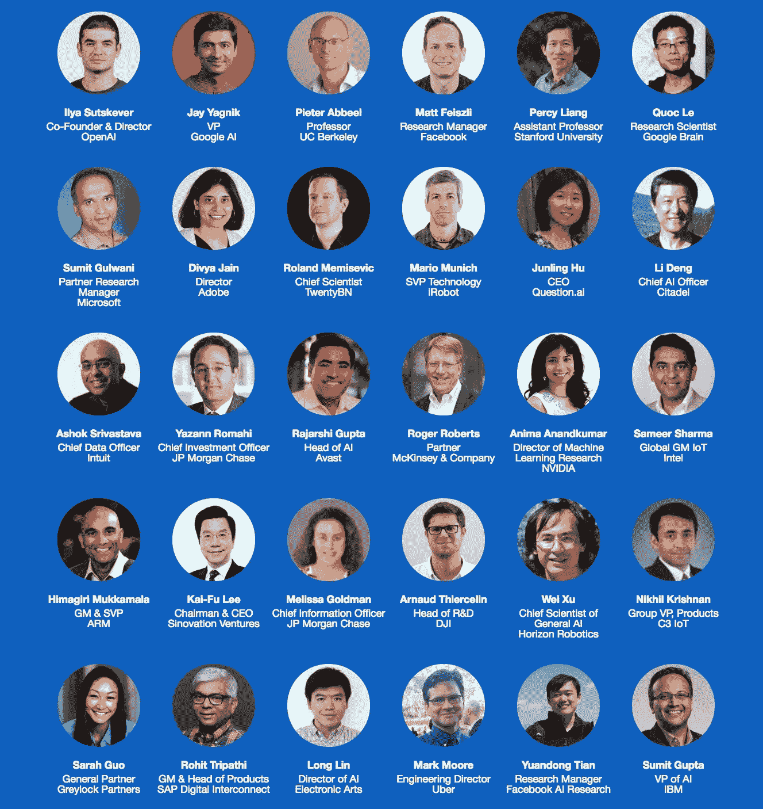
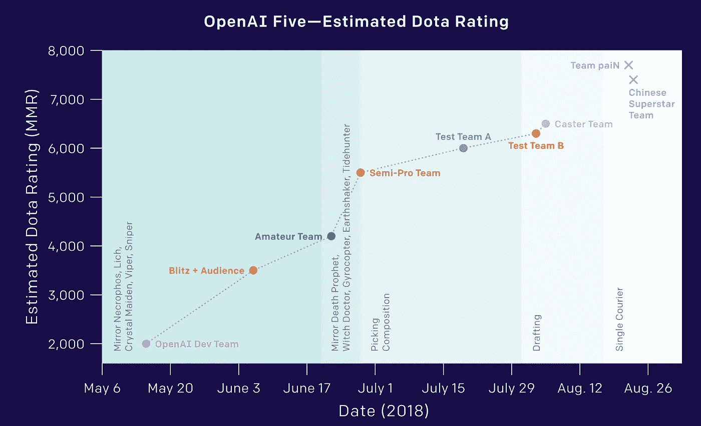
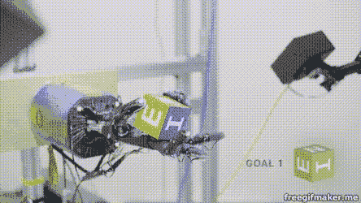
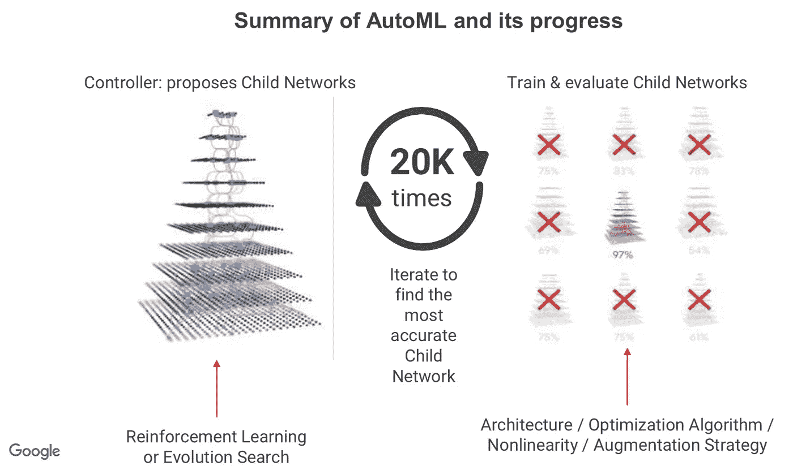
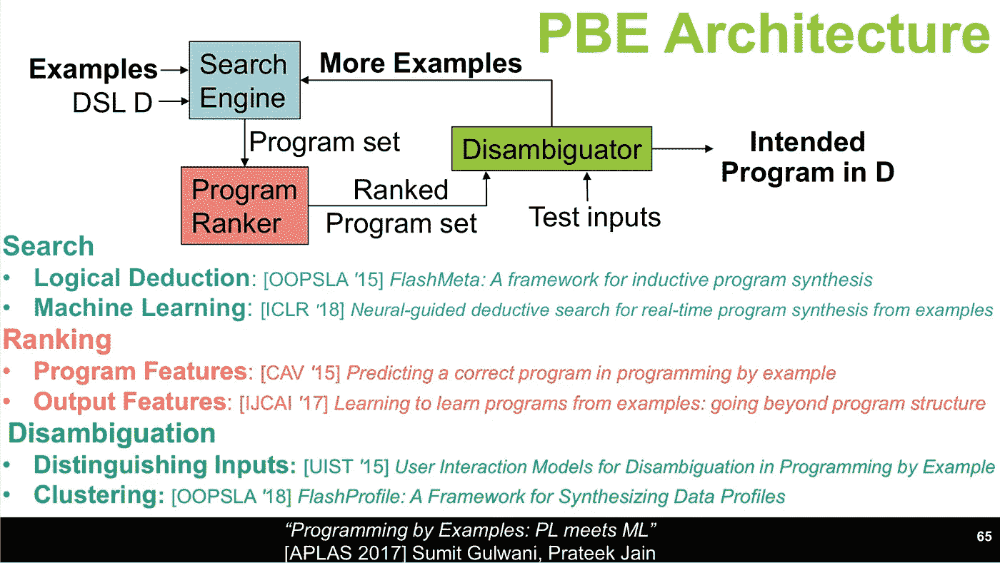
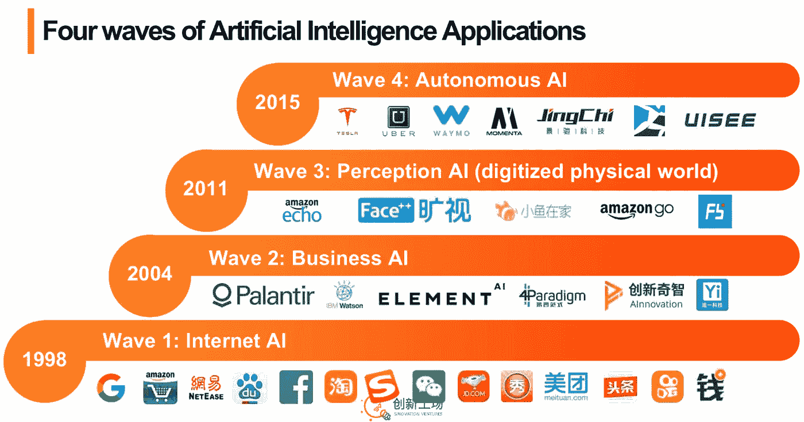
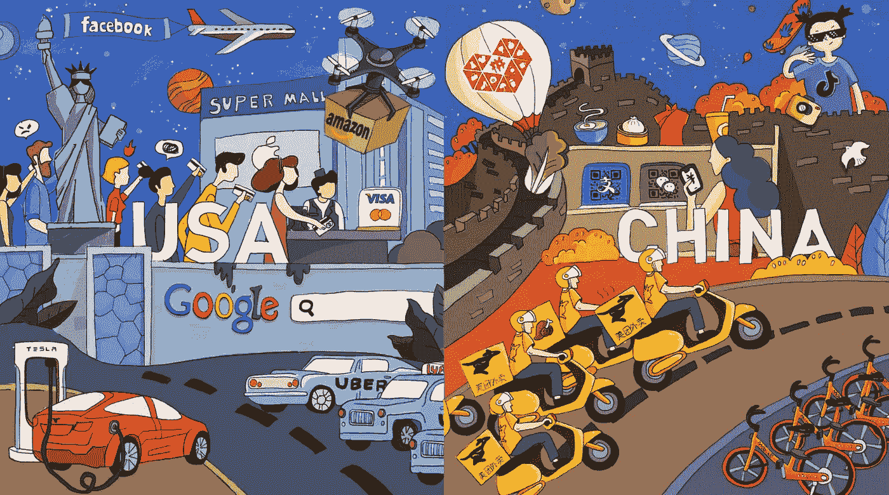
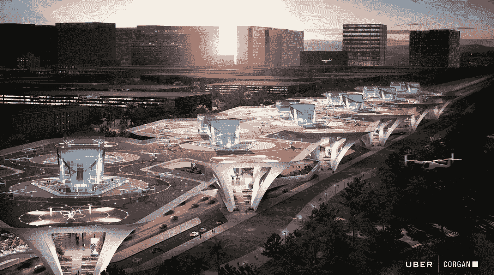
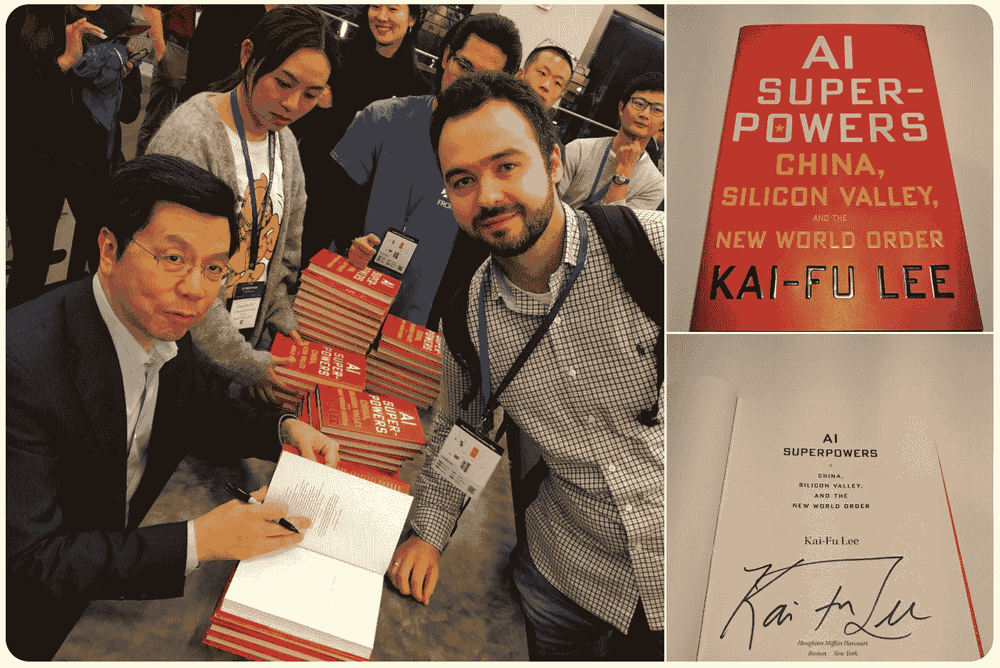

# 人工智能前沿 2018 会议笔记

> 原文：<https://medium.datadriveninvestor.com/notes-from-ai-frontiers-2018-conference-4b37359f2096?source=collection_archive---------18----------------------->

[AI Frontiers 2018](https://aifrontiers.com/) 大会于 11 月 9 日—11 月 11 日在圣何塞会议中心举行。会议展示了大规模部署在各个行业的人工智能前沿技术，包括金融、企业、医疗保健、物联网、机器人、无人机等。会谈内容丰富多样:从初创公司到大公司，从技术到高层，从研究到实际应用。

List of speakers of AI Frontiers 2018 conference

下面我想分享我对印象最深的几个演讲的笔记。

# OpenAI 在深度学习和人工智能方面的最新进展

来自 OpenAI 的 Ilya Sutskever 谈了很多关于强化学习(RL)和 OpenAI 在训练 Dota2 机器人方面的最新进展。

OpenAI Five made great progress in making Dota2 bots smarter

OpenAI 从能够击败职业玩家的 [1v1 bot](https://blog.openai.com/dota-2/) 开始，然后进入需要合作的 [5v5 团队游戏](https://blog.openai.com/openai-five/)，因此更难掌握。OpenAI 的 5v5 机器人显示了很好的结果，持续击败业余球队，给职业选手一场精彩的比赛。

在模拟器中玩游戏或训练机械臂可能看起来很有趣，但有可能将相同的模型移动到现实世界的机器人上吗？Ilya 对此的回答是“是”，这要归功于域随机化。

域随机化的想法并不新鲜，而且很容易理解。当在模拟器中训练模型时，真实世界的一些参数可能是未知的或可变的。示例包括各种感知和物理参数，如物体大小、重量、表面摩擦、气压等。为了说明这一点，需要在给定环境参数的一系列可能值上训练模型。因此，模型必须推广到一个范围，而不是一个特定的值。

Mechanical hand was trained to rotate the cube purely in a simulator

OpenAI [演示了用机械手旋转立方体以达到给定位置的方法](https://blog.openai.com/learning-dexterity/)。该模型完全在模拟环境中使用领域随机化进行训练，然后直接放入真实机器人中。印象深刻！

伊利亚最后大胆地说:

> 近期人工通用智能(AGI)应被视为一个严重的可能性。

他提到了神经网络和深度学习的最新进展，包括视觉、翻译、GAN、强化学习和 300，000 次(！)在过去 6 年中神经网络计算增加。接下来可能要解决的挑战包括无监督学习、鲁棒分类、推理和抽象。

# 使用机器学习来自动化机器学习

来自谷歌大脑的 Quoc Le 描述了自动机器学习(AutoML)——谷歌开发的一种自动寻找最佳神经网络架构来解决特定问题的方法。正如我们接下来将看到的，它还概括了不仅仅是架构搜索。AutoML 的核心思想是通过使用显著更多的计算能力来消除对机器学习人类专业知识的需求。

它的工作方式如下。网络的结构被编码为一串配置参数，例如[“过滤器宽度:5”、“过滤器高度:5”、“过滤器数量:24”]。被实现为递归神经网络(RNN)的被称为控制器的更高级网络被用来生成该字符串，该字符串被称为子网络。然后在验证集上训练和测试子网络。然后，基于子网络的准确性，使用强化学习来更新控制器。

High level architecture of AutoML

这种方法看起来非常有前途，因此 AutoML 现在不仅可以用于神经结构搜索(NAS)，还可以用于优化算法、非线性激活函数和训练数据集的增强策略。

人们可能会问一个自然的问题，AutoML 是否创造了另一种过度适应数据集的方法？Quoc Le 的回答是“不”,他建议在生成的网络上使用迁移学习作为过度适应的衡量标准。事实证明，AutoML 生成的模型在其他任务上也表现得更好，而不仅仅是特定的任务和数据集。

# 示例编程

微软研究院的 Sumit Gulwani 的演讲的主要观点可以用下面这段话来概括:

> 举例是说明意图的自然方式。

给定用户意图的例子，机器可以被训练。Sumit 演示了 Flash Fill、Flash Extract 和 Flash Relate 在 Excel 中的用法，可以“猜测”用户想要对一组项目做什么。各种文件提取，日期，名称，模式的转换可以通过编写或修改几个例子来完成，不需要任何代码！当演示完成时，你会很想知道它是如何工作的。

在引擎盖下，引擎用特定领域语言(DSL)表达了所有可能的程序集。例如，在 excel 中，它可以包括正则表达式、子字符串、条件等。该引擎负责找到实现给定结果的有效程序。然后对程序进行排序，并根据输入进行测试。如果有几个程序可以达到相同的结果，那么就选择最简单的一个。这项工作依赖于幻灯片上列出的大量关于 ML 和语言开发的研究论文。

High-level architecture of Programming by Example tool and relevant papers

这项工作肯定很有前途。在未来，人工智能能够在给出描述或例子的情况下编写通用代码吗？我们走着瞧。无论如何，Sumit 认为:

> 通过实例编程是人工智能的一个新领域。

# 人工智能时代

第一天的最后一场演讲无疑是最激动人心、最引人注目的演讲之一。Sinovation Ventures 的李开复谈到了人工智能和中国，并认为中国现在已经具备了成为人工智能发展领导者的所有必要条件。他的演讲可以被视为他最近出版的《人工智能超级力量:中国、硅谷和新的世界秩序》的一个迷你总结。

Four waves of AI, according to Kai-Fu Lee

首先，李开复描述了 4 波人工智能。

1.  互联网 AI。像谷歌、脸书、亚马逊这样的公司可以获得大量数据，并利用这些数据来改善用户体验，包括推荐引擎、广告定位等。
2.  商业人工智能。像 Palantir 这样的公司使用 AI 来解决业务特定的问题。
3.  感知 AI。例子包括用于无收银购物的 Amazon Go 和作为家庭助手的 Amazon Echo。由于语音和视觉识别(感知)技术的进步，这两种方法都有可能实现。
4.  自主 AI。Waymo 自动驾驶就是一个例子。

接下来，他就为什么中国有机会成为人工智能发展的领导者给出了 3 点看法:

1.  只有一些人工智能的突破，它们很容易应用。
2.  人工智能进入实施时代。
3.  人工智能平台的开放性降低了准入门槛。

US and China as “parallel universes”

中国当然有巨大的市场，可以产生大量的数据。反过来，大量数据对于创建和训练人工智能算法至关重要。李开复这样描述它:

> 在人工智能时代，中国是数据上的沙特阿拉伯。

在演讲的最后，开复回答了一个紧迫的问题，即人工智能是否会抢走人们的工作。在他看来，低技能的常规工作肯定会被自动化和人工智能取代，而且这一过程已经开始。然而，他表示，有些工作需要人际互动、同情心、创造力或复杂的决策。这些工作可以通过人工智能来增加，但不会被取代。

# 优步高架

第二天最具视觉吸引力和未来感的演讲之一由来自优步 Elevate 的 Mark Moore 主讲。[优步高架](https://www.uber.com/info/elevate/)是优步的一个项目，利用短程航空运送乘客，特别是在人口密集的城市地区。

Futuristic-looking Uber Elevate hubs for short-range air vehicles

优步将运行一组从地面升起的枢纽来降低噪音水平。该计划将使用类似于飞机和直升机的电动空中交通工具，最多可搭载 4 名乘客。因此，人们希望他们安静、干净、高效。优步的愿景是能够创建一条给定起点和终点的最佳路线，这两个点可能使用不同的交通方式。例如，一个人可以使用 uberX 到达航空枢纽，然后使用 Elevate 到达最近的目的地枢纽，然后再次使用 uberX 到达最终目的地。

目前，优步 Elevate 公司正与飞机制造商合作，如巴西航空工业公司(Embraer ),制造其飞行器的第一个版本。他们的目标是 2020 年进行演示飞行，2023 年投入商业运营。

# 最后的想法

除了我上面列出的那些，还有很多演示，特别是如果你对人工智能在特定行业的应用感兴趣的话。会议内容丰富，组织有序。

顺便说一句，我拿到了李开复签名的《人工智能的超能力:中国、硅谷和新世界秩序》!

喜欢这篇文章吗？在 Medium 上查看并关注我:[阿列克谢·斯塔特克维奇](https://medium.com/u/1859d53eaf45?source=post_page-----4b37359f2096--------------------------------)，Twitter:@[_ 阿斯塔特克维奇](https://twitter.com/_astatkevich)，LinkedIn: [阿列克谢·斯塔特克维奇](https://www.linkedin.com/in/astatkevich/)。谢谢大家！