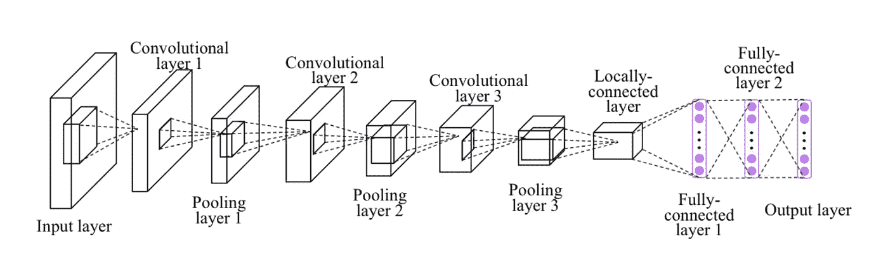
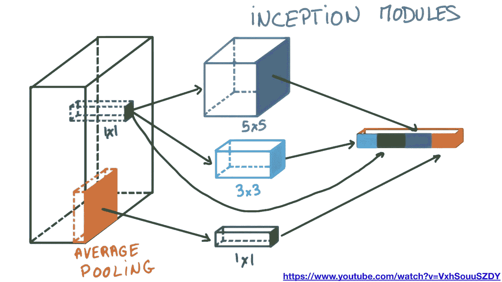
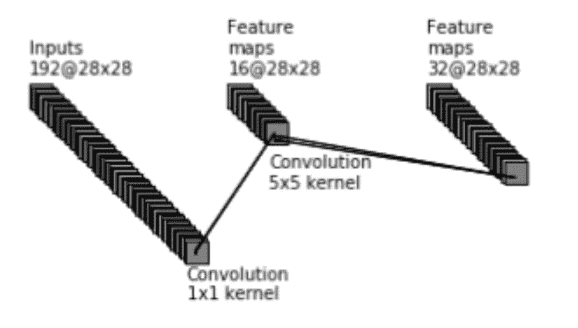
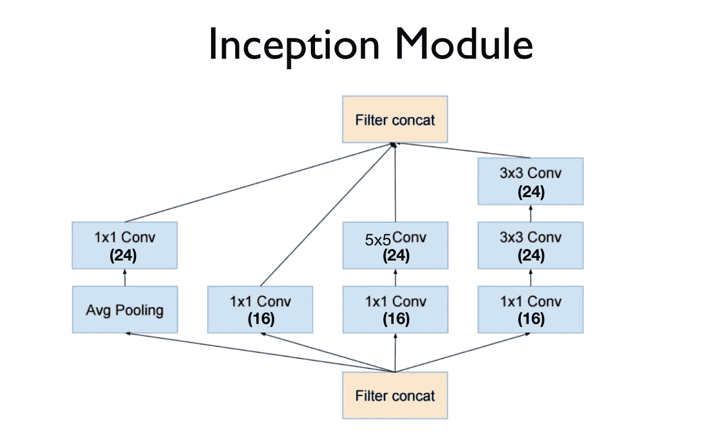
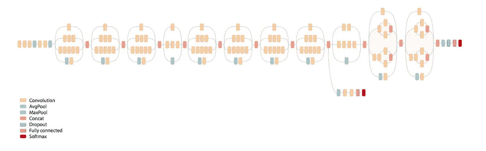
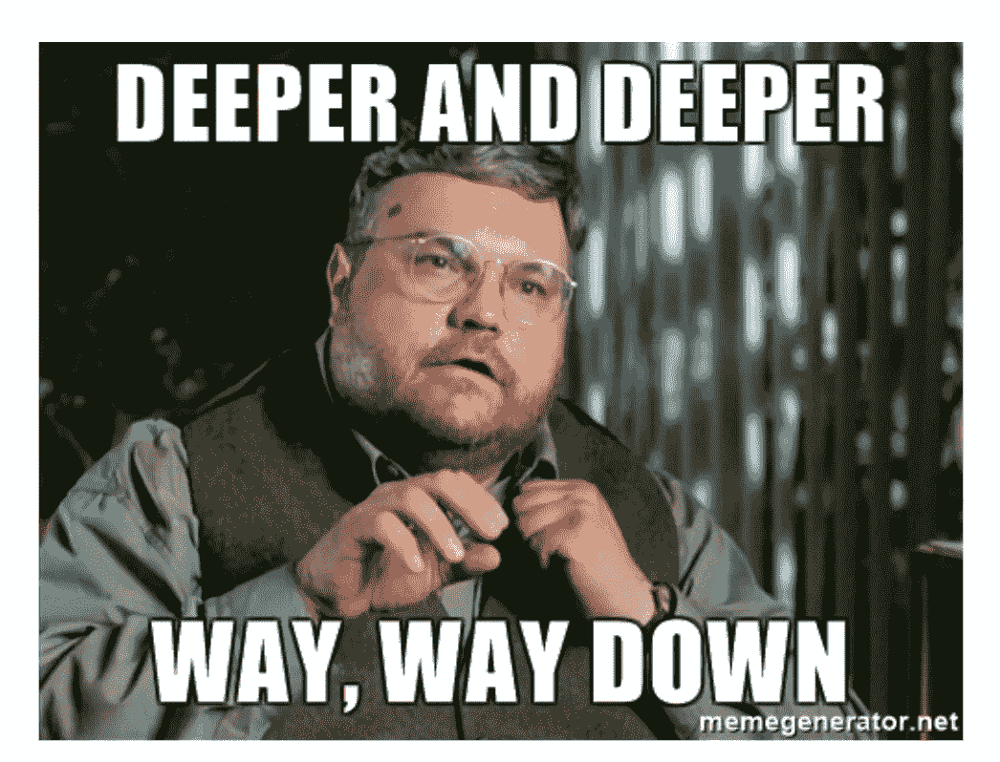
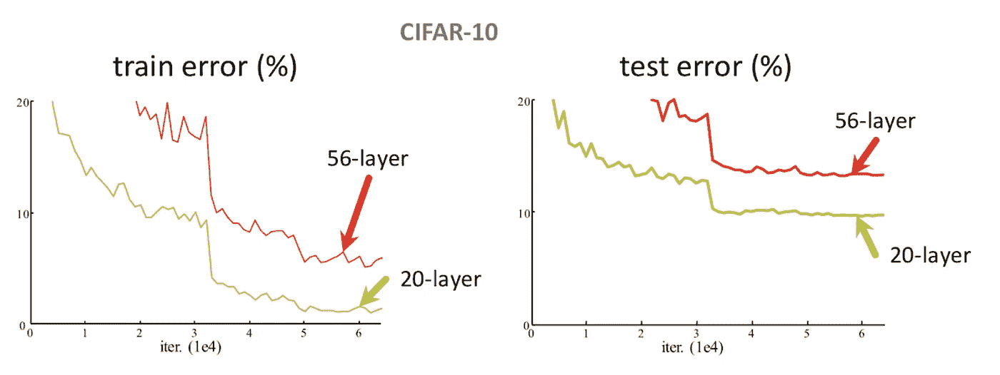
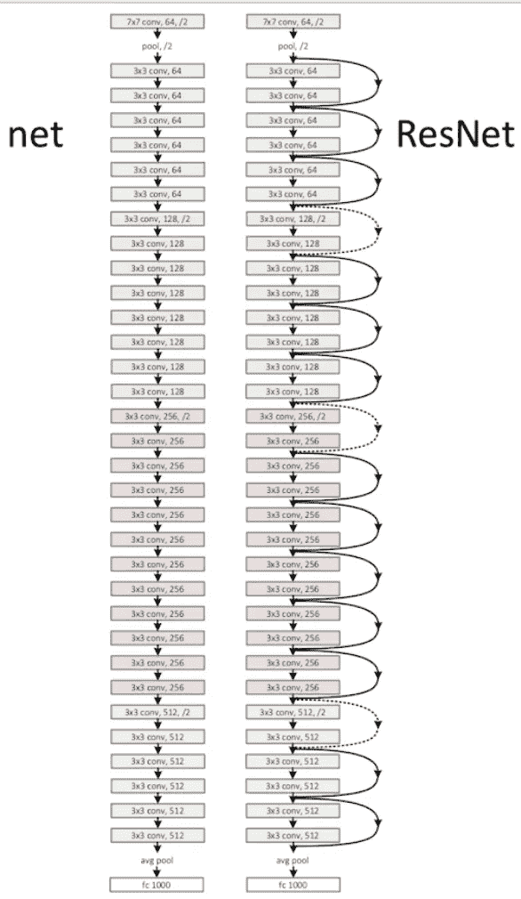
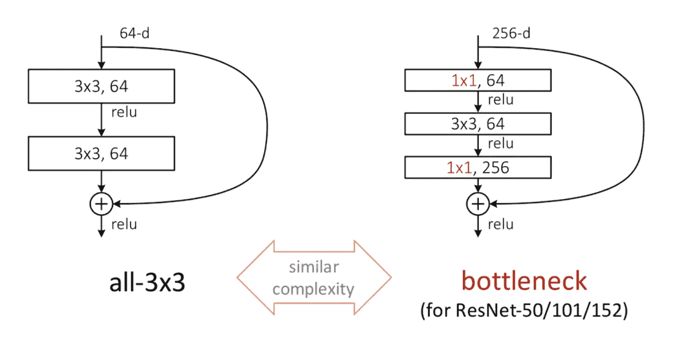
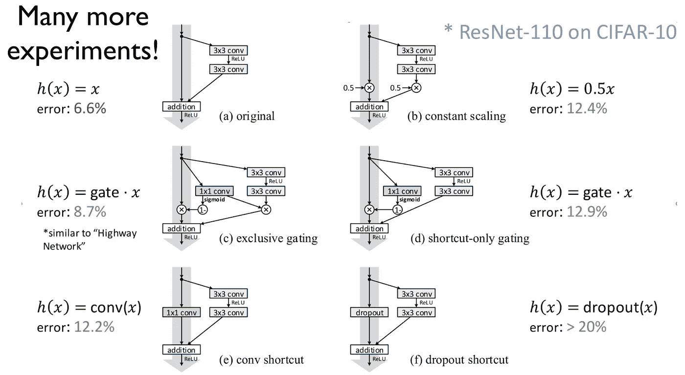

# 深度学习笔记—高级 CNN

> 原文：<https://medium.datadriveninvestor.com/notes-on-deep-learning-advanced-cnn-75ed499ca053?source=collection_archive---------3----------------------->

这是 13 集系列“深度学习笔记”的第 11 集。请在第[篇第](https://medium.com/datadriveninvestor/notes-on-deep-learning-getting-started-db3135be7c80)篇文章中找到所有部分的链接。

我们终于到了高级 CNN。耶！
旅程很长，如果你们一直关注这个系列，我为你们感到骄傲。

 [## 2019 年深度学习的终极学习路径及更多...-数据驱动型投资者

### 又一个美好的一周，一些好的教育内容将会到来。我最喜欢的&最受欢迎的帖子之一…

www.datadriveninvestor.com](https://www.datadriveninvestor.com/2019/01/07/the-ultimate-learning-path-for-deep-learning-in-2019-more/) 

今天我们来谈谈**高级卷积神经网络**。
大部分难的部分之前在基本 CNN 帖子里都有涉及。今天，我们只是在基础构建模块的基础上构建

让我们回顾一下 CNN 的全貌。
1。卷积步骤
2。子采样
(1&2 可以重复)
3。线性层
(3 也称为全连通层)

然后，我们让特定大小的过滤器在图像上移动

高级 CNN 说我们可以使用不同大小的过滤器，并将每个过滤器的结果连接成一个单一的特征图
例如:(1 x 1 绿色过滤器)+ (3 x 3 蓝色过滤器)+ (5 x 5 深蓝色过滤器)

我们继续这样做，并重新创建盗梦空间…

使用 1 x 1 滤镜有一个迷人的技巧。这听起来很愚蠢，就像为什么我们使用一个窗口来获得图像本身…啊啊啊…记得我们有不同的渠道吗？因此，我们通过 1 x 1 滤波器连接所有通道。

有了不同的过滤器，我们可以有一个如下的初始模型。注意，每个分支都是由我们之前学过的所有技巧叠加而成的

下一步的发展是什么？在《盗梦空间》中继续深入…

越来越深…..？有多深？

但我们能继续深入吗？可惜没有。
然后我们面临消失梯度问题(之前串联解释过)就卡住了。看看误差图…

因此，如果我们被困在消失梯度，我们能做什么？
我们从之前的 n 个步骤中获取输入，并将其前馈…

假设我们有步骤 1->2->3->4->5->6->7->8
示例:我们将输出 3 进制到 6 进制。

这很困难，因为我们需要确保当我们跳过并在几个步骤后再次添加时，输出的大小与层的输入相同。

其他几种模块组合可以以不同的方式连接，以获得最佳的学习和准确性:)

让我们再次从上一篇文章跳到笔记本上来构建我们的 MNIST 模型，但是这次用的是高级 CNN 而不是基本 CNN。

# 关于作者

我是 venali sonone，职业是数据科学家，也是管理学毕业生。

# 参考

[http://pytorch.org/](http://pytorch.org/)
[https://github.com/pytorch/examples](https://github.com/pytorch/examples)
[https://github.com/ritchieng/the-incredible-pytorch](https://github.com/ritchieng/the-incredible-pytorch)
[https://github.com/yunjey/pytorch-tutorial](https://github.com/yunjey/pytorch-tutorial)
[https://github . com/znxlwm/py torch-generative-model-collections](https://github.com/znxlwm/pytorch-generative-model-collections)
[https://github.com/hunkim/PyTorchZeroToAll](https://github.com/hunkim/PyTorchZeroToAll)

# 动机

这个系列的灵感来源于失败。如果你想谈论短暂的 5 年或 50 年，后者确实需要一些足够有挑战性的东西来保持你眼中的火花。