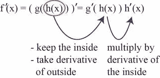
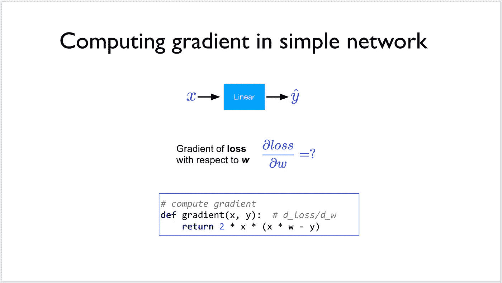
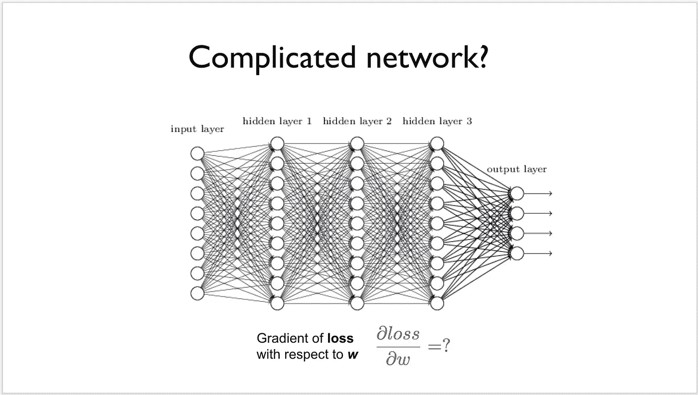
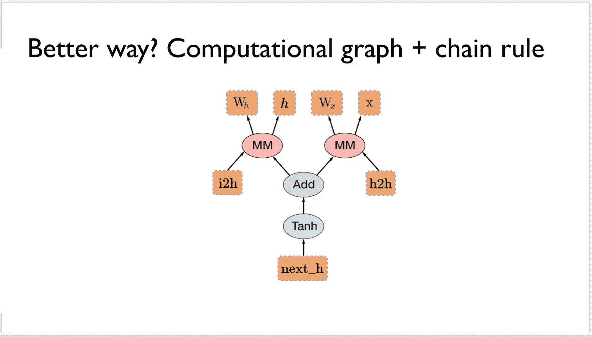
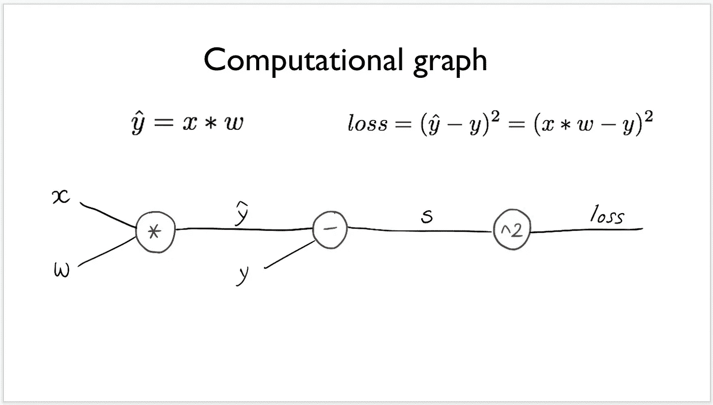
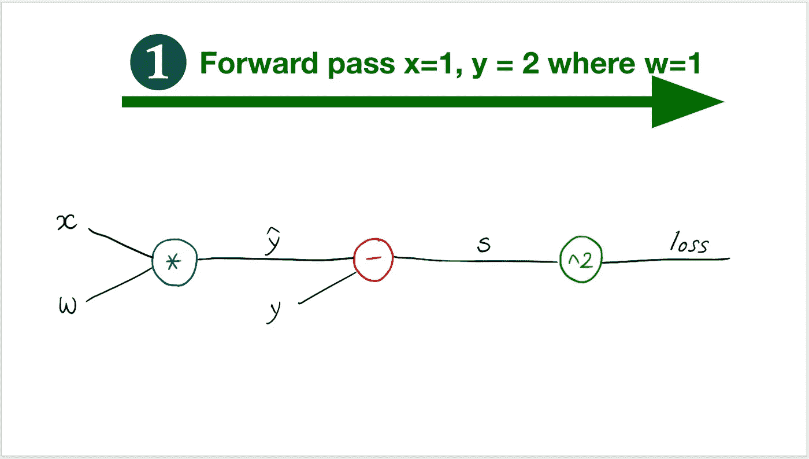
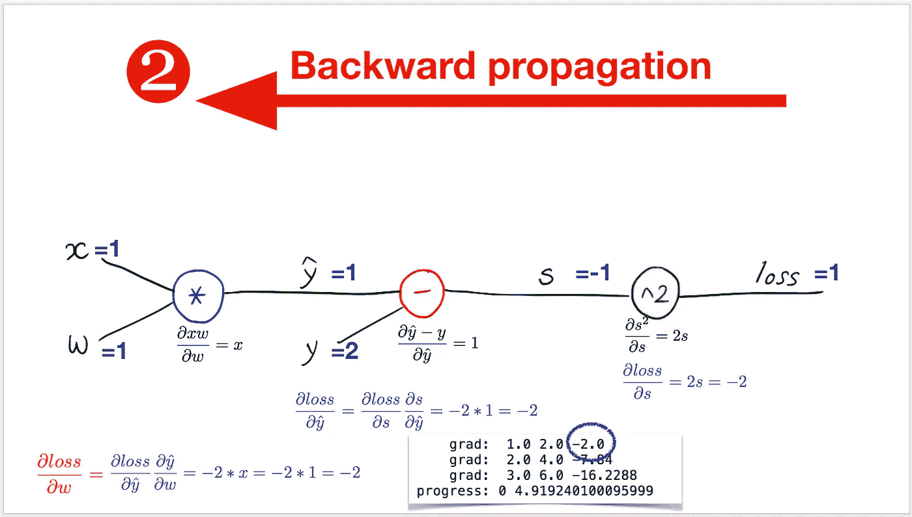
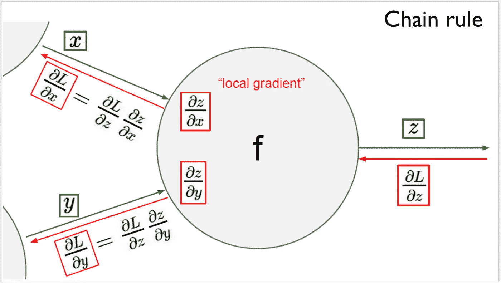
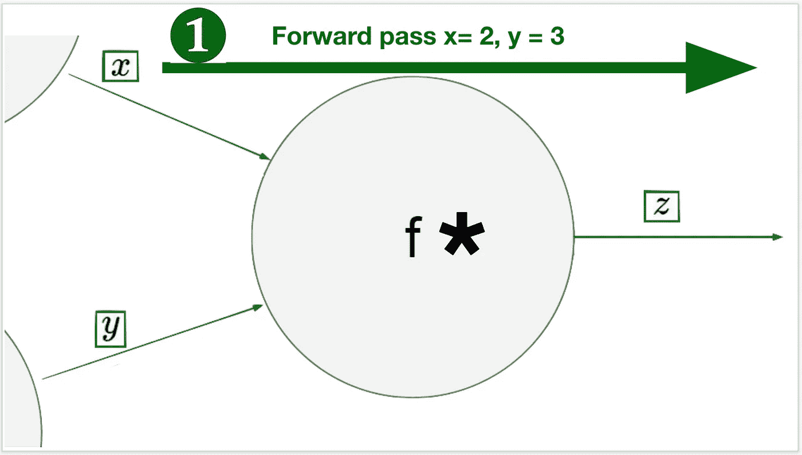
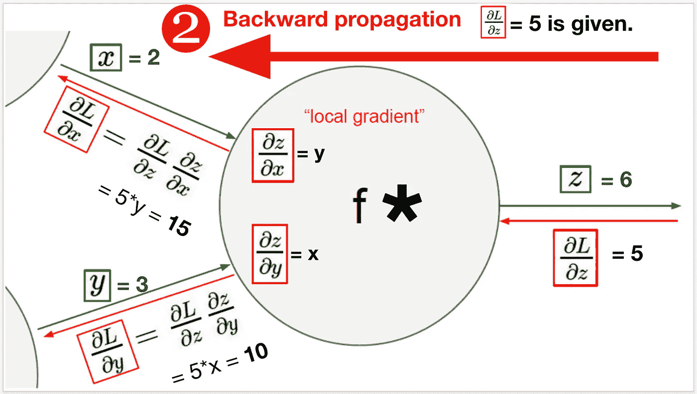

# 深度学习笔记—反向传播和 PyTorch

> 原文：<https://medium.datadriveninvestor.com/notes-on-deep-learning-back-propagation-and-pytorch-21693552b733?source=collection_archive---------0----------------------->

这是 13 集系列“深度学习笔记”的第四集。请在第[篇第](https://medium.com/datadriveninvestor/notes-on-deep-learning-getting-started-db3135be7c80)篇文章中找到所有部分的链接。

# **反向传播和 PyTorch**

> 链式法则是一种直观的方法。
> 
> 例如，有时更容易把函数 f 和 g 看作问题的“层”。函数 f 是“外层”，函数 g 是“内层”。
> 
> 因此，链式法则告诉我们首先对外层求导，保持内层不变(f’(g(x))项)，然后对内层求导(g’(x)项)。
> 
> [来源](https://www.math.ucdavis.edu/~kouba/CalcOneDIRECTORY/chainruledirectory/ChainRule.html)

概念:

a)链式法则

链式法则使人想起扔进池塘的石头激起的涟漪。因为池塘里的水是自由流动的，一个涟漪产生另一个涟漪，它们都传播到池塘的尽头，然后消失。不知何故，我可以连续几个小时观看这些涟漪，因为它们是如此令人心旷神怡。

 [## 2019 年深度学习的终极学习路径及更多...-数据驱动型投资者

### 又一个美好的一周，一些好的教育内容将会到来。我最喜欢的&最受欢迎的帖子之一…

www.datadriveninvestor.com](https://www.datadriveninvestor.com/2019/01/07/the-ultimate-learning-path-for-deep-learning-in-2019-more/) 

每一个向前移动的波纹基本上都是水向前移动的幻觉。这是一种推动水前进的力量。我们可以重新组织我们的句子说，“这是一个前进的动力”。然而，追溯到石头被投掷的原点，并改变石头被投掷的力度以产生涟漪效应，有必要追溯涟漪的路径。那么下一次你可以用或多或少的力量扔一块石头，以获得想要的涟漪效应。

*前传就是扔石头。
反向通路是波纹路径向其原点的追溯。
自动梯度更新是在整个过程中通过学习做出的改变，以获得期望的涟漪效应。*

现在让我们引入计算图的概念。
在之前的几篇帖子中，我们了解到向前传球是一个函数。如果你在处理神经网络，基本上我们有几个函数一个接一个地转换数据。这些功能中的每一个都是神经网络的一层。计算图只是这些函数的顺序的可视化图形。(像流程图。表示函数的计算顺序。)

*梯度是导数。我们不断从我们的重量中减去斜率/导数/梯度，以确保我们达到零或接近零。我们在函数级手动计算梯度以最小化损失。为了计算神经网络或计算图中所有函数的梯度，我们应用链规则。*

链式法则说。
如果有两个复合函数。计算外部函数的导数，保持内部函数不变，然后计算内部函数的导数。

使用这个概念，我们可以将所有函数的梯度结合起来，一次性计算出来并更新权重。
玉湖！再读一遍，得到 NN 的窍门。这是最重要的概念之一，被称为反向传播。

[*亦见斯坦福指南*](https://cs224d.stanford.edu/lectures/CS224d-Lecture5.pdf)

Pytorch 中的反向传播和自动梯度

在 Pytorch 中，反向传播和梯度更新的实现是自动的。它使用链式法则来计算梯度。整个过程都在后台完成，Pytorch 的用户不需要独立计算每个函数的梯度。
简单来说，Tensorflow 的用户不计算梯度。用户根据需要初始化数据变量 _grad=True
张量流计算机梯度为每个使用该变量的函数更新梯度。

PS:基本上所有的权重都是数据变量，因为 requires_grad=True

张量流是不是很牛逼？但是知道后端发生了什么总是好的:)并且理解反向传播和链式法则。

那么上面是怎么回事呢？

*   机器从随机猜测开始，w =随机值，并对照我们给定的 w 的所有值进行检查
*   auto 通过 pytorch 计算梯度，而不是我们之前手动完成的
*   对于每次迭代，权重被减去一个小的梯度因子，并且获得新的权重
*   为什么？所以我们知道使我们损失最小的重量是多少，我们使用它

这些在下面的概念图中也有很好的解释。

# 关于作者

我是 venali sonone，职业是数据科学家，也是管理学毕业生。

# 参考

[http://pytorch.org/](http://pytorch.org/)
[https://github.com/pytorch/examples](https://github.com/pytorch/examples)
[https://github.com/ritchieng/the-incredible-pytorch](https://github.com/ritchieng/the-incredible-pytorch)
[https://github.com/yunjey/pytorch-tutorial](https://github.com/yunjey/pytorch-tutorial)
[https://github . com/znxlwm/py torch-generative-model-collections](https://github.com/znxlwm/pytorch-generative-model-collections)
[https://github.com/hunkim/PyTorchZeroToAll](https://github.com/hunkim/PyTorchZeroToAll)

# 动机

这个系列的灵感来源于失败。如果你想谈论短暂的 5 年或 50 年，后者确实需要一些足够有挑战性的东西来保持你眼中的火花。