# 深度学习笔记—基本 CNN

> 原文：<https://medium.datadriveninvestor.com/notes-on-deep-learning-basic-cnn-6540fc6edcd4?source=collection_archive---------1----------------------->

这是 13 集系列“深度学习笔记”的第 10 集。请在第[篇第](https://medium.com/datadriveninvestor/notes-on-deep-learning-getting-started-db3135be7c80)篇文章中找到所有部分的链接。

今天我们来谈谈**卷积神经网络**。
CNN 是一项非常强大的技术。它非常适合图像和文本数据。我们将讨论几个概念，所以请耐心等待。

 [## 用 7 个步骤解释深度学习——数据驱动投资者

### 在深度学习的帮助下，自动驾驶汽车、Alexa、医学成像-小工具正在我们周围变得超级智能…

www.datadriveninvestor.com](https://www.datadriveninvestor.com/2019/01/23/deep-learning-explained-in-7-steps/) 

# **卷积神经网络的全貌**

要分解 CNN 的整个画面，有三个部分。卷积步骤
2。子采样
(1&2 可以重复)
3。线性层
(3 也称为全连通层)

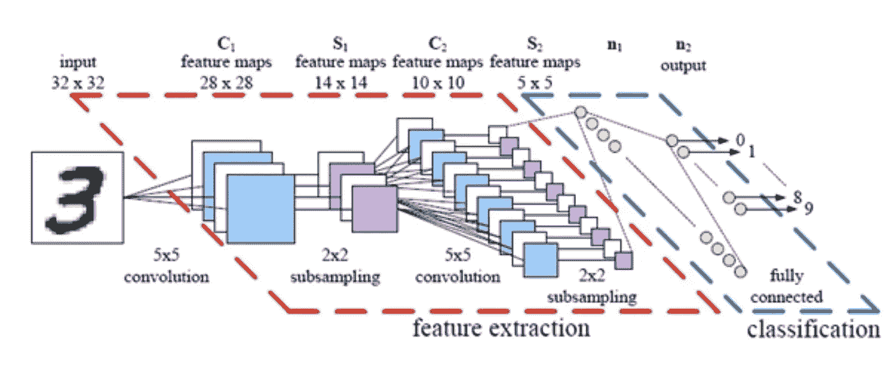

现在让我们往里跳一点。这里我们就明白了:
-卷积
-通道(深度)
-输入大小
-窗口/路径

看看下面的图片，我会详细解释它的每一部分。

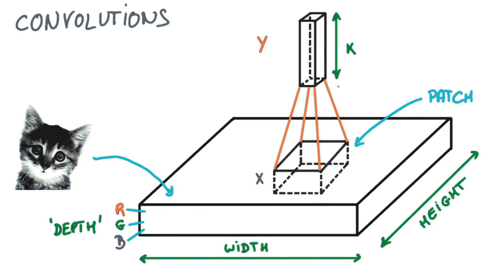

想象给你一张可爱小猫的图片。她很可爱，不是吗？嗯，长着一张“讨好”脸的小猫实际上是像素矩阵。图像的大小是由**宽** x **高**表示的像素大小。这是我们投入的**规模。**

接下来，根据你拍摄的是黑白图像还是彩色图像，图像看起来会有所不同(很明显…)。黑白图像基本上是由黑白的不同阴影表示的图像。
现在，如果图像是彩色的，它是红色、蓝色和绿色的组合，以获得不同的颜色。那么，我们为什么要在意是黑&白还是彩色呢？我们关心这个是因为不同类型的图像会有不同的表现形式。
黑白图像将是一个单一的平面矩阵 n * n【2D】
现在，如果图像是彩色的，它将是一个 3D 矩阵。它就像三个 2D 矩阵堆叠在一起一样简单，每个矩阵代表红色、绿色和蓝色。
这三层被称为**通道**或也被称为**深度**。

在卷积中，我们不把图像看作一个整体。我们开一扇窗户。窗口是图像的一小部分。我们如何选择小份？假设我们基本上只想看到 4*4 矩阵的前 2*2 个值，那么部分/窗口大小就是 2*2。

然后这个小窗口在整个图像上顺序移动。
为什么？现在，只是说，仔细看图像，我们看到它的小部分细节。这个具有选定尺寸的小部分被称为**窗口或补丁**。
每当一个窗口移动时，它都会做一些计算，并计算出一个值，这个值代表了在窗口中看到的图像的任何部分。

在整个图像上顺序移动补片或窗口的过程称为**卷积**。

看下面的动画，上面的都有直观的解释。

我说过在整个图像上顺序移动补丁或窗口的过程称为**卷积**。但是在移动的时候，我们移动了多少呢？我们可以相邻移动或跳过一个并相邻移动两个。移动多少像素由一个名为**步幅**的值定义。
我们再来重温一下上面的概念。

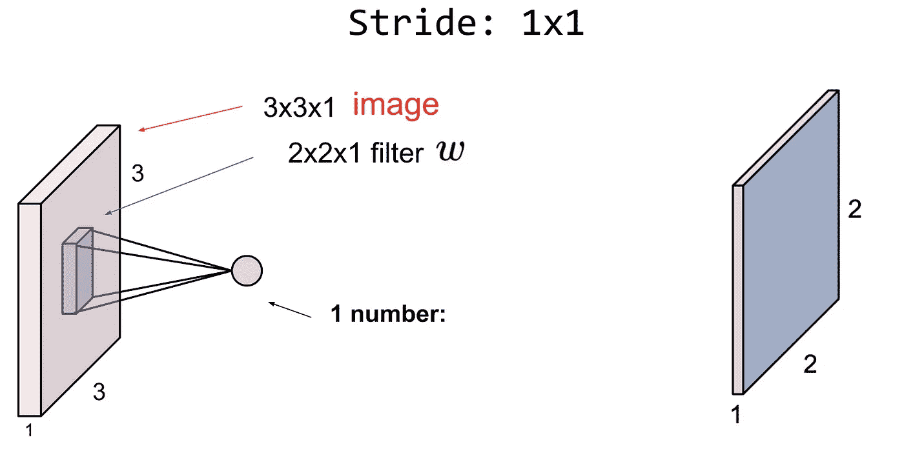

假设我们有**步距**(我们向前移动一步的值为 1)
为了简单起见，图像由 3*3 像素组成，如左边的方框所示。图像是黑白的，所以在上面的例子中深度是 1。
我们图像的**输入尺寸** e 为 3*3*1。

你能猜出这种情况下的**窗口或补丁**是什么吗？窗户是 2*2*1。

为什么？我们随机决定只查看 9 个像素中的前 4 个像素，即每次 2*2 个像素。

在 CNN 术语中，窗口或路径也被称为**过滤器**。
比方说，当我们看到第一个 2*2 窗口时，我们计算一个代表图像的 2*2 部分的数字，这个数字被记录下来，我们一步一步地向前移动。然后我们计算另一个数字，直到我们移动到结束。我们注意到的数字看起来像左边的方框，矩阵的大小为 2*2。

假设我们使用一个 2*2 的窗口，每个数字除了角上的数字在窗口中至少出现两次，对吗？因此，我们只看一次角部数字就会丢失一些信息。在末尾加零怎么样，这样我们就可以移动窗口，每个数字正好看两次？零的添加被称为**填充**。

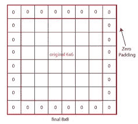

所以在填充图像上移动看起来像。

带有填充的整个卷积看起来像这样…

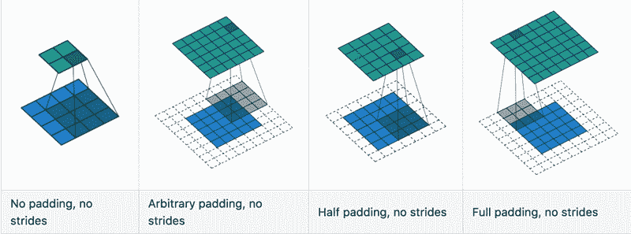

前面说过步幅可以是一步，那么当步幅是两步时会是什么样子呢？

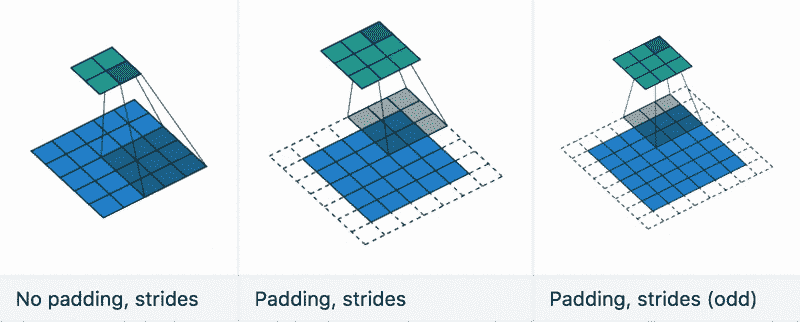

之前我们也说过，当我们在图像的一部分上有一个窗口时，我们会计算一些数字。
比方说，当我们看到第一个 2*2 窗口时，我们会计算一个代表图像 2*2 部分的数字，这个数字会被记录下来，我们会一步一步地向前移动。

这算什么？我们可以简单地将过滤器和我们在窗口中看到的部分图像的像素进行点积。
假设我们有一个深度为 3、图像大小为 32*32 的 RGB 图像。给定一个 5*5 的窗口大小，窗口/滤波器变成一个 5*5*3 的矩阵，我们只取权重为 w 的点积。

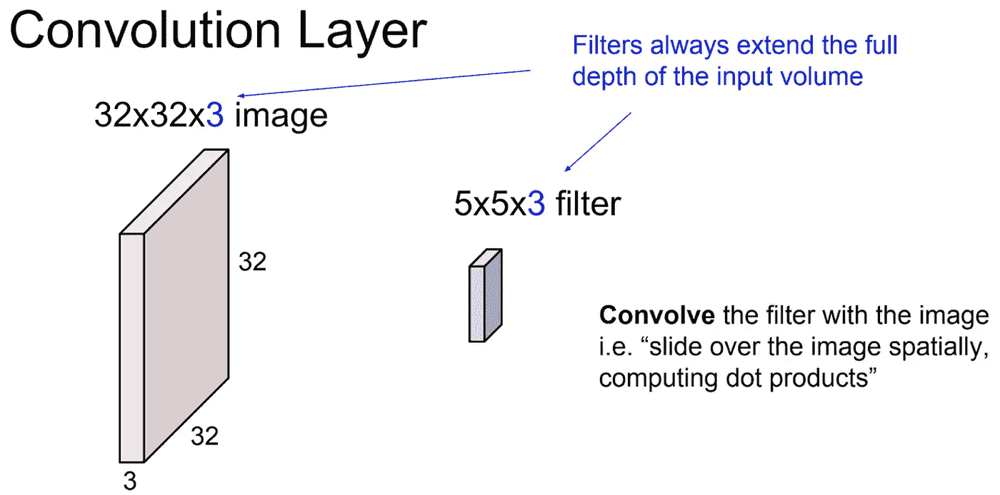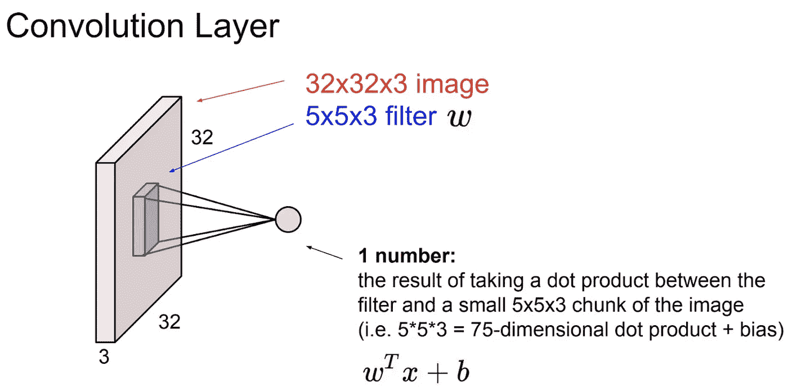

这个点积创建了一个名为**的激活图**的输出。

几种类型的过滤器会给我们几个激活图。假设我们有不同类型的窗口，我们只取不同窗口大小的输出，并创建如下几个激活图:

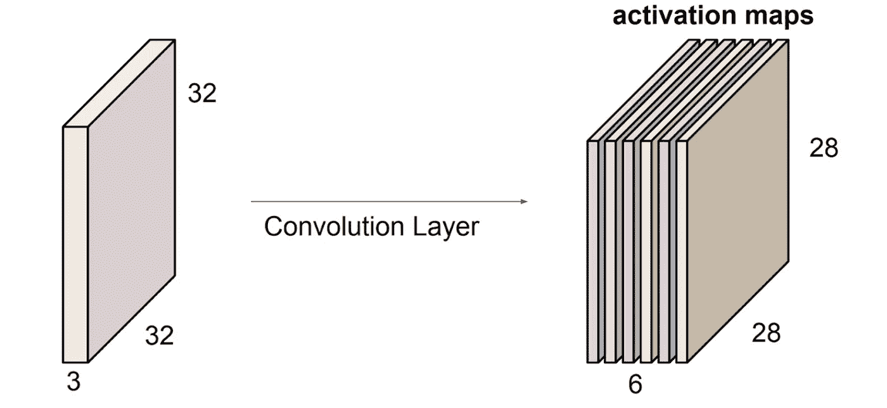

假设我们有足够的卷积信息。为了使用来自卷积的信息，我们使用一种称为池化的技术。什么是合用？一个**池**只不过是减少来自激活图的信息，这是以一种类似的方式完成的，就像我们首先将窗口移动到图像上以获得激活图一样。这里所做的计算完全不同。最常见的是最大池。(记得为了得到激活图我们用了点积)
什么是**最大池**？它只是选择窗口中的最大值。

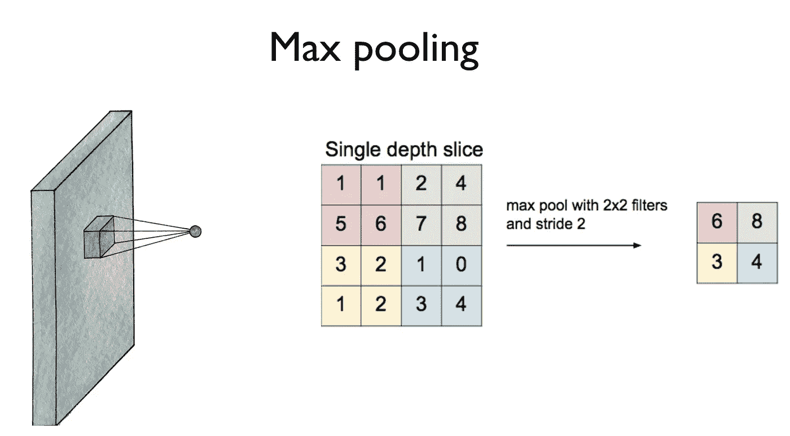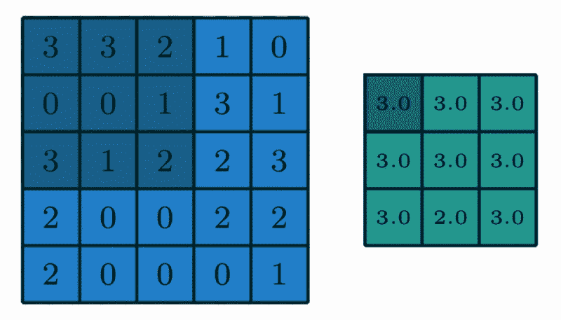

与最大池化类似，我们可以只取窗口中数字的平均值，这样我们就得到了**平均池化**，即平均池化

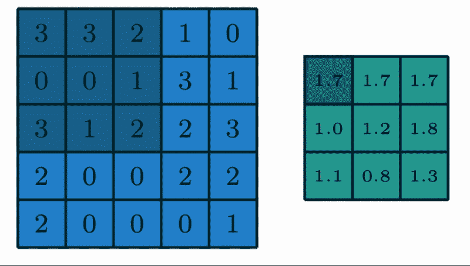

然后我们可以用类似于我们在以前的文章中堆叠不同的线性层的方式来堆叠几个卷积。然而，所有卷积的最终输出被给予线性层(也称为**全连接层**)。

我们从 CNN 的全貌开始，通过分解来解释所有的部分。当我们把上面的所有部分连接起来，我们再次得到 CNN 的全貌

让我们跳到笔记本上，从上一篇文章中再次构建我们的 MNIST 模型，但这次用 CNN 代替 softmax 和交叉熵。

# 关于作者

我是 venali sonone，职业是数据科学家，也是管理学毕业生。

# 参考

[http://pytorch.org/](http://pytorch.org/)
[https://github.com/pytorch/examples](https://github.com/pytorch/examples)
[https://github.com/ritchieng/the-incredible-pytorch](https://github.com/ritchieng/the-incredible-pytorch)
[https://github.com/yunjey/pytorch-tutorial](https://github.com/yunjey/pytorch-tutorial)
[https://github . com/znxlwm/py torch-generative-model-collections](https://github.com/znxlwm/pytorch-generative-model-collections)
[https://github.com/hunkim/PyTorchZeroToAll](https://github.com/hunkim/PyTorchZeroToAll)

# 动机

这个系列的灵感来源于失败。如果你想谈论短暂的 5 年或 50 年，后者确实需要一些足够有挑战性的东西来保持你眼中的火花。