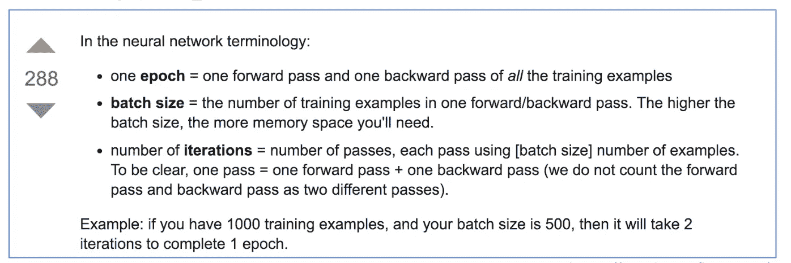
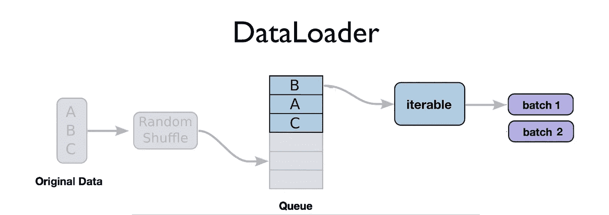
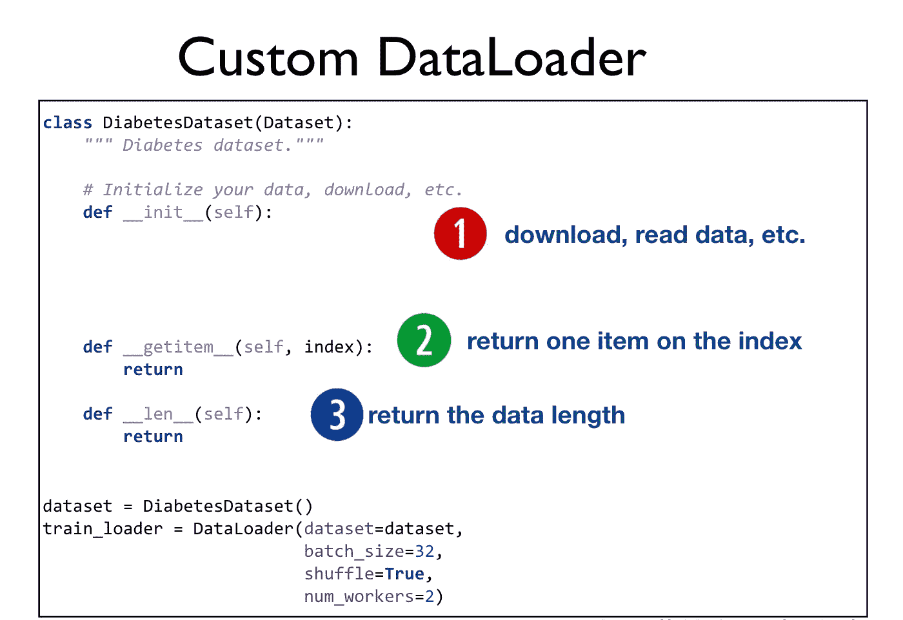

# 深度学习笔记—数据加载器

> 原文：<https://medium.datadriveninvestor.com/notes-on-deep-learning-data-loader-d93ab79a631a?source=collection_archive---------2----------------------->

这是“深度学习笔记”13 集系列的第 8 集。请在第[篇第](https://medium.com/datadriveninvestor/notes-on-deep-learning-getting-started-db3135be7c80)篇文章中找到所有部分的链接。

深度学习是一个*成功*是因为*大数据*。当谈到机器学习或深度学习时，80%或更多的时间都花在与数据争论上。机器学习工程师或数据科学家花费在将数据格式化、准备和清理异常上的精力是巨大的。争吵的部分甚至不是最琐碎和最重要的部分，所以它甚至不能被跳过。事实上，争吵受到了特别的关注，因为它对表演的影响最大。这一章经常被反复修改。

 [## 用 7 个步骤解释深度学习——数据驱动投资者

### 在深度学习的帮助下，自动驾驶汽车、Alexa、医学成像-小工具正在我们周围变得超级智能…

www.datadriveninvestor.com](https://www.datadriveninvestor.com/2019/01/23/deep-learning-explained-in-7-steps/) 

深度学习喜欢噪音，在噪音中学习得更好，但不能否认的是，人们必须准备数据。数据加载是不可避免的任务之一。PyTorch 帮助我们加载、预处理重要的数据集。

这也使得代码看起来 nice^^，所以为什么不做得更好:)

到目前为止，我们熟练地迭代了手写的 while 循环。这是简单有效的，但是我们可以做的不仅仅是简单的数据迭代。特别是，我们可以

*   创建批次
*   打乱数据
*   并行加载数据增强多处理
*   访问易于使用的函数进行迭代，因此我们不必担心
*   在我们开发的所有项目中使用最先进的标准和通用标准

如果我们使用 torch.utils.data.DataLoader，这些功能都可以轻松使用

数据集
数据集就是你的数据。在 Pytorch 中，它是具有函数的类的抽象表示:

*   **len** 以便 len(dataset)返回数据集的大小。
*   **getitem** 支持索引，以便数据集[i]可用于获取第 I 个样本

如果我们需要编写自定义数据加载器，我们需要覆盖上述方法

让我们进入笔记本，构建我们的定制数据加载器…

# 关于作者

我是 venali sonone，职业是数据科学家，也是管理学毕业生。

# 参考

[http://pytorch.org/](http://pytorch.org/)
[https://github.com/pytorch/examples](https://github.com/pytorch/examples)
[https://github.com/ritchieng/the-incredible-pytorch](https://github.com/ritchieng/the-incredible-pytorch)
[https://github.com/yunjey/pytorch-tutorial](https://github.com/yunjey/pytorch-tutorial)
[https://github . com/znxlwm/py torch-generative-model-collections](https://github.com/znxlwm/pytorch-generative-model-collections)
[https://github.com/hunkim/PyTorchZeroToAll](https://github.com/hunkim/PyTorchZeroToAll)

# 动机

这个系列的灵感来源于失败。如果你想谈论短暂的 5 年或 50 年，后者确实需要一些足够有挑战性的东西来保持你眼中的火花。