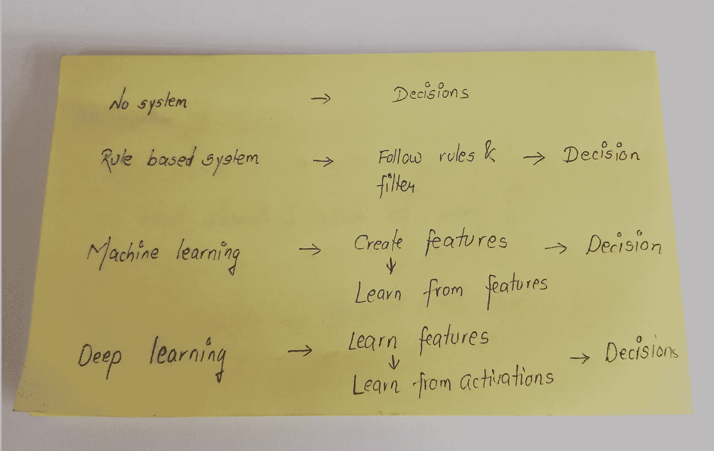
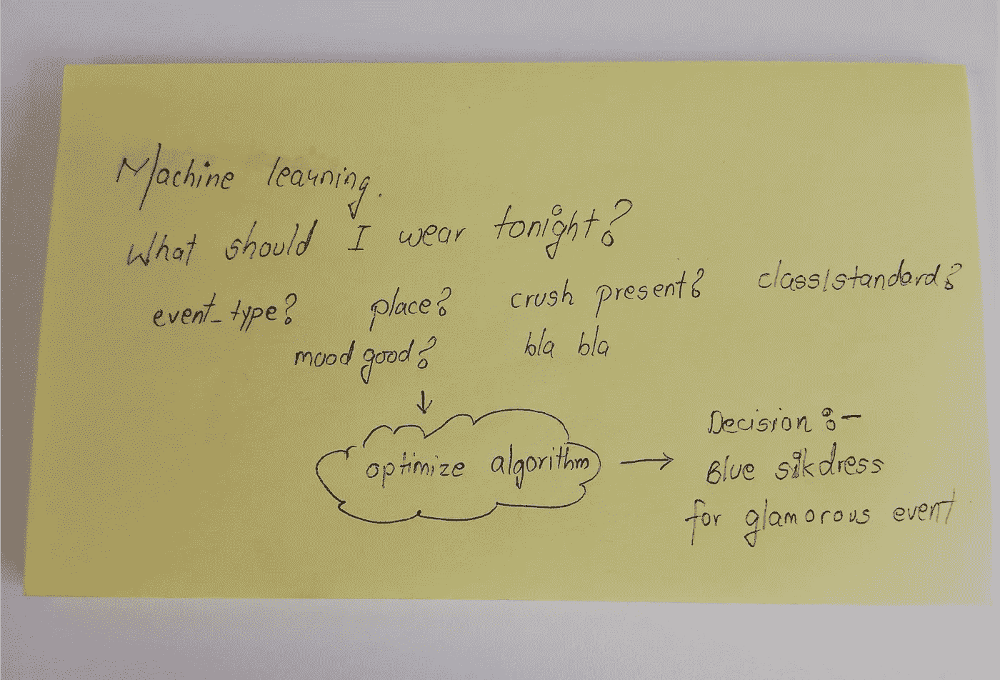
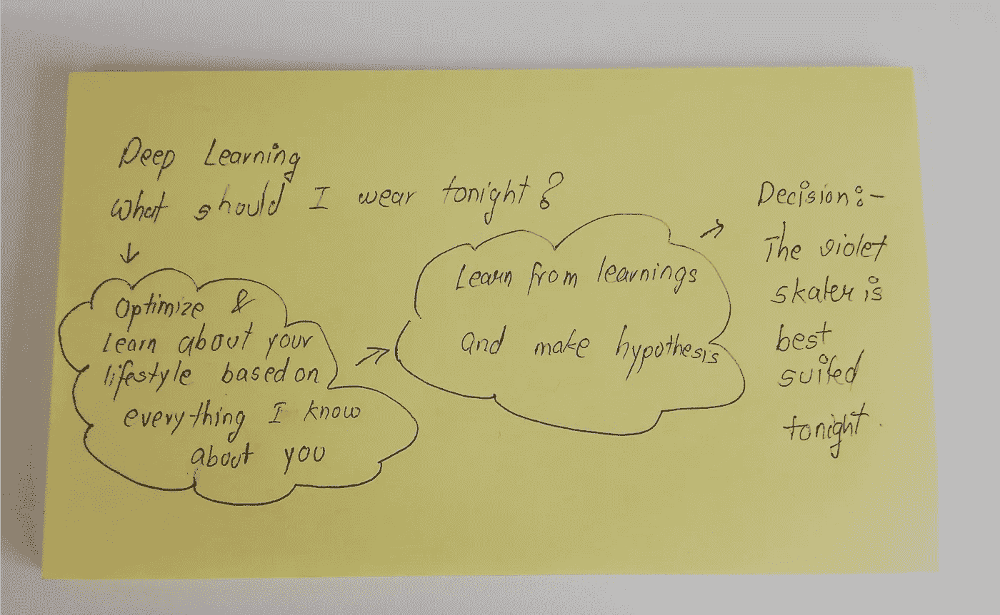

# 深度学习笔记—入门

> 原文：<https://medium.datadriveninvestor.com/notes-on-deep-learning-getting-started-db3135be7c80?source=collection_archive---------7----------------------->

这是关于深度学习的 13 部分系列笔记的第一部分。

以下是“深度学习笔记”系列中所有文章的链接。

1.  [入门(本文)](https://medium.com/@venali/notes-on-deep-learning-getting-started-db3135be7c80)
2.  [线性模型](https://medium.com/@venali/notes-on-deep-learning-linear-model-bafc9e6a9f7f)
3.  [梯度下降](https://medium.com/datadriveninvestor/notes-on-deep-learning-gradient-descent-e95675ebd260)
4.  [反向传播和 PyTorch](https://medium.com/datadriveninvestor/notes-on-deep-learning-back-propagation-and-pytorch-21693552b733)
5.  [py torch 方式的线性回归](https://medium.com/datadriveninvestor/notes-on-deep-learning-linear-regression-in-pytorch-way-c2794837f0d2)
6.  [逻辑回归](https://medium.com/datadriveninvestor/notes-on-deep-learning-logistic-regression-7d58973728cf)
7.  [宽&深](https://medium.com/datadriveninvestor/notes-on-deep-learning-wide-deep-46170d9040c)
8.  [数据加载器](https://medium.com/datadriveninvestor/notes-on-deep-learning-data-loader-d93ab79a631a)
9.  [Softmax 分类器](https://medium.com/datadriveninvestor/notes-on-deep-learning-softmax-classifier-971b3df27466)
10.  [美国有线电视新闻网](https://medium.com/@venali/notes-on-deep-learning-basic-cnn-6540fc6edcd4)
11.  [高级 CNN](https://medium.com/@venali/notes-on-deep-learning-advanced-cnn-75ed499ca053)
12.  [RNN 第一部](https://medium.com/datadriveninvestor/notes-on-deep-learning-rnn-part-1-1c8fd9db72a7)
13.  [RNN 第二部](https://medium.com/datadriveninvestor/notes-on-deep-learning-rnn-part-2-4256ed5bd26)

**深度学习一片骂声？我也这样认为，直到我别无选择，只能采用它并欣赏它的能力。**

**什么是深度学习？**
根据 investopedia(因为只有技术的实际应用才能反映技术产生的货币价值)

> 深度学习是一种人工智能功能，它模仿人脑在处理数据和创建用于决策的模式方面的工作。深度学习是[人工智能(AI)](https://www.investopedia.com/terms/a/artificial-intelligence-ai.asp) 中机器学习的一个子集，它拥有能够从非结构化或无标签的数据中进行无监督学习的网络。
> 
> 也称为深度神经学习或深度神经网络。

我对深度学习的定义(因为视觉比文字更重要)

 [## DDI 编辑推荐:5 本机器学习书籍，让你从新手变成数据驱动专家…

### 机器学习行业的蓬勃发展重新引起了人们对人工智能的兴趣

www.datadriveninvestor.com](https://www.datadriveninvestor.com/2019/03/03/editors-pick-5-machine-learning-books/) 

*PS:诸如特征、权重、激活函数、传播、层、向前传递等术语 bla bla 将在后续文章中介绍，请耐心等待*

evolution of taking decision

决策的演变-基于非系统的决策、基于规则的决策、基于机器学习的决策和基于深度学习的决策的比较。

人类在进化，人类的直觉也在进化中进步，我们作为人类使用智力的主要动机是根据统计或直觉做出决定。据各种消息来源称，一个普通人每天要做 35，000 个决定。这是很多，这就是我如何衡量任何系统决策的 KPI。

过去，我们可以相信人类的本能，顺其自然，但自从我们开始理性思考，决策过程就发生了变化。

evolution of taking decision- era of no systems

理性决策主要是根据过去的经验做出的，一些聪明的人试图建立基于规则的系统，以便遵循标准的蓝图，减少思考。我想这也可能是为了一致性。

evolution of taking decision- era of rule-based systems

然后是一个优化什么是最好的时代。我称之为机器学习的数字运算时代。很多都是基于人类的直觉来创建特征，并基于这些特征权重来优化算法决策。

evolution of taking decision- era of machine learning systems

但是数字运算真的足够了吗？
端到端建模，以便在没有太多人类干预和直觉的情况下做出决策，这是深度学习的新时代。

evolution of taking decision- era of deep learning systems

# 关于作者

我是 venali sonone，职业是数据科学家，也是管理学毕业生。

# 参考

[http://pytorch.org/](http://pytorch.org/)
[https://github.com/pytorch/examples](https://github.com/pytorch/examples)
[https://github.com/ritchieng/the-incredible-pytorch](https://github.com/ritchieng/the-incredible-pytorch)
[https://github.com/yunjey/pytorch-tutorial](https://github.com/yunjey/pytorch-tutorial)
[https://github . com/znxlwm/py torch-generative-model-collections](https://github.com/znxlwm/pytorch-generative-model-collections)
[https://github.com/hunkim/PyTorchZeroToAll](https://github.com/hunkim/PyTorchZeroToAll)

# 动机

这个系列的灵感来源于失败。如果你想谈论短暂的 5 年或 50 年，后者确实需要一些足够有挑战性的东西来保持你眼中的火花。