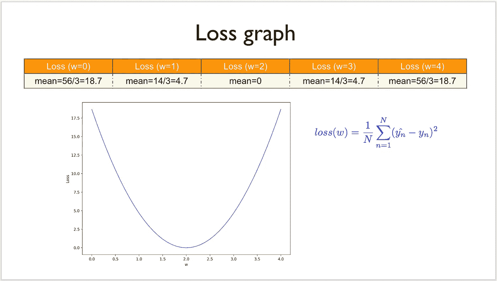
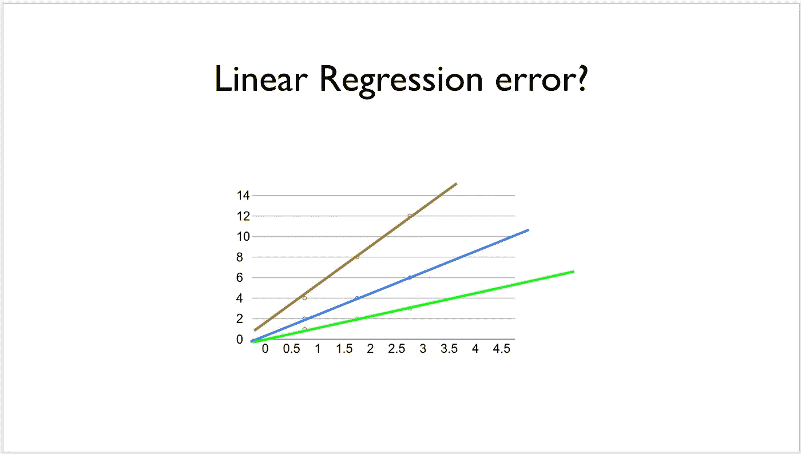
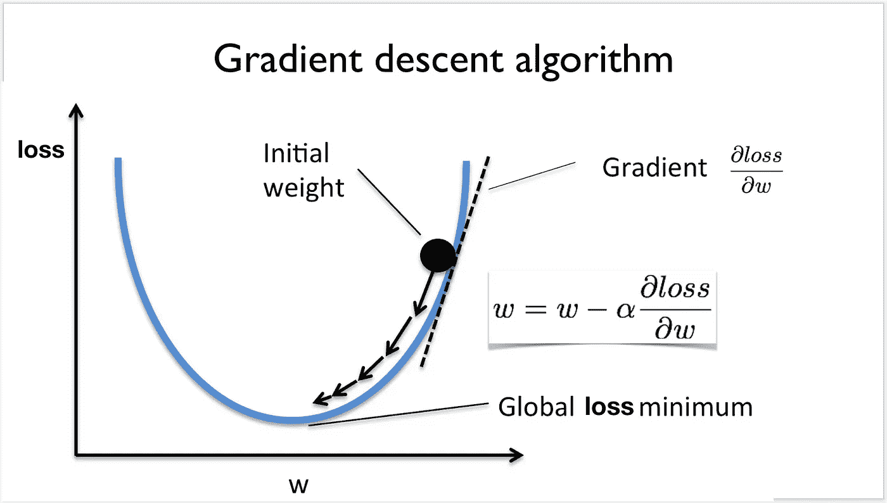
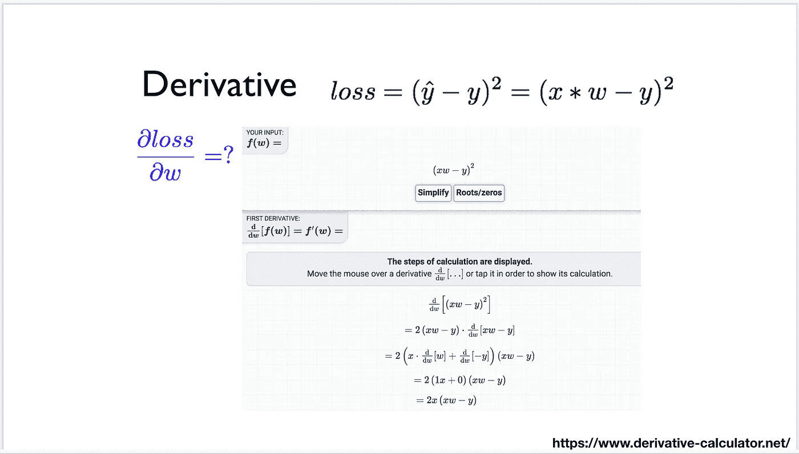
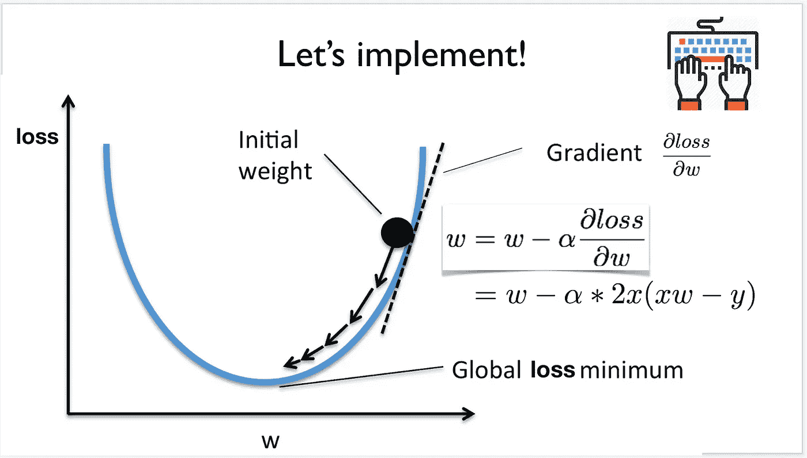

# 深度学习笔记—梯度下降

> 原文：<https://medium.datadriveninvestor.com/notes-on-deep-learning-gradient-descent-e95675ebd260?source=collection_archive---------9----------------------->

这是 13 集系列“深度学习笔记”的第三部分。请在第[篇第](https://medium.com/datadriveninvestor/notes-on-deep-learning-getting-started-db3135be7c80)篇文章中找到所有部分的链接。

# 梯度下降

> “一般:指道路或其他地形特征的坡度或坡度。
> 
> 物理学中:属性(温度、压力等)大小的增加或减少。
> 
> 在数学中:导数的多变量推广，使其成为向量值函数。
> 
> 在平面设计/艺术中:图像渐变是指颜色或纹理的逐渐变化/混合"
> [来源](https://www.quora.com/What-is-a-gradient)

相关技术指南

[*sci kit 监督学习的常规指南-learn-随机梯度下降-SGD-广义线性模型(13)*](https://medium.com/@venali/conventional-guide-to-supervised-learning-with-scikit-learn-stochastic-gradient-descent-sgd-14068f286a7f)

概念:

a) *坡度*

梯度是导数。
彩虹有逐渐消失的颜色梯度，地平线也是如此:P
所以基本上可以认为，当导数(梯度)达到最小值(或最大值)时，它的值等于零

让我们回忆一下上一篇[关于损失的帖子](https://medium.com/datadriveninvestor/notes-on-deep-learning-linear-model-bafc9e6a9f7f)，我们需要一个损失的最小值来给出精确的近似值。
这个简单的目标可以通过简单地累加不同权重的 MSE 并从中找出最小值来实现。

我们可以做得更好？
显然是的！

那么我们该怎么办？
使用渐变。上面的定义清楚地表明梯度在最小值为零，在给定点是一个斜率。如果我们不断减去这个斜率，以确保我们达到零或接近零。

 [## 用 7 个步骤解释深度学习——数据驱动投资者

### 在深度学习的帮助下，自动驾驶汽车、Alexa、医学成像-小工具正在我们周围变得超级智能…

www.datadriveninvestor.com](https://www.datadriveninvestor.com/2019/01/23/deep-learning-explained-in-7-steps/) 

*随机开始…
如果斜率为负，我们添加一个数字。这增加了权重值
如果斜率为正，我们减去一个数字。这将减少重量值*

最后，我们接近了零！最小损失点。

上面的解释可能真的很幼稚，但我建议阅读参考资料以获得更多的技术深度。

[*使用 scikit 的监督学习的常规指南-learn-随机梯度下降-SGD-广义线性模型(13)*](https://medium.com/@venali/conventional-guide-to-supervised-learning-with-scikit-learn-stochastic-gradient-descent-sgd-14068f286a7f)

尽管如此，即使跳过了指南，阅读附带的笔记本也会给人更多的直觉。

那么上面是怎么回事呢？

1.  机器从随机猜测开始，w =随机值，并对照我们给定的 w 的所有值进行检查
2.  计算梯度
3.  对于每次迭代，权重被减去一个小的梯度因子，并且获得新的权重
4.  为什么？了解“什么是重量”,哪种重量能使我们的损失最小，我们使用它

这在下面的概念图中有很好的解释。

# 关于作者

我是 venali sonone，职业是数据科学家，也是管理学毕业生。

# 参考

[http://pytorch.org/](http://pytorch.org/)
[https://github.com/pytorch/examples](https://github.com/pytorch/examples)
[https://github.com/ritchieng/the-incredible-pytorch](https://github.com/ritchieng/the-incredible-pytorch)
[https://github.com/yunjey/pytorch-tutorial](https://github.com/yunjey/pytorch-tutorial)
[https://github . com/znxlwm/py torch-generative-model-collections](https://github.com/znxlwm/pytorch-generative-model-collections)
[https://github.com/hunkim/PyTorchZeroToAll](https://github.com/hunkim/PyTorchZeroToAll)

# 动机

这个系列的灵感来源于失败。如果你想谈论短暂的 5 年或 50 年，后者确实需要一些足够有挑战性的东西来保持你眼中的火花。