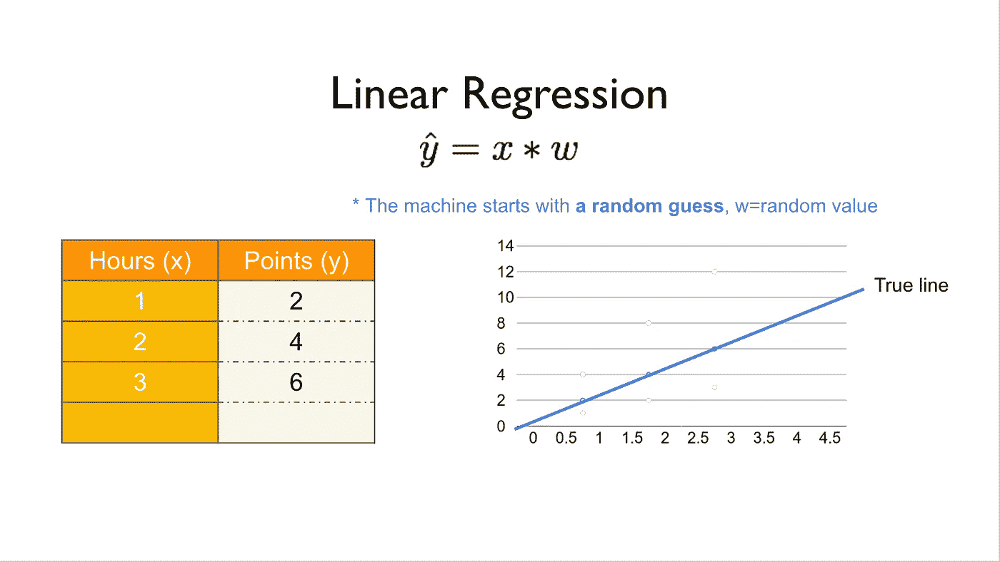
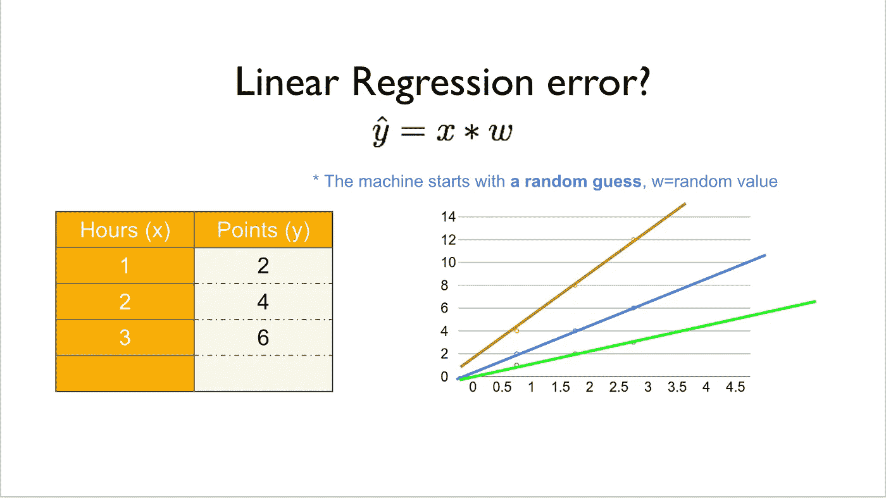
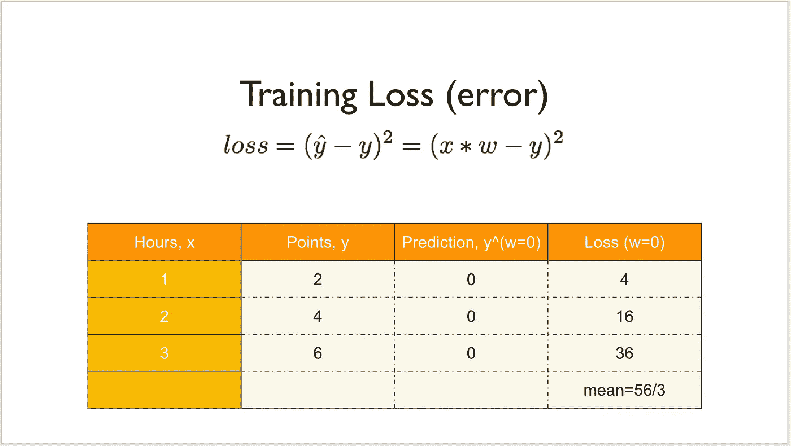
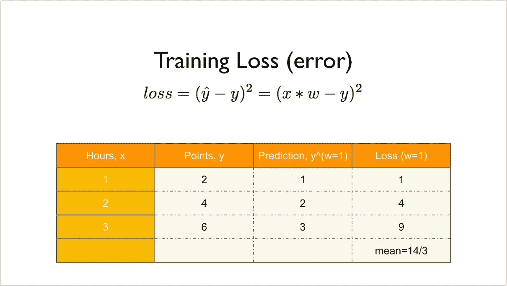
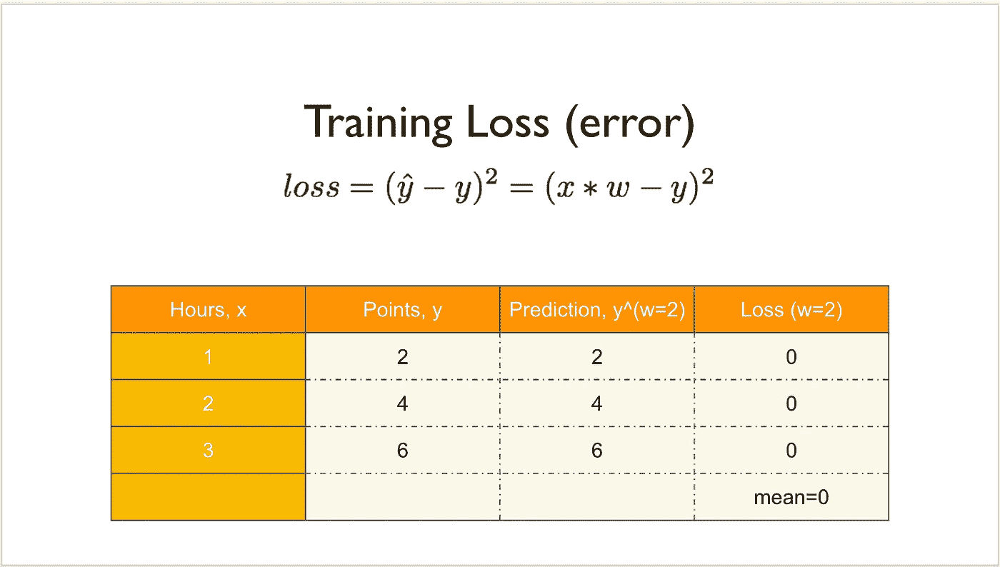
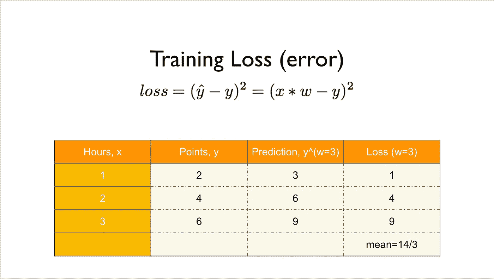
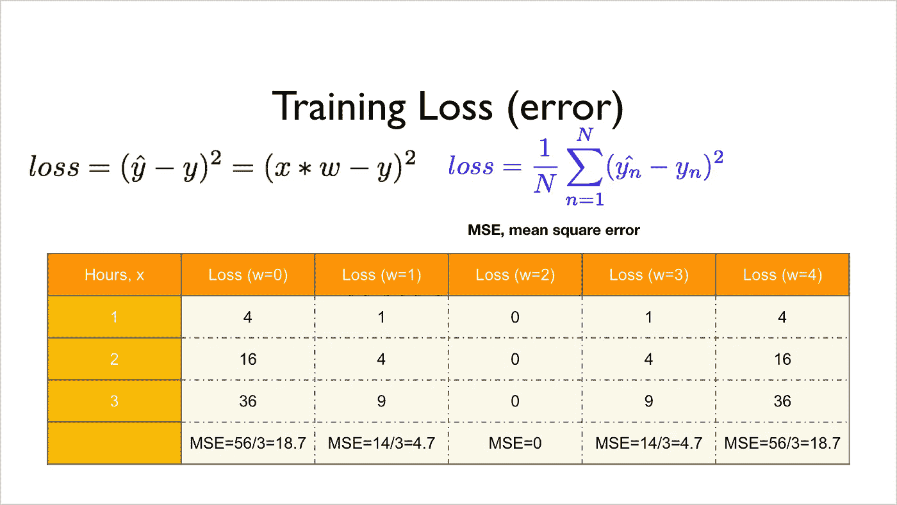
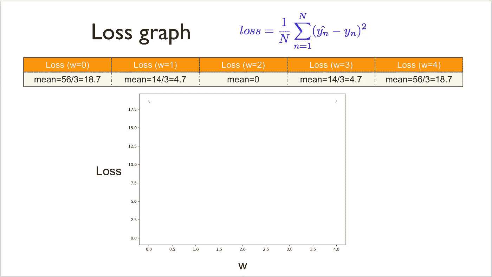
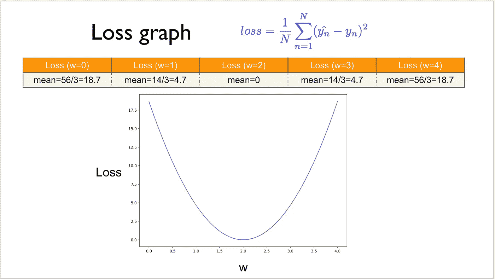

# 关于深度学习的笔记—线性模型

> 原文：<https://medium.datadriveninvestor.com/notes-on-deep-learning-linear-model-bafc9e6a9f7f?source=collection_archive---------7----------------------->

这是 13 集系列“深度学习笔记”的第二部分。请在第[篇第](https://medium.com/datadriveninvestor/notes-on-deep-learning-getting-started-db3135be7c80)篇文章中找到所有部分的链接。

# 线性模型

“让我们调整”

我们显然不是什么都知道。作为一个孩子，我们学会了如何平衡和行走，如何吃东西，或者事实上吃多少等等…

初为人母也不知道该给宝宝喂多少。采取的解决办法是喂宝宝一点，然后等，如果宝宝哭闹就多喂一些。这种情况一直持续到母亲知道她的宝宝实际需要多少食物。即使她凭经验知道数量，有时婴儿不太饿，有时更饿，这取决于婴儿的情绪，母亲明白这一事实。她也理解“正常”。

数学以类似的方式处理逻辑。在一个非常简单的例子中，如果 20 克咖啡豆在机器中研磨需要 2 分钟，那么 200 克需要多少时间？

10 次，即 20 分钟。耶！你知道线性。

这是一个线性模型，它遵循一个线性方程。
需要找到魔法因子(20g = 2 需要分钟)

相关技术指南

1.  [*scikit-learn 监督学习的常规指南—普通最小二乘广义线性模型*](https://medium.com/@venali/conventional-guide-to-supervised-learning-with-scikit-learn-ordinary-least-squares-generalized-29cbf1648a25)
2.  [*使用 scikit 的监督学习的常规指南——学习——感知器——广义线性模型*](https://medium.com/@venali/conventional-guide-to-supervised-learning-with-scikit-learn-perceptron-generalized-linear-2e3c85a8940a)

 [## 用 7 个步骤解释深度学习——数据驱动投资者

### 在深度学习的帮助下，自动驾驶汽车、Alexa、医学成像-小工具正在我们周围变得超级智能…

www.datadriveninvestor.com](https://www.datadriveninvestor.com/2019/01/23/deep-learning-explained-in-7-steps/) 

概念:

***数据*** :
收集到的信息称为数据。
在机器学习中，它可能有标签，也可能没有标签。标签是我们感兴趣了解的定量/定性信息，通常是收集的某种信息的已知数量/质量。
20g 咖啡研磨 2 分钟。
40g 咖啡磨 4 分钟。
60g 咖啡需要 6 分钟研磨。“分钟数”是标签。代替时间，我们可以用咖啡类型作为定性信息。

***线性方程:***
乘法因子是神奇的公式

(咖啡克数)*(幻数)=研磨时间

***前向:***
前向传递是通过我们的线性魔术公式对我们感兴趣了解(标注)的定量/定性信息的计算。

***重量:*** 重量是神奇公式的倍数。通常可以用感知器模型很好地解释。

***损耗:***
有时候宝宝会根据他(她)的心情而不太饿或者更饿。如果机器被加热，咖啡可能需要更多的时间来研磨。

与“正常”不同的变化叫做误差或损失。
我们的使命是尽量减少与“正常”的差异。

上面的解释可能真的很幼稚，但我建议阅读参考资料以获得更多技术深度:

尽管如此，即使跳过了指南，阅读随附的笔记本也会给人更多的直觉。

相关技术指南。

1.  [*sci kit-learn 监督学习的常规指南—普通最小二乘广义线性模型*](https://medium.com/@venali/conventional-guide-to-supervised-learning-with-scikit-learn-ordinary-least-squares-generalized-29cbf1648a25)
2.  [*sci kit-learn-感知器-广义线性模型监督学习的常规指南*](https://medium.com/@venali/conventional-guide-to-supervised-learning-with-scikit-learn-perceptron-generalized-linear-2e3c85a8940a)

那么上面是怎么回事呢？

*   机器从随机猜测开始，w =随机值，并对照我们给 w 的所有值进行检查
*   附加每个重量的损失，并标绘损失和重量
*   为什么？所以我们知道什么是我们的幻数或重量。使我们损失最小的重量。这个用图片很好的解释了

# 关于作者

我是 venali sonone，职业是数据科学家，也是管理学毕业生。

# 参考

[http://pytorch.org/](http://pytorch.org/)
[https://github.com/pytorch/examples](https://github.com/pytorch/examples)
[https://github.com/ritchieng/the-incredible-pytorch](https://github.com/ritchieng/the-incredible-pytorch)
[https://github.com/yunjey/pytorch-tutorial](https://github.com/yunjey/pytorch-tutorial)
[https://github . com/znxlwm/py torch-generative-model-collections](https://github.com/znxlwm/pytorch-generative-model-collections)
[https://github.com/hunkim/PyTorchZeroToAll](https://github.com/hunkim/PyTorchZeroToAll)

# 动机

这个系列的灵感来源于失败。如果你想谈论短暂的 5 年或 50 年，后者确实需要一些足够有挑战性的东西来保持你眼中的火花。