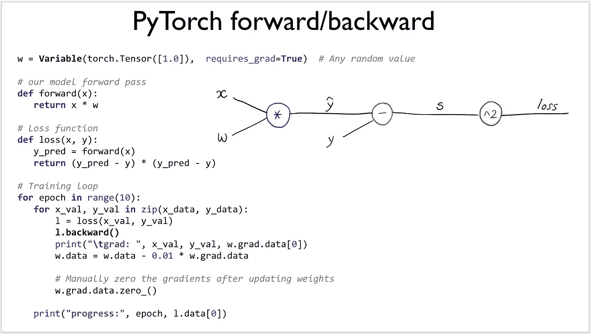
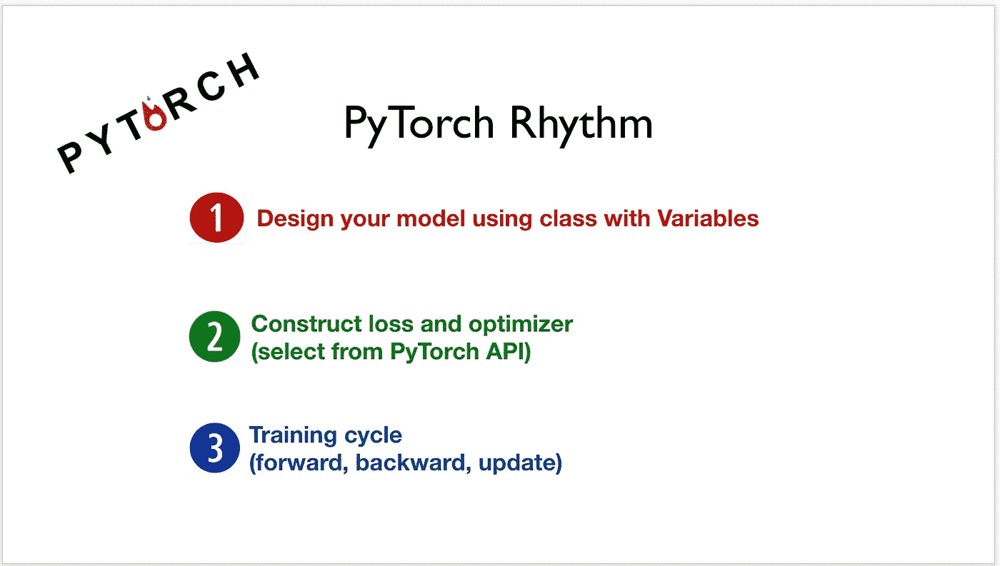

# 关于深度学习的注记 PyTorch 方法中的线性回归

> 原文：<https://medium.datadriveninvestor.com/notes-on-deep-learning-linear-regression-in-pytorch-way-c2794837f0d2?source=collection_archive---------5----------------------->

这是 13 集系列“深度学习笔记”的第五集。请在第[篇第](https://medium.com/datadriveninvestor/notes-on-deep-learning-getting-started-db3135be7c80)篇文章中找到所有部分的链接。

# 线性回归

> PyTorch 的核心提供了两个主要特性:
> 
> 一个 n 维张量，类似于 numpy 但是可以在 GPU 上运行
> 自动微分用于构建和训练神经网络

来自监督学习的相关技术指南

1.  [*scikit-learn 监督学习的常规指南—普通最小二乘广义线性模型*](https://medium.com/@venali/conventional-guide-to-supervised-learning-with-scikit-learn-ordinary-least-squares-generalized-29cbf1648a25)
2.  [*使用 scikit 的监督学习的常规指南——学习——感知器——广义线性模型*](https://medium.com/@venali/conventional-guide-to-supervised-learning-with-scikit-learn-perceptron-generalized-linear-2e3c85a8940a)

 [## 2019 年深度学习的终极学习路径及更多...-数据驱动型投资者

### 又一个美好的一周，一些好的教育内容将会到来。我最喜欢的&最受欢迎的帖子之一…

www.datadriveninvestor.com](https://www.datadriveninvestor.com/2019/01/07/the-ultimate-learning-path-for-deep-learning-in-2019-more/) 

概念:

a)模型类

之前我们定义了自己的权重(类似于感知器)。我们还定义了损失函数和远期函数。

那太乏味了…
如果我们编写所有的代码，并在需要时编写所有的函数，过一段时间后，我们将编写 TensorFlow/PyTorch 本身……
我相信这不是我们的动机:P

编写数值优化库总是很棒的，但是在预先编写的库(如 PyTorch)之上构建来完成任务会产生商业价值。

所以如果我们被事实说服，就用 PyTorch 的 nn 包实现吧。这里让我们首先创建一个单层。我们可以用类似的方式堆叠一系列的层，或者堆叠之前文章中提到的计算图。

我们使用线性层:

每个线性模块使用线性函数计算输入的输出，并保存其权重和偏差的内部张量。

另请注意，我们还可以采用其他几个标准模块。
让我们使用一个模型类格式，它有:
a) __init__:定义线性模块
b)forward:forward 是替换，使用 init 中定义的模型层，而不是我们定制的 forward pass。

b)优化器

考虑到我们使用的是 nn 包和其中的模块，模块通常有几个超参数，这些参数通常是随机预定义的。这也指出了 Pytorch 模块是用户友好的，但它也提供了配置底层功能的灵活性。
py torch 中的 optim 包抽象了优化算法的思想，提供了常用优化算法的实现。

c)标准

还记得我们写的损失函数吗？标准是我们的损失函数，现在也可以从火炬神经网络模块使用。

如果你想了解更多细节，请看相关技术指南:
[学习 PYTORCH 并举例](https://pytorch.org/tutorials/beginner/pytorch_with_examples.html)

# 那么上面是怎么回事呢？

*   机器以学习率、随机权重和随机超参数开始。
*   Pytorch auto 以 Pytorch 的方式计算超参数、权重和偏差，而不是我们之前手动完成的。
*   对于每次迭代，超参数、权重、偏差被更新。
*   为什么？因此，我们得到了优化的超参数，权重，偏差，即 PyTorch 模型，它给我们带来了最小的损失和准确的预测，这在帖子中有很好的解释

好吧，让我们做点正经事，把手弄脏…

我们在上面看到了一个简单的例子，这对于理解概念是非常必要的。然而，尝试一下功能并分析真实世界的数据集还是不错的。为什么不在 CIFAR10 上尝试我们最简单的线性回归形式呢？

CIFAR-10 和 CIFAR-100 被标记为 8000 万微小图像数据集的子集。它们由 Alex Krizhevsky、Vinod Nair 和 Geoffrey Hinton 收藏。

更多[技术指南](https://pytorch.org/tutorials/beginner/blitz/cifar10_tutorial.html)。

关于作者

我是 venali sonone，职业是数据科学家，也是管理学毕业生。

# 参考

[http://pytorch.org/](http://pytorch.org/)
[https://github.com/pytorch/examples](https://github.com/pytorch/examples)
[https://github.com/ritchieng/the-incredible-pytorch](https://github.com/ritchieng/the-incredible-pytorch)
[https://github.com/yunjey/pytorch-tutorial](https://github.com/yunjey/pytorch-tutorial)
[https://github . com/znxlwm/py torch-generative-model-collections](https://github.com/znxlwm/pytorch-generative-model-collections)
[https://github.com/hunkim/PyTorchZeroToAll](https://github.com/hunkim/PyTorchZeroToAll)

# 动机

这个系列的灵感来源于失败。如果你想谈论短暂的 5 年或 50 年，后者确实需要一些足够有挑战性的东西来保持你眼中的火花。