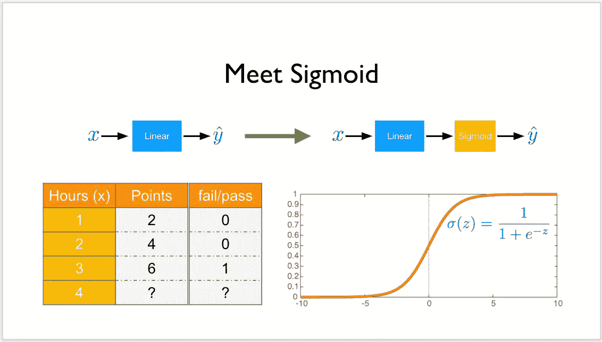
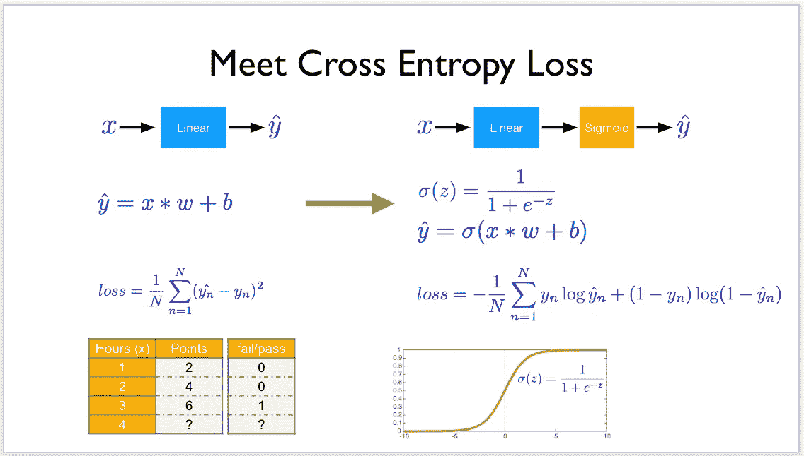

# 深度学习笔记—逻辑回归

> 原文：<https://medium.datadriveninvestor.com/notes-on-deep-learning-logistic-regression-7d58973728cf?source=collection_archive---------8----------------------->

这是 13 集系列“深度学习笔记”的第六集。请在第[篇第](https://medium.com/datadriveninvestor/notes-on-deep-learning-getting-started-db3135be7c80)篇文章中找到所有部分的链接。

# 逻辑回归

> PyTorch 的核心提供了两个主要特性:
> 
> 一个 n 维张量，类似于 numpy 但是可以在 GPU 上运行
> 自动微分用于构建和训练神经网络

来自监督学习的相关技术指南

1.  [使用 scikit 的监督学习的常规指南-learn-逻辑回归-广义线性模型(12)](https://medium.com/@venali/conventional-guide-to-supervised-learning-with-scikit-learn-logistic-regression-generalized-e9783c414588)

上一个帖子很沉重，我知道你正在寻找更多令人兴奋的东西来玩，我保证它会到来。
但是就这个帖子而言，它是一个很轻的帖子…

 [## 投资算法快速指南-数据驱动投资者

### 让我们想象一下 30 年前的股票市场:让我们想象一下现在:像现在的许多其他领域一样，投资市场已经…

www.datadriveninvestor.com](https://www.datadriveninvestor.com/2019/01/31/a-quick-guide-to-investment-algorithms/) 

概念:

a)Sigmoid
Sigmoid 将函数的输入转换为 0 或 1。

如果我们必须指出上一本关于线性回归的笔记本和这本关于逻辑回归的笔记本的一个不同之处，那么唯一不同的是:
1。sigmoid 能够提供 0 到 1 之间的输出。
2。这个 sigmoid 被用作线性层的输入，并且我们使用 sigmoid 和线性层的组合作为我们的正向传递。

sigmoid，也称为二进制随机神经元，将输出视为在短时间窗口内产生尖峰的概率。

简单地说，
Sigmoid 的分母中有一个‘e’提升为变量(函数的输入)，将数字映射为二进制 1 或 0。

如果你想知道细节，请看看相关的技术指南:
[学习 PYTORCH 并举例](https://pytorch.org/tutorials/beginner/pytorch_with_examples.html)

那么上面是怎么回事呢？

*   机器以学习率、随机权重和随机超参数开始。
*   auto 以 pytorch 的方式计算超参数、权重和偏差，而不是我们之前手动完成的。
*   对于每次迭代，超参数、权重、偏差被更新。
*   为什么？因此，我们得到了优化的超参数，权重，偏差，即 PyTorch 模型，它给我们带来了最小的损失和准确的预测，这在帖子中有很好的解释

关于作者

我是 venali sonone，职业是数据科学家，也是管理学毕业生。

# 参考

[http://pytorch.org/](http://pytorch.org/)
[https://github.com/pytorch/examples](https://github.com/pytorch/examples)
[https://github.com/ritchieng/the-incredible-pytorch](https://github.com/ritchieng/the-incredible-pytorch)
[https://github.com/yunjey/pytorch-tutorial](https://github.com/yunjey/pytorch-tutorial)
[https://github . com/znxlwm/py torch-generative-model-collections](https://github.com/znxlwm/pytorch-generative-model-collections)
[https://github.com/hunkim/PyTorchZeroToAll](https://github.com/hunkim/PyTorchZeroToAll)

# 动机

这个系列的灵感来源于失败。如果你想谈论短暂的 5 年或 50 年，后者确实需要一些足够有挑战性的东西来保持你眼中的火花。