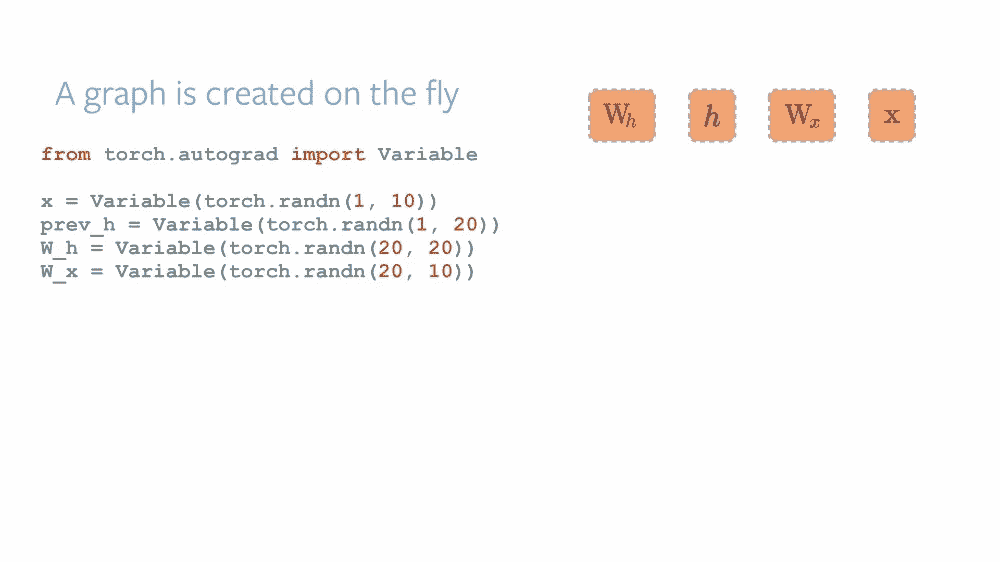
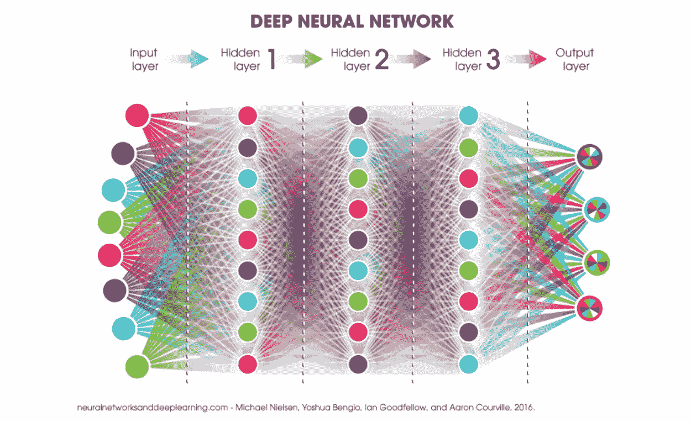
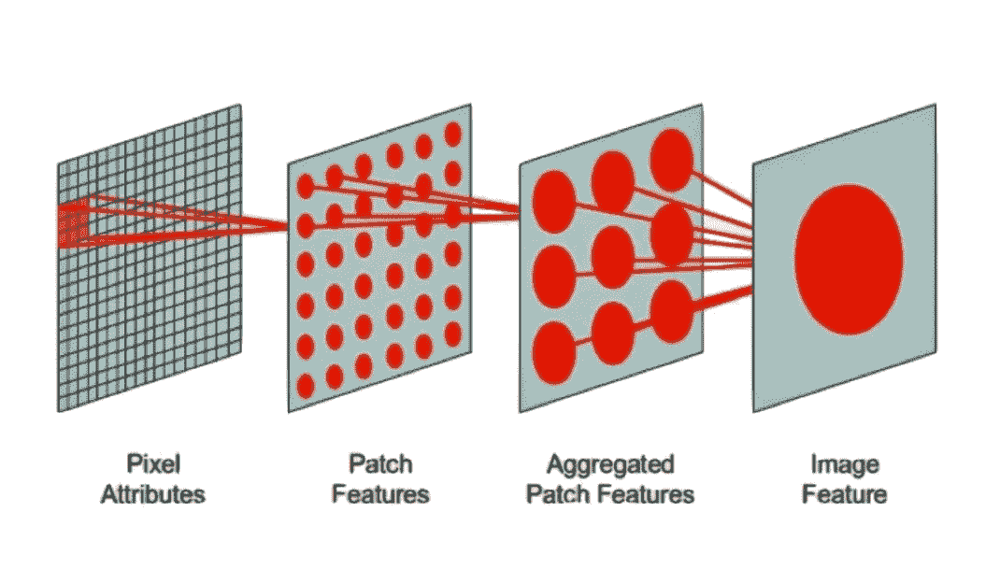
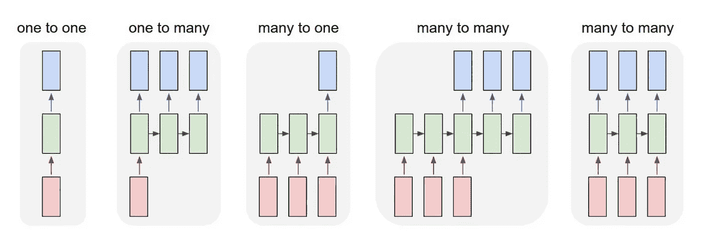
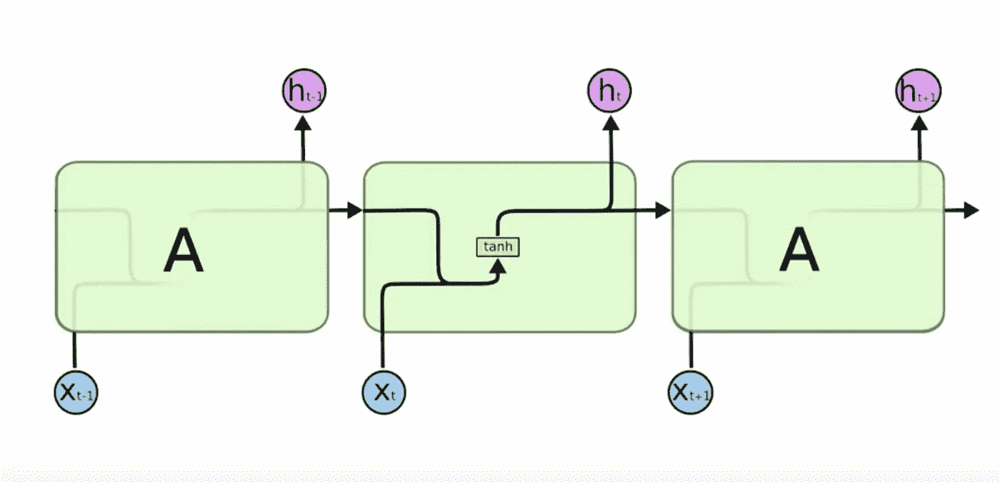
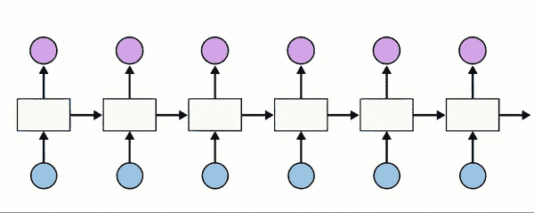

# 深度学习笔记— RNN 第 1 部分

> 原文：<https://medium.datadriveninvestor.com/notes-on-deep-learning-rnn-part-1-1c8fd9db72a7?source=collection_archive---------4----------------------->

这是 13 集系列“深度学习笔记”的第 12 集。请在第[篇第](https://medium.com/datadriveninvestor/notes-on-deep-learning-getting-started-db3135be7c80)篇文章中找到所有部分的链接。

这篇文章主要涉及 RNN(循环神经网络)
让我们重新审视神经网络，然后看看 CNN、DNN 和 RNN 的区别。之后，我们再深入 into)

 [## 2019 年深度学习的终极学习路径及更多...-数据驱动型投资者

### 又一个美好的一周，一些好的教育内容将会到来。我最喜欢的&最受欢迎的帖子之一…

www.datadriveninvestor.com](https://www.datadriveninvestor.com/2019/01/07/the-ultimate-learning-path-for-deep-learning-in-2019-more/) 

# 神经网络

神经网络(即相互连接的神经元)的优势在于它可以共享和利用先前的信息。

在前几个帖子中，我们了解到向前传球是一个函数。
如果你正在处理神经网络，基本上我们有几个函数一个接一个地转换数据。这些功能中的每一个都是神经网络的一层。计算图只是这些函数的顺序的可视化图形。
(像一个流程图。表示函数的计算顺序。)

为了方便起见，我们基本上可以分为

# 1.深网

“深度”神经网络。那么这个神经网络有什么魔力呢？最近常见的是将神经网络归因于深度学习。这种深度学习从何而来？事实上，有两种方法可以实现深度学习。其中一个非常深入。
另一个是走实宽。

深度和广度是规模和范围的一种关系，但不完全相同。那么神经网络的深度和广度。

让我们解码这些术语

*   DEEP = >堆叠层
*   WIDE = >矩阵乘法

# 2.卷积网

在整个图像上顺序移动补片或窗口的过程称为卷积。
卷积神经网络的全貌。
要分解 CNN 的全貌，有三个部分:

1.  卷积步骤
2.  子采样(1 和 2 可以重复)
3.  线性层(3 也称为全连接层)

# 3.最后是递归神经网络

将先前的状态反馈到下一个状态(层)。
递归神经网络的概念是输入是一个序列，我们希望以某种方式将一个先前的输入用作下一个输入的输入。
想象你要去踢足球。

你关于踢足球的决定取决于今天的天气状况，但也取决于你昨天有多累。
假设你每天都踢足球，昨天的足球决定取决于昨天的天气和前天你有多累。
我们只是想确保当你决定今天玩还是不玩的时候，我们不会拿走我们今天知道的东西，而是以某种方式捕捉过去的一切:)这也是为明天的决定而重复的…我们每次决定时都会收集反馈

前馈网络呢？
退一步讲，前馈接受输入构成的一切并做出决定。
递归使用其内部存储器捕获内部状态(存储器)来处理输入序列。

上图表示反馈回路，为了展开它，我们可以使用下面的表示法
还要注意一系列的输入可以产生一系列的输出，但是每个输出也从系列中的前一个输入状态(绿框)获取一些输入。
考虑到这一点，如果我们使用先前的状态，并且每个先前的状态也使用其先前的状态，我们就有效地捕获了所有先前的状态…

递归神经网络也有不同的类型，我们将有机会在后面的帖子中看到其中的一些

# 深入了解 RNN

那么 RNN 发生了什么呢
我们已经看过这张图片了

它看起来像这样，
我们将输入作为原始输入，并有一个类似 tanh 的函数来乘以先前的隐藏状态。就是这样，一个最简单的概念造就了 RNN。

我们在这里看到的例子试图得到一个字母，然后预测一个字母。
这很简单，在 NLP 用例中非常有用

让我们跳到笔记本上来为上面的动画建立我们的 RNN 模型

# 关于作者

我是 venali sonone，职业是数据科学家，也是管理学毕业生。

# 参考

[http://pytorch.org/](http://pytorch.org/)
[https://github.com/pytorch/examples](https://github.com/pytorch/examples)
[https://github.com/ritchieng/the-incredible-pytorch](https://github.com/ritchieng/the-incredible-pytorch)
[https://github.com/yunjey/pytorch-tutorial](https://github.com/yunjey/pytorch-tutorial)
[https://github . com/znxlwm/py torch-generative-model-collections](https://github.com/znxlwm/pytorch-generative-model-collections)
[https://github.com/hunkim/PyTorchZeroToAll](https://github.com/hunkim/PyTorchZeroToAll)

# 动机

这个系列的灵感来源于失败。如果你想谈论短暂的 5 年或 50 年，后者确实需要一些足够有挑战性的东西来保持你眼中的火花。