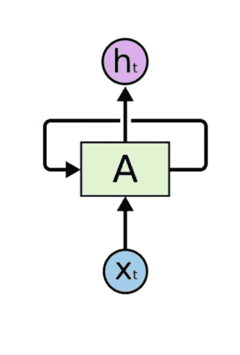
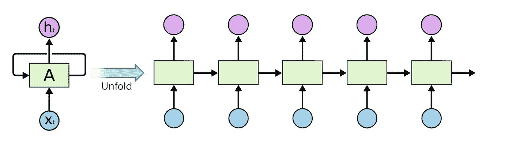
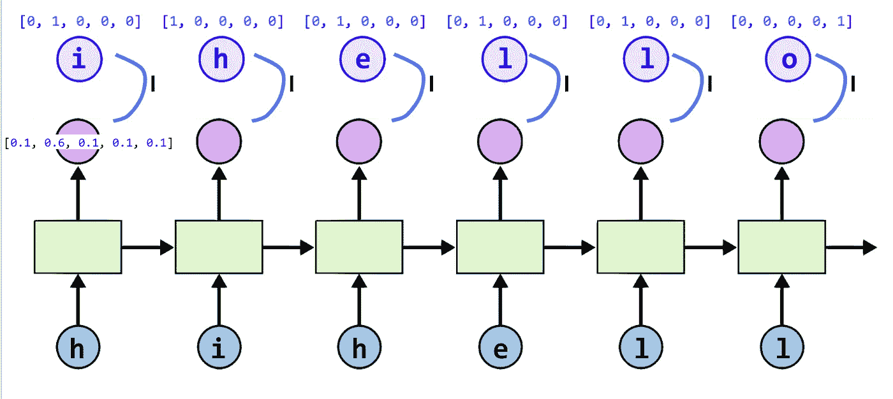
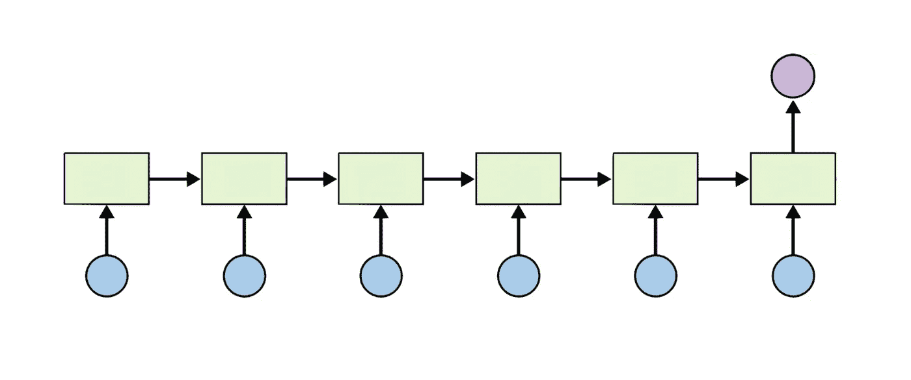
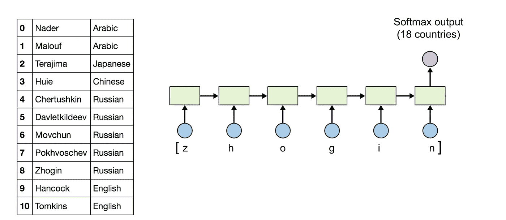
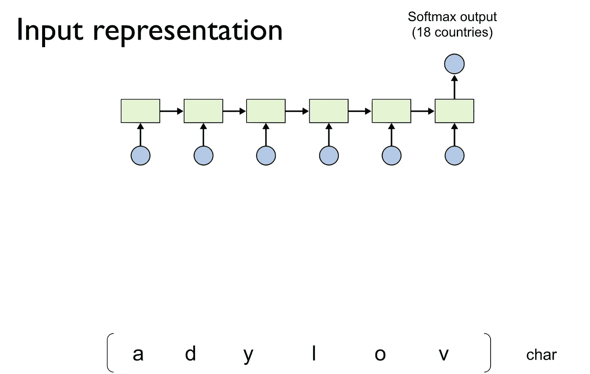
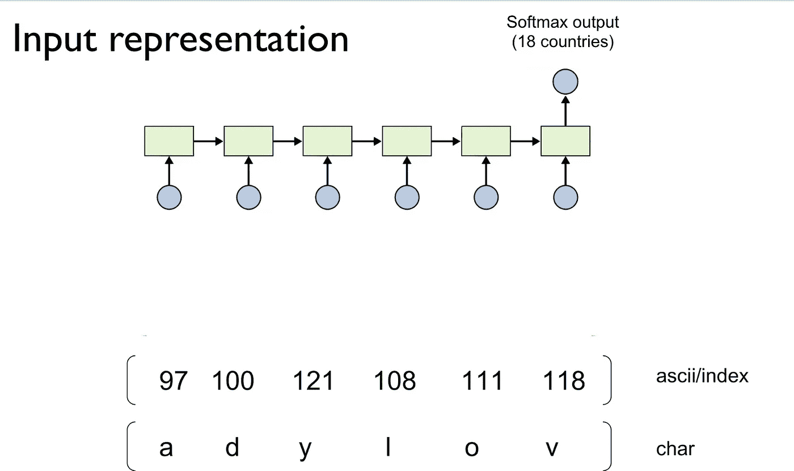
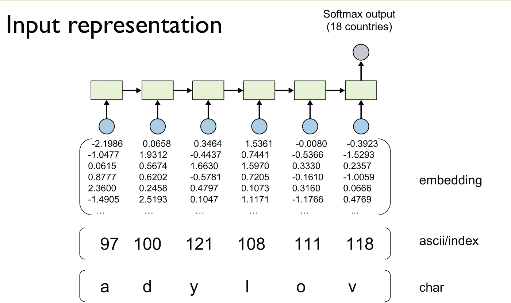
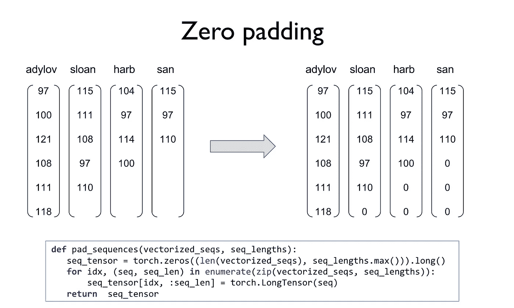
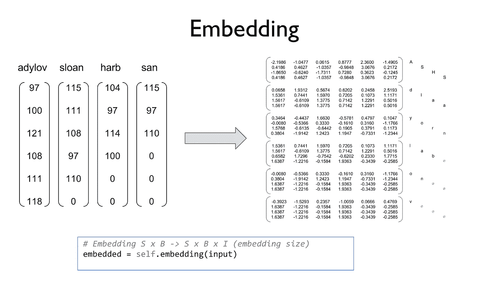

# 深度学习笔记— RNN 第二部分

> 原文：<https://medium.datadriveninvestor.com/notes-on-deep-learning-rnn-part-2-4256ed5bd26?source=collection_archive---------12----------------------->

这是“深度学习笔记”系列的第十三部分。请在第[篇第](https://medium.com/datadriveninvestor/notes-on-deep-learning-getting-started-db3135be7c80)篇文章中找到所有部分的链接。

这是 RNN 第二部分。耶！
RNN 在之前的帖子里都有涉及。这里我们将只检查 RNN 的一个具体例子，并理解填充和嵌入的概念。

 [## 2019 年深度学习的终极学习路径及更多...-数据驱动型投资者

### 又一个美好的一周，一些好的教育内容将会到来。我最喜欢的&最受欢迎的帖子之一…

www.datadriveninvestor.com](https://www.datadriveninvestor.com/2019/01/07/the-ultimate-learning-path-for-deep-learning-in-2019-more/) 

让我们回顾一下 RNN。

# RNN

将先前的状态反馈到下一个状态(层)。
递归神经网络的概念是输入是一个序列，我们希望以某种方式将一个先前的输入用作下一个输入的输入。

想象你要去踢足球。
你关于踢足球的决定取决于今天的天气状况，但也取决于你昨天有多累。
假设你每天都踢足球，昨天的足球决定取决于昨天的天气和前天你有多累。
我们只是想确保当你决定今天玩还是不玩的时候，我们不会拿走我们今天知道的东西，而是以某种方式捕捉过去的一切:)这也是为明天的决定而重复的…我们每次决定时都会收集反馈

前馈网络呢？
退一步讲，前馈把输入组成的一切都拿过来，做出决定。
递归使用其内部存储器来捕获内部状态(记忆)以处理输入序列。

上图表示反馈回路，为了展开它，我们可以使用下面的表示法
还要注意，一系列输入可以产生一系列输出，但是每个输出也从系列中的前一个输入状态(绿框)获取一些输入。
考虑这一点，如果我们使用先前的状态，并且每个先前的状态也使用其先前的状态，则我们有效地捕获了所有先前的状态…

我们在上一篇文章
中看到了上述概念，让我们从现在开始在此基础上构建…
我们正试图最小化每个字符序列的损失。

我们的用例是分类。
给定一个序列对该序列进行分类。首先，我们对每个状态进行了分类，但现在我们希望对输入长度/输入序列进行分类。
这可以是一个句子或类似此帖子的情感检测的案例研究，给定名称分类该名称属于哪个国家…即基于 n 长度序列预测一个类，如下表示…

我们尝试构建的案例更具代表性，如下:
我们为每个名称预测 18 个国家中的一个，即多类分类

1.  首先，名称被视为一个字符序列

2.字符序列被转换成 ASCII 码

3.ASCII 的序列被转换成单词嵌入，并被馈送到我们的 RNN

但是名称可以是各种长度，我们的网络接受固定大小的输入，所以我们用零填充名称。

什么是嵌入？

单词嵌入是单词的一种表示。在 In pytorch torch.nn.Embedding 中处理嵌入。
我建议关注参考资料了解更多细节:[https://py torch . org/tutorials/beginner/NLP/word _ embeddings _ tutorial . html](https://pytorch.org/tutorials/beginner/nlp/word_embeddings_tutorial.htmlBut)但是名称可以有各种长度，我们的网络接受固定大小的输入，所以我们用零填充名称。

让我们跳到笔记本上来构建我们的 RNN 模型

# 关于作者

我是 venali sonone，职业是数据科学家，也是管理学毕业生。

# 参考

[http://pytorch.org/](http://pytorch.org/)
[https://github.com/pytorch/examples](https://github.com/pytorch/examples)
[https://github.com/ritchieng/the-incredible-pytorch](https://github.com/ritchieng/the-incredible-pytorch)
[https://github.com/yunjey/pytorch-tutorial](https://github.com/yunjey/pytorch-tutorial)
[https://github . com/znxlwm/py torch-generative-model-collections](https://github.com/znxlwm/pytorch-generative-model-collections)
[https://github.com/hunkim/PyTorchZeroToAll](https://github.com/hunkim/PyTorchZeroToAll)

# 动机

这个系列的灵感来源于失败。如果你想谈论短暂的 5 年或 50 年，后者确实需要一些足够有挑战性的东西来保持你眼中的火花。