# 深度学习笔记— Softmax 分类器

> 原文：<https://medium.datadriveninvestor.com/notes-on-deep-learning-softmax-classifier-971b3df27466?source=collection_archive---------0----------------------->

这是 13 集系列“深度学习笔记”的第九集。请在第[篇第](https://medium.com/datadriveninvestor/notes-on-deep-learning-getting-started-db3135be7c80)篇文章中找到所有部分的链接。

# Softmax 分类器和交叉熵

我们讨论了能给我们连续的离散输出的预测。然后我们还讨论了预测，它会给出二进制输出。
如果我们有多标签输出会怎样？
这是常见的多类分类问题吧？
给定一个值，找出它属于 10 类中的哪一类。

 [## 2019 年深度学习的终极学习路径及更多...-数据驱动型投资者

### Faisal 在加拿大工作，拥有金融/经济和计算机方面的背景。他一直积极从事外汇交易…

www.datadriveninvestor.com](https://www.datadriveninvestor.com/2019/01/07/the-ultimate-learning-path-for-deep-learning-in-2019-more/) 

在本帖中，我们将讨论交叉熵损失。
我们还将讨论并解释 softmax 分类器，但是 softmax 将作为 Pytorch 交叉熵实现中的内置功能。

概念:

1.  Softmax 术语
2.  交叉熵损失

**Softmax 术语
也就是说，我们有一个输入 X，在通过我们的网络/层之后，我们预测相应的值 Y。
看起来像下面的例子。
输入用 X 表示，X 经过一个线性层和一个激活，然后是下一层。最后，在它通过我们学习过的网络的所有变换之后，我们得到一个输出值 Y。这个值 Y 是一个离散值。**

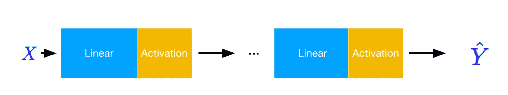

现在假设我们有 10 个类，我们有一个任务，给定 X，预测 X 属于这 10 个类中的哪一个？
这是一个经典的 MNIST 分类器例子。给定一个数字的图片，预测它是 0-9 中的哪一个数字？简单？
这是 10 个标签的问题，为了预测 10 个类别中的一个，我们将上述 Y 转换为 10 个离散值，即 10 个输出。

这很好。我们至少有 10 个输出，对应于我们期望的 10 个输出标签。
但是它仍然没有用，因为我们从输入中得到 10 个值，我们不知道如何将它映射到一个类。

我们如何转换这 10 个值来表示这 10 个类别中要预测的类别？
如果我让你困惑了，我道歉。这个问题就像
每小时从早上 6 点到下午 4 点安排 10 节课。给定你起床的时间，就会选出一门最适合你的课。如果每个小时都用 int 表示，即时间戳，那么你可以在你通常醒来的地方使用任何谨慎的值，我们取最接近的最大小时来匹配你应该参加的课程。”
这里的 max 只是给出最接近上课的小时。既然订购了，就没有问题。

假设不是时间而是 10 个定性值？
即数字。值可以是 10 位数字中的任意一位。给定 10 个值，我们需要一个概率分布，这样，给定 10 个值，哪个值可能代表一个特定的数字？
给定概率分布，我们只取概率最大的一个。
这确切地放在图片将如下

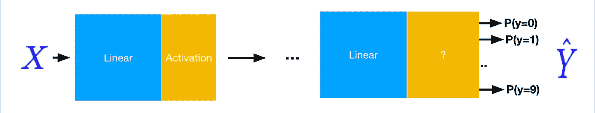

问题是什么能给我们 max？
当我们使用矩阵时，我们已经知道 X 乘以 W 得到 Y。
但是我们有 10 个这样的 Y，那么 W 的维数应该是多少？

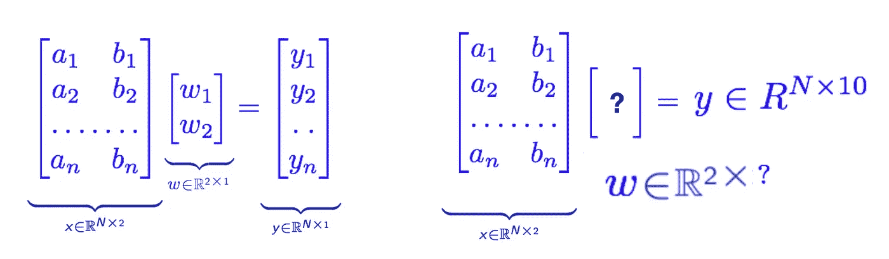

简单的解决方案是 Softmax。
什么是 Softmax？给出 10 个值是很神奇的。它根据概率分布给出最可能的类别。

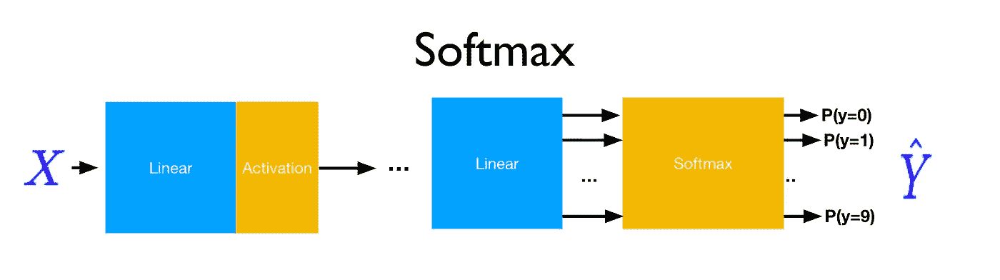

这是一个魔术盒吗？
没有！:P 正如我们刚刚读到的，它是一个给我们概率分布的盒子，然后我们取最大可能类，以便将其转换为 one-hot-encoding。选择一个概率最大的类，忘记其他类

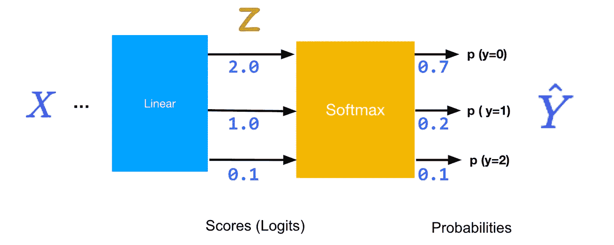

这一概念在下面得到了最好的解释

1.  一个输入 X 通过一个线性层，我们得到 10 个输出。
2.  Z(10 个输出)通过 softmax 方程，我们得到概率
3.  我们计算交叉熵损失并得到最大值。

等什么？？？交叉熵是从哪里冒出来的？这是什么？
我的错，让我们了解一下这是什么

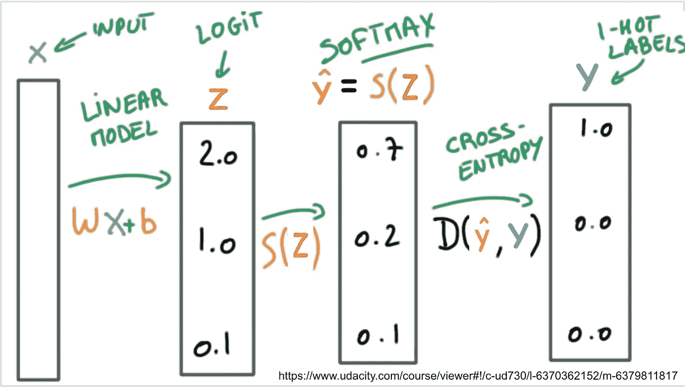

不要深入理论，让我们看看例子
假设我们有三个类 0、1 和 2。我们把它转换成一个热编码如下。

一个热点
0: 1 0 0
1: 0 1 0
2: 0 0 1

现在假设我们预测一个值，我们有一个 X，我们用我们的网络生产一个 Y。
**损失…**
输入 X 的实际期望输出是[1，0，0]
给定两个 Y
，然后在两个 y1 [0.7，0.2，0.1]和 y2 [0.1，0.3，0.6]之间进行选择，我们通过下面的公式选择更相似的一个，并挑选一个。
这是通过以下等式的片段计算的

一个很好的指导就是理解这个概念是[https://towards data science . com/demystifying-cross-entropy-e 80 e 3 ad 54 a 8](https://towardsdatascience.com/demystifying-cross-entropy-e80e3ad54a8)。

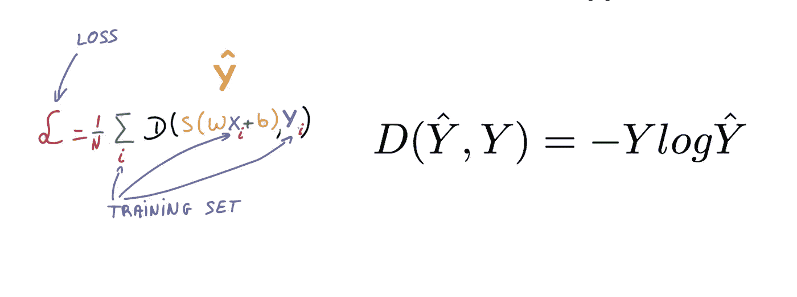

这是下面笔记本的一个片段，但我把它分开来看，损失是如何计算的。我们的目标是选择一个损失最小的

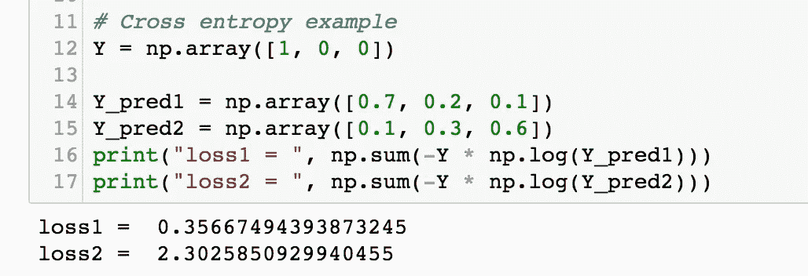

在 Torch 中，这是交叉熵损失，一个内置函数

注意，在 loss(Y_pred，Y)
中，Y 是类的数量

这在用 C 类训练分类问题时很有用。
同样，Y_pred 是实际的 logit 输出。

# Softmax 建立在交叉熵损失函数定义中。

 [## torch.nn - PyTorch 主文档

### 参数是子类，当和 s 一起使用时有一个非常特殊的属性——当它们被指定为模块…

pytorch.org](https://pytorch.org/docs/stable/nn.html#crossentropyloss) 

# 让我们建立我们的 MNIST 网络

我们有一个数字 9 的图像。该图像由具有特定值的像素组成。
数字 9 的图像有 28*28=784 像素，这是我们的输入

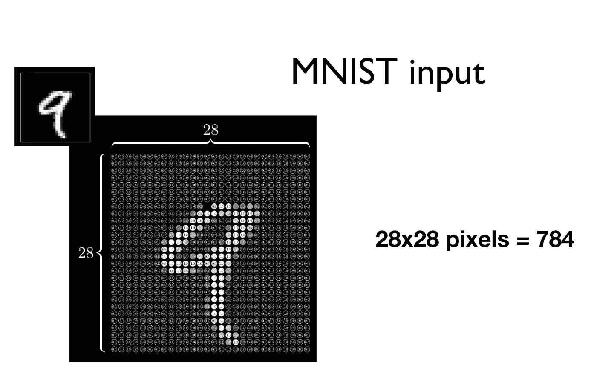

我们使用变换(Linear/soft max/cross-entropy)
将 784 大小的向量变换为 10，让我们画线，这样我们就可以得到我们在所有博客、书籍和所有资源中看到的关于神经网络的图像。对，那个图像就是用这么简单的手法画出来的……
没人说 NN 简单？是吗？但它是…

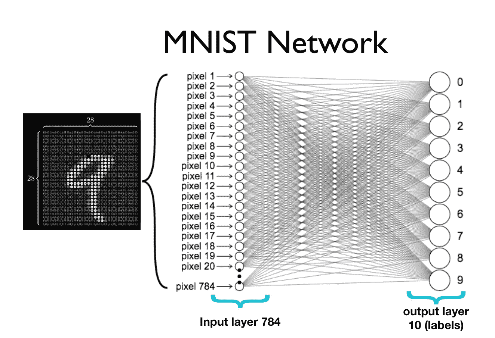

但是在最后一篇博客中，我们说

DEEP => Stack Layers
我推荐看一下[https://stats . Stack exchange . com/questions/332143/why-Stack-more-Layers-works](https://stats.stackexchange.com/questions/332143/why-does-stack-more-layers-work)

假设每一层都是一个神经元。每一个神经元都有一个功能，当受到刺激时，它会被激活以获得特定的属性。神经元是相互连接的，它们各自代表着对自己独特属性的认知。

在给出的例子中，
的想法是在中间输入层。这些多层被称为隐藏层，它是一种内部转换。

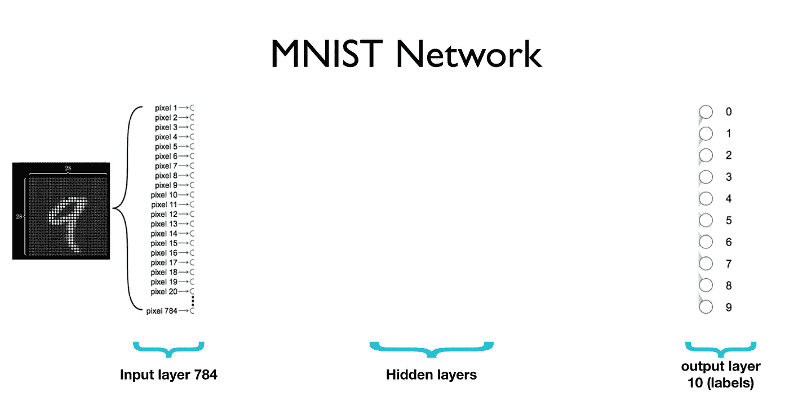

我们如何放置这些堆叠的隐藏层？
通过慢慢减少维度。如果你正在阅读这个系列，你会记得在这个系列的某个地方做过；)一个简单的方法是使用多个线性层
穿过线性层

*   将 28*28 转换为平面 784
*   接下来从 784 转换到 520
*   接下来从 520 转换到 320
*   接下来从 320 转换到 240
*   接下来从 240 转换到 120
*   接下来将 120 转换为 10

这是构造它的最简单的形式。

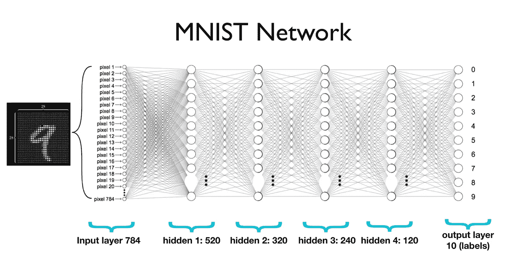

让我们跳到笔记本，学习交叉熵，建立我们刚才解释的 MNIST 网络:)

# 关于作者

我是 venali sonone，职业是数据科学家，也是管理学毕业生。

# 参考

[http://pytorch.org/](http://pytorch.org/)
[https://github.com/pytorch/examples](https://github.com/pytorch/examples)
[https://github.com/ritchieng/the-incredible-pytorch](https://github.com/ritchieng/the-incredible-pytorch)
[https://github.com/yunjey/pytorch-tutorial](https://github.com/yunjey/pytorch-tutorial)
[https://github . com/znxlwm/py torch-generative-model-collections](https://github.com/znxlwm/pytorch-generative-model-collections)
[https://github.com/hunkim/PyTorchZeroToAll](https://github.com/hunkim/PyTorchZeroToAll)

# 动机

这个系列的灵感来源于失败。如果你想谈论短暂的 5 年或 50 年，后者确实需要一些足够有挑战性的东西来保持你眼中的火花。