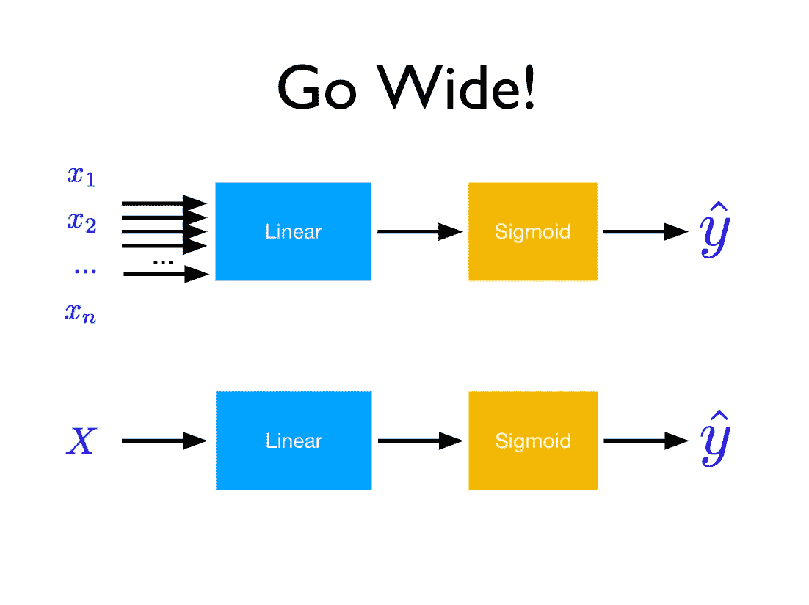
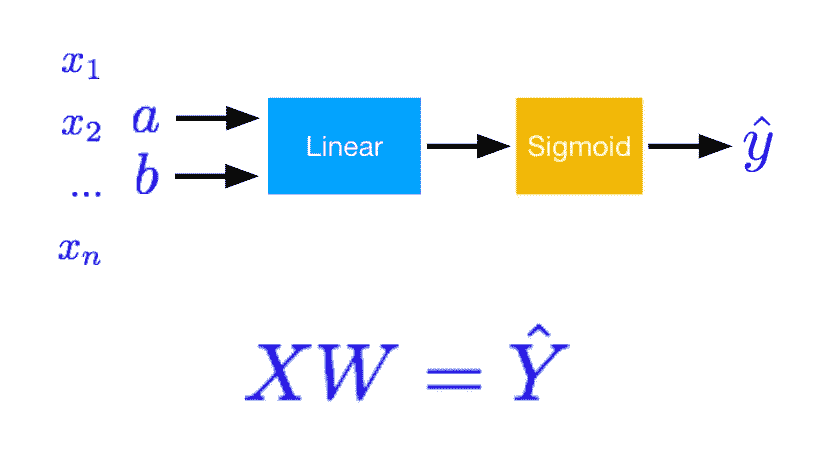
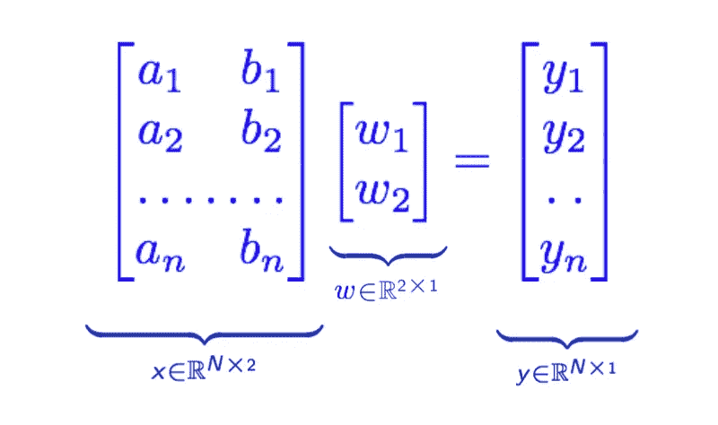
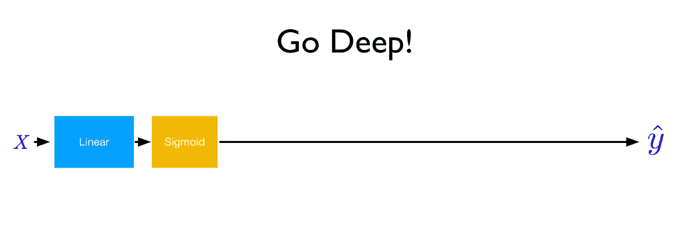
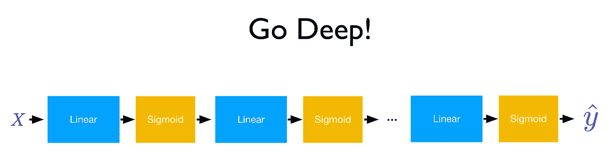
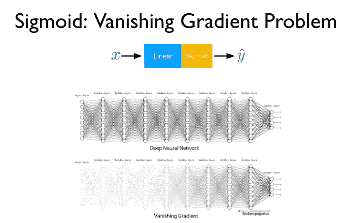
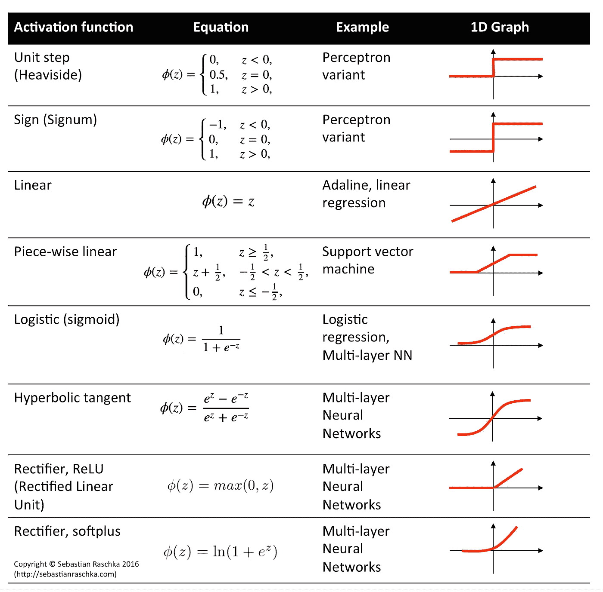

# 深度学习笔记—广度和深度

> 原文：<https://medium.datadriveninvestor.com/notes-on-deep-learning-wide-deep-46170d9040c?source=collection_archive---------4----------------------->

这是 13 集系列“深度学习笔记”的第七集。请在第[篇第](https://medium.com/datadriveninvestor/notes-on-deep-learning-getting-started-db3135be7c80)篇文章中找到所有部分的链接。

“深度”神经网络。那么这个神经网络有什么魔力呢？最近常见的是将神经网络归因于深度学习。这种深度学习从何而来？
嗯，事实上，有两种方法可以实现深度学习。
一个人走得很深。
另一个是走得很远。

深度和广度是规模和范围的一种关系，但不完全相同。那么神经网络的深度和广度。

 [## 用 7 个步骤解释深度学习——数据驱动投资者

### 在深度学习的帮助下，自动驾驶汽车、Alexa、医学成像-小工具正在我们周围变得超级智能…

www.datadriveninvestor.com](https://www.datadriveninvestor.com/2019/01/23/deep-learning-explained-in-7-steps/) 

让我们解码这些术语

*   **深** = >堆叠层数
*   **宽** = >矩阵乘法

我们将要学习的新概念是
**消失渐变问题**

再来说说去广。我们描述了广为传播

*   **宽** = >矩阵乘法考虑每个机器学习工程师在线性回归类中开始的房屋预测的经典例子。房子的空间将是你的价格的一个指标，但如果你也可以添加房子的位置，它的年龄和其他特征，我们可以给出更好的结果。

神经网络也是如此。把我们所有的经历或者信息加进去怎么样？
是的！是啊！走远点！

但是这难道不是计算扩展吗？？**不不**
拓宽和增强神经网络的能力是非常重要的，因为整个网络和方程保持不变。我们只需要用向量代替标量。

是不是很神奇？？
看下图
标量*权重=输出，即 x* w = y

现在 X 换成大写 X
Y 换成大写 Y
权重换成 guess？？仅仅是 X 中的列数，也就是 W，大写 X，Y 和 W 就是矩阵。没有任何变化，后退和前进的步骤保持不变，就像我们以前做的那样。

再来说深入。我们把深入描述为

*   StackExchange 的讨论中给出了一个我非常喜欢的非常漂亮的答案。我建议看一下[https://stats . stack exchange . com/questions/332143/why-stack-more-layers-work](https://stats.stackexchange.com/questions/332143/why-does-stack-more-layers-work)

假设每一层都是一个神经元。每一个神经元都有一个功能，当受到刺激时，它会被激活以获得特定的属性。神经元是相互连接的，它们各自代表着对自己独特属性的认知。

你必须去学校接邻居朋友的儿子亚当，但你从未见过他。如果你被告知亚当将戴着蓝色的帽子，橙色的包，黄色的水瓶，有黑色的头发，身高 3 英尺。很有可能你会一一匹配所有信息，认出亚当。现在计算机也通过步骤，所以每个神经元将学习上述给定的属性。这就是我们为什么要堆叠网络以及它为什么有效的原因。
是的！是啊！走远点！

先说
**消失渐变问题**

神经网络(即相互连接的神经元)的优势在于它可以共享和利用先前的信息。然而，正如下图中的消失梯度所示，反向传播中的值会不断乘以链规则。

为什么这是一个问题？

如果梯度值小于 1，乘以另一个值，它是一个更小的数。
然后你再乘以一个更小的数，数值会变得更小。

随着数值越来越靠前，最终，它被湮灭，参数(我们的权重 W)更新没有完成。这就是消失梯度问题

解决方案:使用不同的激活剂

[http://rasbt.github.io/mlxtend/user_guide/general_concepts/activation-functions/](http://rasbt.github.io/mlxtend/user_guide/general_concepts/activation-functions/)

让我们跳进预测糖尿病的笔记本…

# **关于作者**

我是 venali sonone，职业是数据科学家，也是管理学毕业生。

# 参考

[http://pytorch.org/](http://pytorch.org/)
[https://github.com/pytorch/examples](https://github.com/pytorch/examples)
[https://github.com/ritchieng/the-incredible-pytorch](https://github.com/ritchieng/the-incredible-pytorch)
[https://github.com/yunjey/pytorch-tutorial](https://github.com/yunjey/pytorch-tutorial)
[https://github . com/znxlwm/pytorch-generative-model-collections](https://github.com/znxlwm/pytorch-generative-model-collections)
[https://github.com/hunkim/PyTorchZeroToAll](https://github.com/hunkim/PyTorchZeroToAll)

# 动机

这个系列的灵感来源于失败。如果你想谈论短暂的 5 年或 50 年，后者确实需要一些足够有挑战性的东西来保持你眼中的火花。