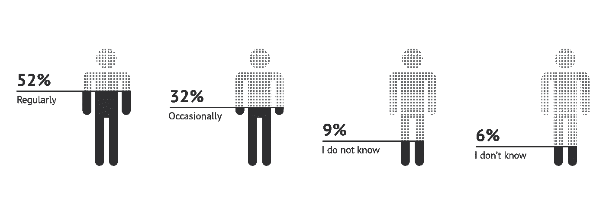

# 只有真相:有助于打击假新闻的技术

> 原文：<https://medium.datadriveninvestor.com/nothing-but-the-truth-technologies-that-help-to-fight-fake-news-3fde9ddf5fab?source=collection_archive---------8----------------------->

在 2016 年美国总统选举期间，一篇基于有缺陷的论点的文章声称唐纳德·特朗普赢得了普选。事实上，他的对手希拉里·克林顿获得了多达 290 多万张选票，但这一虚假信息获得了 400 多万份股份和参与度，成为世界上最大的假新闻。在同一场选举中，虚构的教皇方济各(Pope Francis)支持唐纳德·特朗普(Donald Trump)当选总统，也发生了类似的故事。这个故事打破了新闻，并获得了近 100 万股。

人们认为假新闻影响了最终的选举结果。然而，这并不是全球网络中唯一的误导信息，政治也不是唯一的目的。每天都有无数的假新闻出现，大部分都有危险的后果。**它们会导致恐吓或煽动种族仇恨。**例如，关于非法移民引发加州野火的新闻完全是胡说八道，但这个故事已经有超过 50 万次点击。或者当俄罗斯外交部和亲克里姆林宫的媒体对美国资助的佐治亚州药物实验室进行虚假报道时。[这则假新闻的主要目的是转移读者对索尔兹伯里中毒事件的注意力。](https://www.bbc.com/news/av/world-46157507/russian-disinformation-and-the-georgian-lab-of-death)

社交网络通常有助于传播虚假信息。根据麻省理工学院的研究，在 Twitter **上，虚假新闻被转发的几率比真实新闻**高出 70%，而**真实信息到达 1500 人的速度比**慢 6 倍。同一项研究称，这些数字并不取决于社交网络中机器人的数量。科学家们从他们的数据集中删除了机器人，最终得到了相同的结果。人们帮助传播误导性信息，即使他们意识到这是假的。[据 Statista](https://www.statista.com/statistics/649234/fake-news-exposure-usa/) 统计，52%的美国人认为网络媒体定期发布假新闻。

**媒体多久发布一次假新闻？(美国，2018)**

那么，有什么办法可以解决或者至少减少假新闻的数量呢？最近，谷歌和最大的社交网络如脸书和推特[签署了一份行为准则](https://www.cnet.com/news/google-and-social-networks-sign-code-of-conduct-to-tackle-fake-news/)关于他们将如何抵制虚假故事的传播。他们的主要目标是**战胜虚假账户和机器人，简化对权威内容的访问**。但即使他们成功了，如何处理假新闻来源呢？政治家或寡头控制的媒体呢？这就是现代技术可以帮助我们获得经过验证和可信的信息的时候。

# 区块链

所有媒体都是靠内容货币化生存的。这种货币化的传统机制使得作者更注重产生观点，而不是传递有见地的信息。基本上，为了**激励作者传播可靠的信息，我们需要改变内容货币化的过程**。使用区块链和加密令牌，媒体平台可以建立自我维持的经济。举个例子，ASKfm 平台正致力于区块链项目 [ASQ 协议](https://asqpro.io/)。这个项目将允许创建和存储内容。但更重要的是，它可以通过内部数据加密来访问出版物。区块链将保证货币化的透明度。

基于区块链的媒体平台可以**用代币推广优质内容**。例如，要加入 [Sapien Network](https://www.sapien.network/) ，用户必须拥有 loсal 令牌。该系统保护内部媒体环境免受第三方干预，没有令牌，用户不能对出版物进行评论、发帖或投票。该平台防止虚假账户和网络钓鱼活动，并让用户在发布或分享某些信息前三思。

版权保护呢？一些不可靠的媒体可以修改以前发表的文章，以创造一个不同的叙事。这就是为什么我们需要能够跟踪信息来源和认证出版物的平台。我们已经有了第一个这种类型的区块链项目。研究合作平台 [Matryx](https://nanome.ai/matryx/) 能够识别从事某个项目的研究人员以及他们对这项工作的贡献。[存在证明](https://proofofexistence.com/)服务允许使用比特币认证文件。所有关于作者身份的记录都存储在区块链系统中。

# 人工智能

基本上，人工智能是一种分析大量数据的算法。那么，为什么 AI 不能验证媒体资源并在假新闻在社交网络中传播之前检测到它们？最近，麻省理工学院的 CSAIL(计算机科学和人工智能实验室)和 QRCI(卡塔尔计算研究所)[宣布了一个新的**项目**](https://www.forbes.com/sites/charlestowersclark/2018/10/04/can-ai-put-an-end-to-fake-news-dont-be-so-sure/#1d5335452f84) **，该项目将识别假新闻来源**。在来自媒体偏见/事实核查(MBFC)的数据的帮助下，该系统被训练成检测强烈的政治偏见或错误信息。该技术可以分析可疑的网站材料、Twitter 账户、URL 结构和网络流量。因此，该系统在识别政治偏见方面的准确率为 70%,在检测网站谬误方面的准确率为 65%。

但是假新闻世界里还有 AI 的另一面。不到两年前，这段合成巴拉克·奥巴马的视频在互联网上爆红。可以在人脸上制造全新模拟物的技术并不新鲜，但这一次的结果非常逼真。

生成对抗网络，或 GAN，是一种机器学习技术。由 Ian Goodfellow 于 2014 年创建，**它能够基于现有数据集生成虚假的视频、图像、音频或文本**。在这四年中，技术被全世界的科学家改进，变得更加现实。今天，使用 GAN，开发者不仅可以复制和改变人脸或声音，还可以复制人类的所有动作。一些科学家，比如马里兰大学的法学教授[丹妮尔·香橼](https://papers.ssrn.com/sol3/papers.cfm?abstract_id=3213954)，已经将这项技术 ***“对隐私和国家安全的威胁】*** 。那么，如何检测 AI 制作的视频呢？

为了找到视频造假检测的最佳方式，科学家们正在研究现有的人工智能技术。最近，来自奥尔巴尼(SUNY)大学的研究人员提供了通过合成实验对象缺乏眨眼来识别深度假货的方法。尽管如此，加州大学计算机科学教授哈尼·法里德说，科学家们可能提出的一切都可以被人工智能程序代码中的轻微变化击败。例如，我们试图通过与心跳相对应的面部颜色变化来识别虚假视频。程序员只是更新了他的算法，把这首歌加入到一首假歌中。这就是包括法里德在内的大部分研究人员对他们的假识别项目的所有细节保密的原因。

# 人为因素

尽管如此，人们过去和将来都是假新闻比真实信息传播更快的主要因素。 ***“在真相大白之前，谎言可以走遍半个世界”***——甚至这个著名的短语也与误导信息有关，因为没有人确切知道是谁先说的。我们在分享假故事，因为它们通常看起来比真相更新奇有趣。那么，**如何保护自己和周围的人免受谎言的伤害**？在重新发布任何信息之前，请检查以下内容:

1.  其他媒体都在谈论这个新闻吗？如果你在一些未知的媒体上找到信息，检查它是有用的。但即使是主流资源也要仔细检查；
2.  想想这个:严肃的媒体会使用 clickbait 吗，或者它只是一种鼓励你在阅读前分享文章的方式？
3.  信息来源是什么？这个故事有没有对专家的借鉴？这个人真的存在吗？
4.  刊物错误太多？在声誉好的媒体中，错误是不常见的。
5.  奇怪的域名？检查是否有关于它的任何额外信息。

> ***一些全球媒体资源有单独的部门用于揭露假新闻。*** *在这个* [*BBC 页面*](https://www.bbc.com/news/topics/cjxv13v27dyt/fake-news) *上，你可以找到全世界最危险、最误导人的新闻信息。*
> 
> ***能识别假新闻吗？试试*** [***这个游戏***](https://www.gocompare.com/broadband/fake-news/#/game) ***来检查。***
> 
> ***更多关于识破假新闻的故事*** *来自* [*哈佛暑期学校*](https://www.summer.harvard.edu/inside-summer/4-tips-spotting-fake-news-story) *。*