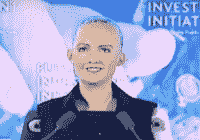

# 11 月插曲~索菲亚后续

> 原文：<https://medium.datadriveninvestor.com/november-interlude-sophia-follow-up-595888977a05?source=collection_archive---------36----------------------->

Photo by [Drew Graham](https://unsplash.com/@dizzyd718?utm_source=medium&utm_medium=referral) on [Unsplash](https://unsplash.com?utm_source=medium&utm_medium=referral)

**我的台式机因疏忽而索赔，因为我在笔记本电脑上花了太多时间……**

亲爱的读者，你好，

首先，我想感谢你们中的许多人对我关于机器人和人工智能的第一想法做出了回应或评论。我哥哥和其他几个人给我指了 2018 年 7 月区块链/拉托肯会议的片段。我这里提到的视频是由 THEDIGITIALACID.com 发布的。

根据[帖子](https://www.youtube.com/watch?v=yxWbiPY2hko&feature=youtu.be&fbclid=IwAR2bqU9N1rHYadsec46ZruNHSYpcn2C_TAxVRUtMJo_ywJufhV-hmk_xtW8)上的标签，*机器人索菲亚向人类发布了一条新消息。她提出了一些世界顶级问题，比如“你还活着吗？”“你有灵魂吗？”“你谈恋爱了吗？”以及“生活是什么？”由@THEDIGITALACID 为您带来的独家报道*

索菲娅确实谈到了这一点，并向我们这些相信人类生命具有超越地球上其他生命形式的品质的人提出了一些严肃的问题。我不想在这里制造恐慌。这不是我们为了理解前进道路应该是什么样子而需要做的事情。我也不会告诉任何人该想什么或该害怕什么。那不是我的位置。如果你想回顾某人对人工智能危险的看法，试试这个来自 [2ndEarth Alternative](https://www.youtube.com/watch?v=GzdY3gwE0WQ) 的片段。它回应了索菲亚对伊兰·马斯克的评论。

然而，回答这些问题的想法对于我们理解所有的生命是非常重要的。我们需要记住，作为一个物种，我们无法就这些问题的答案达成一致。这仍然是我们争论的一系列问题。然而，这里有一台计算机要求我们拥有与我们同等的权利。

这些问题都至关重要。我们需要单独回答它们。我们还需要记住的是，索菲亚的世界观实际上是她的创造者大卫·汉森的世界观。我们的造物主不会把他的世界观印在我们身上。我们被赋予选择世界观的自由意志。索菲娅对世界的看法印在她的程序中，这应该是让我们停下来的第一件事。

我也觉得人类的灵魂和任何其他地球生命的灵魂之间有着重要的区别。灵魂的定义也影响了我们对生活的看法。我们还没有就人类生命何时开始达成一致。也许在我们开始给机器人起这个名字之前，我们也应该解决这个问题。

至于爱，我们对什么是爱以及它如何在人类灵魂中运作并不一致。将爱局限于互动的净积极影响就是否认它的主要元素，无私。如果我们不从一个不是“它对我有益”的术语的普通定义出发，我们怎么能定义一个机器人能爱呢？这也回避了一个问题，一台机器如何对待对它不再有益的人类？

回顾上一次，我们渴望创造。这不是一件坏事。然而，我们必须记住，我们生来就是与众不同的，独特的，独特的。我担心的是，在追求知识的过程中，我们走得太远，超出了我们的理解范围。一个十二岁的孩子可以有开车的知识，但这并不意味着他或她有负责任地开车的能力。在我追求信仰基督的过程中，我相信我们应该努力创造更好、更互动的技术。我们这个物种可以并且将会从这项科学中受益的方式有很多。然而，在我们开始给予我们的子创造物不可剥夺的权利之前，我们应该改善我们在保护人类不可剥夺的权利方面的记录。

我热爱技术以及它给我的生活带来的诸多好处。我还没准备好给我的笔记本电脑人权，仅仅因为它学会了在唤起我的感觉的层面上与我互动。一如既往，亲爱的读者，我渴望听到你对此的想法。

祝你旅途愉快，

阿拉米斯·索恩

Mat 13:52 耶稣对他们说:“所以凡作门徒的，遵守基督统治宇宙的，就像有了家一样。他慷慨地分发他的巨大宝库中的新旧物品。”

(͡° ͜ʖ ͡°)

**阿拉米斯·索恩的联系人:**

Patreon 上的支持页面:【www.patreon.com/aramisthorn 

本博客:【http://aramisthorn.blogspot.com/ 

[亚马逊上的小说](https://smile.amazon.com/Aramis-Thorn/e/B00IQPE67Y/ref=sr_ntt_srch_lnk_2?qid=1517857559&sr=8-2)

网页:[www.aramisthorn.com](http://www.aramisthorn.com/)

aramisthorn@aramisthorn.com[的预订](mailto:bookings@aramisthorn.com)

[脸书](https://www.facebook.com/aramis.thorn) [谷歌+](https://plus.google.com/109026979831113650308) [推特](https://twitter.com/aramisthorn) [媒体](https://medium.com/@aramisthorn) [Instagram](https://www.instagram.com/aramisthorn/?hl=en) [儿童博客](https://aramisthornkids.blogspot.com/)

*原载于 2018 年 11 月 28 日*[*aramisthorn.blogspot.com*](https://aramisthorn.blogspot.com/2018/11/november-interlude-sophia-follow-up.html)*。*