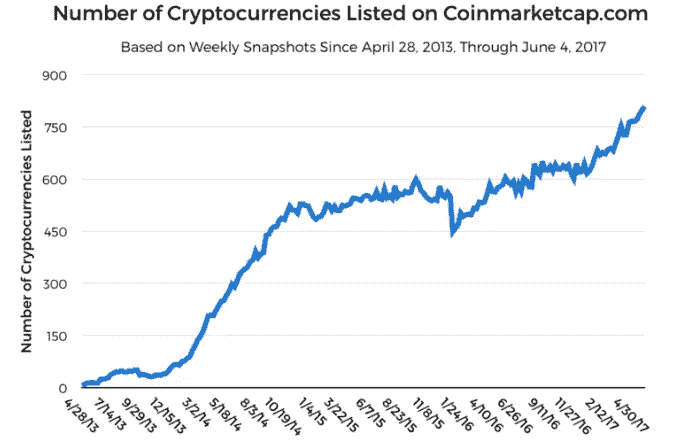
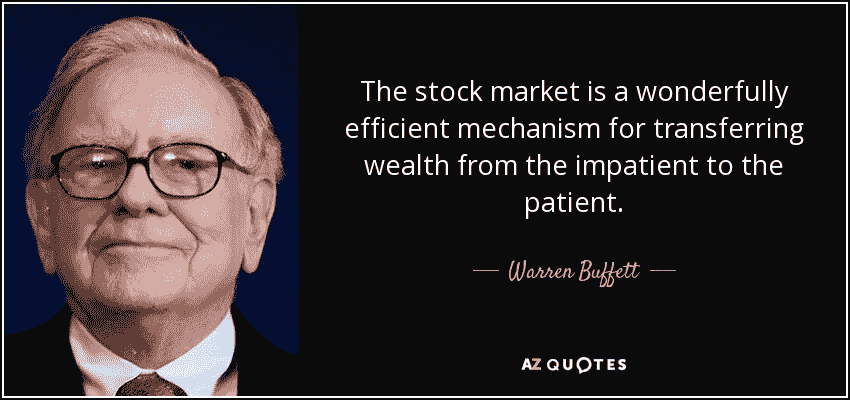

# 现在是投资比特币的最佳时机。

> 原文：<https://medium.datadriveninvestor.com/now-is-the-best-time-to-invest-in-bitcoin-4e66e844afa7?source=collection_archive---------30----------------------->

上周对每个人来说都是一场灾难，加密货币遭受了巨大的打击，股票市场奄奄一息，油价下跌。

"股票市场是一种把钱从没有耐心的人身上转移到有耐心的人身上的工具."—沃伦·巴菲特

这再准确不过了，尽管这篇文章不是关于股票市场的，但它仍然适用于加密货币及其市场。

随着比特币开始其长达一年的持续主流媒体采用和报道，每个人都记得 2017 年 1 月比特币的年初，当时它多年来首次徘徊在 1000 美元左右。只有看到它迅速上升到 1300 美元时，预期的文克莱沃斯双胞胎 EFT 提案在空中-在这方面，它失败了，价格急剧下降到 950 美元左右-为什么我们告诉你这个？

因为这是比特币有史以来的最低点。

它很快超过了 1000 美元的水平，并且没有放缓的迹象，因为它在 5 月中旬越过了 2000 美元大关，并且再也没有回头看。然后，我们看到 2017 年 8 月比特币价格突破了 3000 美元的基准，此后一直没有下降。

说了这么多，你现在为什么要投资比特币？

“现在，当所有人都在说……完了，就是这样，比特币死了，第 175 次了。BKCM 数字资产基金的投资组合经理凯利在周二的“快钱”节目中告诉美国消费者新闻与商业频道。

有两种人投资加密货币，一种是为了技术，另一种是为了钱。

无论市场发生什么，从事这项技术的人显然不会出售他们的比特币或其他加密货币。因为他们已经做了研究，尽管加密货币的价值可能非常不稳定，但这是未来，他们的口袋现在可能会受到一点影响，但几年后当人们最终看到区块链技术和加密货币的好处时，它将会蓬勃发展。

至于那些为了钱而投资的人，尤其是短期投资者，在价格开始进一步上涨之前，今天就投资吧。是的，加密货币的价格可能非常不稳定，很难理解。然而，不需要天才或股票经纪人就知道，在这次巨大的打击之后，比特币的价格会再次上涨。

不耐烦或害怕的人会卖掉他们的加密货币。这是导致市场崩溃的首要原因，在他们用完加密货币进行交易后，市场将稳定下来，价格将停止下跌。人们将意识到它只能从那里上涨，比特币的新价值是这个商业周期的最低价值，这将使市场上的人们购买更多的比特币，这也将吸引更多的投资者，这将使加密货币的价格再次上涨。伙计们，这就是为什么现在不是投资加密货币的最佳时机的简单明了的解释。

***参考文献:***

Ell，K. (2018 年 1 月 24 日)。数字货币对冲基金经理说，现在是投资比特币的最佳时机。检索自[https://www . CNBC . com/2018/01/23/now-is-the-best-time to-invest-bit coin-says-hedge-fund-manager-Brian-Kelly . html](https://www.cnbc.com/2018/01/23/now-is-the-best-time-to-invest-in-bitcoin-says-hedge-fund-manager-brian-kelly.html)

我应该投资比特币吗？什么时候是购买加密货币的最佳时机？(2018 年 4 月 20 日)。检索自[https://bitcoinexchangeguide . com/should-I-invest-in-bit coin-best-time-to-buy-cryptocurrences/](https://bitcoinexchangeguide.com/should-i-invest-in-bitcoin-best-time-to-buy-cryptocurrencies/)

*如果您想了解更多，请访问 BIDITEX 页面并提出您的问题，关注我们的*[*Twitter*](https://twitter.com/biditex_com)*，* [*脸书*](https://www.facebook.com/biditex/) *，* [*中型*](https://medium.com/@biditex) *，* [*电报*](https://t.me/biditex%20%28edited%29) *，* [*LinkedIn* 投标变更用](https://www.linkedin.com/company/biditex)**。**