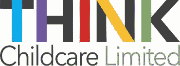
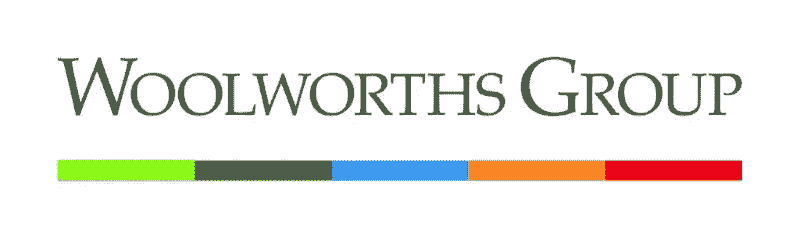

# 鸡块#12

> 原文：<https://medium.datadriveninvestor.com/nuggets-12-2cce00da1095?source=collection_archive---------42----------------------->

# 消费你今天的金块:教育和零售。

两个精心挑选的信息，用你我都能理解的术语解释。从技术角度切入，从澳大利亚人的角度了解你周围的世界。

**ASX: TNK**

# **教育**。

**在经历了一段时间的儿童保育中心供过于求之后，我认为儿童保育预示着更好的财务健康状况。**

1.Think Childcare 是 ASX 上市的第二大儿童保育运营商，在全澳拥有和运营 52 个中心，仅次于 G8 教育(ASX: GEM)。

2.由于机会主义开发商在 2018 年开设了 305 家新中心，儿童保育行业出现了严重的供过于求。

3.这导致中心的入住率下降，利润减少，随后 TNK 的股价从 2018 年 1 月的 2.29 美元降至 2018 年 11 月的 1.10 美元。

4.然而，随着 Think 报告未利用的入住率(可用和占用的位置数量的差异)从每年 665 天减少到 55 天，趋势发生了转变。

# **转机是否短暂**？

**认为儿童保育可以利用其规模来增加行业市场份额。**

1.我认为儿童保育可以利用分散的开发商离开供应过剩的市场，通过以更低的价格收购中心来增加自己的市场份额。

2.这是因为 Think 的规模足以为收购获得资金，同时银行收紧了对规模较小、经验不足的开发商的贷款。

3.Think 还开始创建多个品牌，推出 Nido 托儿服务，以迎合高端市场，从而证明价格较高是合理的。

**ASX: WOW**

# **零售**。

**Woolworths 以 17 亿澳元的价格将其石油业务出售给英国 EG 集团**

1.经过两年的漫长过程，Woolworths 已达成协议，将于 2019 年初出售其 540 个加油站。

2.2018 年 6 月，该公司试图以 18 亿澳元的价格将同样的加油站出售给英国石油，但遭到 ACCC 的拒绝，理由是削弱了行业竞争。

3.相反，EG 集团已经同意购买加油站，作为进入澳大利亚市场的一种简单方式。

4.在销售中有一项战略协议，允许 Woolworths 的客户继续在 EG 的加油站获得折扣和奖励。

# **伍尔沃斯为什么这么急着离开**？

Woolworths 正在执行一项转型计划，退出非核心业务，转而专注于食品杂货。

1.Woolworths 在 2016 年 12 月出售了其家庭木材和硬件业务，从而摆脱了所有非食品业务。

2.同样，相对于 Woolworths 的杂货业务(3%比 2017 年的 6%)，汽油业务的 EBIT 利润率(EBIT 占收入的百分比)较低。

3.此次出售将为 Woolworths 提供投资其核心业务的资金，同时战略联盟确保 Woolworths 继续向加油站提供杂货。

# 今天，你的意见很重要。

你更喜欢哪个鸡块？(下面评论)

1.  团队教育
2.  团队零售

# 一位业余作家的提问:

如果你想更多地看到我的声音，请订阅我下面的时事通讯。

[https://www . nuggets . space](http://www.nuggets.space/)

