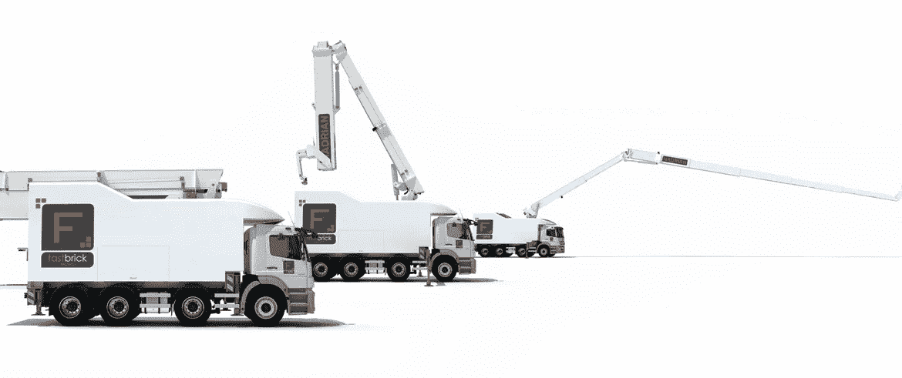

# 掘金 13 号

> 原文：<https://medium.datadriveninvestor.com/nuggets-13-773f92b2a208?source=collection_archive---------45----------------------->

# 消费你今天的金块:科技和建筑。

两个精心挑选的信息，用你我都能理解的术语解释。从技术角度切入，从澳大利亚人的角度了解你周围的世界。

**ASX: FBR**

# 技术。

Fastbrick Robotics 证实了其世界首创的在两天内实现全自动建造三居室房屋的能力。

1.该公司的 Hadrian X 卡车装载着预先切割好的砖块，行驶到建筑工地，在那里激光制导机械臂将砖块放置到位。

2.该公司声称，他们可以达到每小时砌 1000 块砖的峰值，而人工每天平均只能砌 500 块砖。

3.虽然 Fastbrick Robotics 砌砖过程的成本未知，但类似的半自动泥瓦匠(SAM)实现了每块砖 4.5 美分的成本。

4.在澳大利亚等劳动力成本较高的地区，每块砖的平均成本为 1.5 澳元，比半自动机器高出 24 倍。

# 砖家的末日到了吗？

**从中期来看，机器应该会补充体力劳动，而不是取代体力劳动。**

1.现有的机器人已经是半自动化的，仅在更劳动密集型的过程中辅助砌砖工。

2.Fastbrick Robotics 刚刚开始商业化，将解决澳大利亚和全球范围内的砌砖工短缺问题。

3.英国的贸易状况调查显示，68%的建筑中小型企业(SME)很难聘请到砌砖工，而新西兰的建筑工程可能会因砌砖工等候名单而推迟 4 个月。

4.这应该会加速 Fastbrick Robotics 向全球市场的扩张，因为针对砌砖自动化的监管应该会保持在较低水平。

**ASX: LLC**

# 建筑。

**在表现不佳之后，Lendlease 对其工程业务进行了战略评估。**

1.Lendlease 在开发、建设和投资三个领域开展业务。工程是建筑分部的基础设施子分部。

2.由于 3 个基础设施建设项目表现不佳，Lendlease 已进行了 3.5 亿澳元的拨备减记(拨备用于未来预期成本)。

3.一个确定的项目是 NorthConnex 收费公路，尽管 Lendlease 是许多大型基础设施项目的主要建筑承包商。

4.由于投标时的竞争，这些基础设施项目通常对承包商来说利润率较低，从而导致低误差率。

# 接下来会发生什么？

**Lendlease 可能会出售其负责基础设施建设的工程部门，或者大幅改变其风险偏好。**

1.Lendlease 的建筑业务仅实现了 2250 万澳元，而该集团 2018 财年的利润为 7.93 亿澳元。

2.与此同时，开发和投资部门表现强劲，占 2018 财年 EBITDA 的 94%。

3.相比之下，澳大利亚建筑业务的息税折旧及摊销前利润(EBITDA)亏损 2300 万澳元，这引发了出售表现不佳业务的理由。

4.此外，Lendlease 在投标未来的基础设施项目时，可能会提高自己的利润率，为其他承包商效仿铺平道路。

# 今天，你的意见很重要。

你更喜欢哪个鸡块？(下面评论)

1.  团队技术
2.  团队建设

# 一位业余作家的提问:

如果你想更多地看到我的声音，请订阅我下面的时事通讯。

[https://www . nuggets . space](http://www.nuggets.space/)