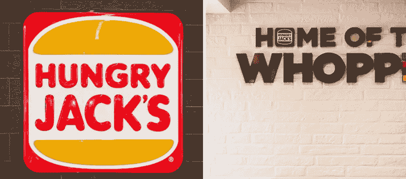

# 鸡块#14

> 原文：<https://medium.datadriveninvestor.com/nuggets-14-d11fc241049e?source=collection_archive---------39----------------------->

# 消费你今天的金块:零售和科技。

两个精心挑选的信息，用你我都能理解的术语解释。从技术角度切入，从澳大利亚人的角度了解你周围的世界。

**ASX: Unlisted**

# 零售。

由于健康饮食受到打击，Hungry Jacks 的连锁所有者 Competitive Foods 的利润下降了 75%。

1.Competitive Foods 是澳大利亚第二大食品集团，经营着 430 家 Hungry Jacks 餐厅，占澳大利亚快餐收入的 7.3%。

2.尽管收入 14 亿澳元，但竞争对手食品公司 2018 年的利润只有区区 750 万澳元，而 2017 年为 3050 万澳元。

3.具有讽刺意味的是，由于失去超市合同，健康食品子公司 PMF 减少了 1000 万澳元的利润(占总利润减少额的 43.5%)。

4.PMF 是超市和熟食店的沙拉和新鲜蔬菜的批发供应商。

# **一次性事件还是全行业问题**？

**虽然健康饮食现在很流行，但以快餐形式销售这些产品的公司日子并不好过。**

1.澳洲主要的健康快餐公司是相扑沙拉(不在 ASX 上市)和 Oliver's Real Food (ASX: OLI)。

2.例如，由于客户活动低于预期，Oliver's Real Food 的 2018 年 EBITDA 比最初的指导低 43%(270 万澳元对 470 万澳元)。

3.与此同时，相扑沙拉在 7 月接受了自愿管理，以避免购物中心收取的美食广场租金，因为它无法与种类繁多的快餐竞争。

**ASX: WEB**

# **技术**。

**Webjet 继续其 B2B 旅游市场整合，以 2 . 4 亿澳元收购了全球目的地。**

1.WebJet 是一个在线旅游预订网站，通过 WebJet 的 WebBeds 业务(WebJet 的一部分)直接(B2C)和通过旅行社(B2B)为客户服务。

2.目的地世界目前与美洲、EMEA 和 APAC 的酒店有 5，600 个合同关系(从销售中收取佣金或加价的协议)。

3.合并后的实体将确保 WebBeds 作为全球 B2B 市场第二大玩家的地位，拥有 26，000 家签约酒店。

4.此前，WebJet 在 2017 年以 3.64 亿澳元收购了 JacTravel，WebJet 因此增加了 1 万家签约酒店..

# **这钱花得值吗**？

**B2B 可以提供更稳定的收入流，通过增加其在分散市场的份额获得网络收益。**

1.商务旅行通常占 B2B 市场的很大一部分，比休闲旅行波动性小。

2.不断增长的 WebBeds 使其收入多样化，从而减少了由于经济原因导致的消费者支出变化对 B2C 部门的影响。

3.尽管按交易额计算，WebBeds 是该市场的第二大公司，但它在 560 亿澳元的全球市场中所占份额不到 3%。

4.巩固这一市场将通过增加 B2B 客户通过网络预订的吸引力和与酒店谈判更好合同的能力，使网络受益。

# 今天，你的意见很重要。

你更喜欢哪个鸡块？(下面评论)

1.  团队零售
2.  团队技术

# 一位业余作家的提问:

如果你想更多地看到我的声音，请订阅我下面的时事通讯。

[https://www . nuggets . space](http://www.nuggets.space/)