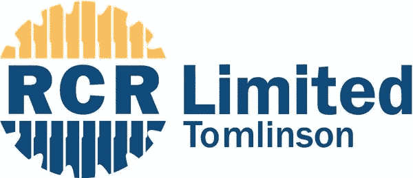

# 15 号鸡块

> 原文：<https://medium.datadriveninvestor.com/nuggets-15-cb19b49842bd?source=collection_archive---------28----------------------->

# 消费你今天的金块:建筑和医疗保健。

两个精心挑选的信息，用你我都能理解的术语解释。从技术角度切入，从澳大利亚人的角度了解你周围的世界。

**ASX: Suspended**

# 建筑。

基础设施和建筑公司 RCR·汤姆林森因未能筹集到足够的资金来完成现有的太阳能农场项目而倒闭。

1.RCR·汤姆林森是一家澳大利亚工程集团，为基础设施项目提供建筑服务。它在 2018 年实现了 20 亿澳元的收入，拥有 3400 名员工。

2.该公司被置于管理之下，并将被出售，因为银行拒绝为其提供进一步的资金，以完成其正在进行的太阳能项目。

3.尽管该公司在 2018 年 8 月从投资者那里筹集了 1 亿澳元的股本。

4.倒塌的原因归咎于 RCR 对太阳能项目的低价竞标，以及缺乏交付这些项目的经验。

# **这对行业有什么影响**？

**RCR 的垮台为其他工程集团收拾残局铺平了道路，但合同招标过程需要重新思考。**

1.RCR 目前有 13 个价值 10 亿澳元(20%的市场)的太阳能发电场项目合同被搁置，因为 RCR 已经暂停了所有的建设工作。

2.这给了当地工程集团唐纳艾迪(ASX:陶氏)和沃利帕森(ASX: WOR)以更优惠的条件购买这些合同的机会。

3.它还缓解了未来太阳能项目激烈的价格竞争，这种竞争是由 RCR 激进的降价策略造成的。

4.然而，流行的固定价格合同(投标人对完成的工程获得固定的付款，而不考虑发生的费用)有其缺点。

5.正如 RCR 和 Lendlease 陷入困境的工程部门所显示的那样(参见金块#13)，大型基础设施项目经常出现成本超支，降低了利润率。

**ASX: To be decided**

# 医疗保健。

医疗技术所有者 PKS 控股公司计划于 2019 年 1 月在 ASX 进行 2200 万澳元的首次公开募股。

1.PKS 拥有专有软件“RippleDown”的所有权，该软件支持临床医生的决策过程。

2.理论上，临床医生从病人身上提取样本，然后送到实验室进行检测。然后，临床医生使用测试结果来帮助诊断和治疗患者。

3.然而，这一过程依赖于实验室的精确检测和手动将结果反馈给临床医生进行解释。实验室技术人员之间的结果可能会有差异。

4.RippleDown 向临床医生提供结果的实时通信，并利用现有数据库自动提供由专业临床医生做出的常见解释。

# **听起来很棒，但这是个好生意吗**？

在有利的行业条件下，RippleDown 通过产生现金流的可扩展解决方案明确解决了一个问题。

1.在过去的 20 年里，PKS 与支持 RippleDown 产品渗透的主要医疗保健组织(如 Healthscope、SA pathology)建立了合作关系。

2.该产品采用基于订阅的商业模式，增加了其现金流的可预测性，在 2018 财年带来了 390 万澳元的收入。

3.随着越来越多的临床医生使用该产品，该产品的价值也随之增加，因为它提高了为更多诊断自动生成的解释的质量。

4.随着澳大利亚通过 MyHealthRecords 迈向完全数字化的医疗记录，这为 RippleDown 利用大规模数据的能力提供了支持。

# 今天，你的意见很重要。

你更喜欢哪个鸡块？(下面评论)

1.  团队建设
2.  团队医疗保健

# 一位业余作家的提问:

如果你想更多地看到我的声音，请订阅我下面的时事通讯。

[https://www . nuggets . space](http://www.nuggets.space/)