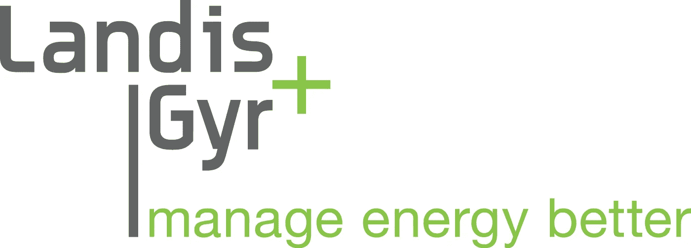

# 掘金 17 号

> 原文：<https://medium.datadriveninvestor.com/nuggets-17-4e4364a05c26?source=collection_archive---------38----------------------->

# 消费你今天的金块:基础设施和娱乐。

**SWX: LAND**

# **基础设施**。

**瑞士智能电表公司 Landis+Gyr 与当地私募股权公司(PEP)合作，继续在澳大拉西亚地区整合智能电表。**

1.这家名为 IntelliHUB 的合资企业将以 2.56 亿澳元收购 Mercury Energy 的 Metrix，后者在新西兰管理着 46 万块智能电表。

2.此次收购使 IntelliHUB 管理的智能电表总数达到约 200 万块。

3.此前，它在 2018 年 5 月进行了一次类似的收购，以 2.67 亿澳元收购了 Origin Energy 的 Acumen，该公司管理着 17 万个智能电表。

4.智能电表是对传统家用电表的升级，因为它可以每 30 分钟发送一次公用事业使用信息(例如电、水)，从而无需进行物理检查。维多利亚州强制推行智能电表。

# **整合智能电表有什么好处？**

**管理智能电表的相关成本属于规模经济，但真正的钱在收集的数据中。**

1.鉴于没有一家能源零售商为所有家庭提供服务，这些零售商很难在整个澳大利亚和新西兰推广智能电表。

2.IntelliHUB 不断扩大的规模将使其能够更有效地操作这些智能仪表，因此零售商更容易向 IntelliHUB 付费来管理这些仪表。

3.然而，随着 IntelliHUB 管理的智能电表数量的增长，它可以获得全国范围内能源使用情况的全面实时信息。

4.这种信息的质量成为一种非常有价值的资产，可以卖给公用事业组织。

**ASX: NEC**

# **娱乐**。

**随着 Stan 与迪士尼签署内容协议，在线流媒体平台竞争更加激烈。**

1.Stan 是澳大利亚主要的流媒体服务公司，由 Nine 和 Fairfax media 合资成立(多家公司合伙经营)。

2.这笔交易将在 2019 年底之前为 Stan 的用户带来迪士尼动画内容(如狮子王，玩具总动员)和漫威电影。

3.这是紧随 Ten Network 推出自己的点播在线流媒体服务之后出现的，由于缺乏优质内容，该服务的价值主张变得越来越低。

4.与此同时，历史上一直是迪士尼内容许可方的网飞的协议已于 2018 年早些时候到期。

# **斯坦是如何争取到这笔交易的**？

随着迪士尼准备在美国推出自己的流媒体服务 Disney+,与 Stan 的交易可能是对澳大利亚扩张的市场研究。

1.由于迪士尼自有节目的数量和受欢迎程度，迪士尼+预计将于 2019 年底在美国推出，成为网飞的直接和重要竞争对手。

2.考虑到与 Stan 的协议期限很短(大约 1 年)，迪士尼可能仍在考虑在澳大利亚推出自己服务的可行性。

3.Stan 可能会在其平台上提供迪士尼节目的观众信息，以换取许可权。

4.这些信息将为迪士尼在澳大利亚成功推出平台提供更大的信心(澳大利亚人口相对较少，流媒体服务数量不断增加)。

# 今天，你的意见很重要。

你更喜欢哪个鸡块？(下面评论)

1.  团队基础设施
2.  团队媒体

# 一位业余作家的提问:

如果你想更多地看到我的声音，请订阅我下面的时事通讯。

[https://www . nuggets . space](http://www.nuggets.space/)