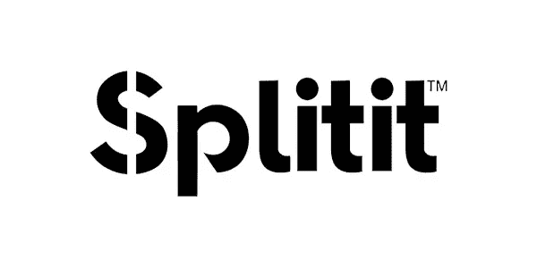

# 掘金 18 号

> 原文：<https://medium.datadriveninvestor.com/nuggets-18-535461c87e18?source=collection_archive---------17----------------------->

# 消费你今天的金块:科技和时尚。

**ASX: SPT**

# **技术**。

**继 Afterpay 成功上市后，总部位于纽约的 Splitit 在 ASX 上市。**

1.Splitit 是一家“先买后付”类型的公司，已经在 ASX 筹集了 1200 万澳元，自 1 月 29 日上市以来，其股价翻了一番(从 0.38 美元到 0.76 美元)。

2.它与 Afterpay 的不同之处在于，它允许买家从个人信用卡的 1-36 个无息月还款中进行选择。

3.因此，它将进行信用检查的责任转移到信用卡发行商身上。

4.Splitit 主要在美国和英国的商家上运营，有 118，000 名不同的购物者购买平均订单规模为 1，050 澳元的商品。

# **会分享 Afterpay 的成功吗**？

Splitit 的商业模式从根本上来说比 Afterpay 风险更大。

1.鉴于 Splitit 不为其用户进行自己的信用检查或注册，它完全依赖于信用卡发行商。

2.Afterpay 需要在 8 周内进行 4 次等额付款，而 Splitit 有可能将其用户锁定在信用卡上 3 年的每月付款。

3.Splitit 的平均订单规模为 1050 澳元，而 Afterpay 为 150 澳元。因此，未完成 Splitit 订单全额还款的风险高于后付。

4.然而，在短期内，鉴于 Afterpay 的巨大成功，投资者可能会支持 Splitit 股价的增长。

*免责声明:作者拥有 SPT 股份的所有权。*

**Unlisted Company**

# **时尚**。

**运动服品牌 Lorna Jane 将与其供应商 Active Apparel Group 一同出售。**

1.Lorna Jane 是澳大利亚 23 亿澳元健身和运动服装市场的第三大参与者，占 8.1%的市场份额。

2.除了 Lorna Jane 的祖国澳大利亚，其产品还销往亚太地区和美洲。

3.它的所有者正在出售多数股权，以便通过建立实体店来筹集资金，向中国扩张。

4.同时，在中国生产和供应 Lorna Jane 产品的 Active Apparel Group 也准备出售。

# **这家公司是一笔好买卖吗**？

**买家有机会收购一家拥有强大品牌的垂直整合公司，从而向亚洲扩张。**

1.运动服市场将亚洲服装市场的平均增长率提高了一倍，在 2011 年至 2016 年间实现了 6%的年均增长率。

2.特别是中国，在 2016 年亚洲运动服装市场的总销售额中占 46%，在该地区处于领先地位。

3.由于 Active Apparel Group 已在中国建立了生产设施，这为其在中国的分销带来了机遇。

4.备受推崇的 Lorna Jane 品牌将使公司更好地抓住亚洲市场的强劲增长。

# 今天，你的意见很重要。

你更喜欢哪个鸡块？(下面评论)

1.  团队技术
2.  团队时尚

# 一位业余作家的提问:

如果你想更多地看到我的声音，请订阅我下面的时事通讯。

[https://www . nuggets . space](http://www.nuggets.space/)

## 来自 DDI 的相关故事:

 [## 为什么数据将改变投资管理——数据驱动的投资者

### 有人称之为“新石油”虽然它与黑金没有什么相似之处，但它的不断商品化…

www.datadriveninvestor.com](https://www.datadriveninvestor.com/2019/01/25/why-data-will-transform-investment-management/)  [## 股票市场投资的机器学习——数据驱动的投资者

### 当你的一个朋友在脸书上传你的新海滩照，平台建议给你的脸加上标签，这是…

www.datadriveninvestor.com](https://www.datadriveninvestor.com/2019/01/30/machine-learning-for-stock-market-investing/)