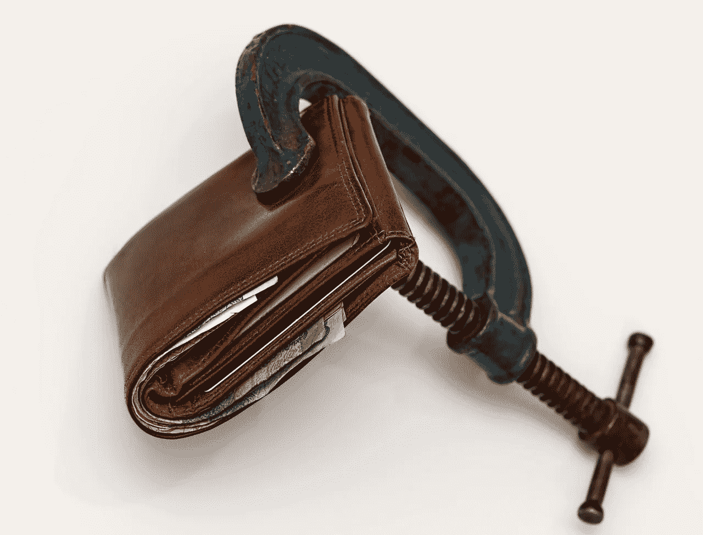
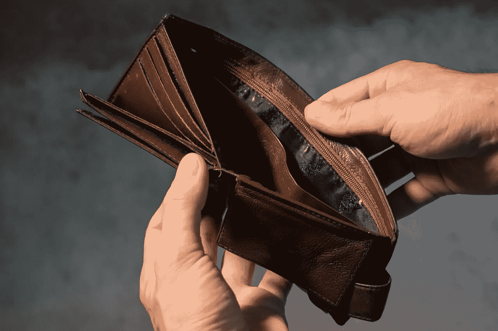
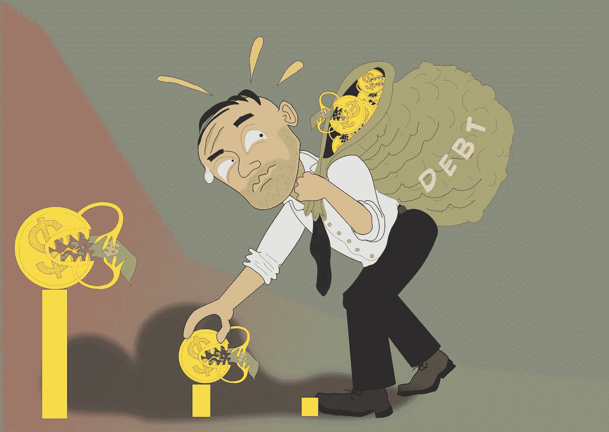

# 数字显示为什么伯尼能成为总统

> 原文：<https://medium.datadriveninvestor.com/numbers-show-why-bernie-could-be-president-899471bd9ccc?source=collection_archive---------15----------------------->

令人不安的是，有各种各样的数据显示伯尼可能会成为美国总统。为了解释这一点，数据显示美国经济对普通美国人来说如此糟糕，以至于自称为民主社会主义者的美国参议员伯尼·桑德斯(I-Vermont)可能会赢得 2020 年总统大选。

具体来说，当银行账户空空如也时，人们会投票给承诺更多政府福利的候选人。比如富兰克林·罗斯福(D-纽约)；美国福利国家之父，在 20 世纪 30 年代大萧条期间赢得了压倒性的总统选举胜利。

不幸的是，这些数字表明许多美国人的口袋和银行账户是空的。因此，桑德斯的吸引力比我们许多人承认的要大得多。因此，批评者需要在将桑德斯斥为“无法当选的怪人”之前检查这些数字。

值得注意的是，我们许多人在 2016 年对桑德斯的纽约同胞唐纳德·特朗普表达了类似的观点。请记住，特朗普获胜的部分原因是他对其他候选人的经济问题的关注；像希拉里·R·克林顿(D-纽约)和杰布·布什(R-佛罗里达)，被忽略。

# **证明伯尼可能成为总统的数字**

支持桑德斯受欢迎的一些数字包括:

*   78%.在由 Career Builder 委托进行的 [2017 年哈里斯民意调查](http://press.careerbuilder.com/2017-08-24-Living-Paycheck-to-Paycheck-is-a-Way-of-Life-for-Majority-of-U-S-Workers-According-to-New-CareerBuilder-Survey)中，承认自己“靠薪水过活”的美国人的比例。
*   25%.在职业构建者调查中，承认去年至少有一次入不敷出的美国人的比例。
*   20%.在职业建设者调查中，承认自己一年中至少有一次付不起账单的美国人的比例。

*   54%.告诉职业生涯规划者他们的债务难以控制的美国人的比例。
*   0.2%.经济政策研究所(Economic Policy Institute)声称美国人的“实际收入中值”在 2017 年有所增长。解释一下，实际收入中值是普通美国人每年的收入。
*   25%.根据[平衡](https://www.thebalance.com/income-inequality-in-america-3306190)的数据，每小时挣不到 10 美元的美国工人的百分比。
*   17%.皮尤研究中心[估计](http://www.pewresearch.org/fact-tank/2018/10/26/nearly-one-in-five-teens-cant-always-finish-their-homework-because-of-the-digital-divide/)由于家庭网络连接不畅而无法完成家庭作业的美国青少年比例。

*   0%.根据皮尤研究中心的[计算](http://www.pewresearch.org/fact-tank/2018/08/07/for-most-us-workers-real-wages-have-barely-budged-for-decades/)，1979 年至 2018 年间美国人平均购买力的增长。因此，普通美国人的购买力与 1979 年大致相同。

# 伯尼能赢是因为美国人没有退休储蓄

*   23%.根据[养老金权利中心](http://www.pensionrights.org/publications/statistic/how-many-american-workers-participate-workplace-retirement-plans)的数据，2017 年美国工人参加养老金计划的比例。
*   根据养老金权利中心的数据，2017 年美国员工不参加任何工作场所退休计划的比例为 46%。

*   57%.根据 [GoBankingRates](https://www.gobankingrates.com/saving-money/savings-advice/half-americans-less-savings-2017/) 的数据，美国成年人承认他们为退休储蓄少于 1000 美元的比例。
*   75%.根据 GoBankingRates 的数据，承认自己退休储蓄不足 1 万美元的美国人的比例。

# 伯尼能赢是因为医疗债务和学生贷款

*   530,000.研究发现，每年因医疗费用而破产的美国家庭数量。这一统计数据来自大卫·希梅尔斯坦博士领导的一项研究，他是纽约市立大学亨特学院的杰出教授，也是哈佛医学院的讲师。
*   1.56 万亿美元。根据[StudentLoanHero](https://studentloanhero.com/student-loan-debt-statistics/)2019 年美国学生贷款债务总额。

*   4470 万。StudentLoanHero 计算了欠学生贷款的美国人的数量。
*   11.5%.Student Loan Hero 估计，美国学生贷款拖欠 90 天或以上的百分比。
*   $393.根据学生贷款英雄，美国学生每月平均还贷额。
*   117.3 万。根据学生贷款英雄，2018 年申请公共学生贷款豁免的美国人数。澄清一下，这意味着借款人要求政府免除贷款。

# 伯尼能赢是因为富人越来越富

*   3.9%.根据加州大学伯克利分校经济学家伊曼纽尔·塞兹的数据，2014 年至 2015 年间，99%的美国人的收入增长了多少。
*   52%.Saez 声称，2013 年至 2015 年间，收入最高的 1%的美国人获得了美国实际收入增长的百分比。

*   50.5%.Saez 对 2015 年收入最高的 10%的美国人手中的美国国民收入份额的估计。
*   34.7%.Saez 的数据显示，2009 年至 2012 年间，美国最富有的 1%人口的收入增长了多少。
*   0.8%.根据 Saez 的计算，2009 年至 2012 年间 99%的美国人的收入增长率。
*   91%.2009-2012 年美国最富有的 1%人群获得的收入增加额；Saez 估计，2008 年经济危机后的三年。

# 数字证明伯尼能赢

这些只是一些统计数据，显示了为什么[桑德斯的议程](https://www.theamericanconservative.com/dreher/socialism-bernie-sanders-zombie-reaganism/)扩大社会保障，全民医疗保险，免费大学，学生贷款豁免，更高的税收，联邦就业保障和 15 美元的最低工资是如此受欢迎。

那些不喜欢[伯尼](https://marketmadhouse.com/why-bernie-could-win-in-2020/)和他的政治的人必须评估这些数字，并为它们暴露的问题提供解决方案。如果保守派、温和派和其他人不理解这些数字的意义，伯尼可能会在 2021 年成为总统。