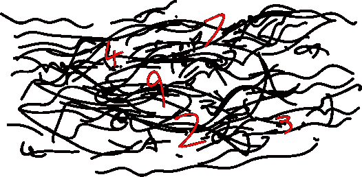

# 数字电台:“可以说，不是供公众消费的”

> 原文：<https://medium.datadriveninvestor.com/numbers-stations-not-shall-we-say-for-public-consumption-3de1efde3f97?source=collection_archive---------9----------------------->

## 秘密信息隐藏在我们周围的静电中，你只需要一台短波收音机就能听到它们

我们生活在一个充斥着不同波长信号的世界里，有些信号我们有能力接收和理解，有些却没有。不管我们是否感觉到，它们都在我们身边。他们通过我们接触。

当谈到那些我们自己感觉不到的波长时，我们可能会使用外部设备将它们解释为我们理解的东西——特殊的相机、天线或摄影胶片。但在一些传输的情况下，接收信号并将其转化为音频不足以理解信息。

理解这些信息需要额外的东西:[一个小小的纸质小册子，里面全是代码](http://users.telenet.be/d.rijmenants/pics/otp-stasi.jpg)。

当我很小的时候，我的爷爷向我介绍了一个神奇的想法。如果我拿起一台收音机，把它调到正确的频率——通常在它的范围的尽头——我就能听到当地警察的谈话。什么样的 7 岁小孩会不觉得这是个诱人的前景呢？它表达了我与所有人类共享的爱；喜欢偷听我们不想听到的事情。

嗯，我滚动和滚动通过尖锐的静电，但从来没有捕捉到任何警察对讲机的提示。

然而，隐藏在静电背后的秘密依然存在。而且没有死胡同；长期以来，非法信息一直隐藏在那里，等待着被听到，任何人都可以在一天中正确的时间用短波收音机设置正确的频率。

这就是数字电台的魅力。任何人都可以听到他们，只有少数人可以解释他们的信息。

什么是数字电台？官方说法是，他们不是。任何政府承认他们存在的最近一次是 1998 年英国发言人在 T4 发表的谨慎声明。“这些是你认为他们是什么。人们不应该被它们迷惑。我们可以说，它们不是供公众消费的。”

我们对数字站的设想是由道听途说、推测和有根据的猜测组成的。他们从内容中获得“数字电台”的名称，这些内容通常由一首歌中几个怪异的小节组成，后面跟着一系列由录音朗读的随机数字。

《兰开夏郡偷猎者》(英国)和[瑞典狂想曲](https://www.youtube.com/watch?v=GUQUD3IMbb4)(德国)就是著名的例子。两者的名字都来自于开始播放的歌曲。

我们确实知道它们在短波频率上传输。短波是一项自 20 世纪 20 年代以来一直流行的老技术，它特别适合远距离传输东西，而不需要任何像互联网或卫星这样的新奇玩意儿的帮助。取而代之的是，短波发射机将信号发送到天空，直到信号到达 50-370 英里高的电离层。

在那里，太阳电离产生电荷，将信号反射回地球。发射器越大、功率越大，信号传得越远。一个大型发射机，再加上另一端的高质量手持收音机，就可以接收到半个地球以外的短波信号。

政府承认这些站的存在是不明智的。大多数都是非法运作的，使用的频率是为正常的广播、紧急服务甚至空中交通管制保留的。它们从未注册的发射机发射信号，由于无线电信号的性质，很难定位这些发射机。

无线电传输没有留下任何数字痕迹，只是[在乡下某处的一个不起眼的发射器](https://www.dailymail.co.uk/sciencetech/article-2877988/Can-solve-mystery-UVB-76-Radio-station-buzzed-second-1970s-no-one-knows-why.html)。与海盗电台被禁止播出相比，对这类电台缺乏行动表明政府和军方参与其中。

那么这些数字是怎么回事呢？它们是任何好奇的孩子的梦想；堆积如山的难以置信的青少年小说变成了现实。它们是给间谍的加密信息。

在确认他们是单独一人后，一名潜入敌方安全机构的海外特工在预先约定的时间调到预先约定的频率。透过静电的迷雾，出现了一首流行民歌的单声道版本，提醒他们即将开始的信息。

然后是数字。特工把它们写在一张小纸片上。当传输结束时，间谍打开他们的一次性便笺簿，翻到正确的一天。有了这个拍纸簿，间谍——也只有间谍——才能发现信息的含义。他们的命令是什么？他们是否应该继续为另一方扮演他们的角色，或者是时候放下伪装，开始行动了？消息被理解，代理现在销毁密钥。

与此同时，短波无线电爱好者、困惑的公众和愤怒的特工人员也在收听。他们正在清楚地接收信号。但是他们不能理解它的含义。

这些车站在冷战期间特别普遍，当时欧洲大城市的居民在行动时都会被敌方特工绊倒。但是冷战正式结束后的四分之一个世纪，许多仍在使用。

这是因为，尽管现代计算机令人眼花缭乱，但数字通信极难隐藏。电子数据总会留下痕迹。另一方面，短波无线电传输是不可能被追踪的。因为任何人都可以接收到它们，所以很难证明谁是出于邪恶的目的在监听。

如果战争爆发，这两个对手将试图关闭对方的互联网，切断他们卫星的电源。尽管如此。要屏蔽短波无线电的整个频谱是不可能的。

2011 年，德国警方突袭了一对安静的中年夫妇的家，他们怀疑这对夫妇是间谍。幸运的是，当警察冲进来时，这位妇女正在通过无线电接收来自莫斯科的命令，她的一次性便笺簿在她面前的桌子上。她和她的丈夫已经在德国做了 23 年的间谍。

2001 年，[美国中央情报局高级分析员安娜·蒙特斯因被指控为古巴从事间谍活动而被捕。特工们在她家里发现了一个一次性便笺簿，还有证据表明她一直在接收一个古巴数字电台的通信。](https://en.wikipedia.org/wiki/Ana_Montes)

今天，据 priyom.org(一个致力于管理世界各地数字电台的网站)称，俄罗斯、乌克兰、朝鲜、韩国、台湾、中国、波兰、古巴和埃及仍在使用数字电台向驻扎在国外的代理商发送订单。Priyom 拥有当前和以前数字电台的记录档案。

随着普通公民放弃模拟技术，政府的影子部门仍然依赖于 1920 年代完善的系统来发送他们不能冒险留下痕迹的信息。我们没人知道它们从哪里来，没人知道它们是给谁的。信号在天空中跳跃，任何人都能听到，我们却无法理解。但是在某个地方，有人也在听，他们知道这些信息意味着什么。

____

[这里有一些关于 numbers stations 的很棒的进一步阅读材料，以及进一步阅读材料的链接。](https://people.howstuffworks.com/numbers-stations.htm/printable)

[*【怪异的西班牙】*](https://weirdspain.substack.com/) *是一份时事通讯，面向那些想要更深入了解他们的第二故乡及其人民的移民，以及世界各地想要更多了解这个神奇国家正在发生什么以及为什么会发生的西班牙爱好者。* [*在这里订阅，在你的收件箱里收到这些文章。*](https://weirdspain.substack.com/subscribe)