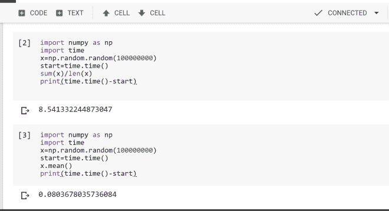
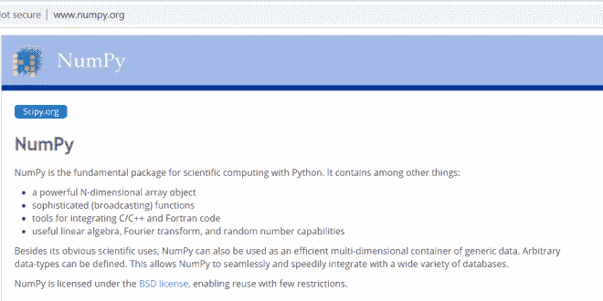
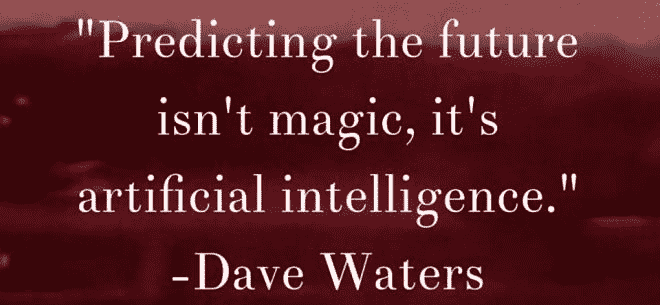

# numpy——深度学习的先决条件

> 原文：<https://medium.datadriveninvestor.com/numpy-a-prerequisite-for-deep-learning-4a91d26ba334?source=collection_archive---------27----------------------->

Numpy 是一个为科学计算而设计的库。这是用 python 进行科学计算的基础包。

于是第一个问题出现在脑海里，为什么不能用 python 中的普通数学模块来代替 numpy？答案是 numpy 在科学计算的意义上比普通的 python 库要快得多。在这里我将证明这一点。

那么，我们到底做了什么？我们使用随机函数创建了随机的 100000000 个值。我们在实施手术前记录了时间。现在，我们通过正常的 python 方法计算所有 100000000 个随机值的平均值，即 sum(x)/len(x)。然后我们再次记录时间，打印出初始时间和最终时间的差值，我们得到 8.54 秒。我们得出结论，通过简单的 python 计算所需的时间是 8.54 秒。

现在在第二种情况下，我们将做同样的事情，即生成随机的 100000000 个值并计算平均值。但是在这种情况下，我们将使用 numpy 库的函数，即 mean()。所以经过计算，我们得到计算所需的时间是 0.083，这是一种更快的方法。

现在让我们看看 Numpy 除了速度之外还提供了什么:

我们可以轻松创建具有大数据值的 n 维数组。我们可以做复杂的广播。
术语广播描述了 numpy 在算术运算中如何处理不同形状的数组。在某些约束条件下，较小的阵列在较大的阵列中“广播”,以便它们具有兼容的形状。广播提供了一种向量化数组操作的方法，因此循环在 C 而不是 Python 中发生。这样做不会产生不必要的数据副本，并且通常会导致高效的算法实现。然而，在有些情况下，广播并不是一个好主意，因为它会导致内存使用效率低下，从而降低计算速度。我们也可以计算一些复杂的函数，如上图所示。

所以这些就是 numpy 被首选的原因。还有很多原因，比如 DL 以数组的形式处理数据，涉及到很多数学运算。我们不要深究了。在下一篇博客中，我们将看到如何实现 numpy 并使用它？

谢谢你！

通知

## 来自 DDI 的相关故事:

 [## 用 7 个步骤解释深度学习

### 和猫一起

medium.com](https://medium.com/datadriveninvestor/deep-learning-explained-in-7-steps-9ae09471721a)  [## 数据科学和软件工程哪个更有前途？

### 大约一个月前，当我坐在咖啡馆里为一个客户开发网站时，我发现了这个女人…

medium.com](https://medium.com/datadriveninvestor/which-is-more-promising-data-science-or-software-engineering-7e425e9ec4f4)