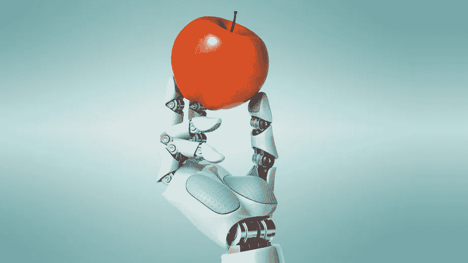

# 营养遇上人工智能

> 原文：<https://medium.datadriveninvestor.com/nutrition-meets-artificial-intelligence-b15847d6cc19?source=collection_archive---------0----------------------->

Robot holding an apple from Google

人们从一种饮食跳到另一种饮食，好像这没什么……从旧石器饮食跳到生酮饮食，再跳到阿特金斯饮食，然后又回到他们开始的地方。美国新闻甚至有一篇关于 T2 最佳饮食的文章。前一天，节食据说能解决你所有的健康问题，但第二天，它又被说成是致命的。不仅与饮食有矛盾，而且像鸡蛋、咖啡和酒这样的食物在被贴上健康和不健康的标签之间来回转换。

消费者可能想知道什么时候结果会是一致的，这样他们就可以找到最终适合他们的饮食。但是，事实上，我们的身体是独一无二的，所以食物在个体层面上影响我们。

 [## 医疗保健的未来正在被一场大型技术入侵所塑造|数据驱动型投资者

### 过去十年，全球经济的所有部门都经历了大规模的数字颠覆，而卫生部门现在…

www.datadriveninvestor.com](https://www.datadriveninvestor.com/2018/11/02/the-future-of-healthcare-is-being-shaped-by-a-big-tech-invasion/) 

*从生物学角度来说，人人都有一种通用饮食的想法是不可能的。好的饮食* ***需要*** *个性化。*

这就是人工智能的用武之地。

Photo by [Hitesh Choudhary](https://unsplash.com/@hiteshchoudhary?utm_source=medium&utm_medium=referral) on [Unsplash](https://unsplash.com?utm_source=medium&utm_medium=referral)

不幸的是，大多数研究都是观察性的，依赖于饮食记录，或者仅仅是患者的记忆，这往往是非常不准确的。为了在考虑个体差异和实施个性化营养的同时了解健康动态，应致力于设计监测个体对食物的健康反应的预测方法。

最初，研究是错误的，因为获得如此准确和大量的数据的麻烦阻止了研究人员使用**机器学习**。

> **“机器学习**是一种自动化分析模型构建的数据分析方法。它是人工智能的一个分支，基于这样一种想法，即系统可以从数据中学习，识别模式，并在最少的人工干预下做出决策。”特种空勤团

在过去的几年中，一些研究能够主要使用*血糖反应*和其他临床数据来做到这一点，从而使结果更加准确。

# 研究 1:

*2016 年进行*

> 用途:血糖水平、饮食习惯、人体测量学、身体活动、肠道微生物群

**Eran Segal** 在他的 TED 演讲中解释了他和他的同事使用血糖反应和机器学习进行的一项研究。

“What is the best Diet For Humans?” — Eran Segal TEDTalk

**另一个更短、更棒的视频，关于艾兰·西格尔的个性化饮食研究:*[*【https://www.youtube.com/watch?v=hZWLy7FLvZ4】*](https://www.youtube.com/watch?v=hZWLy7FLvZ4)***

正如 Eran Segal 在他的视频中总结的……没有放之四海而皆准的饮食计划。我们都有不同的能量水平、营养需求和热量需求。

# 研究#2

*2019 年进行*

> 用途:血糖监测、肠道微生物评估、药物、食品和饮料

心脏病专家埃里克·托普今年早些时候参加了一项人工智能饮食实验，目的是为了活得更健康、更长寿。

> “我参加了一项为期两周的实验，其中包括使用一款智能手机应用程序来跟踪我吃的每一口食物、喝的每一杯饮料和服用的每一种药物，以及我的睡眠和锻炼时间。”

为了更多的技术目的，他戴了一个血糖监测器，研究人员分析了组成他肠道微生物群的各种物种。然后，托普收到了一份类似于个人报告卡的东西，根据他的分析，他吃的食物被评为 A+(好)到 F(差)。以下是他的结果:

> “在糖果类中:奶酪蛋糕被评为 A 级，但全麦无花果条被评为 C 级。在水果方面:草莓对我来说是 A+，但葡萄柚是 c。在豆类方面:混合坚果是 A+，但蔬菜汉堡是 c。不用说，它不符合我认为我了解的健康饮食。”埃里克·托普

他的结果还包含避免葡萄糖峰值的特定食物建议和超过 100，000 种食物和饮料的葡萄糖预测的可搜索数据库。

> 有了机器学习，我们可以在几年内拥有自己的个性化虚拟健康教练。人工智能个性化饮食是一个激动人心的新时代的开始。

*阅读[营养遇上人工智能(第二部分)](https://medium.com/@k_bone/nutrition-meets-artificial-intelligence-part-ii-b45f4a000db6)了解更多！

## 参考资料和其他研究/故事:

*   [https://www . cell . com/cell/full text/s 0092-8674(15)01481-6](https://www.cell.com/cell/fulltext/S0092-8674(15)01481-6)
*   [https://www . the cut . com/2019/04/how-can-artificial-intelligence-affect-diet . html](https://www.thecut.com/2019/04/how-can-artificial-intelligence-affect-diet.html)
*   [https://blog . cardio metabolichealth . org/2019/03/18/growth-seen-in-artificial-intelligence-based-nutrition/](https://blog.cardiometabolichealth.org/2019/03/18/growth-seen-in-artificial-intelligence-based-nutrition/)
*   [https://www . nytimes . com/2019/03/02/opinion/Sunday/diet-人工智能-糖尿病. html](https://www.nytimes.com/2019/03/02/opinion/sunday/diet-artificial-intelligence-diabetes.html)