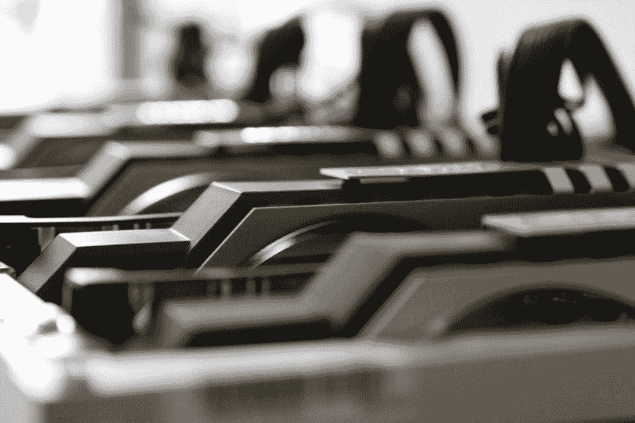
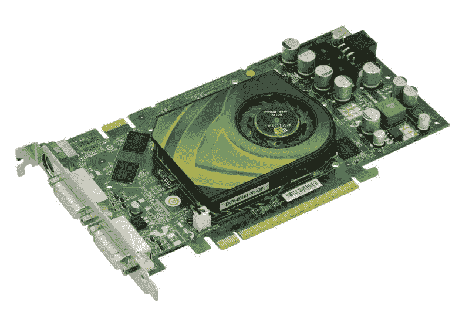
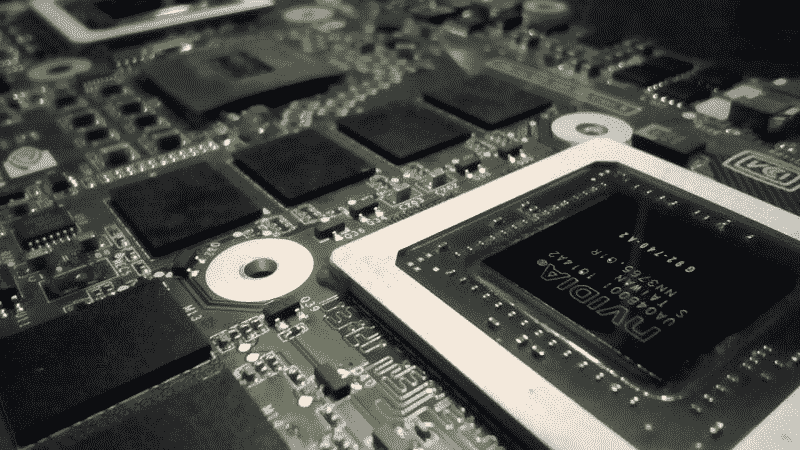
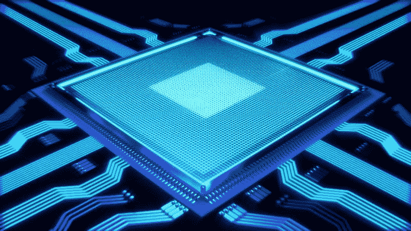
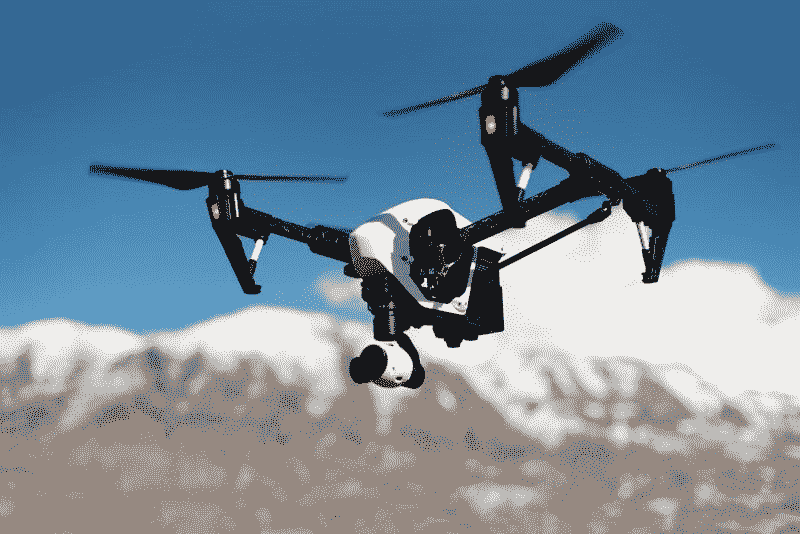
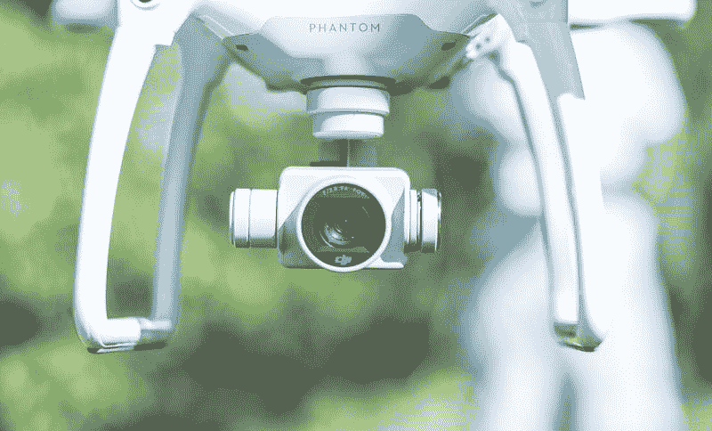
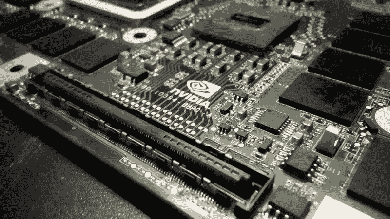

# 英伟达赚的钱越来越少了，它还是价值投资吗——市场狂人

> 原文：<https://medium.datadriveninvestor.com/nvidia-is-making-less-money-is-it-still-a-value-investment-market-mad-house-f0b8c9aeb84?source=collection_archive---------7----------------------->

硅谷的经济发展很麻烦，NVIDIA 赚的钱越来越少。事实上，英伟达的收入和收益正在下降。

例如，英伟达的毛利从 2018 年 4 月 29 日的 20.68 亿美元下降到一年后的 12.96 亿美元。与此同时，**英伟达公司(纳斯达克股票代码:NVDA)** 的营业收入从 2018 年 4 月的 12.95 亿美元降至 2019 年 4 月的 3.58 亿美元。另外，英伟达的净收入从 2018 年 4 月 29 日的 12.44 亿美元下降到 2019 年 4 月 29 日的 3.94 亿美元。

 [## 在自动驾驶汽车发生事故的情况下，谁应该承担法律责任？数据驱动的投资者

### 我仍然认为自动驾驶汽车是一种奢侈品，而不是必需品…

www.datadriveninvestor.com](https://www.datadriveninvestor.com/2018/11/02/who-is-legally-accountable-in-the-case-of-an-autonomous-vehicle-accident/) 

因此，英伟达的收入从 2018 年 4 月的 32.07 亿美元降至 2019 年 4 月的 22.2 亿美元。因此，英伟达的收入在一年内缩水了近 10 亿美元。值得注意的是，Stockrow 估计英伟达的收入增长率下降了 30.78%；或近三分之一，截至 2019 年 4 月 29 日的季度。

# 科技繁荣结束了吗？

许多人会想知道，增长和收入的急剧下降是否表明 NVIDIA 不再是一项值得投资的投资。

其他人会怀疑 NVIDA 的困境是否表明最近的科技繁荣已经结束。解释一下，英伟达生产原材料，其他公司用这些原材料来建造我们的现代技术基础设施。值得注意的是，NVIDIA 为现代技术的几乎所有方面提供了解决方案，从游戏到电影制作，到自动驾驶汽车，到机器人，再到人工智能。

例如，英伟达制造了视频游戏、流媒体视频、人工智能、加密货币、区块链，甚至手机操作的超高速芯片和处理器。事实上，[像 Quadro 和 Image Engine 这样的 NVIDIA 解决方案](https://www.nvidia.com/en-us/industries/media-and-entertainment/)通过使制片人能够将灭霸这样的漫画人物栩栩如生，使最近的超级英雄电影蓬勃发展。

此外，NVIDIA 通过其 NVIDIA Shield TV 帮助流媒体视频蓬勃发展。有趣的是， *9to5 谷歌* [将](https://9to5google.com/2019/07/27/top-stories-see-through-pixel-wallpapers-nvidia-shield-tv-revamp/) Shield TV 描述为“地球上最好的安卓设备”

除了娱乐，英伟达的自动驾驶汽车驱动大脑正在为来自各种公司的自动驾驶汽车提供动力，如**丰田汽车(NYSE: TM)** ，**特斯拉汽车(NASDAQ: TSLA)** 和沃尔沃。

# 为什么英伟达赚钱越来越少？

英伟达收入的下降令我担忧，因为该公司的技术仍然是最好的。

例如，据 techradar [估计](https://www.techradar.com/news/radeon-rx-5700-runs-wolfenstein-youngblood-13-faster-with-amds-new-driver)，NVIDIA 为其 GeForce RTX 图形处理器单元(GPU)开发的游戏就绪驱动程序是第一款速度超过每秒 60 帧(fps)的 GPU。对于非游戏玩家来说，这意味着 GeForce 每秒显示 62.7 帧游戏动作。因此，它提供了一个更快，更真实和更引人注目的游戏。

此外，techradar 声称 NVIDIA 游戏就绪驱动程序可以提供 180 到 200 帧/秒的速度。因此，NVIDIA GPU 的性能是其竞争对手 AMD 的近两倍。

# 经济衰退开始了吗？

因此，当视频游戏成为我们文化中最强大的媒体时，NVIDIA 正在制造市场上最好的游戏技术。然而，英伟达赚的钱越来越少，这可能表明经济放缓。

我认为 NVIDIA 的困境预示着未来的经济困难，因为我能想象的游戏玩家不购买 GeForce 的唯一原因是他们缺乏资金。因此，美国参议员；总统候选人，伊丽莎白·沃伦(D-马萨诸塞州)媒体[警告](https://medium.com/@teamwarren/the-coming-economic-crash-and-how-to-stop-it-355703da148b)“即将到来的经济崩溃”可能是正确的。

具体来说，沃伦声称“另一次经济衰退的可能性很高，而且还在增加。”我不得不怀疑英伟达的收入和收入下降是否会是这种低迷的开始。

很多经济学家；然而，美联社[指出](https://www.reviewjournal.com/news/politics-and-government/warrens-run-could-pivot-on-her-warning-of-more-economic-trouble-1811420/)对沃伦的诊断持怀疑态度。然而，经济增长的放缓足以让美联储降低利率。

# 美国面临滞胀吗？

我个人认为美国正在进入滞胀期。因此，我们将看到更高的价格和低利率，但几乎没有经济增长。

在典型的滞胀中，一些价格上涨，但是工资和收入仍然很低。特别是滞胀下的经济增长缓慢或负增长。滞胀的经典例子包括 20 世纪 60 年代和 70 年代的英国，以及 20 世纪 90 年代日本失去的十年。

在这种情况下，不会出现崩盘或衰退。但是，不会有显著的增长，也不会有好的时候。我觉得像英伟达这样的公司；为奢侈的高科技产品制造零部件；虚拟现实、游戏系统、高清电视等将在这种环境中挣扎。

英伟达会很挣扎，因为普通人不会挨饿，但他们会缺乏额外的钱来买游戏之类的东西。例如，年轻人可能不得不在购买新游戏机和支付租金之间做出选择。

# 英伟达能挺过下一次低迷吗？

然而，通过将重点从娱乐转向制造业、汽车、机器人和其他工业产品，NVIDIA 可以在下一次衰退中生存并有可能繁荣。

值得注意的是，NVIDIA 在自主机器上投入了大量资源。这些努力包括 [Jetson Nano 开发者工具包](https://developer.nvidia.com/buy-jetson)NVIDIA 设计的小型强大计算机，用于运行机器人、无人机和其他自主机器。此外，英伟达还制造了几款为机器人和无人机服务的 Jetson 模型。

NVIDIA 的工程师希望像 Jetson 和 [ISAAC SDK](https://www.nvidia.com/en-us/autonomous-machines/robotics/) (软件开发工具包)这样的解决方案将加快人工智能在工厂等环境中的应用。此外，英伟达还开发了运行工业和商业机器人的计算机 [Jetson AGX Xavier](https://www.nvidia.com/en-us/autonomous-machines/embedded-systems/jetson-agx-xavier/) 。

值得注意的是，[机器人公司](https://www.nvidia.com/en-us/autonomous-machines/robotics/)的 Xavier 操作机器人已经在 **Lowe's(纽约证券交易所代码:LOW)** 家装商店运营。机器人同伴监控库存水平，并提醒员工注意问题。

# 英伟达用自主机能赚钱吗？

我认为 NVIDIA Jetson AGX Xavier 可能有一个巨大的市场，因为他们设计它来使自主机器可扩展。解释一下，自主机器就是自己操作的机器。

NVIDIA 使用的另一个术语是下一代智能机器。下一代自主机器的一个例子是自行操作的叉车或推土机。除了推土机，还有一些公司已经在美国公路上测试的臭名昭著的半卡车。

例如,《休斯顿纪事报》声称，一家名为 TuSimple 的公司计划在圣安东尼奥和亚利桑那州之间运营无人驾驶卡车。值得注意的是，分析师对图森未来的估值为 10 亿美元。此外，TuSimple 筹集了 9500 万美元的融资，可以用于购买 NVIDIA 的产品，如 DRIVE 或 Xavier。

自动驾驶卡车的市场可能是巨大的，因为 Truckinfo [估计仅在美国就有 1550 万辆卡车和 200 万辆半挂牵引车在运营。此外，120 万家美国公司运营卡车。](https://www.truckinfo.net/trucking/stats.htm)

# 卢德派会为英伟达而来吗？

因此，英伟达可以通过推动[技术工作启示录](https://marketmadhouse.com/the-technological-jobs-apocalypse-is-coming-how-safe-is-your-job/)赚很多钱。然而，像 Jetson AGX Xavier 这样的产品可能会引发对英伟达的丑陋的政治反弹。我认为英伟达是将成为现代[障碍](https://marketmadhouse.com/the-luddites-are-coming/)目标的几家公司之一。

值得注意的是，第一个将自动驾驶卡车和机器人作为竞选议题的政治家，[杨安泽](https://marketmadhouse.com/conservatives-and-progressives-must-respond-to-andrew-yang/)(纽约州民主党)正在他的总统竞选中吸引注意力。此外，至少一个主要的国家权威人士，超级明星正在推广杨的信息。

因此，建造自主坦克或无人机来保护其总部免受暴徒的攻击可能是 NVIDIA 的明智之举。卢德暴徒可能会来，因为政治家和学者需要一个技术失业的替罪羊，而硅谷将成为一个伟大的替罪羊。

# 英伟达能产生多少现金？

NVIDIA(纳斯达克股票代码:NVDA) 尽管前景黯淡，但它仍然是一家现金充裕的公司。令人印象深刻的是，英伟达在 2019 年 4 月 28 日报告的运营现金流为 7.2 亿美元，投资现金流为 14.95 亿美元，自由现金流为 5.92 亿美元。

然而，英伟达在 2019 年产生的现金远少于 2018 年。例如，2018 年 4 月 28 日，英伟达报告的运营现金流为 14.45 亿美元，自由现金流为 13.77 亿美元。

重要的是，英伟达手头持有大量现金。事实上，英伟达现在的现金比 2018 年还多。具体来说，英伟达在 2018 年 4 月 29 日报告了 73 亿美元的现金和短期投资。相比之下，英伟达一年后的现金和短期投资为 78.02 亿美元。

# 英伟达准备好迎接更多的增长了吗？

*“增长和价值投资紧密相连。”——*沃伦·巴菲特*。*

具体而言，英伟达在 2019 年 4 月 29 日报告了 27.72 亿美元的现金和等价物以及 50.3 亿美元的短期投资。因此，英伟达有大量资金用于自主机器、人工智能、自动驾驶汽车和机器人技术的研发。

令人印象深刻的是，NVIDIA 正在这些领域投入资金，以推动娱乐以外领域的增长。我认为支出显示了一个聪明的管理团队，他们理解增长的重要性。

具体来说，沃尔玛可以购买 1，500 台机器人地板清洁器、300 台库存扫描机器人、1，200 台用于卸载卡车的快速自主卸载机和 900 台皮卡塔。取件塔是一个自动售货亭，顾客可以在那里领取他们在网上订购的商品。

# 英伟达是好的分红股票吗？

我认为**英伟达(纳斯达克股票代码:NVDA** )是一只增长良好的股票，市场先生在 2019 年 7 月 31 日将其定价为 168.89 美元。

令人惊讶的是，对于一只科技股来说，英伟达也是一只不错的分红股。例如，英伟达于 2019 年 6 月 21 日和 2019 年 3 月 22 日支付了 16₵股息。此外，1₵在 2019 年的股息增长从 2018 年 12 月 21 日的 15₵开始。

值得注意的是，英伟达在 2019 年 7 月 31 日的股息率为 0.38%，64₵ a 股的年化派息率为 9%。此外，Dividend.com 认为英伟达有六年的股息增长。

所以，我认为英伟达是一只前景光明的好股票。然而，我认为英伟达股东可以预期在可预见的时间里收入和收益会下降。因此，我建议推迟购买英伟达，直到我们看到股价可能下跌到什么程度。

*原载于 2019 年 7 月 31 日*[*【https://marketmadhouse.com*](https://marketmadhouse.com/nvidia-is-making-less-money-is-it-still-a-value-investment/)*。*