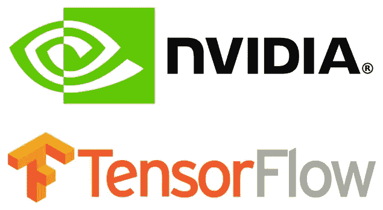
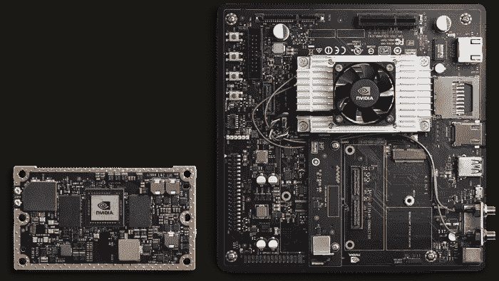
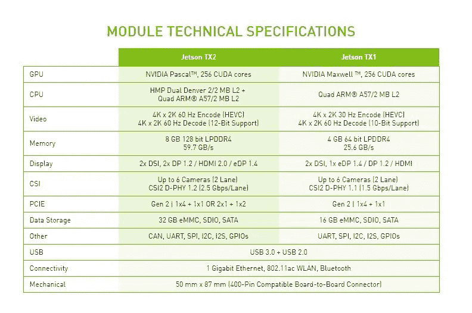
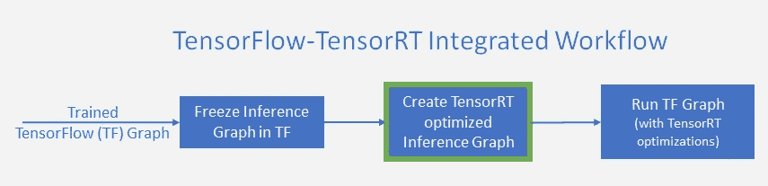
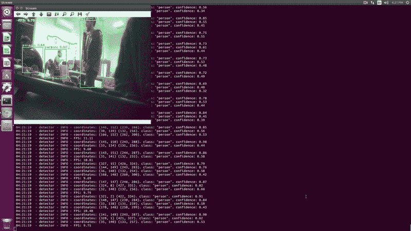
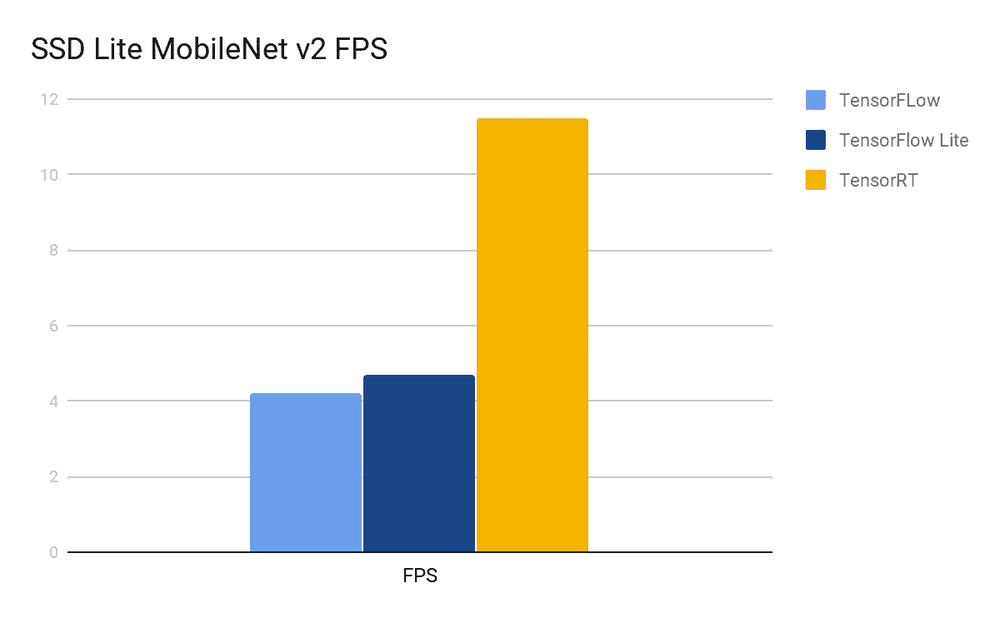

# NVIDIA Jetson TX2 上的对象检测

> 原文：<https://medium.datadriveninvestor.com/object-detection-on-nvidia-jetson-tx2-6090dc3e0595?source=collection_archive---------0----------------------->

[](http://www.track.datadriveninvestor.com/1B9E)

近年来，嵌入式系统开始在人工智能领域流行起来。因为 AI 和深度学习革命从软件领域走向硬件。插卡上的嵌入式系统，具有处理器、内存、电源和外部接口。由于嵌入式系统专用于特定的任务，设计工程师可以对其进行优化，以减小产品的尺寸和成本，提高可靠性和性能。它们常见于消费、烹饪、工业、汽车、医疗、商业和军事应用中。



NVIDIA Jetson TX2

这方面最有趣的设备之一是 NVIDIA Jetson TX2。这是第二代英伟达嵌入式设备。Jetson TX2 是一款嵌入式系统级模块(SoM)，采用双核 NVIDIA Denver2 +四核 ARM Cortex-A57、8GB 128 位 LPDDR4 和集成的 256 核 Pascal GPU。Jetson TX2 可用于部署计算机视觉和深度学习，运行 Linux，以不到 7.5 瓦的功率提供超过 1 TFLOPS 的 FP16 计算性能。



Jetson’s technical specification

在本文中，我们演示并评估了一种使用运行在 NVIDIA Jetson TX2 上的 SSD Lite MobileNet V2 对象检测算法来执行实时对象检测的方法。

# 安装 Jetpack

首先，让我们安装 NVIDIA JetPack。NVIDIA JetPack SDK 是构建 AI 应用程序的最全面的解决方案。使用 JetPack 安装程序为您的 Jetson 开发套件刷新最新的操作系统映像，为主机 PC 和开发套件安装开发工具，并安装启动开发环境所需的库和 API、示例和文档。撰写本文时的最新版本是 JetPack 4.1.1。

在大多数情况下，安装很容易。从 Ubuntu 16.04 或 Ubuntu 18.04 PC 主机，您只需从 NVIDIA JetPack [网页](https://docs.nvidia.com/jetpack-l4t/2_2/content/developertools/mobile/jetpack/l4t/2.2/jetpack_l4t_install.htm)下载 JetPack(您必须使用您的开发人员帐户登录才能下载 JetPack)，然后按照安装指南中的说明进行操作。

# 安装 TensorFlow、TensoRT 和 OpenCV

TensorFlow 是当今最流行的深度学习框架之一。NVIDIA TensorRT 是一个深度学习平台，可以优化神经网络模型，并加快在数据中心、嵌入式和汽车设备中运行的各种 GPU 加速平台之间的推理速度。TensorFlow 与 TensorRT 很好地集成在一起，这似乎是一个天然的组合，特别是 NVIDIA 提供了非常适合加速 TensorFlow 的平台。这使得 TensorFlow 用户在使用 TensorRT 时能够拥有极高的推理性能和近乎透明的工作流程。


将 TensorRT 添加到 TensorFlow 推断工作流涉及到一个额外的步骤，如图 3 所示。在这一步中(用绿色突出显示)，TensorRT 从一个冻结的 TensorFlow 图构建一个优化的推理图。

在本文中，我们将使用 python 3。让我们在设备上安装 TensorFlow 和 TensorRT。你可以在 [Jetson repository](https://github.com/NVIDIA-AI-IOT/tf_trt_models) 上的 NVIDIA tensor flow/tensort 模型中找到很好的说明。但是首先，你应该安装 *python3-dev* 和 *libfreetype6-dev* 包。他们可能会解决一些关于 matplotlib 安装的问题:

```
sudo apt-get update
sudo apt-get upgrade
sudo apt-get install libfreetype6-dev python3-dev
```

此外，我们建议安装 TensorFlow 的最新版本，目前是 1.10.1。

安装 TensorRT 后，我们在 jupyter 示例上遇到了一个问题。由于该示例使用 ssd_inception_v2 模型来尝试分配大量 GPU 内存，会话运行进程被系统终止。为了解决这个问题，我们将 TensorFlow [Model ZOO](https://github.com/tensorflow/models/blob/master/research/object_detection/g3doc/detection_model_zoo.md) 的型号改为 SSD Lite MobileNet v2。模型动物园是谷歌预先训练的对象检测模型的集合，这些模型具有不同级别的处理速度和准确性。



虽然该模型运行速度更快，但它的代价是精确度较低。下载 SSDLite-MobileNet 模型并将其解包，并在 jupyter 笔记本中设置模型文件的路径。


model ZOO

现在构建并安装 openCV。为了更好地使用这个[库](https://github.com/jetsonhacks/buildOpenCVTX2)。但是安装后，你应该多做一步。Adrian Rosebrock 在他的博客中描述道:

OpenCV + Python 绑定应该安装在/usr/local/lib/Python 3.5/site-packages 中。但是在为 Python 3+编译 OpenCV 3 绑定时要小心，输出。所以文件有时被命名为 cv2 . cpython-35m-arm-Linux-gnueabihf . so(或类似的东西)而不是 cv2.so(就像在 Python 2.7 绑定中一样)。也许是 CMake 脚本中的一个 bug。如果发生这种情况，只需将文件重命名为 cv2.so。

这很容易解决。我们需要做的是:

```
cd /usr/local/lib/python3.5/site-packages/
sudo mv cv2.cpython-35m-arm-linux-gnueabihf.so cv2.so
```

# 运行张量流图

以下所有代码均可在 [GitHub](https://github.com/QuantuMobileSoftware/mobile_detector) 上获得。

首先，为[对象检测器](https://github.com/QuantuMobileSoftware/mobile_detector/blob/jetson-tx2/object_detector.py)定义一个抽象类:

接下来，实现 TensorFlow 模型的接口，我们使用了来自[对象检测 API](https://github.com/QuantuMobileSoftware/mobile_detector/blob/jetson-tx2/object_detector_detection_api.py) 的代码。

现在让我们实现 jetson 机载摄像机的视频流功能:

并使用它:

因此，使用 SSD Lite TensorFlow 模型，我们有大约 **4.2 FPS** 。


SSD MobileNet v2 Lite Results

# 运行 TensorFlow Lite 优化图

TensorFlow Lite 是在移动和嵌入式设备上运行机器学习模型的官方解决方案。它支持在 Android、iOS 等设备上进行低延迟、小二进制的机器学习推理。TensorFlow Lite 为此使用了许多技术，例如允许更小更快(定点数学)模型的量化内核。

如何用 TensorFlow Lite 设置环境和转换图形你可以在之前的[文章](https://medium.com/@Quantum_inc/mobile-object-detector-with-tensorflow-lite-9e2c278922d0)中读到。另外，你也可以从[这里](https://www.dropbox.com/s/3i1hop5wm61jd5n/mobile_detector.tar.gz) ( *detect.tflite* )下载一个建兴图。
我们需要创建另一个检测类来处理优化的图形。代码可在此处[获得。](https://github.com/QuantuMobileSoftware/mobile_detector/blob/jetson-tx2/object_detector_detection_api_lite.py)

采用 TensorFlow Lite 优化的 SSD Lite 型号平均有 **4.7 FPS** 。

# 运行 TensorRT 优化图

您也可以跳过这一部分，因为我们已经在这里[(*ssdlite _ inception _ v2 _ coco _ TRT . Pb*)提供了一个预训练模型。让我们考虑一个更详细的例子。](https://www.dropbox.com/s/3i1hop5wm61jd5n/mobile_detector.tar.gz)

我们已经下载了一个预训练的 SSD Lite 模型。我们应该建立一个冻结的图表:

接下来，构建一个 TensorRT/Jetson 兼容图形并保存它:

我们可以像使用标准冻结图一样使用这个优化图。

经过 TensorRT 优化后，我们有 **11.5 FPS**



TensorRT Results

# 摘要

在我们的测试运行之后，我们得到了以下性能结果:

*   标准张量流图—4.2 FPS；
*   TensorFlow Lite 优化图形—4.8 FPS；
*   TensorRT 优化图形— 11.4 FPS。



Models’ comparison

正如您在上面看到的，TensorRT 优化几乎将模型的性能提高了两倍。如果我们能够批量处理图像，性能可能会更高。TensorFlow Lite 优化似乎对 Jetson 有一点影响，这可能是因为它没有针对 GPU 使用进行优化。TensorRT 只有一个缺点:不是所有的模型都可以用它来优化。

总而言之，NVIDIA Jetson TX2 + TensorRT 是一款相对便宜、紧凑且高效的机器，可用于实时物体检测。

*撰稿*[*Klym Yamkovyi*](http://www.linkedin.com/in/kyamkovyi) *校对*[*nadia Pyvovar*](https://www.linkedin.com/in/nadiia-pyvovar/)*[*Cherepanov Oleksandr*](https://www.linkedin.com/in/oleksandr-cherepanov/)*

**原载于 2018 年 12 月 27 日 www.quantumobile.com**的*[T22。](https://www.quantumobile.com/object-detection-on-nvidia-jetson-tx2/)*