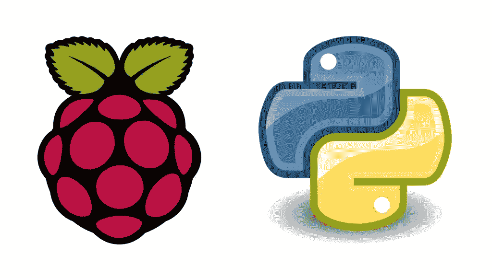
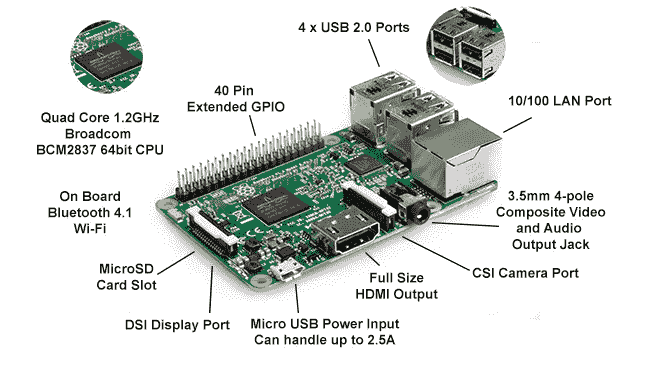
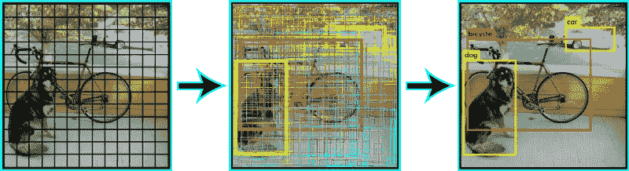
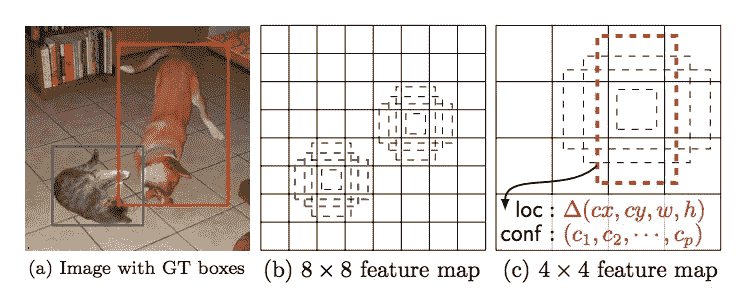
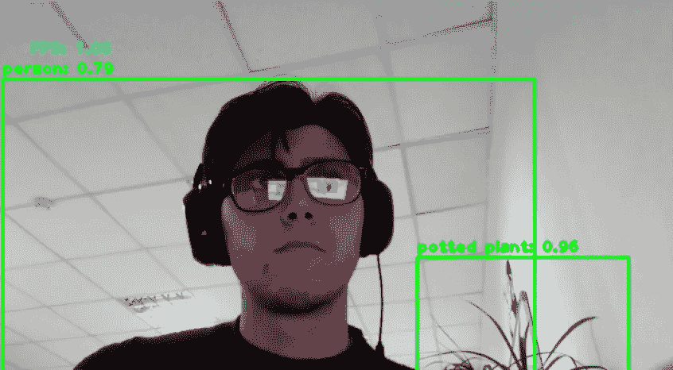
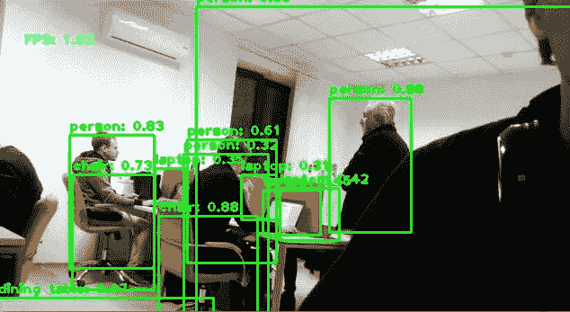

# 用 Raspberry Pi 和 Python 实现目标检测

> 原文：<https://medium.datadriveninvestor.com/object-detection-with-raspberry-pi-and-python-bc6b3a1d4972?source=collection_archive---------0----------------------->

[](http://www.track.datadriveninvestor.com/1B9E)

今天我们将讨论如何构建一个简单而廉价的移动物体检测器。
这项研究的目的是确定廉价移动设备上的对象检测模型是否可用于现实世界的任务。

作为移动平台，我们使用 Raspberry Pi 3 Model b。Raspberry Pi 是一台 35 美元的单板计算机，这意味着微处理器、内存、无线电台和端口都在一块电路板上。Pi 是一台 Linux 计算机，所以从技术上讲，它可以做 Linux 计算机能做的一切事情，例如运行电子邮件和网络服务器，充当网络存储，或用于对象检测。

[](https://www.datadriveninvestor.com/2018/11/16/for-community-building-game-on/) [## 对于社区建设，数据驱动的投资者

### 从任何意义上来说，珀尔·莫伯斯都是一个游戏玩家。一名活动家、艺术家、角色扮演者和社交媒体项目经理…

www.datadriveninvestor.com](https://www.datadriveninvestor.com/2018/11/16/for-community-building-game-on/) 

与大多数内置硬盘或 SSD 存储选项的电脑不同，Pi 的操作系统安装在 microSD 卡上，这也是你放置所有文件的地方，因为主板不包括任何内置存储(不过你可以随时添加 USB 硬盘)。这种结构便于您通过更换 microSD 卡来扩展存储和在不同操作系统之间切换。



Raspberry Pi 3

作为我们的对象检测器的硬件部分，我们使用了 Raspberry Pi 3 模型 B 和 Raspberry Pi 相机 V2。我们需要安装 Raspbian Stretch 9，因为如果您运行的是 Raspbian 9，TensorFlow 1.9 正式支持 Raspberry Pi。我们还需要一个 microSD 卡，至少有 16 Gb 的内存，因为构建 OpenCV 是一个非常消耗内存的过程。


Raspberry Pi with camera module V2

# 目标检测模型

在我们的实验中，我们选择了以下型号:微型 YOLO 和固态硬盘 MobileNet lite。

[你只看一次(YOLO)](https://pjreddie.com/darknet/yolo/) 是一个在 Darknet 上实现的最先进的实时物体检测系统。现有的检测系统重新利用分类器或定位器来执行检测。他们将模型应用于多个位置和尺度的图像。图像的高分区域被认为是检测。这个模型比基于分类器的系统有几个优点。它在测试时查看整个图像，因此它的预测是由图像中的全局上下文提供的。它还可以通过单个网络评估进行预测，不像 R-CNN 这样的系统需要成千上万的单个图像。

为了进行检测，图像被分成 SxS 网格(左图)。每个单元将预测 N 个可能的“边界框”和它们中每一个的确定性(或概率)水平(图像在中心)，这意味着 SxSxN 个框被计算。这些框中的绝大多数将具有非常低的概率，这就是为什么算法继续删除低于某个最小概率阈值的框。剩余的框通过“非最大抑制”，这将消除可能的重复检测，从而只留下最精确的检测(右图)。



YOLO

[SSD(Single Shot multi box Detector)](https://arxiv.org/pdf/1512.02325v5.pdf)是物体检测中一种流行的算法。SSD 消除了对区域提案网络的需求，从而加快了流程。为了弥补准确性的下降，SSD 应用了一些改进，包括多尺度功能和默认框。这些改进允许 SSD 使用较低分辨率的图像来匹配更快的 R-CNN 的精度，这进一步提高了速度。采用 MobileNet 的 SSD 是一种针对移动设备上的推理而优化的对象检测模型。

这里的关键思想是一个单一的网络(速度)，不需要区域提案。相反，它使用不同的边界框，然后调整边界框作为预测的一部分。不同的边界框预测由负责预测逐渐变小的边界框的网络的最后几层中的每一层实现，并且最终预测是所有这些预测的联合。



SSD

对于对象检测，我们使用了 OpencCV、Tensorflow 对象检测 API 和 Darkflow。TensorFlow 的对象检测 API 是一个非常强大的工具，可以快速使任何人(尤其是没有真正机器学习背景的人)构建和部署强大的图像识别软件。API 为最终用户提供了用于训练和运行检测模型的工具，以及在 COCO 数据集上训练的模型，如 fast R-CNN、SSD Mobile 等。由于 YOLO 是在基于 C++的深度学习框架 Darknet 上实现的，所以我们使用 Darknet 到 TensorFlow 的转换，称为 Darkflow。

# 环境设置

接下来，我们将设置环境。第一件事是在 Raspberry Pi 3 上安装 OpenCV 及其所有依赖项。在这里可以找到很好的指南:[https://www . pyimagesearch . com/2017/09/04/raspbian-stretch-install-opencv-3-python-on-your-raspberry-pi/](https://www.pyimagesearch.com/2017/09/04/raspbian-stretch-install-opencv-3-python-on-your-raspberry-pi/)。下一步是设置和启用摄像机。我们还需要安装一个名为 picamera[array]的 python 模块。该模块提供了一个接口，将来自摄像机的图像表示为 NumPy 数组。这里有另一个很好的指南:[https://www . pyimagesearch . com/2015/03/30/access-the-raspberry-pi-camera-with-opencv-and-python/](https://www.pyimagesearch.com/2015/03/30/accessing-the-raspberry-pi-camera-with-opencv-and-python/)。

如上所述，TF 1.9+正式支持树莓 Pi。但这并不意味着我们可以使用 pip 安装它。Pip 仅安装 0.11.0 版本，该版本不满足对象检测 API 的要求。我们应该从源代码构建 Tensorflow。但是不推荐在 Raspberry Pi 上构建，因为处理器速度慢，RAM 有限。这需要很多时间。建立张量流更容易。将 whl 打包到更强大的主机上，然后安装到树莓上。我们可以使用[官方指南](https://www.tensorflow.org/install/source_rpi)来构建这个包或者下载一个[已经构建好的包](https://github.com/lhelontra/tensorflow-on-arm/releases)。之后，将车轮文件复制到树莓派，用 pip 安装:

```
pip install [file_name].whl
```

接下来，我们需要为 YOLO 设置环境。YOLO 是在一个名为 Darknet 的基于 C 的深度学习框架中实现的。为了避免在 Raspberry Pi 上构建暗网，我们使用了[dark flow](https://github.com/thtrieu/darkflow/)is dark net translation 来运行 TensorFlow。Darkflow 易于安装，有官方资料库的指导。此外，我们使用了 Darkflow([https://drive . Google . com/drive/folders/0B1tW _ vty 7 onidewyq 2 ftqvplweu](https://drive.google.com/drive/folders/0B1tW_VtY7onidEwyQ2FtQVplWEU))作者提供的 YOLO 预训练权重 *tiny-yolo-voc.weights* 和 dark flow 源代码库中的网络配置 *tiny-yolo-voc.cfg* 。

现在，我们需要从 [TensorFlow 检测模型动物园](https://github.com/tensorflow/models/blob/master/research/object_detection/g3doc/detection_model_zoo.md)下载 MobileNet SSDLite 模型。模型动物园是谷歌预先训练的对象检测模型的集合，这些模型具有不同级别的处理速度和准确性。Raspberry Pi 的处理器较弱，RAM 有限，因此我们需要使用处理能力较低的型号。虽然该模型运行速度更快，但它的代价是精确度较低。我们尝试使用 SSD MobileNet 模型，但在加载模型图形时，它抛出了内存分配异常，Raspberry Pi 没有完成此任务所需的内存量。然后，下载 SSDLite-MobileNet 模型并将其解包。我们需要唯一的*freezed _ inference _ graph . Pb*文件。


model ZOO

# 一些代码

首先，为检测器定义一个抽象类:

接下来，实现 SSD 和 YOLO 模型的接口。对于 SSD，我们使用来自对象检测 API 的代码。YOLO 对象检测器只是暗流 TFNet 类的包装。

现在让我们实现一个检测脚本。首先初始化摄像机:

接下来，从流中获取图像并对其进行检测。并将结果可视化:

# 摘要

我们运行了这两个模型，得到了这些结果:
—YOLO·蒂尼—**0.32 FPS**；
—SSD MobileNet Light—**1.07 FPS**。

因此，看着这些结果，我们可以说，我们可以将移动检测器与 SSD MobileNet 一起用于现实生活中简单的行人跟踪或房屋安全系统，可以检测草坪上的猫。或者另一种情况是尺寸和功耗更重要，1 FPS 就足够了。

此外，我们试图使用 MXNet 网络，但我们有麻烦与*../libmxnet.so* 在模块导入期间。

以下结果可视化:



*撰稿*[*Klym Yamkovyi*](http://www.linkedin.com/in/kyamkovyi) *校对*[*nadia Pyvovar*](https://www.linkedin.com/in/nadiia-pyvovar/)

*原载于 2018 年 11 月 26 日*[*www.quantumobile.com*](https://www.quantumobile.com/mobile_detector/)*。*