# 具有深度学习的对象验证

> 原文：<https://medium.datadriveninvestor.com/object-verification-with-deep-learning-of-binary-hash-codes-a43dcd197ee6?source=collection_archive---------8----------------------->

最近，深度学习(DL)特别是卷积神经网络(CNN)在图像分类方面取得了巨大进展。有一些已知数据集 DL 可以轻松达到 90%以上的准确率(mnist，cifar10，…)。但是大多数技术都是处理训练集中固定数量的类别。对于通常需要添加新类别来分类的系统，如果不从头开始重新训练整个数据，很难保持相同的精度。

我看到了下面的两个链接，找到了在 DL 模型中添加新类别的答案。[使用什么技术进行图像匹配](https://datascience.stackexchange.com/questions/13596/what-techniques-to-use-for-image-matching)，[如何给深度学习模型添加新类别](https://datascience.stackexchange.com/questions/15656/how-to-add-a-new-category-to-a-deep-learning-model)

他们提出了一种叫做**的基于内容的图像检索**方法来处理新类别。在接下来的部分，我将写一个方法**深度学习二进制哈希码用于快速图像检索**，它是在同名的[论文](https://www.iis.sinica.edu.tw/~kevinlin311.tw/cvprw15.pdf)中介绍的，并修改以用于对象验证问题。

# 用于快速图像检索的二进制哈希码深度学习

图像检索是一个系统，我们上传一幅图像，系统将返回相同类型的图像。

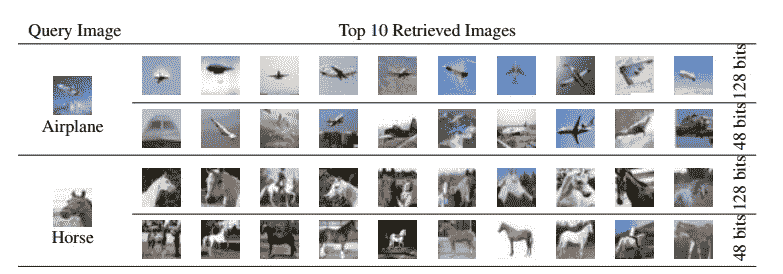

Image retrieval system

该技术的概念是返回具有最接近查询图像之一的最后特征层的图像(最后一层表示高级特征，而第一层表示低级特征，如:边缘、线等)

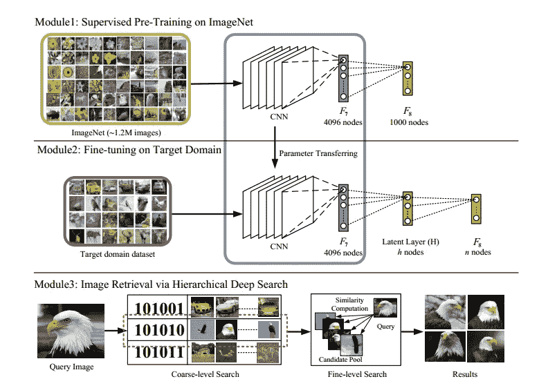

Concept of binary hash deep learning

在图像检索问题中，与查询图像进行比较的图像数量可能是巨大的。本文提出了一种由粗到细的分层深度搜索策略。首先—粗略搜索，通过阈值将最后一层(上图中的潜在层)激活二值化，然后识别与查询图像具有最低汉明距离的 m 个候选(两个向量之间的比特差)。其次—精细搜索，计算查询图像的前一层(F7)与池中图像的欧氏距离，然后对该值进行排序。

# 用二进制散列码进行对象验证

我想在这篇文章中介绍的问题不是图像检索，而是对象验证——检查图像是否与其身份匹配。可以定期添加新类别。

使用的数据集是从 0 到 7 的 Mnist。新的类别 8 和 9 将在以后添加。

该模型针对从 0 到 7 的分类问题进行了微调(准确率> 99%)

(所有代码与 fast.ai v1 库一起使用)

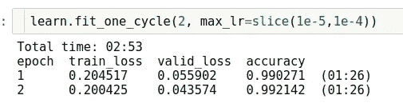

Fine tune

基于最后一层的两种方法，将介绍三个实验:二值化和多元高斯异常检测

## 二进制化最后一层:(大小= 48)

*   首先，我用编号为 9 的新数据集运行模型，并将最后一层二值化。保存它并命名为 ref9

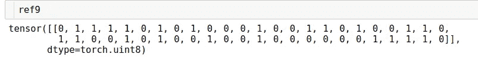

binarizing number 9 feature vector

*   然后，我用从 0 到 8 的所有其他数字(每个数字 10 张图片)运行该模型，并将它们的特征向量与 ref9 进行比较。结果是它们的特征向量之间的相似性百分比的平均值:

__ 第 9 名:

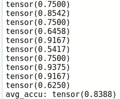

首先，我们用数字 9 进行测试，检查我们是否有很高的相似性。平均值(84%)还可以，但是方差很大

—数字 0:

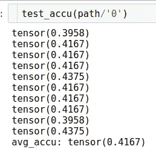

—第一:

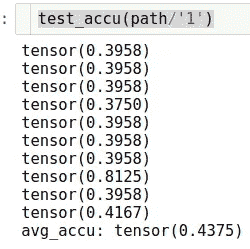

__ 第二名:

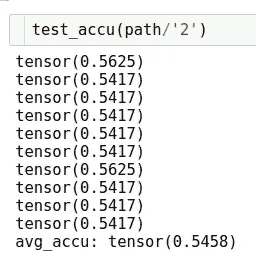

并且所有其他数字具有低相似性(<60%) except Number 7:

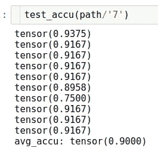

It has the similarity of ref9 even higher than number 9

*   So this approach with binarizing the last layer works not very good (I have tested with the size = 128 and the result is also bad)

## Multivariate-gaussian-anomaly-detection (size = 48)

This technique is introduced in the Machine Learning course of Andrew Ng and you can find the summarization here: [https://www . ritchieng . com/machine-learning-anomaly-detection/# 1a-problem-motivation](https://www.ritchieng.com/machine-learning-anomaly-detection/#1a-problem-motivation)

这种思想是基于特征向量的统计，我们可以通过其低概率来识别异常值。

我通过计算对数修改了多元概率计算。原因是变量数量多时，概率可能太小或太大。例:48 个变量，每个变量的概率为 0.1。多元概率是 0.1⁴⁸——非常小的数字

结果:

*   验证 9 号

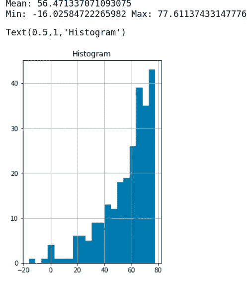

*   数字 0:

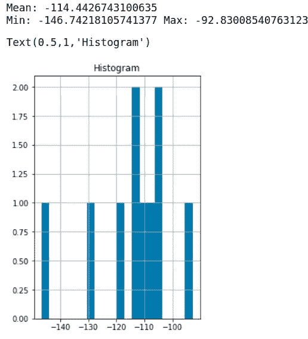

除了数字 7 之外，所有其他数字具有类似于二进制化方法的小概率

*   第七点:

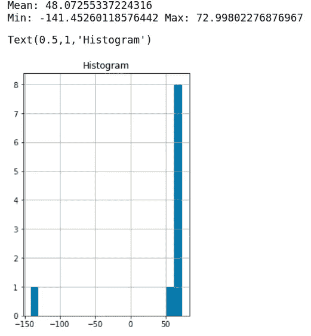

我们可以看到，数字 7 的平均概率小于数字 9，但这两者之间仍有重叠。

## 多元高斯异常检测(大小= 128)

这两个数字 7 和 9 之间的重叠以及数字 9 的高方差可以解释为我们没有足够的特征来表示 9。我将特征向量增加到 128，结果好了很多

除了 7 之外，从 0 到 8 的每个数字的概率都很小

*   7 号

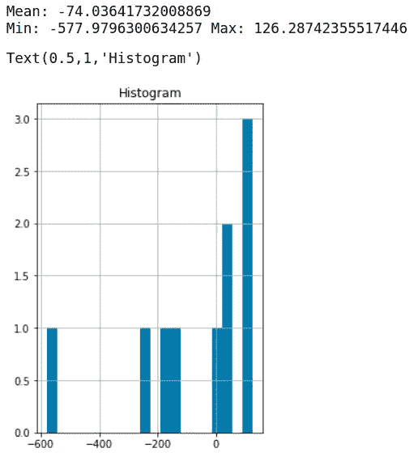

*   9 号

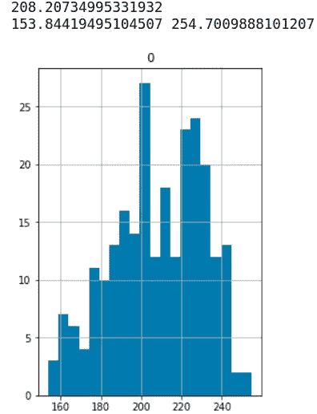

我们不再有重叠，这种方法可以用来验证添加到模型中的新类别

这个博客的源代码你可以在这里找到它:

 [## dienhoa/deephash_pytorch

### 在 GitHub 上创建一个帐户，为 dienhoa/deephash_pytorch 开发做贡献。

github.com](https://github.com/dienhoa/deephash_pytorch/blob/master/mnist%20_%20deep%20hash%20_cpu.ipynb)