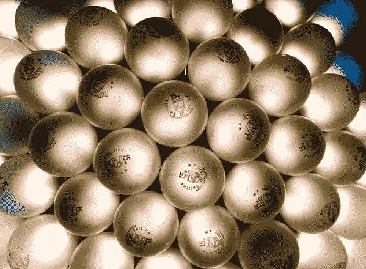

# 客观性和同理心造就了不太可能的伙伴关系

> 原文：<https://medium.datadriveninvestor.com/objectivity-and-empathy-forge-unlikely-partnership-4621a305e55a?source=collection_archive---------2----------------------->

## 一个巨大的挑战是不带任何偏见地看待一切

Image by Thomas Hawk via Flickr

根据[凯特·纳塞尔](https://katenasser.com/)的说法，客体性不是超然的冷漠。常识和情感是相容的。

“如果没有同理心，你就无法理解别人面临的真正挑战，”演讲者和培训师、蔻驰人际技能协会的 Nasser 说。

“你必须理解人们正在经历什么才能给他们建议，”她说。"在他们利用你的客观性之前，你还必须用心去建立他们的信任."

 [## 让强烈的意识成为你最好的人际交往技能之一

### 正念有助于缓解你内心和思想之间的矛盾

medium.com](https://medium.com/an-idea/make-powerful-awareness-one-of-your-best-people-skills-ce6344d3876a) 

她在博客和与 [Greg Tutunjian](https://twitter.com/gregtutunjian/with_replies) 的讨论中谈到了这些观点[。他“帮助组织提供最能体现使命、价值观和宗旨的产品和服务。”](https://katenasser.com/objectivity-vs-detached-coldness-leadership-peopleskills/)

“很多人认为客观是完全没有情感，”纳赛尔说。“我不同意。

“客观性是看到所有的问题和感受，不带偏见地做出贡献，”她说。"客观是没有偏见，而不是没有同理心."

# 视觉证明

土豚剑更依赖视觉效果。

“强调可以展示、证明或展示的东西，而不是可以感觉到的东西，”他说。“并不是说我 100%的时间都这样生活，但客观地说，我认为这是一种可行的方法。”

与此同时，他想知道领导人如何知道他们听到了所有的观点。纳赛尔说，这可以通过人们如何描绘客观性来解释。

“客观性唤起了晴朗的天空，通畅的视野，无尽的地平线，”她说。"这是参与和公正的，而不是分离和判断."

 [## 科技攻击偏见，但不完全是

### 人类影响他们在工作场所使用的数据的准确性

medium.datadriveninvestor.com](/tech-attacks-bias-but-not-totally-6343973c6665) 

客观的挑战是不确定你是否真的客观。人们根据自己的一套假设事实行事。

“暂停个人判断，”屠呦呦说。”平静自己内心的声音。寻找所有可能的输入来源。验证自己的客观结论。”

纳赛尔看到了更多的挑战。

“过去的伤疤扭曲了我们的观点，”她说。“还有‘我会失去什么’的想法。人们害怕参与会让他们陷入情绪中。不会的。

“一个巨大的挑战是不带任何偏见地看待一切，”她说。

# 向右开始

客观性的好处是不会带着偏见的假设进入关系。从右脚开始互动。

“客观性为决策扫清了道路，”图图健说。“你为那些参与其中的人设定了方向，这样他们就可以继续他们的生活并建立心流。”

纳赛尔着眼于客观性如何提高领导者。

“他们对这个世界有了更真实的看法，”她说。“你有更大的领导能力。扭曲的领导者会走向失败。

纳赛尔说:“当我们看到真相时，有有效的冲突解决和巨大的增长。"尊重他人和尊重他人更容易。"

 [## 在冲突爆发前将其扼杀

### 小问题得不到检查会给团队带来不必要的问题

medium.datadriveninvestor.com](/snuff-out-conflicts-before-they-explode-d4b4f876aaca) 

客观不同于冷酷无情。例如，好医生需要客观地做出正确的诊断，同时通过对病人的态度保持对病人的感情。

“冷漠无情表明一种超然的决策风格，这种风格剥夺了决策者和那些受以人为本的结果影响的人，”图说。

纳赛尔做了几次比较。

“客观看到人类的需求和问题，”她说。“冷酷无情的不多见。

“客观不为情感所左右，”纳赛尔说。"冷漠无情的人缺乏看清事物的联系."

# 头和心

人际交往技能融合了头脑和心灵的元素，以驾驭复杂的关系和决策。

“有效的倾听、同理心、耐心、透明度以及对情况和相关人员的承诺，有助于我们保持客观和关爱，”Tutunjian 说。

 [## 给没有被提及的企业家的建议

### 良好的沟通能增进工作内外的关系

medium.datadriveninvestor.com](/tips-for-entrepreneurs-not-spoken-for-9de87df8653) 

纳赛尔强调积极倾听和其他人际交往技巧。

“在你分析之前，先产生共鸣，”她说。“从你的心开始，然后用你的头脑。看到问题的真相和人类的需求。”

根深蒂固的内心感觉让人们更难接受与他们相信的事实和观点相反的事实和观点。

“当这些内心的感觉与一个未解决的问题相关联时，它们会阻止我们与他人或其他人充分互动，”Tutunjian 说。

# 处理事实

害怕真相阻碍了纳赛尔的其他客观性。

“当人们缺乏自尊时，他们就会失去客观和关心他人的能力，”她说。“有时候，他们把客观性定义为超然的，仅仅是事实。自我、自恋和支配欲也会阻碍关爱的客观性。

要有爱心，要客观，摒弃非此即彼的心态。美好的生活充满了互谅互让。

 [## 你发自内心的感激表明你真的在乎

### 无论在家还是在工作中，表达感激都是一个很好的日常习惯

medium.com](https://medium.com/an-idea/your-heartfelt-gratitude-shows-you-really-do-care-eeed3dbd56fe) 

“暂缓判决，”屠呦呦说。“拥有一颗宁静的心灵。专注于另一个人。忽略个人经历和结果。”

纳赛尔认为，客观性和关怀始于相信每个人都很重要。

“你必须在你的宇宙中看到其他人，而不是认为你是中心，”她说。“你一定不要害怕冲突。参与并解决它。

“相信看待事物的方式不止一种，”纳赛尔说。“对你不喜欢的事物保持开放的心态。你必须爱人们。”

# 人情味

首先看到病人生命的医生——而不是医学的治愈能力——在他们的实践中保留了人情味。

“减少病人的负担，为每个病人、家庭和爱人安排更多的时间，”Tutunjian 说。“参加旨在拓展个人意识的另类训练。

“忽略与其他医疗专业人员在金钱和津贴上的竞争，”他说。

 [## 你在哪里透明地划清界限？

### 社交媒体使医生和病人之间的隐私变得复杂

medium.datadriveninvestor.com](/where-do-you-transparently-draw-the-line-3945faa07141) 

纳赛尔认为，发自内心倾听的医生更加客观。

“医生应该像尊重成人一样尊重他们，而不是像对待孩子一样对待他们，以显示客观的关怀，”她说。“如果医生们能够感同身受，他们会更加关心和客观。

“医生们，不要害怕同理心，”纳赛尔说。“我们需要你的同情。”

Tutunjian 和 Nasser 都是关心他人的领导人。

“我喜欢并尊重那些客观的关心他人的领导者，他们对他们所管理的人表现出同情和理解，”Tutunjian 说。"除此之外，他们还影响那些不寻求任何形式回报的人."

纳赛尔喜欢那些接受并利用她的才能的领导人。

“他们参与，而不是发号施令，”她说。“他们不是中立的。他们订婚了。客观的关怀型领导培养了一种问责文化，而不是责备。

**关于作者**

吉姆·卡扎曼是[拉戈金融服务公司](http://largofinancialservices.com)的经理，曾在空军和联邦政府的公共事务部门工作。你可以在[推特](https://twitter.com/JKatzaman)、[脸书](https://www.facebook.com/jim.katzaman)和 [LinkedIn](https://www.linkedin.com/in/jim-katzaman-33641b21/) 上和他联系。