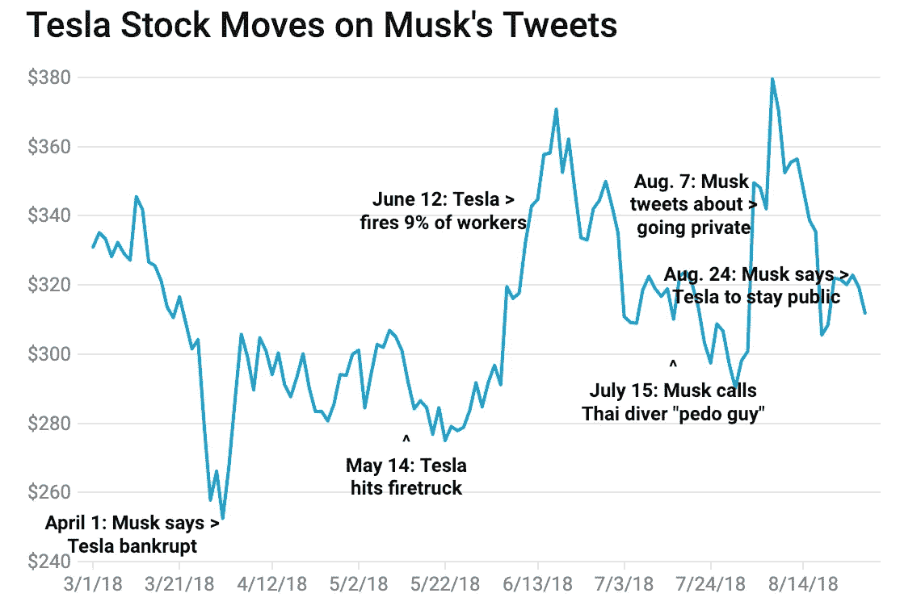
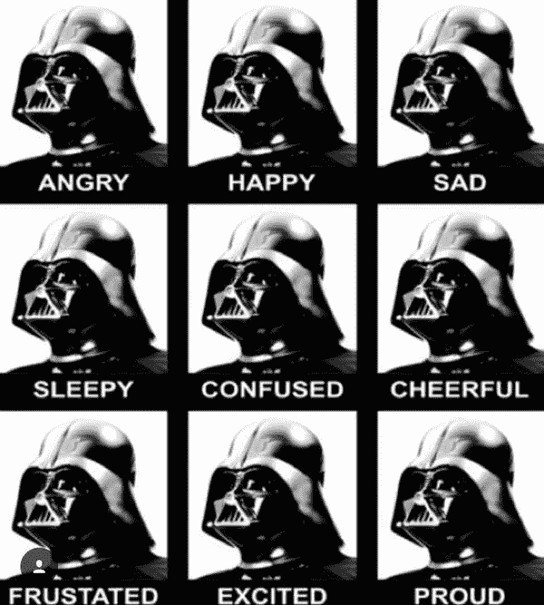

# 从数据中获得洞察力:我们应该将 Twitter 数据纳入投资模型吗？

> 原文：<https://medium.datadriveninvestor.com/obtaining-insights-from-data-should-we-include-twitter-data-in-investment-models-475b722196f9?source=collection_archive---------10----------------------->

[Source](https://www.wired.com/story/elon-musk-twitter-stock-tweets-libel-suit/)

当埃隆·马斯克在推特上说他已经获得了将特斯拉私有化的资金时，股市爆炸了。特斯拉的股票价格飙升至约 380 美元，迅速跌至 305 美元，然后在马斯克发推文称特斯拉终究会保持上市后，开始在 310 美元至 320 美元之间徘徊。看到一条推文可能对华尔街和国内投资者产生的影响，激起了我对 Twitter 是否是一个可行的金融信息来源的兴趣，所以我做了任何有科学背景的人都会做的事情:我做了一个实验。我测试的假设是，我可以创建一个预测模型* *，比只使用 Twitter 数据的虚拟股票预测器要聪明得多。和我所有的文章一样，我在这里使用的代码可以在[我的 GitHub](https://github.com/aaronfrederick/CEO-Twitter-Impact-on-Stocks) 上找到。*

我使用的数据来自 Twitter 的 API，它允许轻松访问任何用户(在这种情况下是 Elon Musk)的大约 3200 条最后的推文:全文、收藏夹、转发和发布日期/时间。tweets 的结构也适合存储在非关系数据库中(比如 MongoDB ),并且可以通过 PyMongo 接口轻松存储。使用的股票数据是每条推文发布后第二天特斯拉股票的市场开盘价。这相当于大约 330 天的可用数据。

当着手为这些推文建立预测模型时，我决定选择分类器的低挂果实，而不是更典型的金融预测问题的回归器。我这样做是因为这个实验是为了证明概念，而不是真正的预测能力本身，预测> 0 或< 0 将比预测任何精度的标量值容易得多。由于这个数据集的小性质(几百个数据点)，深度学习是不可能的。虽然一个潜在的成功方法是将每个单词表示为一个向量，将每个 tweet 表示为一系列向量，并以这种方式在数据集上训练一个递归神经网络，但 tweet 的缺乏意味着网络不会收敛，因此必须采用统计学习方法。

VaderSentiment is a great python package for sentiment analysis of tweets. [Source](http://t-redactyl.io/blog/2017/04/using-vader-to-handle-sentiment-analysis-with-social-media-text.html)

分类器的特征工程意味着将推文表示为向量。一种典型的方法是采用 word2vec 模型，就像谷歌在 2013 年发布的那种。谷歌的词向量是 300 个特征，这大致是我拥有的样本数量——我需要能够明智地减少我的数据中的特征数量。为此，我求助于原始的数字数据——收藏和转发。这是两个很棒的功能，通过组合收藏夹+10 *转发(把两者放在一个相似的量级上)，我设计了我所说的推文的“病毒式传播”。使用情感分析，我能够生成另一个与推文语言对话的数字特征。我将每条推文的情绪乘以其病毒传播性，以包含一个既能表达影响范围又能表达情绪的特征，作为一个交互术语。

对于我的最后一个特征，我使用了一种称为潜在狄利克雷分配(LDA)的无监督学习方法来对推特语料库进行主题建模。LDA 是一种概率方法，它使用关键词及其关联的频率来创建组或“主题”以及每条推文属于给定主题的概率。在我的案例中，最普遍、最明智的 5 个话题是:

1.  公告—事情“即将到来”
2.  与其他 Twitter 用户的互动
3.  无聊的公司
4.  SpaceX 和猎鹰重型发射
5.  汽车和各种特斯拉模型

现在我有了一组对数据敏感的特征(数字推文数据和 5 个主题概率)，是时候建模了。使用 scikit-learn，我能够在测试数据(101 个样本)上创建一个准确率为 57.4%的模型。这个表现最好的模型是一个 K-最近邻模型，它有很多直观的意义。这个表现最好的模型使用类似的推文来预测股价是上涨还是下跌。这个结果引出了一个问题——实验成功了吗？埃隆马斯克(Elon Musk)的推特使用情况是否预示或影响了特斯拉股价的变化？

为了严格测试这些数字，我需要拒绝零假设，即通过随机猜测，我可以达到与我的机器学习模型相似的性能水平。实现在 101 个样本上随机猜测具有 57.4%准确度的模型的概率在 5%和 8%之间，因此我可以说，该模型比随机猜测模型表现得更好，具有 90%的置信度。理想情况下，这种可能性要么小于 5%，要么大于 10%。如果概率小于 5%，我们可以自信地拒绝零假设，同样，如果概率大于 10%，我们可以在实验中得到否定的结果。鉴于这个实验的结果是如何落入“灰色”区域的，我会从《流言终结者》的书中抽出一页，认为这是合理的。有了更多的数据，指针很容易被推到一边或另一边。

[Source](https://www.aquiziam.com/the-baghdad-battery/myth-busters-plausible/)

如果你有关于如何改进这个用例或者进一步扩展的想法，我很乐意在下面的评论中听到它们！