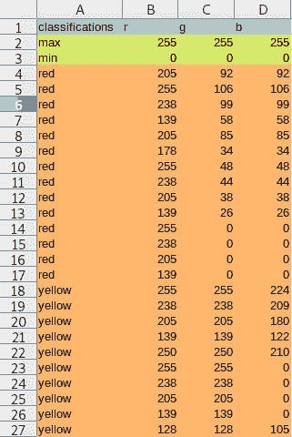
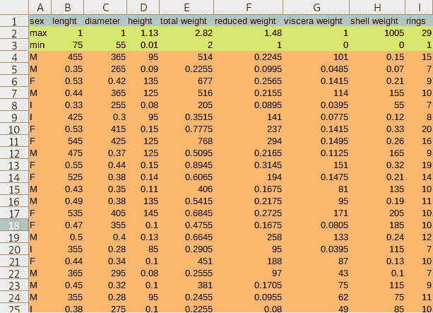
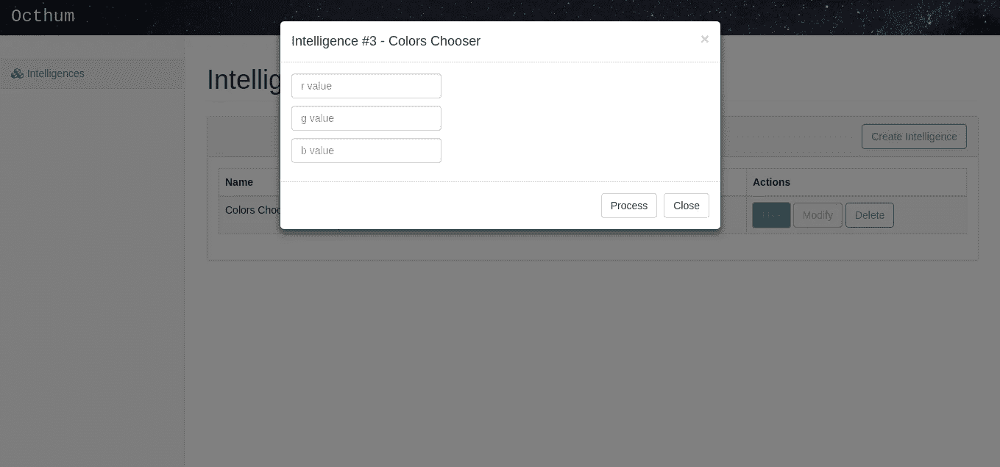
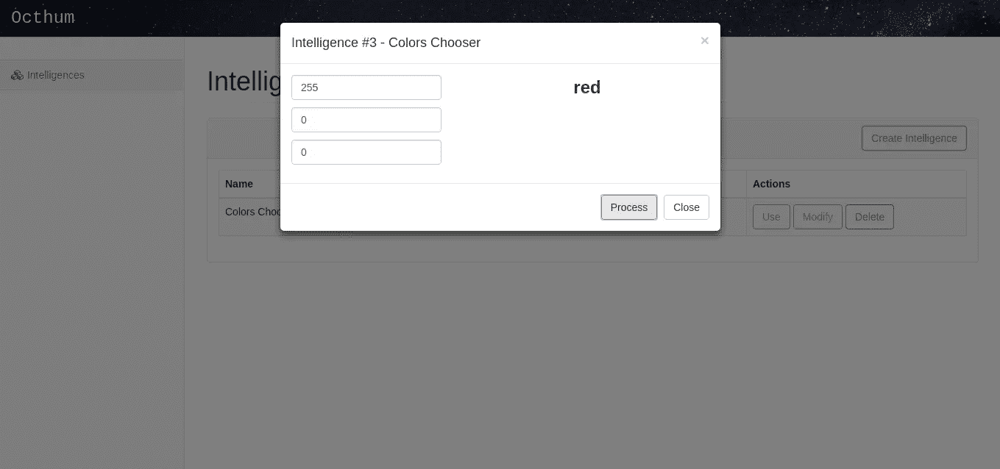
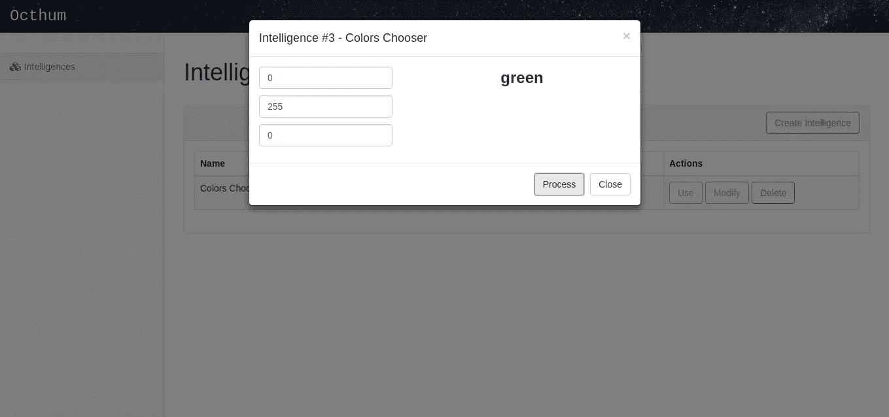
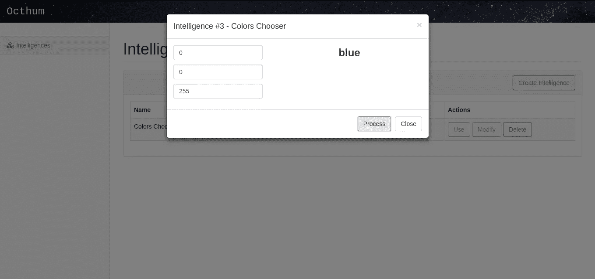
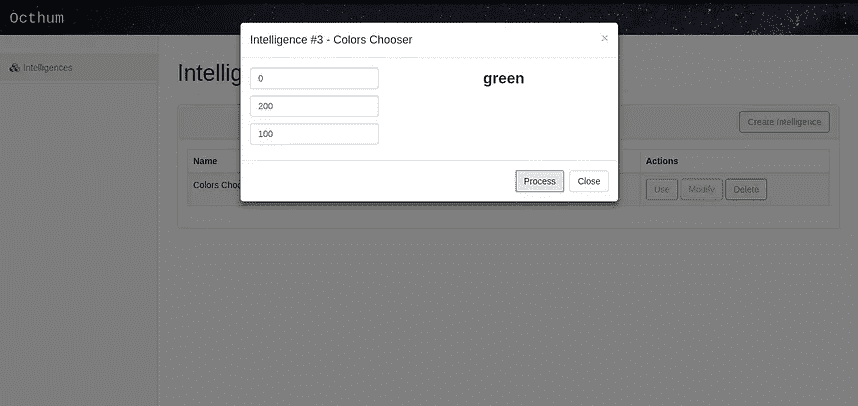
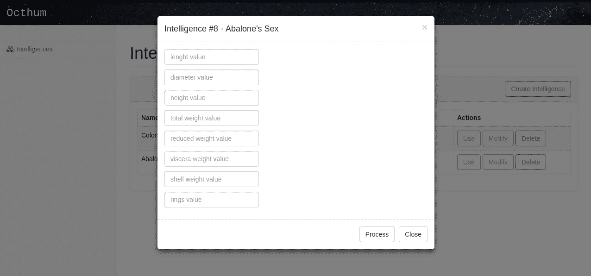
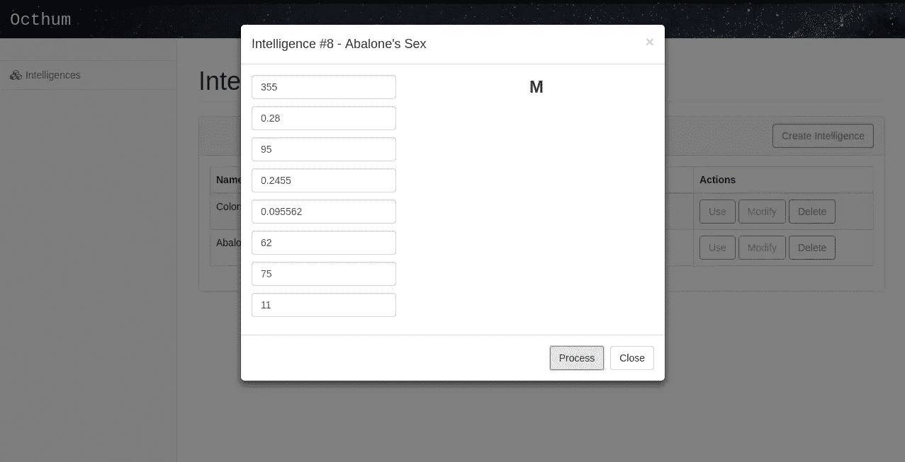
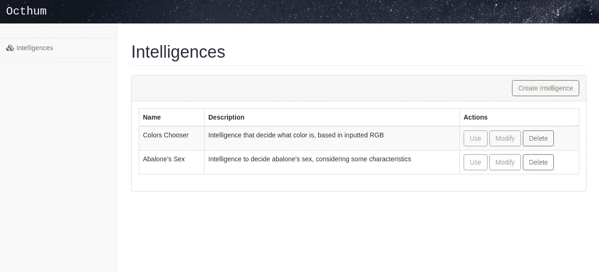

# Octhum:统一不同人工智能方法的工具

> 原文：<https://medium.datadriveninvestor.com/octhum-a-tool-to-unify-different-artificial-intelligence-approaches-69efdb817564?source=collection_archive---------20----------------------->

简言之，人工智能是模拟人脑的模型。例如，神经网络，一种更著名的人工智能方法，了解一个范围(通过一个信息数据库文件或另一种包含模式的字体)，模拟神经元信号和你的连接(突触)，在“大脑处理”中考虑每一个的权重。这恰恰发生在我们的大脑中:我们一生都在学习模式，将它们分类为图像、音频和触摸。

最大的问题是，没有一种简单的方法来重用人工智能软件，因为我们重用我们的大脑来处理一切。如果您需要处理肿瘤模式，您将需要获得一个神经网络，该网络将具有特定的突触权重，以及应用于该范围的神经元数量。如果你是一名生物学家，并且需要通过它们的噪音来识别鲸鱼的种类，你将需要获得另一个神经网络平台，其中包含与第一种情况完全不同的突触权重和神经元数量。

Octhum 就是为了解决这个问题而产生的，它用多种模型训练智能，验证哪种模型是最好的，并使用它。这样，我们可以在同一个平台中使用不同的作用域，每个作用域使用最适合的模型。这是可能的，因为 Octhum 要求数据库文件内容具有相同的格式。

下面我们有两个例子:一个智能决定什么是颜色，基于 RGB 输入，另一个智能决定什么是鲍鱼的性别，基于一些特征，如环数，内脏重量，高度，宽度和其他。

在第一个智能中，我们应该格式化 CSV 文件(在 Octhum 神经网络训练中用作数据库文件),如下图所示，其中第一列包含最终分类，其他列包含与每个分类相关的输入(或变量)。第二行和第三行包含每个变量的最小值和最大值(仅用于验证)。

CSV formatted containing some RGBs and your respective colors

在第二个智能中，我们应该像在第一个智能中那样格式化 CSV 文件，保持相同的结构。训练任何智能，文件格式都应该是一样的。

CSV formatted containing some abalone’s characteristics and your respectives sexes

Octhum 将处理这些数据库，并将存储配置的神经网络，当用户想要使用智能时访问它。当这种情况发生时，Octhum 接收变量的值(由用户定义)，将它们输入神经网络，并给出最终分类的响应。下图显示了正在使用的第一种智能。

Fields to input variable values

R=255, G=0, B=0 is red

R=0, G=255, B=0 is green

R=0, G=0, B=255 is blue

Giving inputs not so obvious

在第二个智能中，我们有一个更大的数据库，有更多的病例和变量，最终分类可以是男性(M)、女性(F)和未定义的(I)。下面，Octhum 接收变量输入，对它们进行处理并返回一个响应，即鲍鱼的性别。

Fields gave by Octhum to inputs insert

The input of abalone’s characteristics, and receiving the sex (male)

训练了这两种智能，我们可以在任何时候使用这两种智能，而无需改变 Octhum 核心，只需将输入数据库的格式改变为上面所示的格式。

Intelligences list

所有这些显示以前是由一个软件，只改变输入数据库文件的布局。如果任何人想在任何范围内使用神经网络，只需要适当地格式化一个 CSV 文件，并在 Octhum 中使用它。

Octhum 是用 PHP 开发的开源 REST API，基于 SaaS 技术工作，允许第三方软件定制(例如，在 ERP 中预测销售)。Octhum 仍然很小，但有潜力成为一个伟大的平台，

*   允许更多的文件数据库格式(例如 JSON ),以使通过 API 对第三方软件的处理更容易；
*   使用更多的人工智能方法，如专家系统、遗传算法等；
*   使用一些容器(如 Docker ),以并行方式处理各种架构；
*   处理多种输入类型，如图像和声音。

GitHub:[https://github.com/vitorlofonseca/octhum](https://github.com/vitorlofonseca/octhum)

# DDI 特色数据科学课程:

*   [**用于数据科学的 Python**](http://go.datadriveninvestor.com/intro-python/mb)
*   [**Scikit-Learn**](http://go.datadriveninvestor.com/scikitlearn/mb)
*   [**深度学习**](http://go.datadriveninvestor.com/deeplearningpython/mb)

**DDI 可能会从这些链接中收取会员佣金。我们感谢你一直以来的支持。*