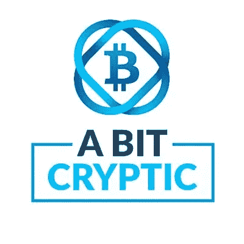

# 健康、人类和区块链

> 原文：<https://medium.datadriveninvestor.com/of-health-humans-and-blockchain-ec6fb62ec5de?source=collection_archive---------34----------------------->

我们对何塞·阿里埃塔的采访结束了( [iTunes](https://itunes.apple.com/us/podcast/a-bit-cryptic/id1359437472?mt=2) 、 [Google Play](https://play.google.com/music/listen?u=0#/ps/Ig4xr743xcrdqqcbvokbxrf4j5i) 和 [Stitcher](https://www.stitcher.com/s?fid=198657&refid=stpr) )！Jose 是美国卫生与公众服务部(HHS)负责采购的副助理部长。

> “区块链令人兴奋的地方在于，你是谁并不重要，你是世界塑造技术的一部分。这完全取决于你是否有热情、兴趣和精力来开发将被社区采用的框架。”何塞·阿里埃塔

Jose Arrieta

## 在 DC，政府作为商品和服务的消费者/提供者有什么问题？为什么使用区块链，你用的是什么平台？

美国联邦政府每年通过拨款在商品和服务上花费大约 8000 亿美元。卫生与公众服务部(HHS)是赠款的最大提供者:预算总额超过 1 万亿美元。

政府已经演变成多个方面，这使得很难跟踪不同机构和业务部门的支出。要了解每个部门的支出情况，目前的方法要求我们深入每个部门，获取支出细节。

相反，我们使用 Hyperledger 系统来覆盖 HHS 现有的合同书写系统。我们使用自动机器学习算法从这些合同中提取关键信息。然后，这些数据将分布在 Hyperledger 结构的数据层中。使用权威证明机制，我们创建了一个不可变的标准数据可信度。

然后我们使用 hyper-ledger fabric 的编排层来构建和实现微服务。例如，我们建立了一个 P&L 工具，为整个组织提供开支的可见性。在整个 HHS，价格信息是准确和一致的，这使得买家可以在结账时做出明智的决定。该工具与其他微服务工具一起帮助政府决定如何削减成本、节省运营时间和实现技术现代化。

## 你是如何说服你的领导跳过官僚主义的束缚并实施区块链概念验证的？

有很多运气。这取决于对变化持开放态度的文化。HHS 有一个拥抱新技术的战略计划。我在总务管理局(GSA)的最后一个职位期间，也能够运行 POC。我是在非常好的条件下开始这份工作的。也就是说，仍有工作需要完成。

*   首先，我们关注的不是我们将利用这项技术做什么，而是我们将如何转变商业模式。我们决定通过让他们访问整个机构的所有数据点来授权个人层面的决策。我们的目标是集中数据，但分散基于单一事实来源的决策。
*   其次，我们绘制了以人为中心的设计的生命周期。我们与用户坐下来，试图找出他们在整个流程周期中的痛点。
*   第三，我们使用区块链构建了一个示例，向员工展示它将如何改进他们的工作流程。
*   最后，我们使用财务指标来衡量结果，记录我们一路走来的进展。

## 你如何评价 DC 的创新环境？

在为监管机构工作后，有时我们会过度考虑不合规的风险，而不是与监管机构进行对话，让他们了解我们在努力做什么。如果你与监管机构进行沟通，并帮助他们理解你在努力做什么，他们可能更有可能加入进来。

DC 有一种不同的创新模式，这种模式已经存在很长时间了。与硅谷相比，它确实会影响上市速度。也就是说，DC 市场环境对创新越来越开放。

## 请告诉我们您将在约翰·霍普金斯大学教授的区块链课程

我真的很喜欢教书，但是我想我在教书的时候学到了更多。我从 30 年前就开始教书了。一个机会出现了，我可以和刘吉姆博士一起教授区块链。我们的计划是首先回顾区块链的基础，驱散关于这项技术的神话，解释各种类型的区块链设计之间的差异(许可与非许可的区块链)。

课程的第二部分是对市场如何演变的观点。目的是帮助学生理解一些公司是如何被监管障碍绊倒并失败的。

我非常支持基于案例的学习。我们将要求学生针对特定行业，使用特定数据集来实施该行业的区块链解决方案。

区块链令人兴奋的是，你是谁并不重要，你是世界塑造技术的一部分。这完全取决于您是否有热情和兴趣来开发将被社区采用的框架。

## 链接:

[https://www.linkedin.com/in/jose-arrieta-6064531/](https://www.linkedin.com/in/jose-arrieta-6064531/)

# 学分:

**主持:** [党杜](https://www.linkedin.com/in/dang-d-330068106/)，[宜都王](https://www.linkedin.com/in/yidu-wang-b6360516)
**节目笔记作者** : [宜都王](https://www.linkedin.com/in/yidu-wang-b6360516)

**关注我们:**

[**中型**](https://medium.com/@abitcryptic) **，**[**Steemit**](https://steemit.com/@abitcryptic)**，**[**Twitter**](https://twitter.com/keepitcryptic)**，** [**脸书**](https://www.facebook.com/abitcryptic)

**播客:**[**Itunes**](https://itunes.apple.com/us/podcast/a-bit-cryptic/id1359437472?mt=2)**，**[**Google Play**](https://play.google.com/music/listen?u=0#/ps/Ig4xr743xcrdqqcbvokbxrf4j5i)**，**[**Stitcher**](https://www.stitcher.com/podcast/a-bit-cryptic?refid=stpr)