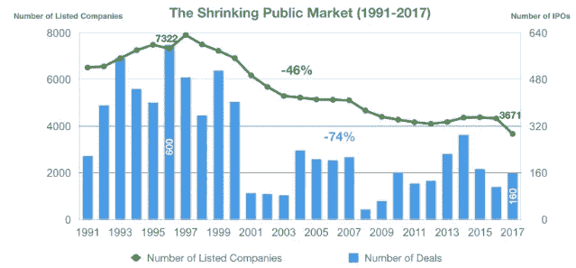
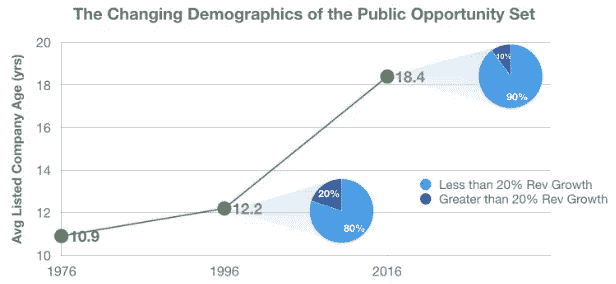
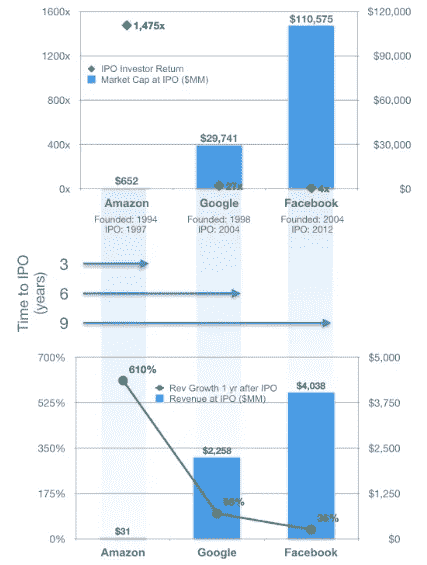

# 停止销售

> 原文：<https://medium.datadriveninvestor.com/off-the-market-30202042fa1a?source=collection_archive---------8----------------------->

## 为什么公司选择保持私有，风险资本是如何推动这一趋势的

by [Ari Spada](https://unsplash.com/@ari_spada?utm_source=medium&utm_medium=referral) on [Unsplash](https://unsplash.com?utm_source=medium&utm_medium=referral)

公司更长时间保持私有的趋势将会持续下去。作为投资顾问、家族理财室团体和超高净值个人值得信赖的合作伙伴，Fuel Venture Capital 了解讨论这一公认的资本市场转变的意义的重要性，我们希望确保我们的投资者相应地调整他们的投资方法和投资组合分配。

尽管每当主要股指触及历史高点时，媒体和投资者都会继续乘着股市上涨之机欢呼雀跃，但很少有投资者透过引擎盖看到更严重的问题，即不断萎缩和老化的公开市场，或者理解鼓励公司在私有制下生存更长时间的因素。

*Source: Rokk3r Fuel ExO, World Bank, Ernst & Young*

在过去的 20 年里，**美国股票市场萎缩了——**不是在价值上，而是在数量上。尽管公司数量的增长相对缓慢，慢到你可能都没有注意到的程度，但这种变化是不可否认的，而且相当引人注目。

如今的市场有 3671 家上市公司，规模只有 1996 年巅峰时期的一半，当时有 7322 家公司上市。上市股票的补充速度不够快，不足以弥补通过收购、私有化交易以及(不太常见的)退市而被剔除的公司数量。事实上，年度首次公开发行(IPO)的数量急剧下降，从 1996 年的 600 家降至今天的 160 家。我们不能把这种下降归因于缺乏新的候选人。相比之下，公司总数和有资格上市的公司数量都有所增加。**问题在于公司加入公共领域的动机。**权衡成本上升和收益减少，越来越多的公司避开公开市场，更长时间地保持私有化。

# **上市和公开上市的成本上升**

随着 2002 年萨班斯-奥克斯利法案的出台，上市和作为公共实体运营的成本已经上升。为了遵守法规，公司开始面临更多的强制性信息披露和监管要求。《就业法案》( 2012 年)立法放松了一些监管障碍，但同时放开了私人资本筹集。因此，它削弱了该法案刺激新公司流入公共领域的目标。

除了财务成本之外，有形成本的减少也导致了新上市活动的减少。在公众的关注下，上市公司的决策和行动受到投资者、分析师和新闻媒体的密切关注。许多上市公司的管理层被迫以牺牲长期价值创造为代价，专注于短期业绩。上市公司被要求披露的信息为上市公司的内部运作提供了充分的透明度，使竞争对手能够重新配置自己的战略，并增加了股东激进主义的风险。

# 公开发行的收益递减

通过 IPO 上市的主要好处是能够快速筹集资金，为增长计划和扩张提供资金。然而，这种好处已经减少，因为今天的公司比以往任何时候都有更多的选择，可以从不同的来源找到大量的、条款灵活的私人融资。

由于私人资本市场的发展，就初创公司在 IPO 前能够筹集的资本数量而言，今天的世界已经完全不同了。尤其是风险资本领域，已经引发了一场范式转变。

20 年前，IPO 前的融资额中值为 1200 万美元，而这一数字在 2016 年跃升至近 1 亿美元，并且这一上升趋势保持稳定。一家独角兽公司(估值超过 10 亿美元的公司)通过单独的私募发行所能筹集的资金数额更是惊人。

在上市之前，脸书在 2005 年至 2011 年的七年时间里通过私募市场渠道筹集了 22 亿美元。从 2010 年到 2016 年的另一个七年时间里，优步完全从私人市场筹集了近 130 亿美元。在短短几年时间里，私人市场上充足的资本已经带来了翻天覆地的变化。今天，私人资本来源可以满足私人公司的所有需求，包括实现主导规模和收购较小的对手。

在公共方面，美国公司现在坐拥 1.5 万亿美元，是 2000 年资产负债表上金额的三倍多。美国的企业巨头已经从 R&D 撤出，留下创意经济作为创新的源泉。然后，他们会动用全部资金收购任何构成竞争威胁或填补缺口的公司。**健康的资本供应支撑了强劲的并购环境，降低了上市的另一个优势——为公司创始人、员工和早期投资者获得流动性**。

为了获得流动性，小公司实际上更愿意卖给大公司，而不是冒险进行首次公开募股，并在与更大、更成熟的同行竞争中处于劣势。另一方面，二级市场和私人股票交易计划的发展为私人公司的所有者在退出前将股票货币化提供了一种手段。

# 市场层面的多样化减少

随着发行 IPO 的公司越来越少，与过去相比，美国剩余的上市公司现在规模更大，历史更久，行业更集中(由于行业整合)，增长更慢。

数据显示，如今上市公司的平均年龄是 20 年前的 50%，规模是 20 年前的 4 倍。在同一时期，标准普尔 500 增长 20%或以上的公司数量减少了一半。这与风险资本投资者现在可以获得的机会形成了鲜明的对比。燃料风险投资团队投资于月增长率达到两位数或年增长率达到三位数的初创公司。我们独特而严格的流程在公司生命周期的早期识别和评估公司，并立即取消任何没有潜力实现指数增长和投资者回报的公司。

*Source: S&P* Fuel Venture Capital*, S&P CapIQ, Credit Suisse*

对公开上市的厌恶并不局限于特定行业，而是一种普遍现象。然而，就规模而言，故意回避在微型股和小盘股中更为常见。大多数小公司会等到生命周期的后期上市，那时它们可以在更高的收益基础上摊销巨额 IPO 成本，并拥有足够的规模来有效竞争。鉴于上市公司数量的减少和这些企业的到期日，公开市场不再像过去那样提供全面的机会。这意味着投资者需要接受另类投资，特别是私人和风险资本投资，以接触更年轻、增长更快的公司，从而建立像以前一样多元化的投资组合。

# 价值创造从公共转向私人

当前推迟 IPO 的趋势让私人市场投资者受益，而牺牲了公共市场投资者的利益——这是另一个严酷的事实。如今，大多数初创公司都享受了更长的增长跑道，并在私人手中创造了大部分价值。因此，公众投资者购买早期公司股份的可能性越来越小，从而错过了早期价值创造的可观收益。

*Source:* Fuel Venture Capital*, S&P CapIQ, Credit Suisse*

早在 1997 年，像亚马逊这样的顶级科技公司很早就进入了公开市场。就亚马逊而言，IPO 是在公司成立三年后进行的。当时，亚马逊的市值仍在数百万，收入也很微薄。因此，任何愿意在亚马逊首次公开募股时提前押注并一直持有到今天的公众投资者，都将获得 1475 倍的潜在回报。这相当于 45%的年化回报率——相当于风险资本的资产回报率。谷歌和脸书保持私有状态的时间更长，只是在市值和收入都比亚马逊大得多之后，才进入公开市场。在生命周期的后期上市，谷歌和脸书都享受了上市前的大部分高速增长阶段。较低的增长潜力导致谷歌和脸书的 IPO 投资者分别获得低得多的 27 倍和 4 倍回报。

为了达到亚马逊自 IPO 以来的回报，谷歌需要达到 44 万亿美元的市值，脸书需要达到 163 万亿美元的市值。因为在我们目前的市场中，许多成功的创业公司计划在他们生命周期的很长时间后上市，如果有的话，我们不希望看到亚马逊那样的主街投资者回报的重演。

# 结论

强劲的私人投资市场的增长是过去 30 年中最显著的发展，它通过资本市场产生了冲击波效应。企业已经延长了私有化的时间，因为它们不再需要追求 IPO，也不再需要应对融资增长或获取流动性的成本和公众压力。经验丰富的投资经理已经离开公开市场，利用私人资本大幅增长带来的机会。与此同时，私人投资者领域已经扩大到包括非传统参与者，如企业风险投资、主权财富基金、共同基金、对冲基金和家族理财室。就连美国证券交易委员会(SEC)最近也宣布了调整规则的计划，允许更多主流投资者参与私人交易，并从早期投资中获取潜在收益，用于退休或其他需求。

Fuel Venture Capital 预计，公共股本的下降将持续一段时间，我们将看到私营公司在不断增长的市场中发挥越来越大的作用。这让我们的投资者需要做出决定。他们可以 **选择要么置身事外，要么通过增加对私募股权和风险资本投资的配置来顺应潮流，以寻求多元化的风险敞口和潜在的指数回报。**

*本文作者是燃料风险投资公司总经理* *合伙人兼首席投资官 Maggie Vo，CFA。Maggie 管理投资活动，领导对潜在投资的尽职调查，并对现有投资组合公司进行估值分析。要联系玛姬，发电子邮件到 maggie@fuelventurecapital.com。在社交媒体上关注 Fuel 风投，via*[*insta gram*](https://www.instagram.com/fuelventurecapital/?hl=en)*，*[*Twitter*](https://twitter.com/FuelVC)*和*[*LinkedIn*](https://www.linkedin.com/company/fuelventurecapital/)*。*