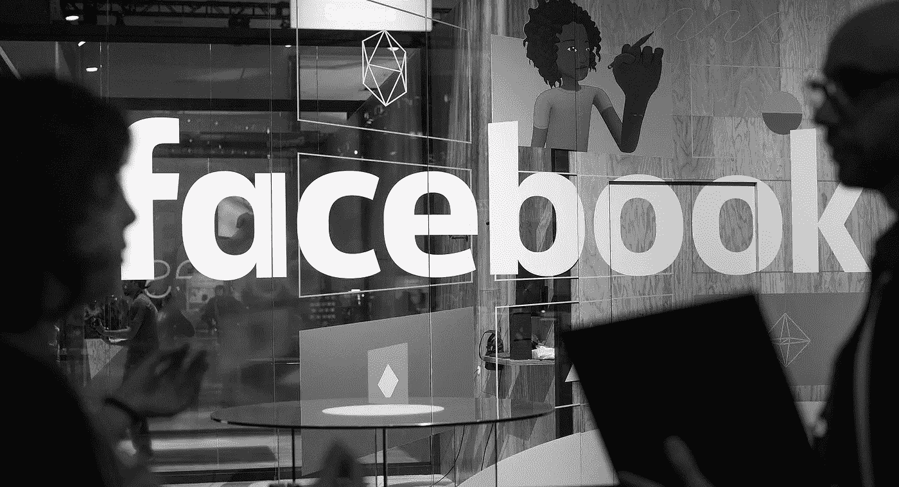

# 不要生脸书的气。

> 原文：<https://medium.datadriveninvestor.com/oh-dont-be-so-mad-at-facebook-only-88a1558a5d47?source=collection_archive---------2----------------------->

(也)为自己分享了这么多关于自己的事情而生气。

## 我想可以肯定地说，全世界都在生脸书的气。

剑桥分析公司和脸书丑闻似乎真的让许多人看到了社交媒体和互联网其他部分分享的个人信息所发生的可悲现实。

我很惊讶地看到这么多人对这样一个事实感到惊讶，即像玩一个测验或互动游戏/应用程序这样简单的事情可以帮助[进行心理分析](https://en.wikipedia.org/wiki/Psychographics)，其目的超出了应用程序的预期用途。

**对你来说，这只是一个应用程序。但对他们来说，大数据意味着一切。**

## “但这只是一个无伤大雅的小测验——有什么大不了的？”

一次无害的测验，却带来可怕的后果。从字面上来说，通过与随机应用程序互动，你可以让自己接受心理分析，然后数据被处理成用于为你专门制作广告的信息。

但是你不能因为有人用你免费赠送的牛奶制作和销售调味冰淇淋而生气。

所以，如果你真的生脸书的气，那你也生自己的气也是公平的。

对自己不了解社交媒体平台的实际运作方式感到愤怒。为自己没有真正探索所有社交媒体账户的隐私和广告设置而生气。

为自己不相信品牌利用了人们喜欢花时间的各种环境而生气。

最重要的是，要为自己点了才想起来而生气。我不记得上一次我有意识地点击在线广告或授权一个应用程序是什么时候了——更不用说参加性格测试了。

使用社交媒体的方式多种多样，但分享太多个人信息肯定不是其中之一。这很容易，因为如果你真的问自己，我想你会同意，不知道《权力的游戏》中哪个角色的个性与你匹配，或者不知道你老了会是什么样子，这没什么。

不知道谁查看了您的个人资料，或者有这样做的意图，这没什么。

不知道自己的智商得分也没关系，比较星座运势也没关系，因为如果你今天真的应该迷信什么的话，那就是你非常乐意在网上分享的个人信息的安全性和完整性。

所以，不要#删除 Facebook——只需留意你分享的内容。